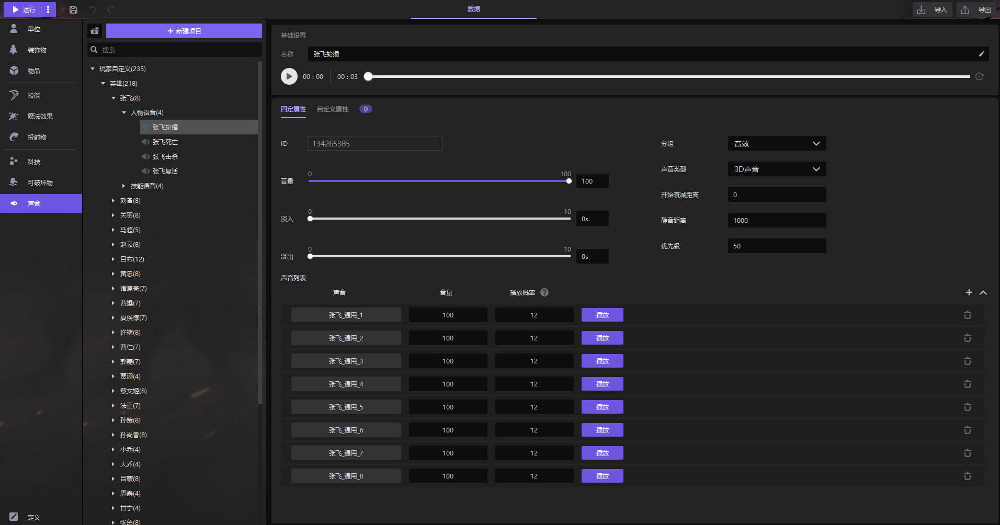

import { Callout } from 'codesandbox-theme-docs'
import { FCollapse } from 'components/FCollapse'

# 声音

在编辑器中，您可以简单地编辑一个声音并将其用作背景音乐或技能音效。声音根据类型分组。您可以在[资源管理器](../Navigation/Resource_Manager)中查看声音资源。

您可以在[物体编辑器-声音](../Navigation/Object_Editor/Functions#声音)中进行调整设置。例如，您可以更改声音模板，将声音设置为**2D声音**或**3D声音**，并设置**音量**、**淡入**和**淡出**。

<Callout type="info">
术语：3D声音：您还可以设置**衰减距离**和**静音距离**。
</Callout>

