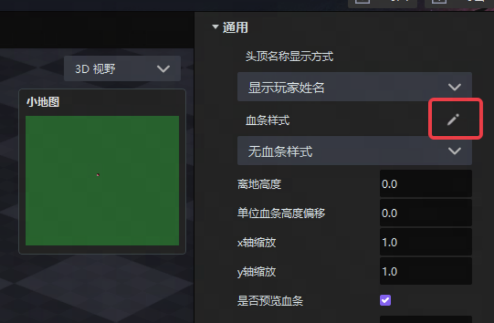
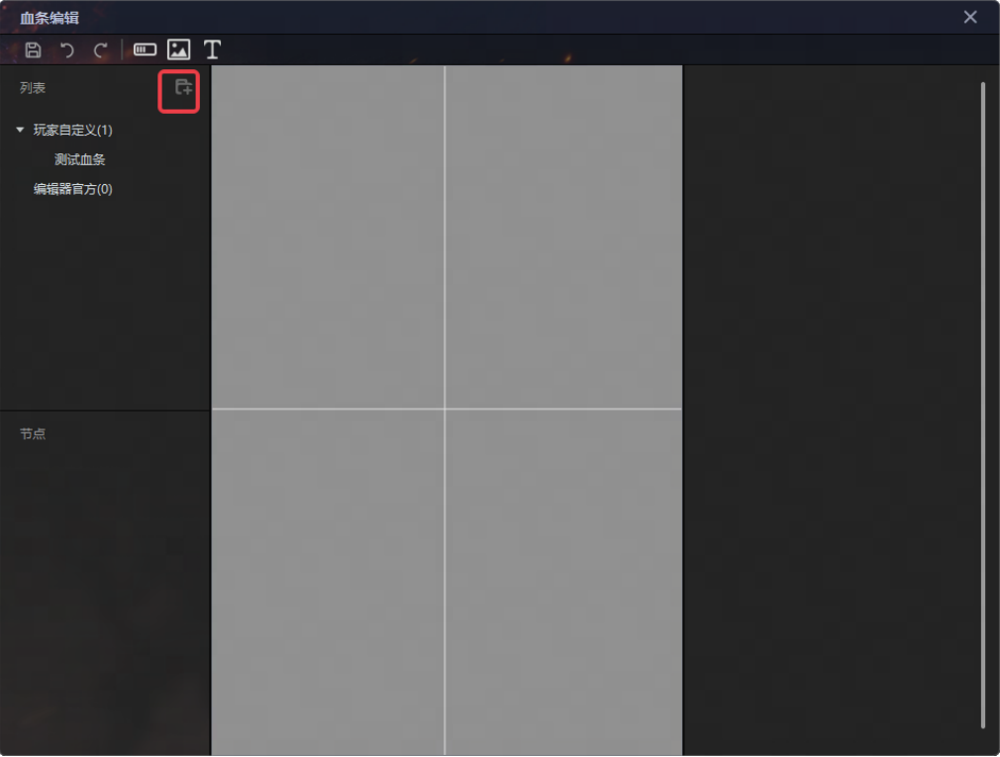
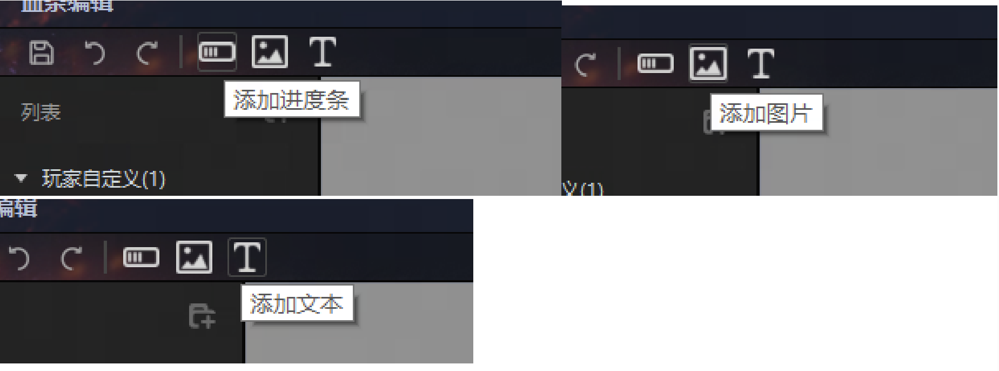
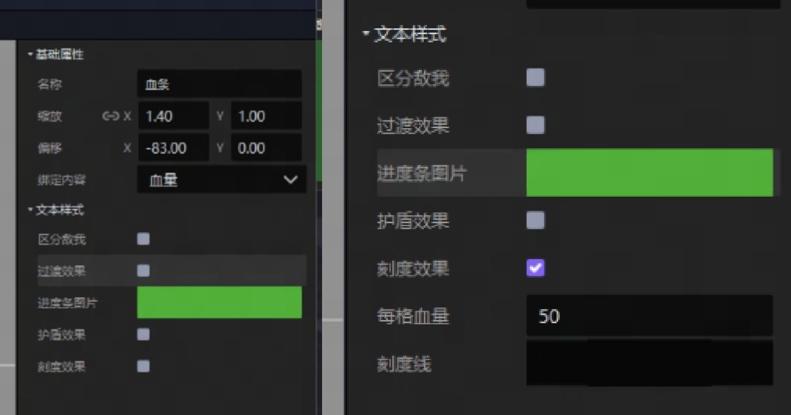
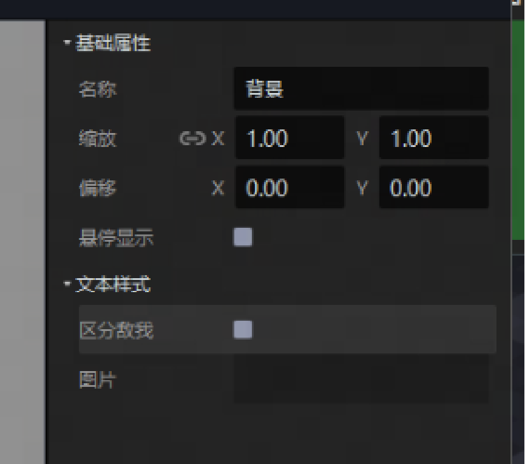
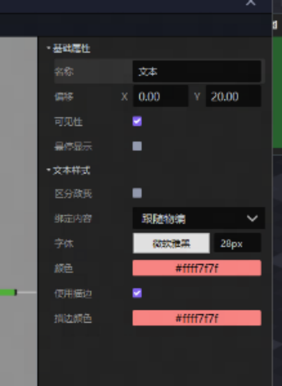
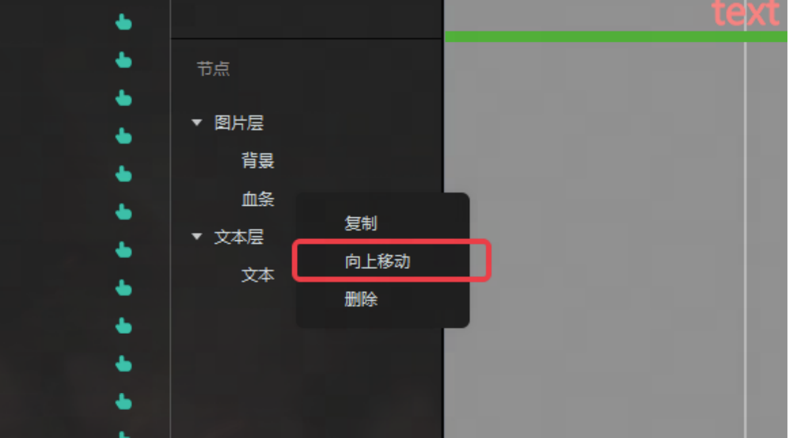
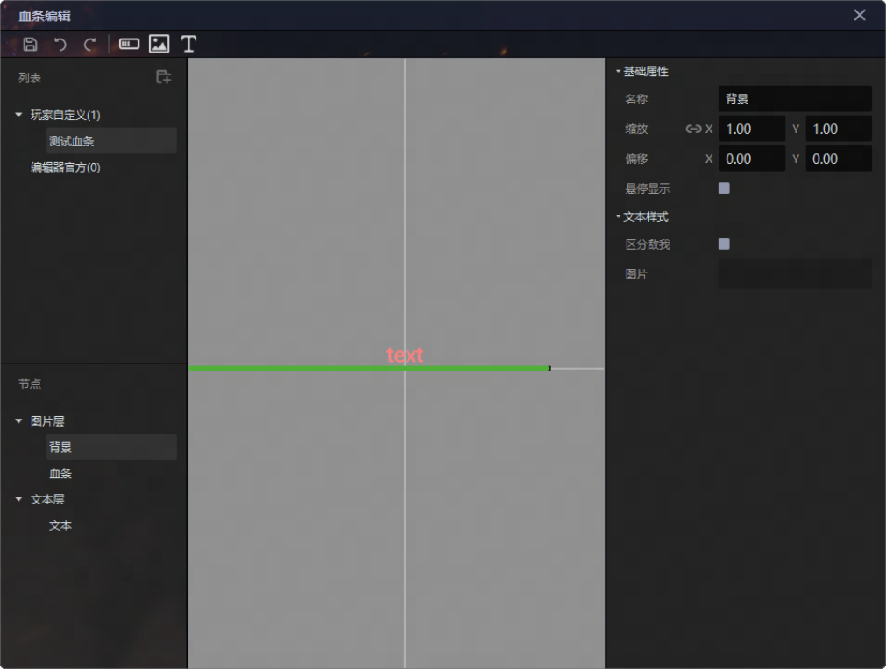
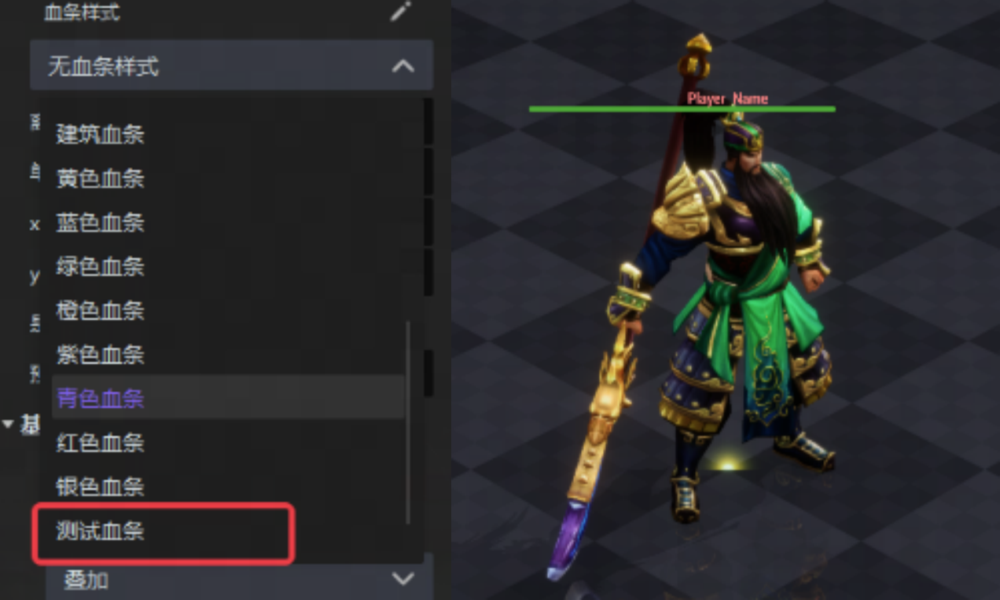

import { Callout } from 'codesandbox-theme-docs'
import { FCollapse } from 'components/FCollapse'

# 血条编辑器
在游戏中，血条不仅可以显示角色的生命值，优秀的血条设计不仅可以提供战斗反馈，还能衡量战斗能力以及增强游戏沉浸感。
本教程将介绍怎么利用编辑器制作出我们想要的血条效果。

## 一、制作一个自定义血条

### 1.1 物编中选中任意单位-在表现页面-点击血条样式后的编辑按钮，呼出血条编辑器

### 1.2 新建一个血条，选中对应的血条进行编辑

### 1.3 点击对应按钮添加组件

#### 1.3.1相关功能说明： 进度条：封装的多张图片用来实现血条、蓝条等进度条的显示功能（同时血条封装了过渡效果、区分敌我显示、刻度显示等功能，勾选后即可使用）

图片：常用来制作类似血条背景、连击点等血条内容 

文本：常用来显示角色名称、玩家名称、等级等信息

生成顺序调整：血条严格按照由上往下的顺序生成，后生成的内容会放在上面，可自行调整 

### 1.4 通过调整组件的具体属性调整对应组件的排布与现实内容等信息，制作完成后点击保存

## 二、使用自定义血条

经过第一步的流程后，我们已经有了一个自定义血条

在单位的血条样式属性中选中之前制作的血条，并可以在物编和场景中进行预览

可以用ECA进行相关显隐以及内容的调整

<video width="100%" controls>
  <source src="http://up5.nosdn.127.net/0/doc/HPBar.mp4" type="video/mp4" />
  Your browser does not support the video tag.
</video>