import { Callout } from 'codesandbox-theme-docs'
import { FCollapse } from 'components/FCollapse'

# 挂接流程
## 特效挂接
### 1、打开物体编辑器
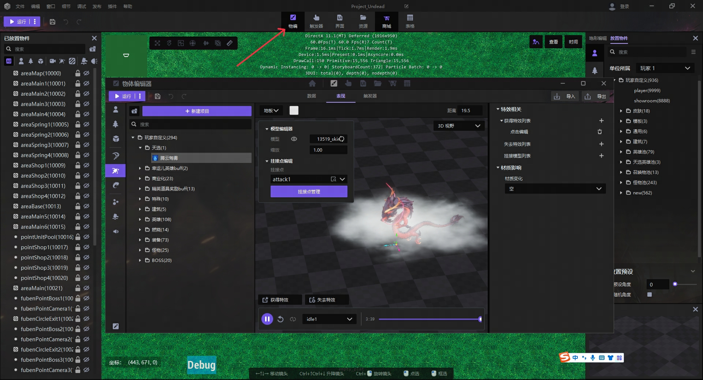
### 2、点击魔法效果
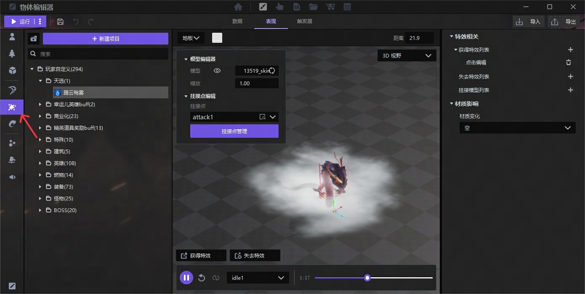
### 3、新建项目

### 4、替换需要绑定的模型
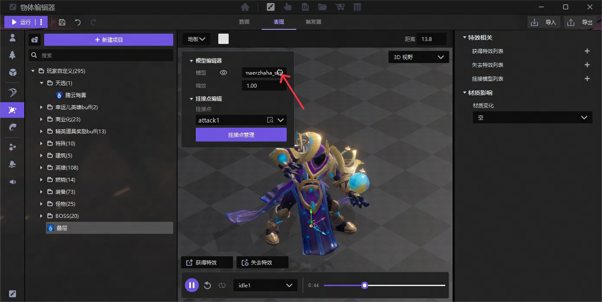
### 5、选择挂接点
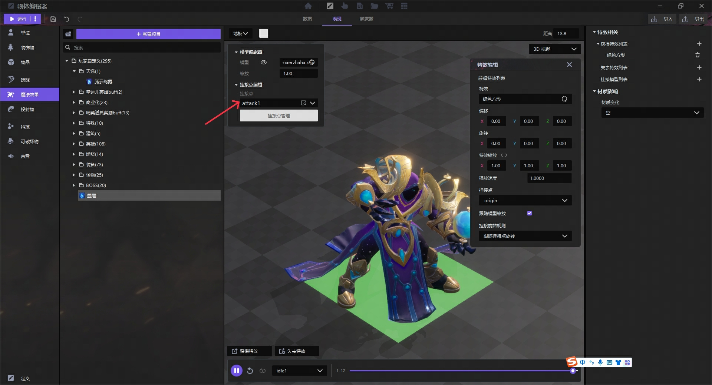

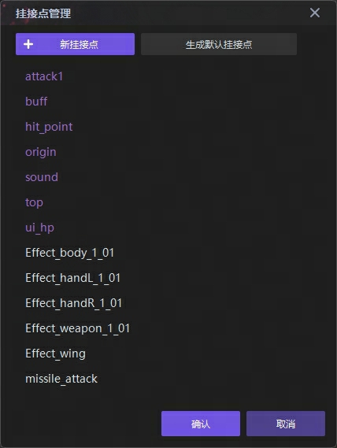

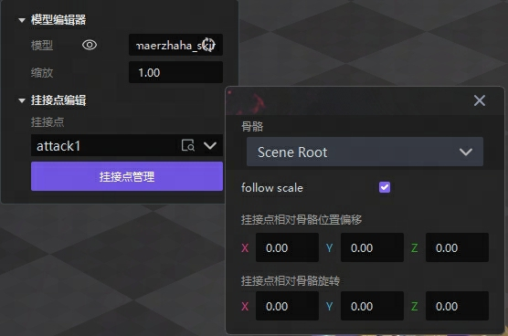
### 6、添加特效
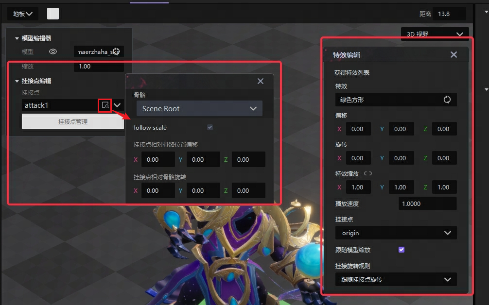
### 7、确认效果
无误即挂接完成，可在游戏局内通过魔法效果管理武器挂接和卸载时间点
## 模型挂接
### 1、创建
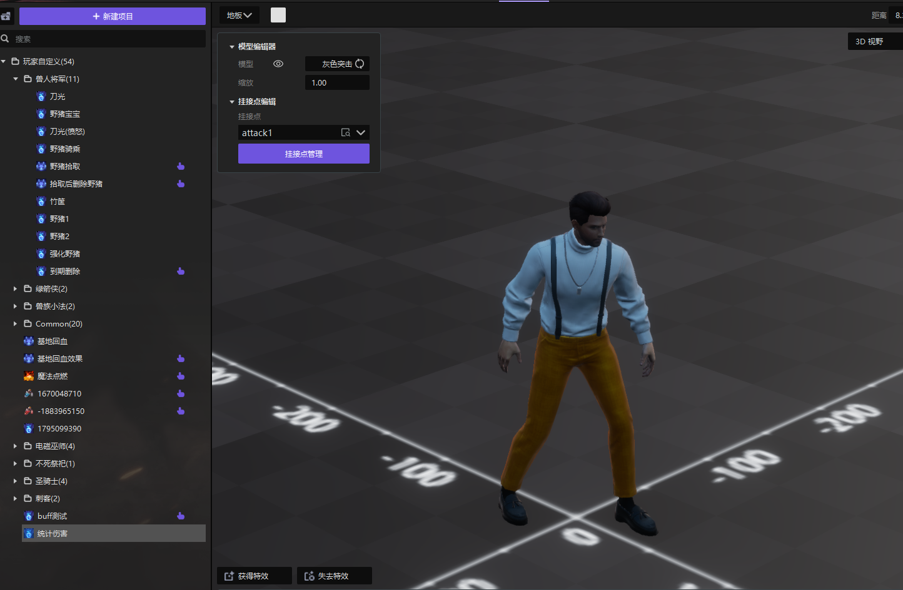
### 2、在魔法效果里有一个配置叫挂接模型列表，新建一个
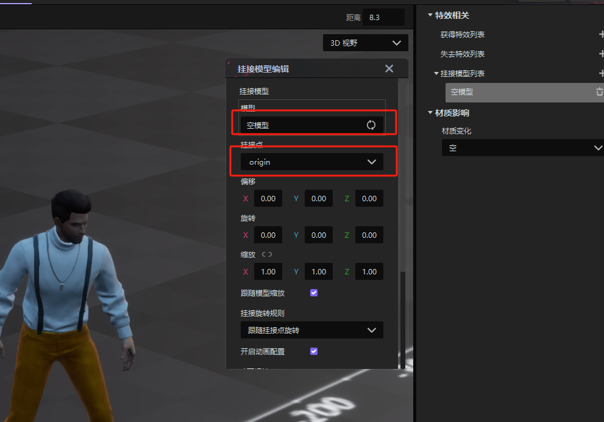
### 3、调整这个武器在对应挂接点的缩放，偏移和旋转
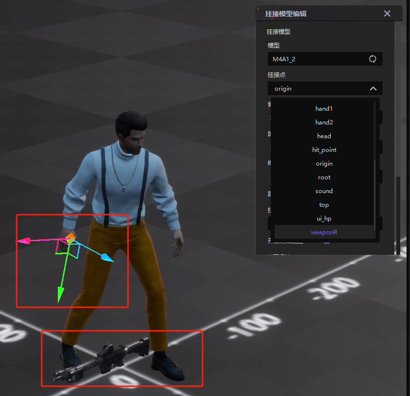

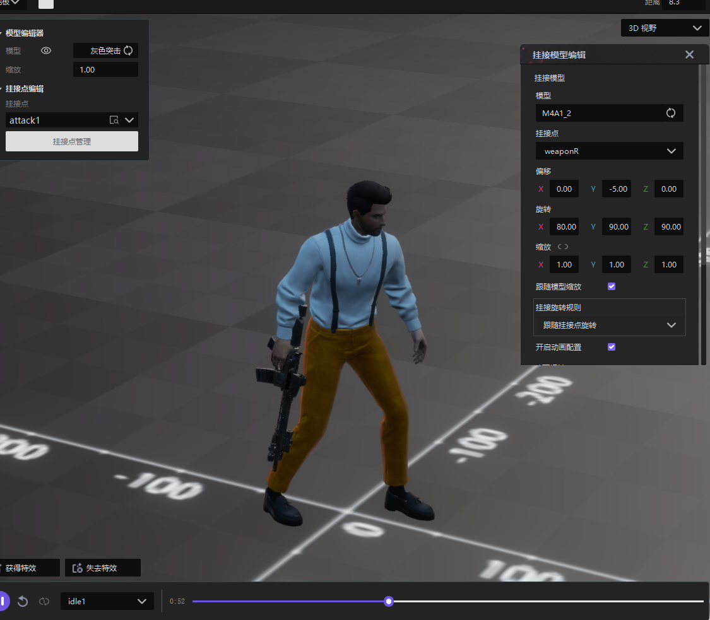
### 4、挂接完成后，可选择不同人物动画预览武器挂接效果
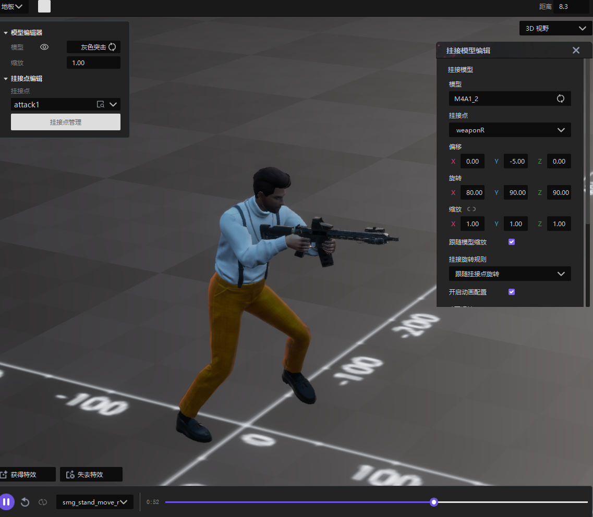

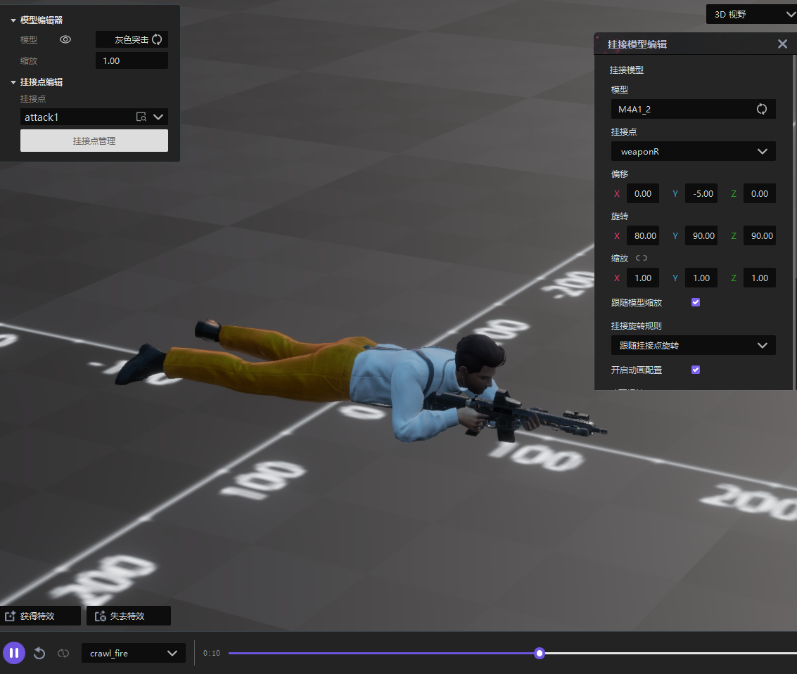
### 5、确认效果
无误即挂接完成，可在游戏局内通过魔法效果管理武器挂接和卸载时间点。