import { Callout } from 'codesandbox-theme-docs'
import { FCollapse } from 'components/FCollapse'

# 资产导入
本节介绍如何将资产上传到Y3编辑器，以及如何将它们应用到您的项目中。
# 导入和查找资产
您可以导入自己的图像、音频、模型和天空盒，以便在您的团队中专门使用。此外，您可以使用资源管理器中的资源进行选择。 导入图像、音频、模型和天空盒。 在资源管理器中，您可以导入批量资产以在您的体验中使用。
# 资源管理器导入导出相关使用说明
## 1、导入流程

在资源管理器对应目录分页下点击导入按钮，在弹窗中选择文件填写相关信息即可

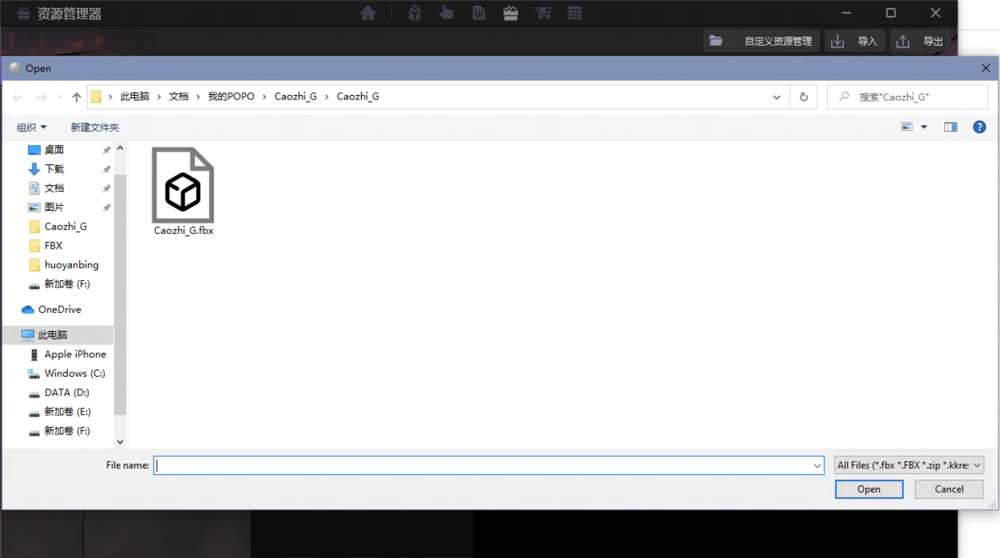

## 3、导出流程
在资源管理器对应目录分页下点击导出按钮，勾选需要导出的具体内容，点击确认后选择导出位置（文件夹）即可

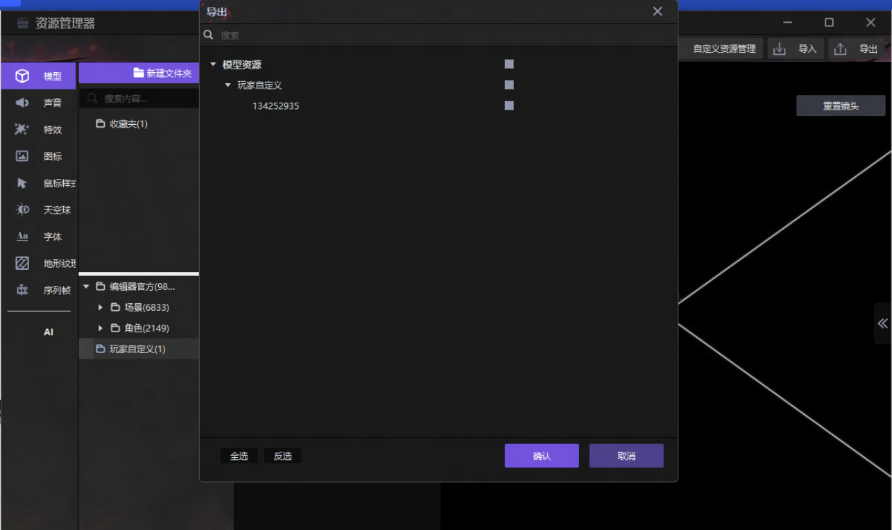

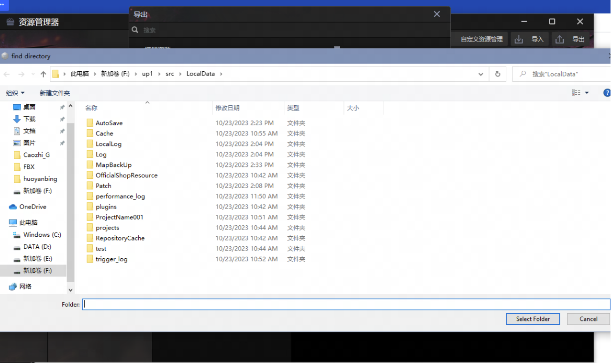

#导入的格式要求
## 2、支持自定义导入的类型：
**模型**（fbx）

**模型贴图**（tga、png）

**音效**（mp3、wav）

**图片**（png、jpg）

**鼠标样式**（cur）

**天空球**（exr、hdr）

**序列帧**（plist、多选png）

**地形纹理**（png）

## 自定义资源结构修改相关说明
1、在2.0.43的更新中我们改变了自定义资源的存储结构，现在所有的自定义资源都会放在地图文件的\custom\OriginalRes路径下

cur=鼠标样式

effect=特效

font=字体

icon=图片

model=模型

sequence=序列帧

sky_box=天空盒

sound=音频

terrain_texture=地形纹理

2、自定义资源的结构将会与文件结构对应更加可读（如图） 有.package后缀的文件夹是编辑器内的资源条目，没有后缀的是正常的文件夹（请勿手动在文件夹名称末尾加.package，容易造成不可知问题）

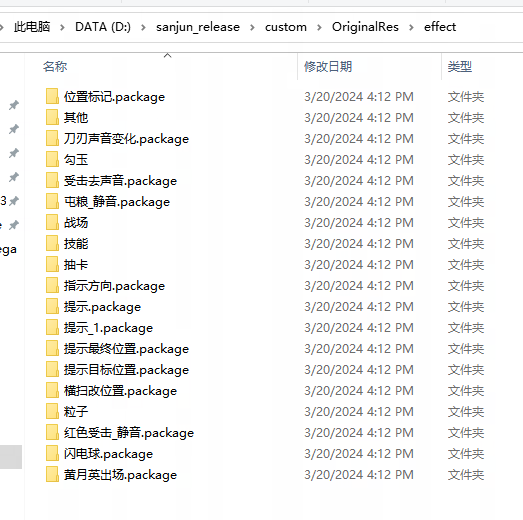

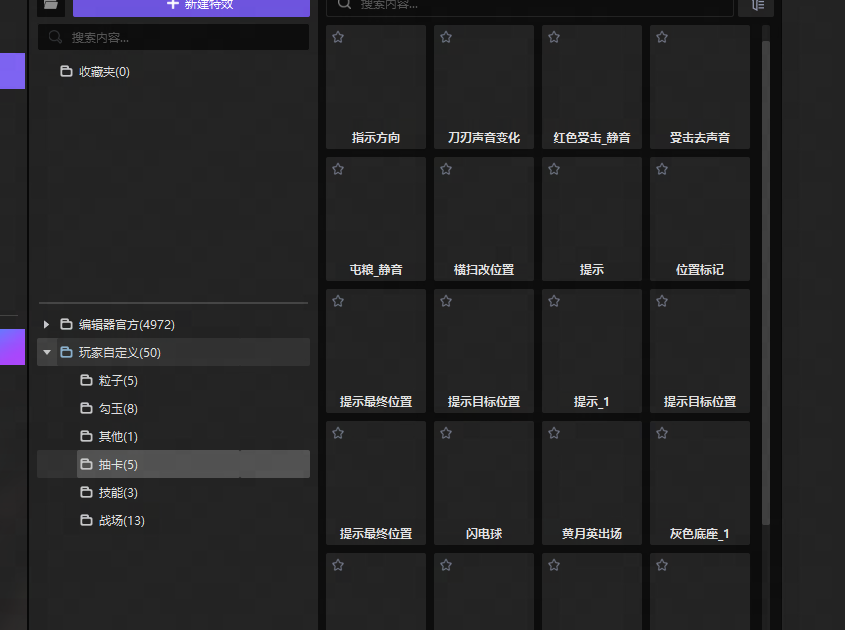

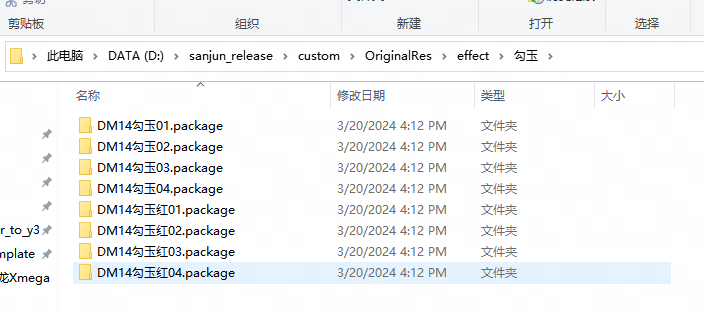

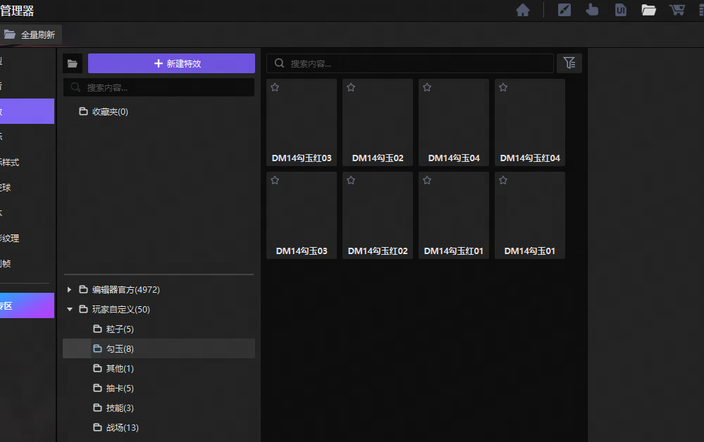

3、资源分享将更加方便，只需要将对应资源文件拖入对应文件夹（如果是其他地图里已经导入的直接放进去即可，如果是资源文件则会依次走导入流程），点击编辑器内刷新按钮即可

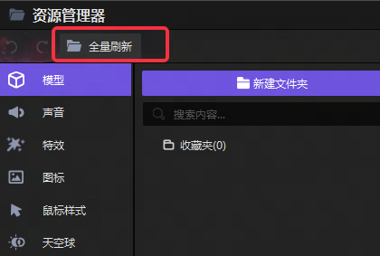

4、此次更新后,导入的文件将会以源文件+描述文件的形式存储，方便查看和调整（可以直接在windows目录中将对应资源替换成其他同名图片，打开编辑器刷新后即可生效）

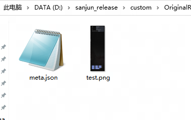

注意事项：

1、第一次刷新时会处理当前地图内的所有资源，建议先备份原地图，时间相对较长（600M的资源在固态中测试用时10min左右），请耐心等待，处理完成后地图文件大小会有较大幅度的提升

2、可以直接在windows文件管理中对源资源文件进行一定的修改调整，单独删除源文件或meta文件可能造成对应资源丢失，修改前请做好备份工作

3、由于目前批量资源操作速度比较慢，暂时没做开图自动刷新，后续优化完成后会加上
## 模型自定义导入指引
### 1、确认单位比例
DCC软件以3D Max为例
### 2、单位设置
· 一般使用厘米或米为单位。

· 将系统单位和显示单位设置成一致。

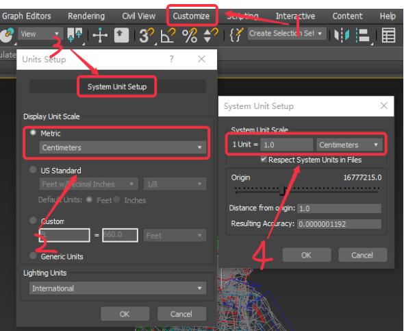
### 3、确定模型比例
打开模型文件，确认单位比例，可以拉一个box来验证大小，示例文件单位为厘米时是正常比例。

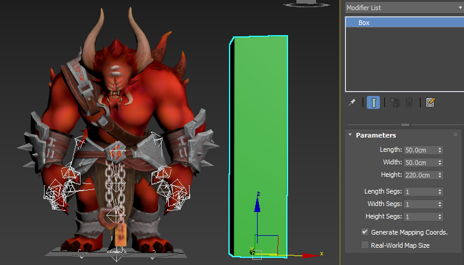
### 4、确定资产合规性
详细请查看 Y3 角色、装饰物模型要求。

### 5、模型导出
一般导出为fbx格式。

fbx导出Geometry选项设置如下：

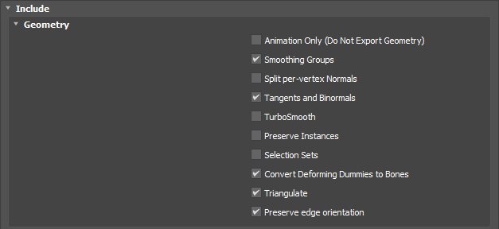

如果是带绑定的模型，请确保Skins处于勾选状态：

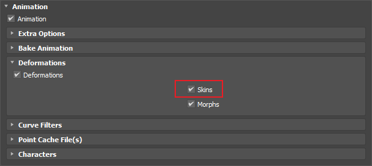

检查导出单位是否与系统单位设置一致，一般情况使用Automatic（自动）即可：

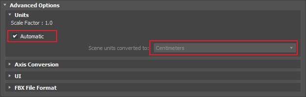
### 6、动画导出
动画导出可以带模型导出，或只导出骨骼动画，导出设置同上。
如果最终的动画轨迹与DCC中有差异，可以在导出设置里勾选 Bake Animation，并设置动画结束帧（End）：

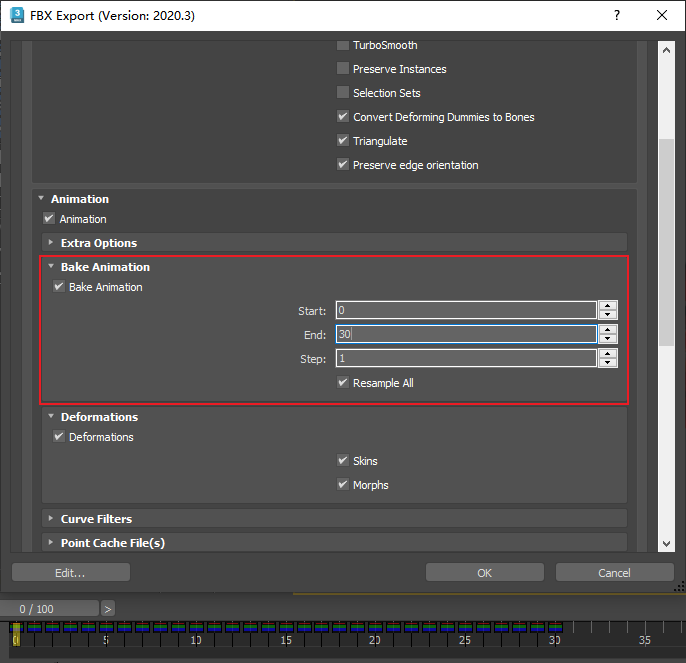
### 7、导入到编辑器
打开Y3编辑器的资源管理器界面，在模型标签页下，点击右上角的导入按钮，选择需要导入的模型文件。

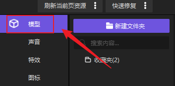

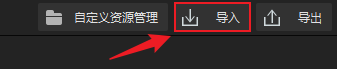
### 8、导入动画和纹理贴图

### 9、材质和贴图
详细信息请查看材质制作指引。
### 10、必要的动作要求
**待机：idle1** **死亡:die** **移动：walk**骨骼模型导入Y3时，必须要指认这3个动画文件，需要提前准备好动作素材。

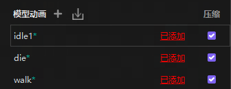

如果资源没有这3个动画，且在游戏内用不到这个3个动画，可以使用任意动画来填充槽位。
### 11、模型朝向

我们可以看到模型底部有一个箭头方向，对于角色模型我们需要将角色的面朝向旋转至于箭头方向一致，我们可以通过正方向矫正功能来调整角色朝向，如下所示，我们将角色旋转180度后，角色证明与箭头方向保持一致。
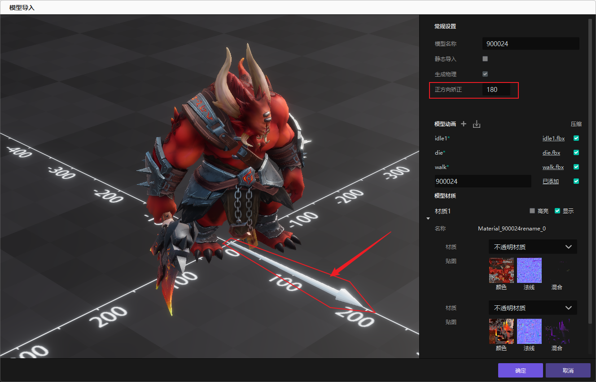

### 12、添加更多动画
可以点击+号添加更多动作，并修改动画名称。点击动画条目的空白处可预览动画。

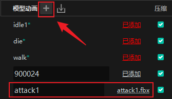

如果动画数量较多可全选动画文件批量导入

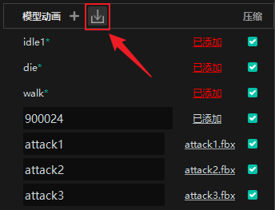

### 13、再次编辑
导入后可以在玩家自定义目录下找到我们的资源，可以通过右键**再次编辑**修改。

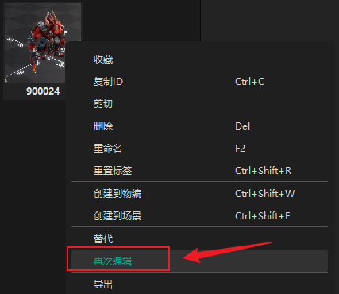

## Y3角色、装饰物模型要求
### 1、支持模型类型
Y3编辑器模型导入支持**静态网格体**和**骨骼网格体**（带蒙皮的模型）。

推荐使用FBX格式进行导入，导出FBX时建议将除蒙皮（skin）外的其他节点（修改器）塌陷或删除，并转为三角面，否则结果可能与预期产生偏差。
### 2、资产面数规格
面数一律是指三角形，非多边形。
#### 角色类
英雄、BOSS、精英怪、载具出现的环境差异较大，建议根据不同视角选择合适的面数规格

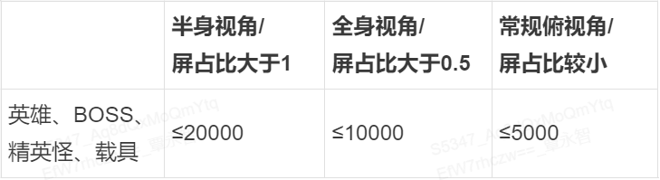

普通怪物、NPC、坐骑、动物、武器等模型建议面数小于等于5000面。
#### 场景类
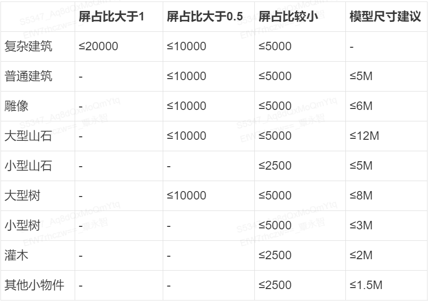

### 3、LOD（细节层次）几何图形
自定义导入不支持LOD，需要多级LOD的资产，建议将LOD拆分成多个资产导入，通过ECA逻辑切换不同的模型。例如在角色展示界面使用高面数模型，游戏内使用低面数模型。

### 4、贴图规格
模型贴图尺寸必须为2的n次幂，通常为正方形，如512*512、1024*1024等。

模型主体贴图建议为1024*1024像素，最大不要超过2048*2048，装饰区域通常可以使用更小尺寸的纹理。

贴图作用参考材质贴图指引。
### 5、模型与材质拆分
模型资产的子模型数量和材质数量均会增加绘制接口调⽤（drawcall），影响渲染效率（CPU），对于同屏大量角色的情况需要严格控制角色子模型和材质的数量。

建议导入前检查模型，将使用相同材质的子模型合并。

英雄、boss类角色建议drawcall数量小于等于4，其他角色小于等于2 。

场景装饰物建议drawcall数量小于等于2 。
### 6、骨骼
骨骼数量不能超过128根，如果模型资源的骨骼超过128需要手动减少骨骼，或者将模型拆分成多个模型资源进行导入。

请避免骨骼名称重复。

仅支持1个根骨骼。

仅能支持每关节 4 个顶点的蒙皮。

仅支持蒙皮（skin），不支持链接或蒙皮包裹等功能。
### 7、融合变形
不支持模型内的融合变形。

## 材质贴图指引
### 1、材质支持类型
PBR材质（基于物理的渲染流程）、英雄三国材质（次世代制作流程）、卡通材质

我们提供了基于BPR材质的4中变体材质，可在列表中选择透明模式和双面模式。
#### 如何选择材质
查看资源中包含的纹理；

如果包含混合纹理，请选择PBR材质，关于混合纹理的详细信息请看 PBR材质贴图制作指引 。
PBR材质的模型和贴图示例：

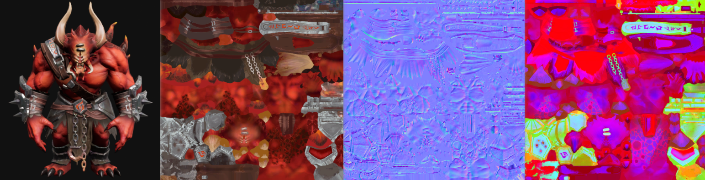

混合贴图RGB通道信息示例（R:粗糙度 G:金属度 B:AO）：

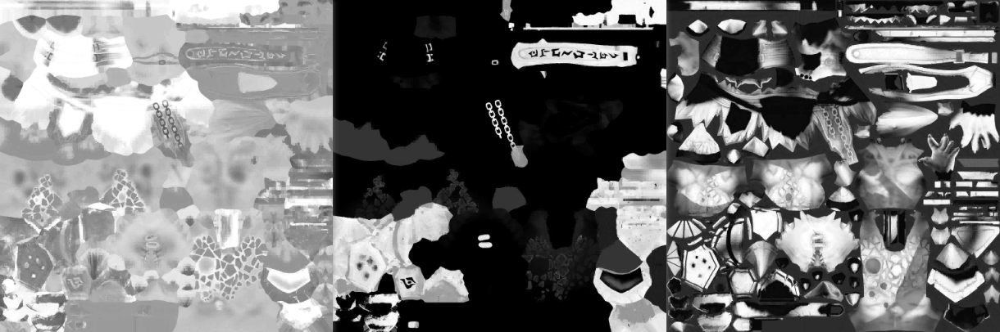

如果包含高光纹理，请选择英雄三国材质。
英雄三国材质的模型和贴图示例：

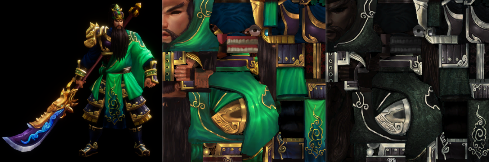

如果资产的纹理只有颜色图或只有颜色和法线，请选择 PBR材质、英雄三国卡通材质 中的任意一种，缺失的纹理贴图保持材质默认即可。

如果希望有更强的卡通效果表现，可以选择卡通材质，建议使用 卡通材质（新） 。
卡通材质（新）的模型和贴图示例：

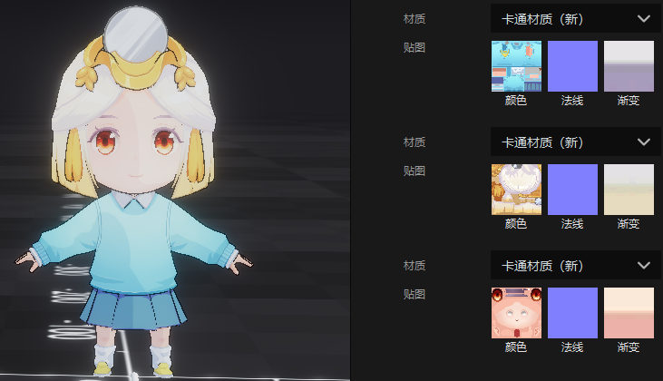

如果颜色贴图的Alpha通道有透明信息
### 2、PBR材质贴图制作指引
PBR，意为基于物理的渲染，用于更精确的描述光如何与物体表面的互动。PBR的优势在于拥有一套相对标准化的工作流程，能够获得更加稳定、可预测的高质量效果。

我们使用金属/粗糙度工作流(Metal-Roughness)，需要作者上传3张纹理：颜色、法线、混合。
#### 贴图输入
##### 颜色贴图的注意事项
颜色贴图除了微观遮蔽信息（Micro-occlusion）以外，不应该含有任何光照信息。

颜色贴图中的颜色对于非金属材质来说是它的反照率颜色（Albedo），对于金属材质来说则是它的反射值（Reflectance value，所带色相与其反射的波长有关）。

**非金属部分**暗色值在宽松条件下不应该低于 30 sRGB，严格来说不应该低于 50 sRGB。亮色值不应该高于 240 sRGB。

**金属部分**Base Color 贴图中的值是指金属的反射值，这些值应当采用真实世界中的测量值。原始金属的反射值一般都非常高，大概能达到 70-100% 的镜面反射，映射到 sRGB 范围大概是 180-255。

**颜色贴图A通道**作为半透明通道输入。
##### 法线贴图
法线贴图使用Dx（DirectX）模式，与3D Max的法线贴图方向一致。如果是OpenGL模式的法线，需要在图像处理软件中将法线贴图的绿通道颜色翻转。
##### 混合贴图
混合贴图RGB通道分别为：粗糙度、金属度、AO。

如果资源的混合纹理是多张灰度图，请在图像处理软件中按正确的通道顺序将其合并。

粗糙度是一个非常主观的领域，作为一个艺术设计者可以放开手去尝试。粗糙度为黑色表示完全光滑，会产生比较聚拢的高光效果，粗糙度为白色表示完全粗糙，表面几乎看不到高光。

AO用于计算环境遮蔽，在低配效果下，AO会直接作用与颜色以加强低配效果，若资源不需要AO需要将B通道填为白色。
###### 金属度的注意事项
金属贴图是用于定义物体中哪个区域是原始金属的贴图。作为一个灰度贴图，他的作用就类似于一个图层遮罩，告诉着色器应该如何去解读 Base Color 贴图中的 RGB 数据。

金属被氧化、腐蚀、上漆、覆尘后，这些区域需要被当做非导体（电介质）材质来看待。

在金属贴图中，纯黑（0.0）代表了非金属，纯白（1.0）代表了金属，我们可以用过渡的灰阶来表示不同程度氧化和污垢。

如果金属贴图中有值低于 235 sRGB，那么在 Base Color 中对应区域的反射值也应该降低。
### 3、英雄三国材质
英雄三国材质是匹配旧时代资产的材质，下面简称 英三材质。

#### 贴图输入
##### 颜色贴图
与PBR材质的颜色图要求不同，英三材质的颜色图需要将部分光影、质感信息绘制到贴图上。
##### 法线贴图
法线贴图使用Dx（DirectX）模式，与3D Max的法线贴图方向一致。如果是OpenGL模式的法线，需要在图像处理软件中将法线贴图的绿通道颜色翻转。
##### 高光贴图
其光照计算相对于PBR材质要简单很多，材质通过高光图来控制模型的高光区域、颜色和强度。

高光图通常可以通过颜色图调整亮度曲线得到。

金属感强的区域高光图可以适当提亮，非金属的区域需要将高光图压暗。

通过高光图的亮度聚拢程度来表现材质的光滑度。

颜色图与高光图的关系参考：

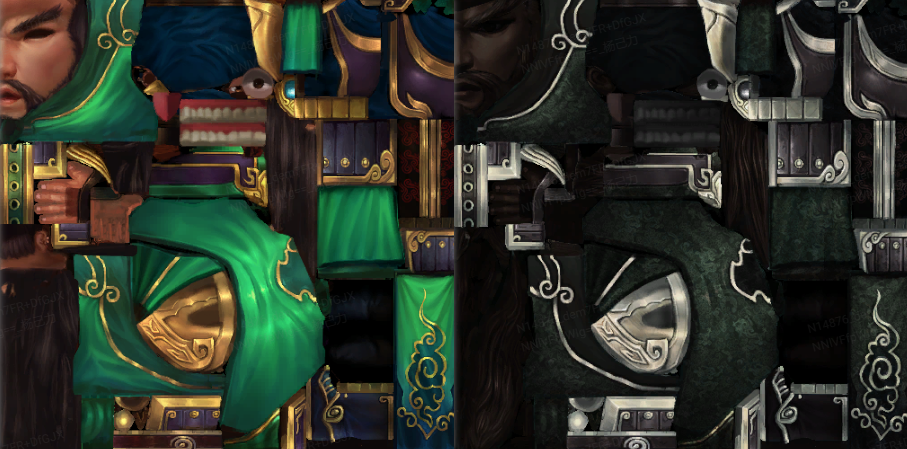

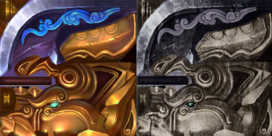
### 4、卡通材质（新）
#### 贴图输入
##### 渐变贴图
渐变贴图用于控制模型受光照亮度和暗部的颜色变化。

渐变贴图的尺寸通常小于32*32像素。

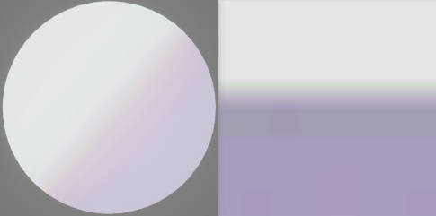

## 其他说明：
1、导出的文件统一为kkres格式，放在一个名为KKexport的文件夹中

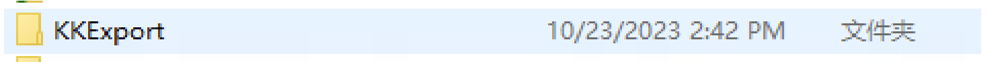

2、模型导入后将默认播放idle1动画（如果没有则为T-pose），需要接入动画系统的模型必现有die、idle1、walk三个动画

3、模型的骨骼蒙皮等信息读取自源文件，纯动画fbx无法作为源文件

4、目前暂不提供材质相关的自定义修改