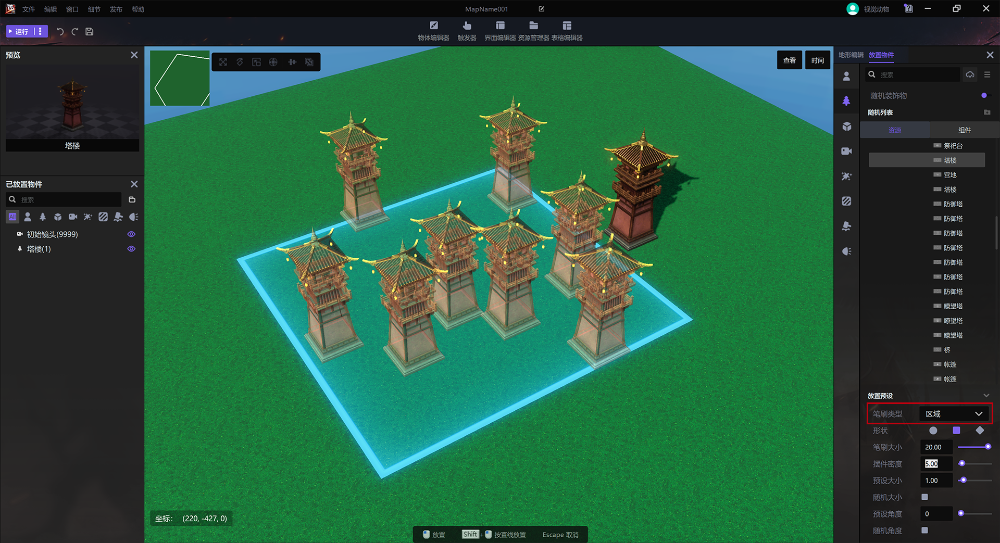
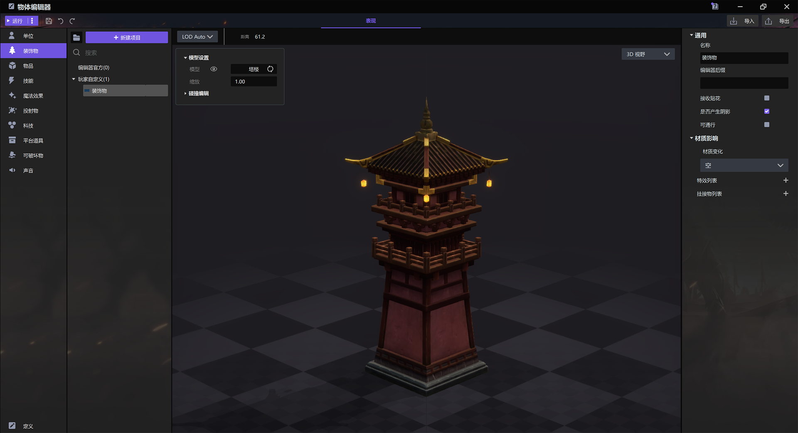

import { Callout } from 'codesandbox-theme-docs'
import { FCollapse } from 'components/FCollapse'

# 物品模型

物品模型可以用作装饰或可破坏物，以及建筑单位。 

<video width="100%" controls>
  <source src="https://up1goods.fp.ps.easebar.com/file/643f60ad9781de56bea82a89x6tJ3Z3q03" type="video/mp4" />
  Your browser does not support the video tag.
</video>

您可以在[操作区域](../Navigation/Main_interface/Operation_Area)中的[放置物件-装饰物/可破坏物](../Navigation/Main_interface/Tool_Palette)中选择一个**物品模型**并将其拖放到地图中。您还可以选择放置**随机装饰物**。

<Callout type="info"> 
术语：**随机装饰物**分为**资源**和**组件**。资源是指预设在[资源管理器](../Navigation/Resource_Manager)中的模型，而**组件**则是通过[物体编辑器](../Navigation/Object_Editor/Interface#物体编辑器的界面)自己组装的装饰物。
</Callout>

在预设部分，您可以通过**笔刷类型**选择放置**个体**或**区域**的模型，并将其设置为**随机大小**和**随机角度**。

在[物体编辑器-装饰物/可破坏物](../Navigation/Object_Editor/Functions#decorations)中，您可以编辑相应的**物品模型**，例如，您可以为物品模型**更改材质**。

