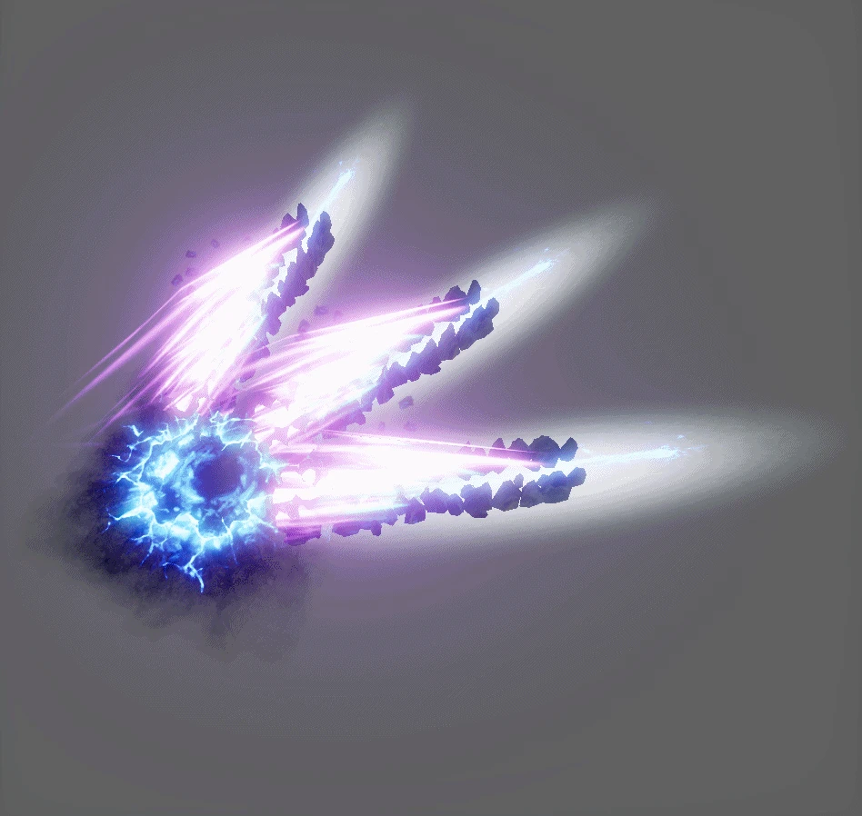
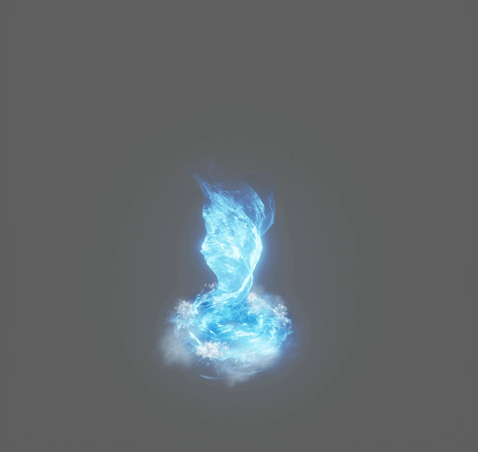
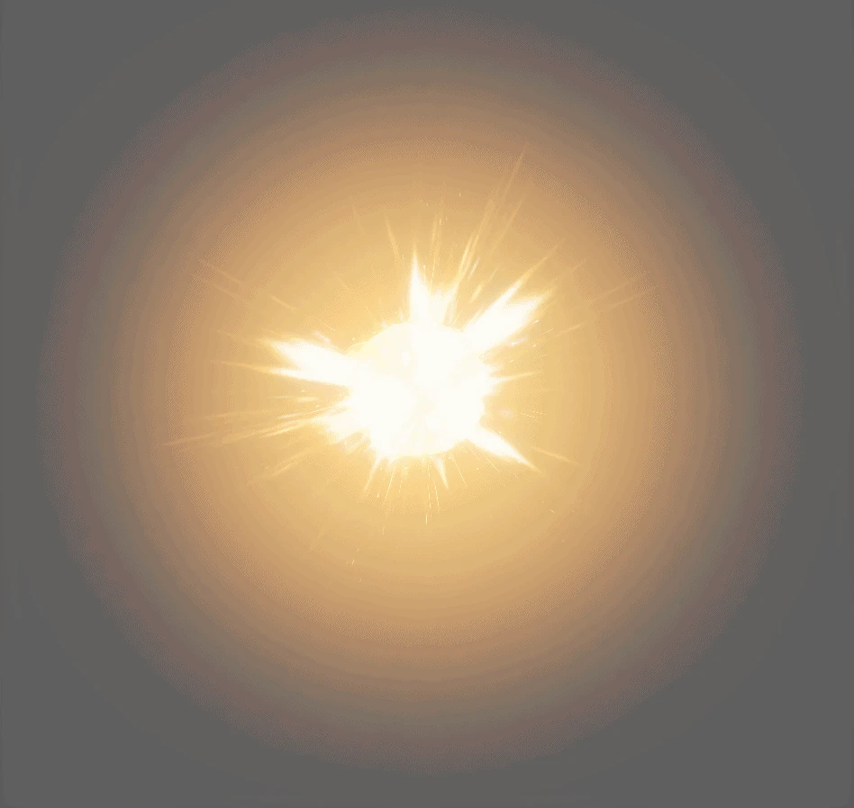
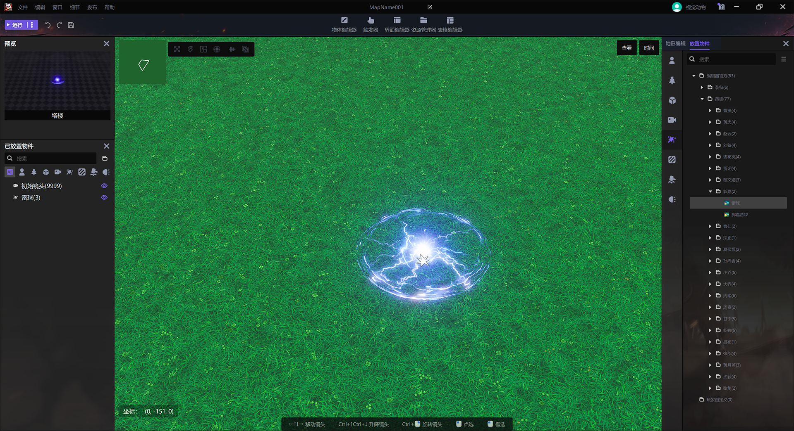
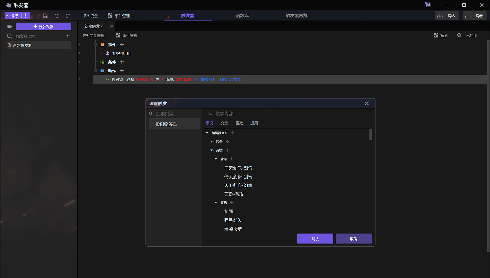
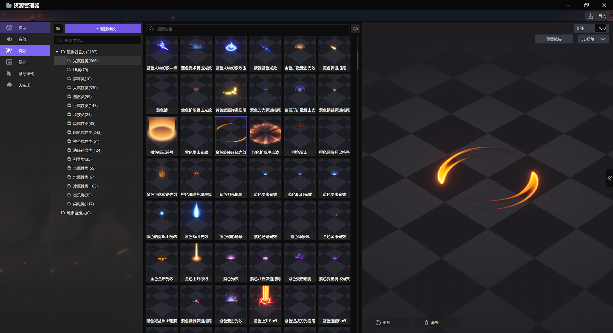

import { Callout } from 'codesandbox-theme-docs'
import { FCollapse } from 'components/FCollapse'

# 特效

**特效**可以使用在**魔法效果**、**场景UI**或者**投射物**当中。

方法为在**放置物件**板块选择一个**投射物**并将其拖拽放置到操作区的地图中。

+ 特效示例：刀风

+ 特效示例：地刺

+ 特效示例：龙卷风

+ 特效示例：法阵

+ 特效示例：溅射

+ 特效示例：爆炸

您可以在[物体编辑器-投射物](../Navigation/Main_interface/Tool_Palette#projectile)中选择一个**投射物**，并将其拖到[操作区域](../Navigation/Main_interface/Operation_Area)的地图上。

您还可以通过[触发器](../Navigation/Trigger)创建粒子效果。您可以通过搜索名称或单击**资源管理器**，从[资源管理器](../Navigation/Resource_Manager)中选择所需的特效。

