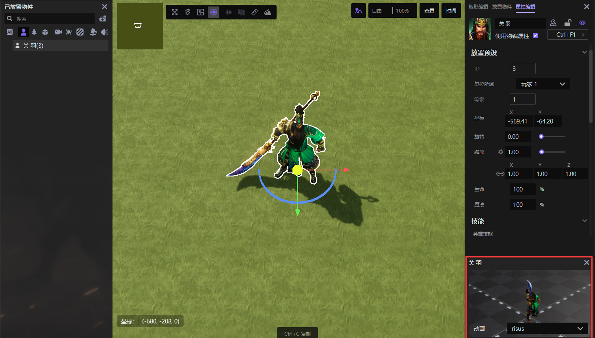
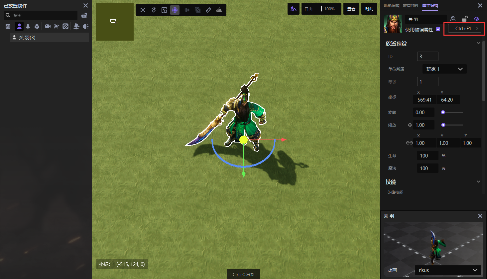

import { Callout } from 'codesandbox-theme-docs'
import { FCollapse } from 'components/FCollapse'

# 角色模型

角色模型通常用作**单位**。不同职责的**单位**有不同的类型。**单位类型**确定了**单位**的某些特征，包括可编辑属性和默认属性。角色**单位**可以分为三种类型，如下所示。

+ 英雄：此类型没有限制。
+ 建筑：无法移动、转身或获得经验。
+ 生物：无法获得经验点数。

<video width="100%" controls>
  <source src="https://up1goods.fp.ps.easebar.com/file/643f606e9781de1874bb012aFC25Vup003" type="video/mp4" />
  Your browser does not support the video tag.
</video>

每个模型都有对应的动作。您可以在[资源管理器](../Navigation/Resource_Manager)中预览所有单位及其动作。

您可以通过[触发器](../Navigation/Trigger)调用角色模型及其动作。

您可以在[放置物件-单位](../Navigation/Main_interface/Tool_Palette)中选择一个**角色模型**，并将其拖到[操作区](../Navigation/Main_interface/Operation_Area)的地图上。

在操作区中选择一个角色后，您可以在[物件预览区](../Navigation/Main_interface/Preview_Area)中更改其动作。

在选择了角色后，您还可以点击[属性编辑](../Navigation/Main_interface/Tool_Palette)中的**编辑对象**，然后在[物体编辑器](../Navigation/Object_Editor/Interface)中设置角色。

在[物体编辑器-数据](../Navigation/Object_Editor/Interface)中，您可以设置一个**单位**是否具有生命值，生命值的显示样式以及是否显示玩家名称。在[物体编辑器-显示](../Navigation/Object_Editor/Interface)中，您还可以更改角色的动作，并在窗口底部查看相应的动画。

如果您想要替换模型，您可以点击**模型设置**部分，模型名称后面的进入[资源管理器](../Navigation/Resource_Manager)。

您可以在[资源管理器](../Navigation/Resource_Manager)中查看所有可替换的模型。您还可以**导入**自己的模型（[导入规则](../Art-Assets/Import)）并使用它。

