import { Callout } from 'codesandbox-theme-docs'
import { FCollapse } from 'components/FCollapse'

# 序列帧动画
在界面编辑器中我们需要插入一些动画时，可以使用序列帧动画的功能，本教程将具体介绍序列帧动画的使用方法。
# 获取资源内容
## 导入纯图片内容（适用于玩家仅有散图的情况）
在导入窗口中批量选择图片，被选中的图片将以命名升序的顺序导入编辑器中
## 导入图集与plist文件（适用于玩家从cocos或unity中导出序列帧到编辑器中的情况）
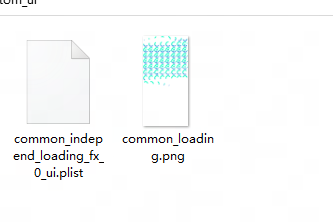

对于已经有完整图集和plist文件的序列帧，点击导入，选择对应的plist文件即可

系统会尝试自动检索绑定的png文件，如果没有搜索到则会留空，需要手动绑定
## gif文件处理（适用于用户仅有gif文件的情况）
由于引擎暂不支持直接进行gif的导入，所以目前需要使用者自己先将gif处理成单独的png文件再进行导入

以PS为例，打开gif后选择 导出 将图层导出到文件 ，然后将分离出来的png文件批量导入即可

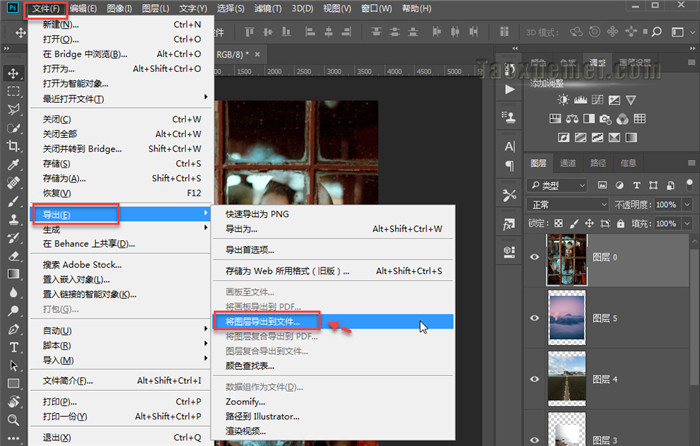

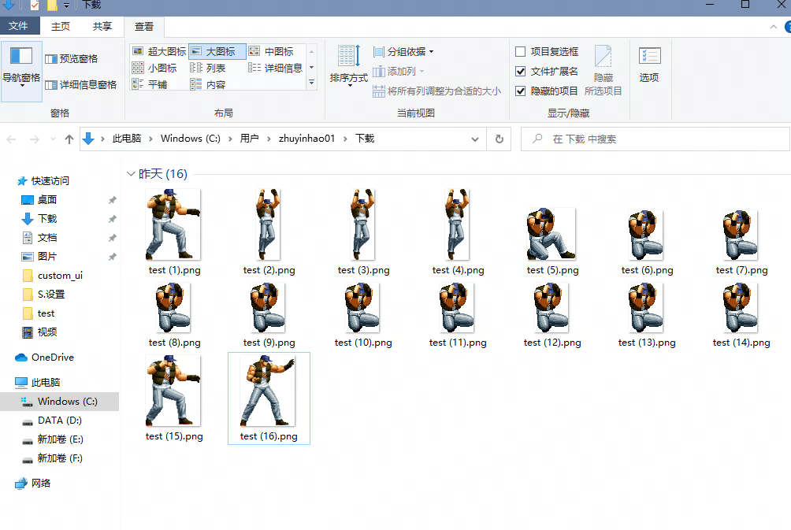
## 仅有图集文件处理（适用于用户仅有png图集文件的情况）
在搜集对应序列帧资源时经常出现仅提供了图集，没有描述文件的情况，这种情况需要手动切图

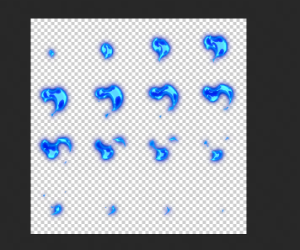

以PS为例，打开对应图片后，选择切片工具，框选图集整体，在右键菜单中选择划分切片，输入对应参数后 按alt+shift+ctrl+s保存为png格式

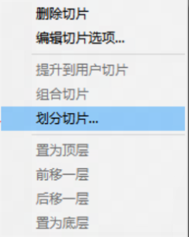

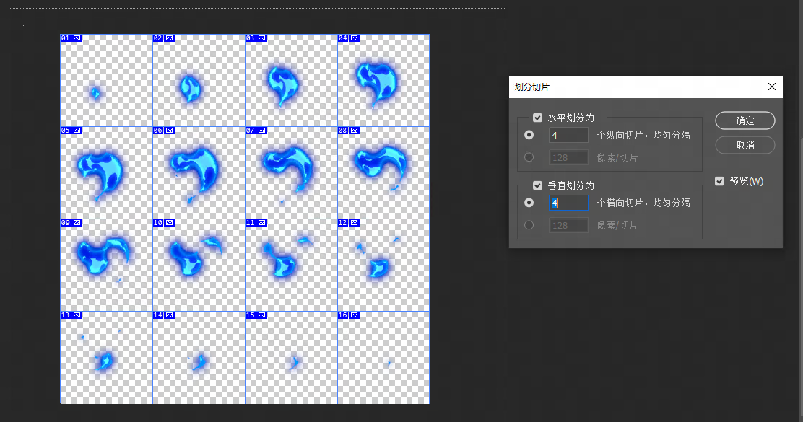

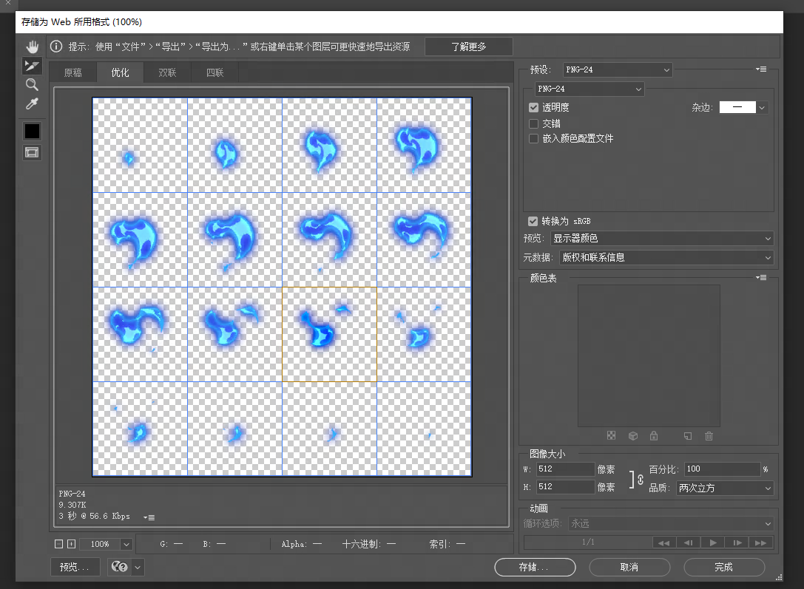

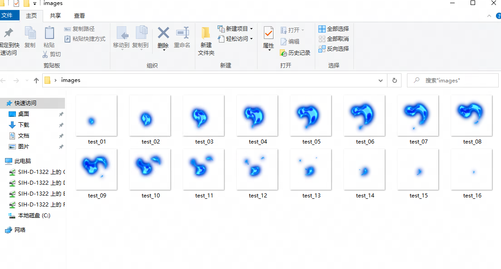

随后将生成的png批量导入即可
# 在编辑器中使用序列帧
经过第一步的导入流程后，我们成功的将一个序列帧文件创建到了资源管理器中

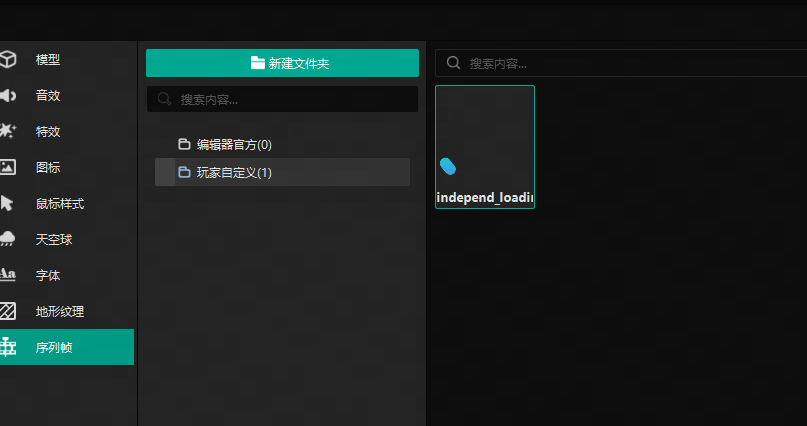

现在我们将尝试去使用它

打开界面编辑器，往画布内添加一个序列帧控件

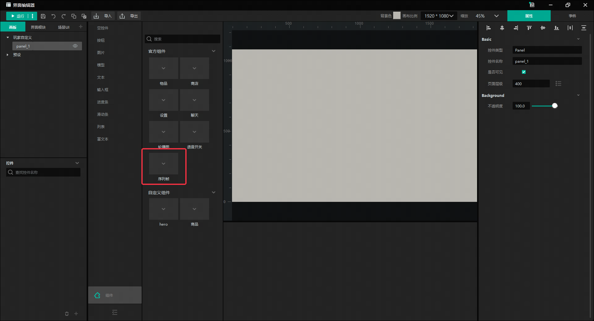

点击属性中的序列帧，添加一个默认序列帧

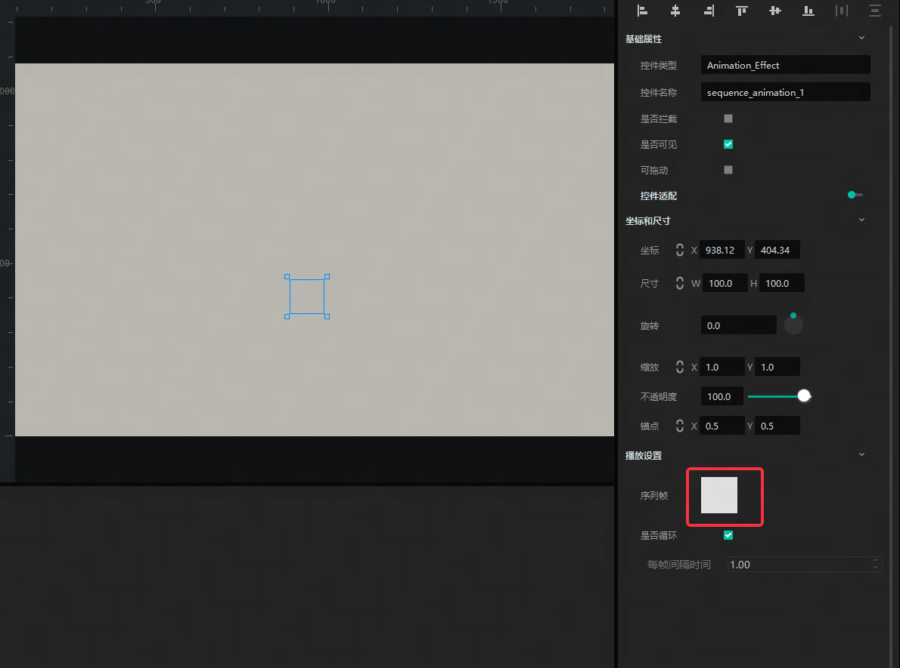

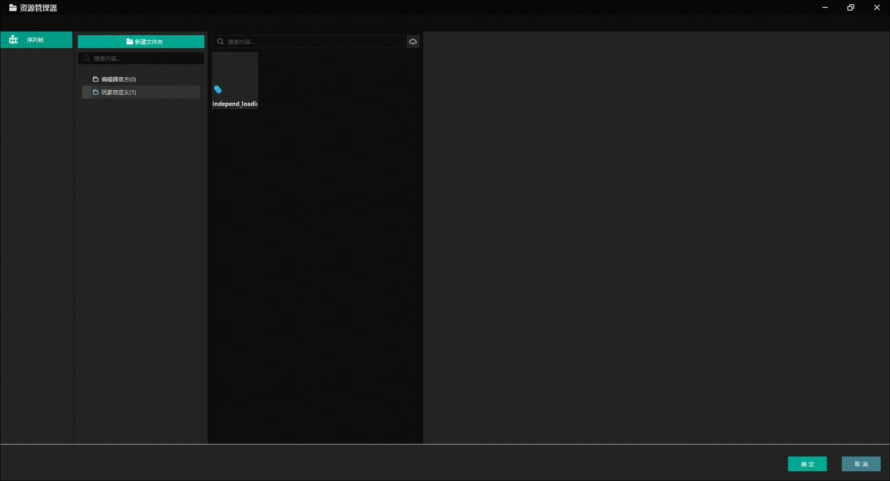

添加完成后即可在界面中看到对应序列帧的效果

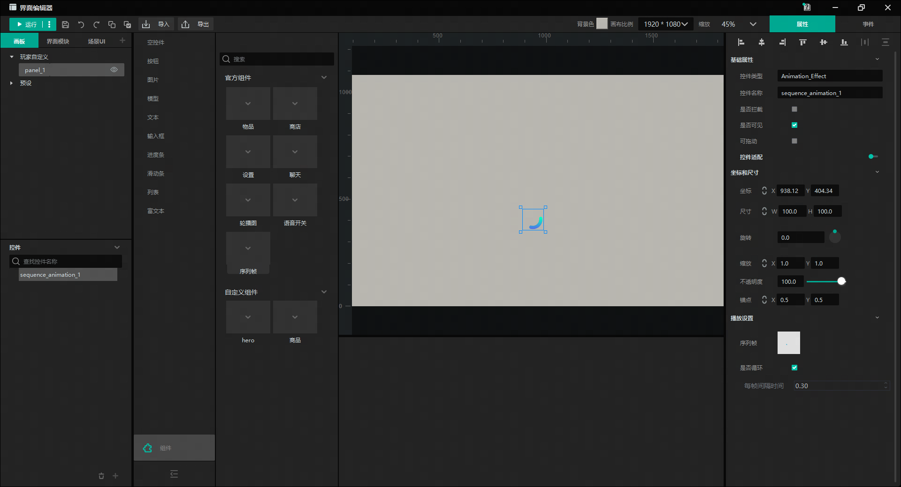

在运行过程中可以通过以下ECA调整序列帧效果

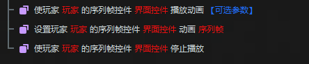

视频教程：
1、散图导入
<video width="100%" controls>
  <source src="http://up5.nosdn.127.net/0/doc/SFA1.mp4" type="video/mp4" />
  Your browser does not support the video tag.
</video>
2、plist导入
<video width="100%" controls>
  <source src="http://up5.nosdn.127.net/0/doc/SFA2.mp4" type="video/mp4" />
  Your browser does not support the video tag.
</video>