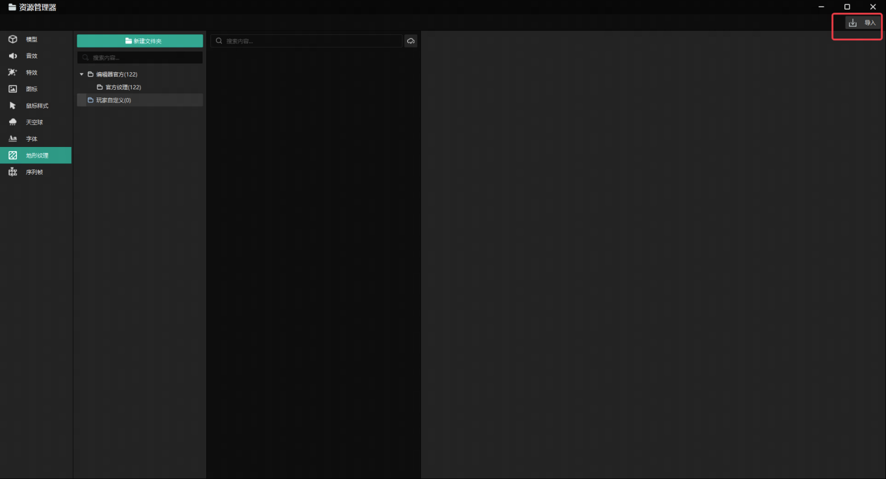
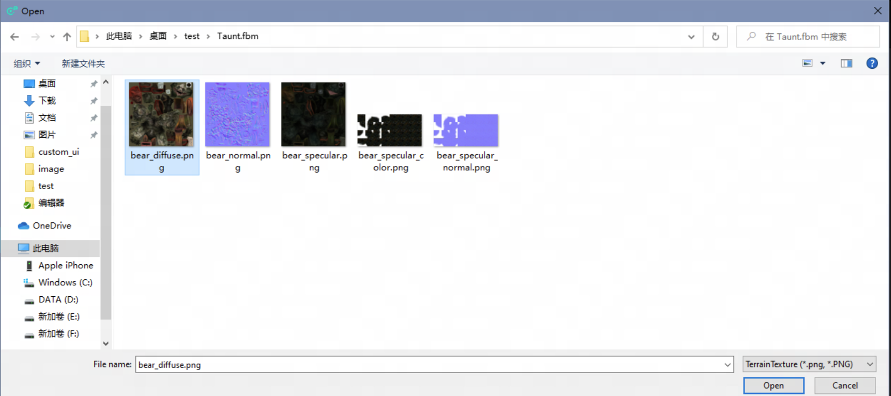
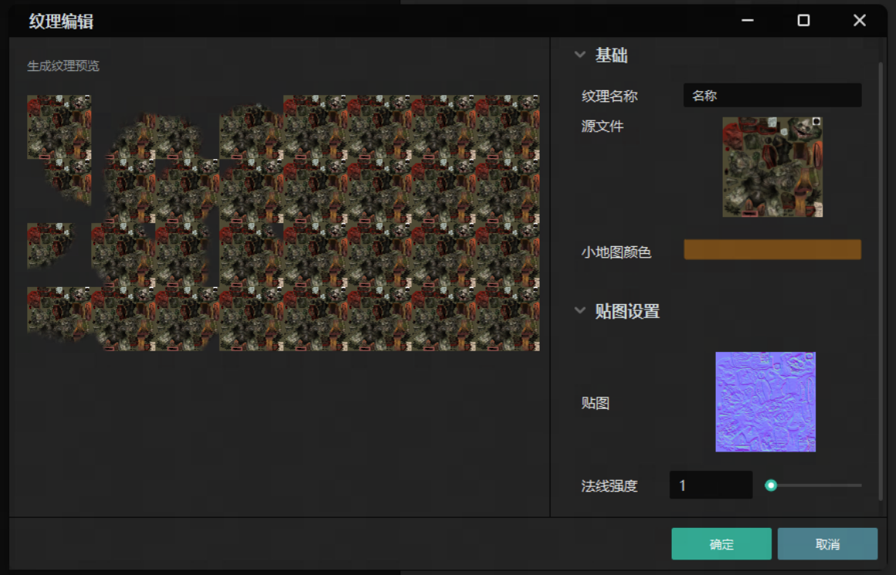
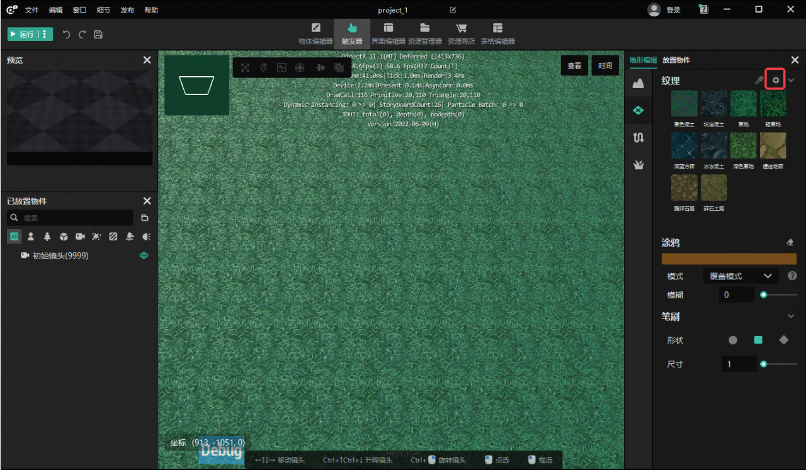
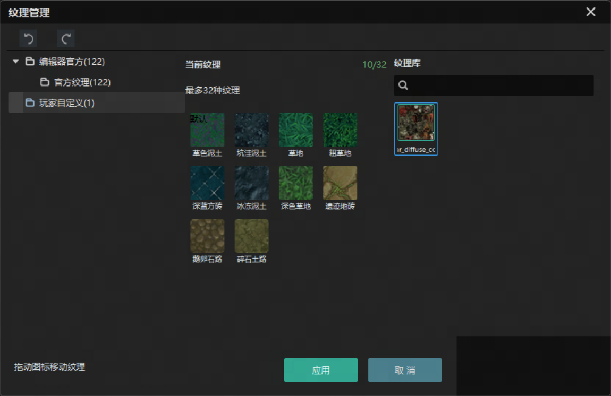
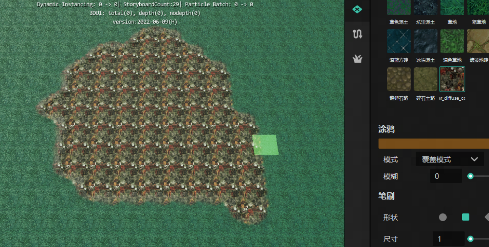

import { Callout } from 'codesandbox-theme-docs'
import { FCollapse } from 'components/FCollapse'

# 纹理导入
在编辑器中我们可以使用地形纹理快速生成不同的场景效果，引擎自带了丰富的地面纹理，当引擎中的纹理不能满足我们的需求时，可以通过如下方法自行导入我们所需的纹理，来实现想要的场景效果。
## 一、纹理导入
1、打开 编辑器主界面-资源管理器 选择地形纹理分页，点击导入

在弹窗中选择目标图片点击确定

进行基础的参数设置后点击确认就会自动生成对应的纹理贴图（一般需要5s左右）

## 二、纹理使用
经过第一步后我们已经有了一个自定义导入的纹理，接下来我们将把它添加到地编中并绘制到场景上回到主界面，打开地形编辑窗口-地形分页，点击纹理配置按钮（红框内）

在左侧打开目标纹理的对应路径，拖拽至当前纹理页并点击应用

地编窗口中就会出现这个纹理，左键选中后即可像其他纹理一样进行纹理绘制

<video width="100%" controls>
  <source src="http://up5.nosdn.127.net/0/doc/TI.mp4" type="video/mp4" />
  Your browser does not support the video tag.
</video>