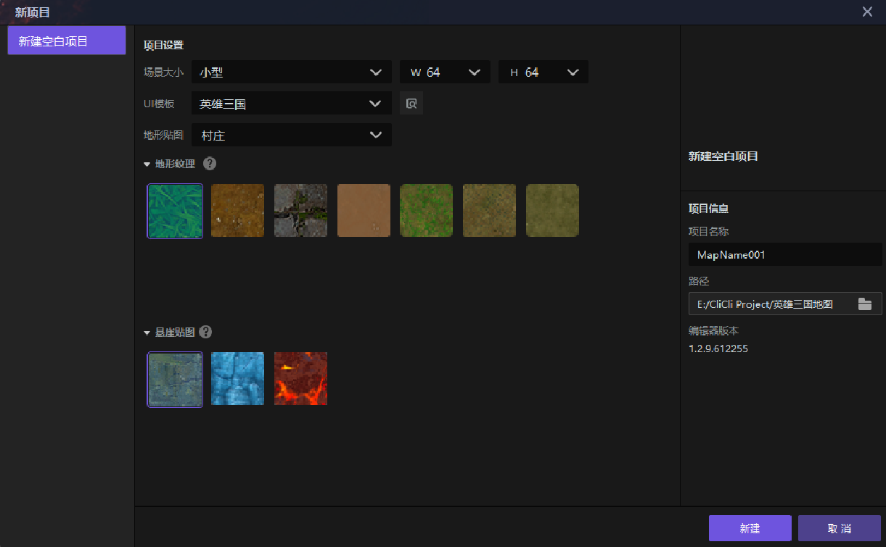
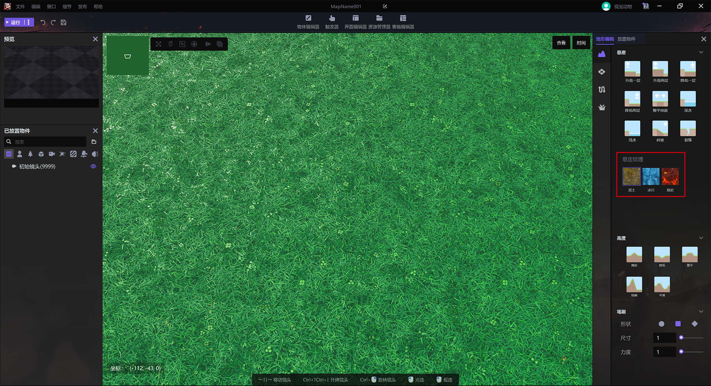

import { Callout } from 'codesandbox-theme-docs'
import { FCollapse } from 'components/FCollapse'

# 美术资源

在此我们介绍了**编辑器**中可用的美术资源，让您了解不同类型的美术资源的操作。您可以通过资源管理器管理或下载美术资源，包括从资产商店购买的资源。

## 纹理

**纹理**是指场景区域的映射。您可以使用**纹理**创建不同风格的游戏。

当您在启动页上创建[新项目](../../Navigation/Start_Page)并选择不同的**地形贴图**时，Y3编辑器会提供不同风格的**地形纹理**。

<Callout type="warning"> 
注意：虽然在创建项目时选择了一种**地形贴图**。但在进入编辑器后，依然可以修改其中地形纹理的样式。
</Callout>

根据不同的映射区域，纹理分为[悬崖纹理](#悬崖纹理)和[地形纹理](./地形纹理)。

### 悬崖纹理

**悬崖纹理**用于悬崖地形。在[地形编辑 - 悬崖](../../Navigation/Main_interface/Tool_Palette#地形)中，当您通过**悬崖**部分更改地形时，可以使用**悬崖纹理**来映射地形的侧面。

<Callout type="warning"> 
注意：**悬崖纹理**只能用于悬崖的侧面。要为平面地形添加**纹理**，请使用**地形纹理**。
</Callout>

