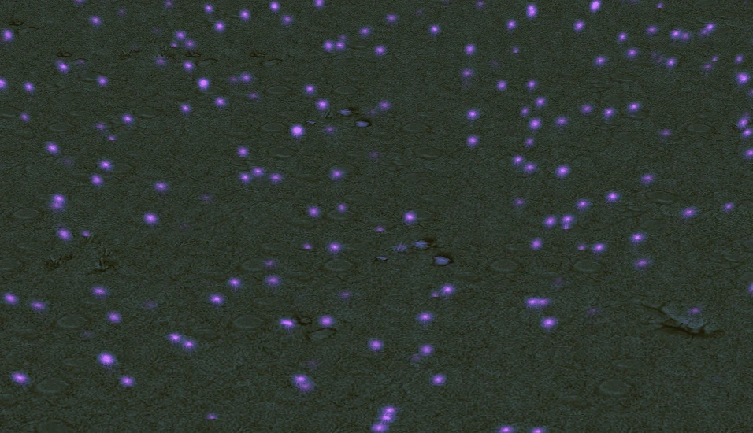
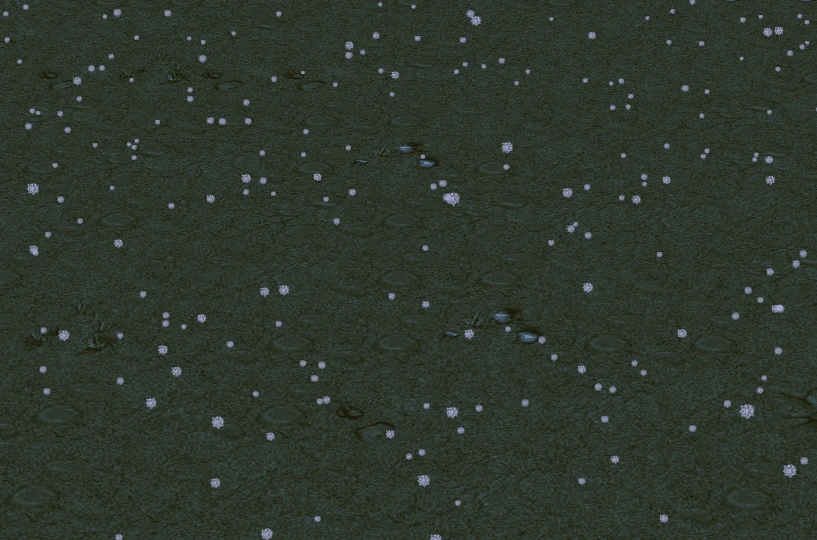
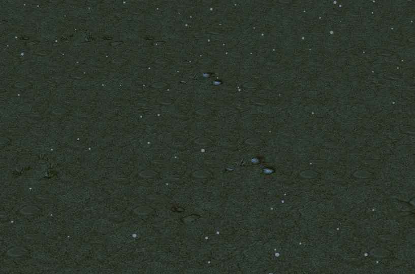

import { Callout } from 'codesandbox-theme-docs'
import { FCollapse } from 'components/FCollapse'

# 天气

在项目设置中的[全局天气](../getting-started/artistic-effects)或[区域天气](../Navigation/Main_interface/Tool_Palette)，共有15种

+ 大雨

+ 小雨
  

+ 魔力上升
  

+ 蓝雾
  

+ 绿雾
  

+ 红雾
  

+ 白雾
  

+ 暴风雪
  

+ 大雪
  

+ 小雪
  

+ 日光
  

+ 月光
  

+ 沙尘暴
  

+ 大风
  

+ 小风
  

