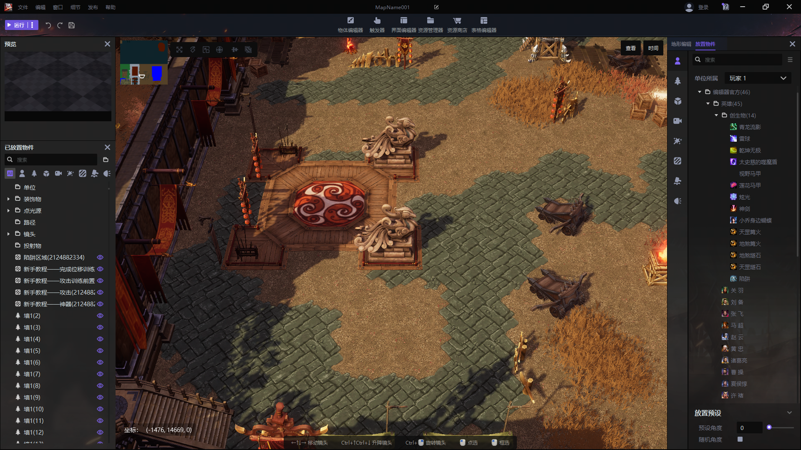
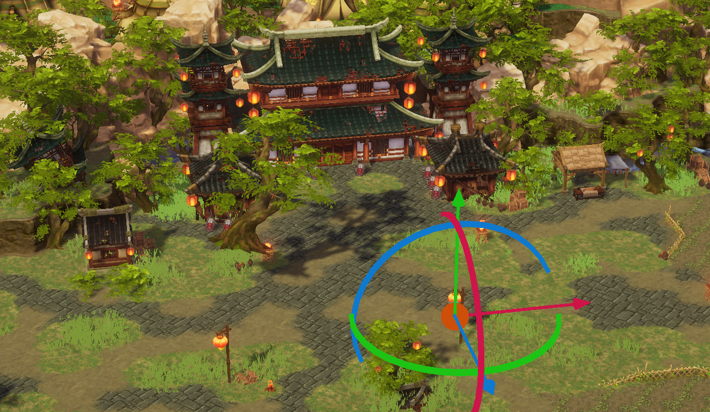
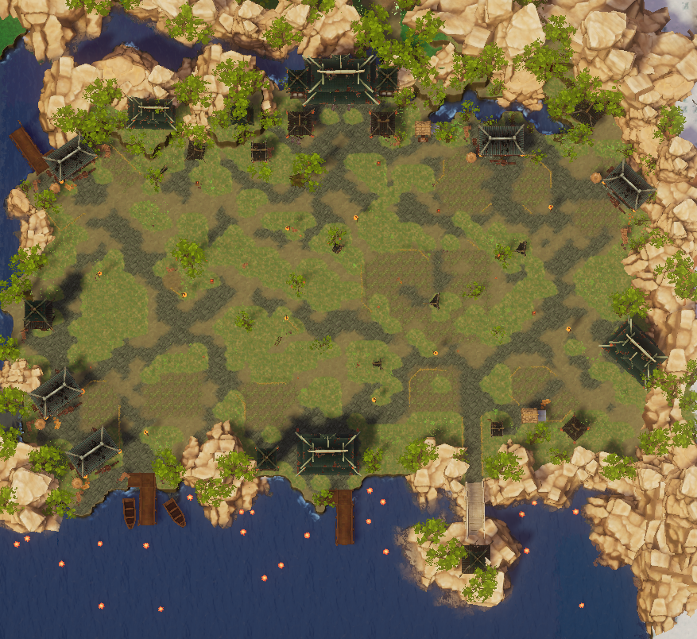
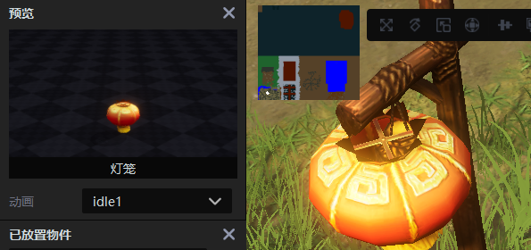
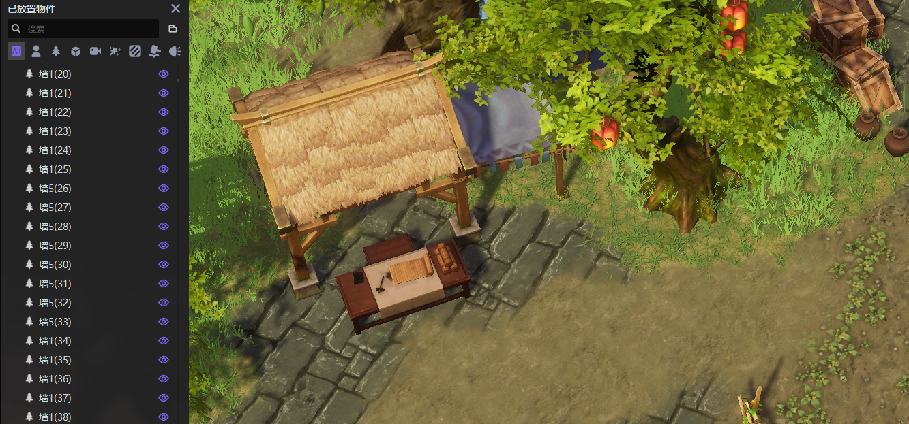
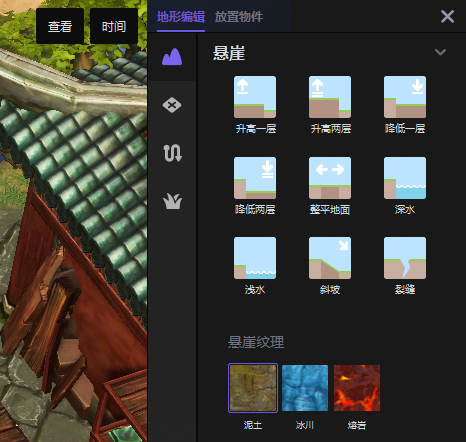
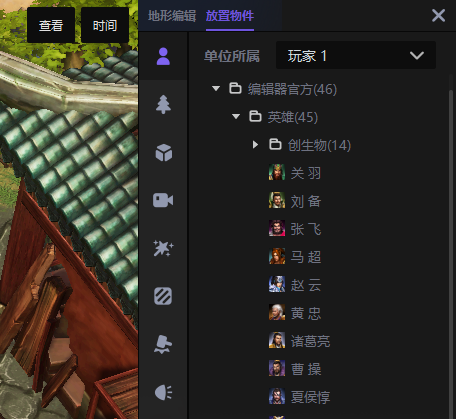
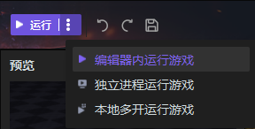

import { Callout } from 'codesandbox-theme-docs'
import { FCollapse } from 'components/FCollapse'

# 开发者指引
   
## 针对Y3特点设计游戏

Y3从经典RTS游戏编辑器和现代游戏引擎中汲取灵感。它可以实现大多数游戏创意，但也有一些限制。在使用Y3设计游戏时，建议考虑目标用户组和编辑器功能。

### 为玩家而设计

**年轻玩家**
年轻人更专注于尝试新事物，享受乐趣和与他人联系，而不仅仅是竞争或瞄准特定目标。他们消费内容的方式不同，主要受社交媒体和bilibili的影响，并且乐于与朋友进行线上互动，Y3可以很好地满足这类需求。

**年龄较大的玩家**
可以吸引年长玩家的游戏越来越受欢迎，这通常意味着它们具有与其他平台相似的功能。年龄较大的玩家更有可能在您的游戏上花费更多的时间和金钱，他们也往往是围绕游戏创建社区的人；他们对游戏的忠诚度可能更高，而不仅仅是尝试一次。

### 为编辑器而设计

基于Y3编辑器设计游戏可确保为玩家提供流畅和优化的游戏体验。它还允许最大限度地利用编辑器的特性和功能，从而获得更好的整体游戏设计。  
Y3适合创作的游戏玩法类型包括**TD塔防**、**角色扮演**、**防守**、**生存**、**对战**、**策略**、**MOBA**等。

## 考虑用户界面和用户体验

游戏UI和UX的良好设计对于游戏体验至关重要。以下是为 PC 玩家设计 UI 和 UX 的一些提示：

- **使其易于导航**：UI 应直观且易于导航，以便玩家可以快速找到所需的内容。

- **保持简单**：杂乱的 UI 可能使玩家不知所措，难以专注于游戏。应保持设计简单整洁。

- **使用键盘快捷键**：键盘快捷键可以使电脑玩家的导航更快、更高效，请确保在你的设计中包含这些内容。

- **针对不同的屏幕尺寸进行优化**：电脑可能会使用各种屏幕尺寸，请确保 UI 针对不同的屏幕分辨率进行了优化。

- **注意细节**：细节会对整体用户体验产生重大影响。请注意字体大小、间距和颜色，以创建一致且有吸引力的设计。

- **考虑上下文**：考虑玩家在游戏中执行的操作以及 UI 如何支持他们的体验。

- **邀请真实玩家进行测试**：最后，确保使用真实玩家测试您的 UI 和 UX，以获得反馈并进行改进。

## 发布游戏成为平台里的可玩地图

当您首次将地图发布到KK对战平台时，您正在创建一个可在平台上公开玩的新游戏。之后，您可以在同一游戏下发布更多地图以创造更复杂的体验，例如为您的 MOBA 游戏添加新地图。而每张地图都包含游戏该部分的所有对象，包括构成其特定环境的对象、ECA 触发器和用户界面小部件。

## 认识编辑器窗口

此处你将概览Y3编辑器内的主要界面，详细信息在[界面导航](../Navigation/Start_Page)这一章节。

### 主窗口

Y3编辑器窗口可显示游戏中的所有内容。在这里，您可以通过简单的点击、游戏测试、移动相机和切换视图来修改对象以在虚拟环境中环顾四周。

### 预览窗口

默认情况下可见的预览窗口显示对象在游戏中的外观。在这里，您可以检查预设或自定义资产的外观，然后再将它们放入工作区。

### 放置对象窗口

已放置物件窗口显示地图内每个放置对象的层次列表。

### 工具面板窗口

工具面板窗口包含两个选项卡：编辑地形和放置物件。这两个选项卡提供了构建有趣玩家体验的基本工具和对象。

## 资产

在Y3编辑器中，图像、模型和声音等资产在您将它们实现到您的游戏中时在本地进行处理。大部分资产都存储在云端，用户从下载到放置只需简单的点击几下即可实现。

## 脚本

Y3编辑器旨在为任何想要创建自己的游戏的人提供低门槛的工具。无需任何编程经验，因为您可以使用我们的触发器 API 控制事件、条件和动作来塑造您的游戏。
详细信息请参阅[ECA触发器](../Navigation/Trigger)。

另一方面，Y3编辑器也支持Lua编程语言，为有熟练编程背景的用户提供更多技术选择。您可以将 Visual Studio Code 等第三方 IDE 与Y3 Lua 插件集成。Lua框架代码及API文档请访问：https://github.com/y3-editor/y3-lualib

## 编辑器内测试

Y3编辑器提供了一套用于在发布游戏之前测试游戏的选项：

编辑器内运行游戏在Y3编辑器中运行游戏以方便调试。
作为单独的进程运行游戏提供了在KK上运行的游戏的更接近体验。
运行多个游戏将打开多个窗口，您可以在其中测试和调试不同玩家的多人游戏体验。