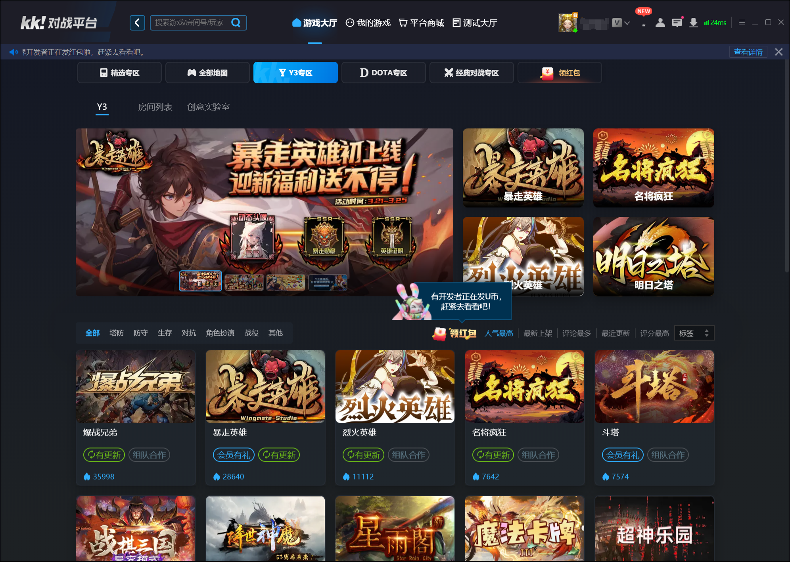

import { Callout } from 'codesandbox-theme-docs'
import { FCollapse } from 'components/FCollapse'

# 商业化
   
在您成为[平台开发者](../../guides/publishing/1-Register)并成功[递交作品](../../guides/publishing/2-Upload)后，可能会希望能推广您的游戏并从中盈利。

## 在KK平台推广

在您发布游戏后，它将显示在我们的KK平台上。如果您的游戏获得大量游玩时间，KK可能会注意到，并将您的游戏置于推荐位置。

此外，您也可以自行通过社交媒体，通过文字、图片、视频等方式，宣传您创作的游戏内容。

## 在KK平台赚钱

当您开始在KK上进行开发时，您无需支付任何费用即可使用我们的工具或平台服务。

KK平台的经济运行在U币上，KK用户购买和使用的虚拟货币。当您的游戏通过玩家购买物品赚取U币时，所有收益都可以在**开发者平台**的数据中心查看。您也许可以通过我们的付款方式兑现现实世界的货币。目前只有游戏开发者可以在KK上赚钱。详情请于官网查看**产品付费模式**：https://create.reckfeng.com/help