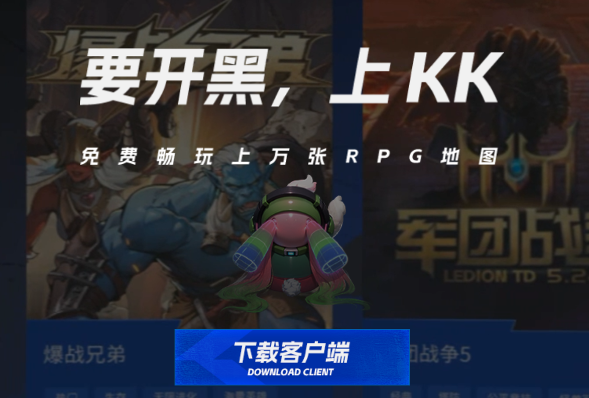
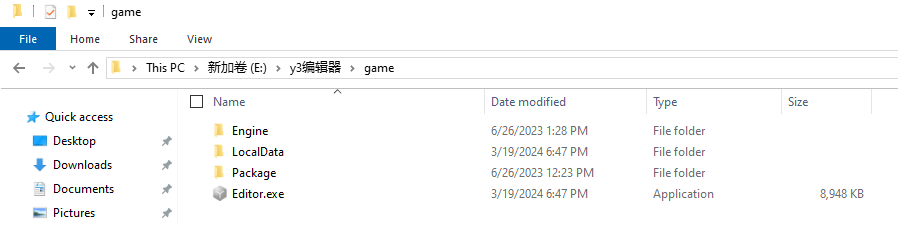

import { Callout } from 'codesandbox-theme-docs'
import { FCollapse } from 'components/FCollapse'

# 配置需求与安装
   

## 配置需求
   

### 最低配置
Windows系统 - Windows 7。 64位。  
处理器 - AMD FX-8350。  
内存 - 8GB系统内存。  
显卡 - 独立显卡：AMD Radeon RX 550，集成显卡：HD 2000。  

### 标准配置
Windows系统 - Windows 7、Windows 8、Windows 10或Windows 11。64位系统。  
处理器 - Intel® Core™ i5-6500或更好。  
内存 - 16GB系统内存或更好。  
显卡 - GeForce GTX 750 Ti或更好。

### 推荐配置
推荐使用 6500 XT 及以上型号显卡，搭配42寸显示器或超宽显示器，以此体验Y3编辑器的完整性能。

   

## 客户端与编辑器下载

### KK对战平台下载

1、通过KK对战平台官网下载平台客户端。

2、解压/安装对战平台，使用快捷登录并根据引导流程注册KK对战平台账号。

### Y3编辑器下载
1、在下载并安装KK对战平台后，点击右上角更多-进入平台设置。
2、英雄三国KK-游戏设置-游戏路径，点击“立即下载”，进行下载游戏客户端。
3、在游戏客户端下载完毕，根据路径找到所在目录盘符:\HeroesOfKingdoms\game。
在该目录下可以看到Y3编辑器：Editor.exe，可以右击创建桌面快捷方式方便使用。
4、打开Editor.exe，使用KK对战平台账号登录。
请注意：如已下载完整版可直接根据第3个步骤开始操作，如下载的是精简版，请按照第1个步骤开始操作。

### 编辑器更新

启动Y3编辑器时会自动检测并更新。KK平台上的每个游戏都必须在最新版本的Y3编辑器上运行。