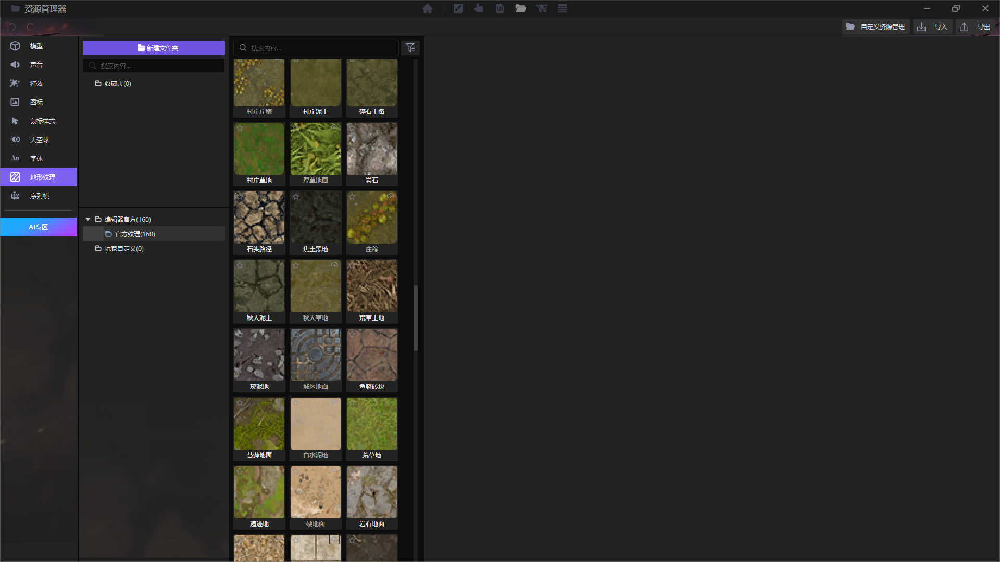
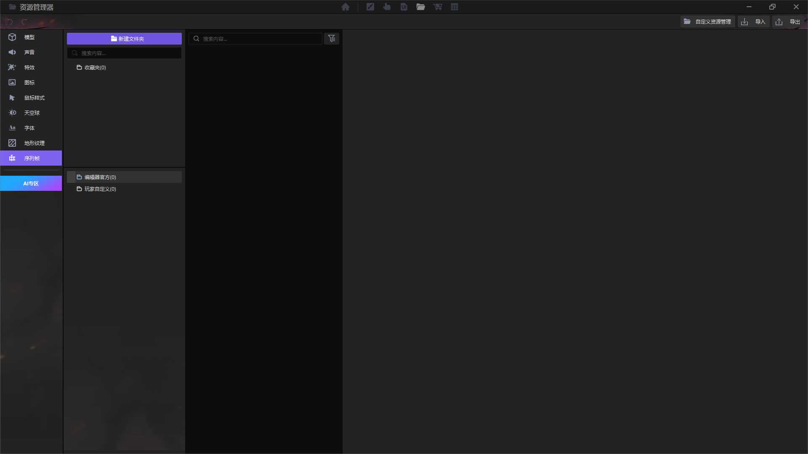
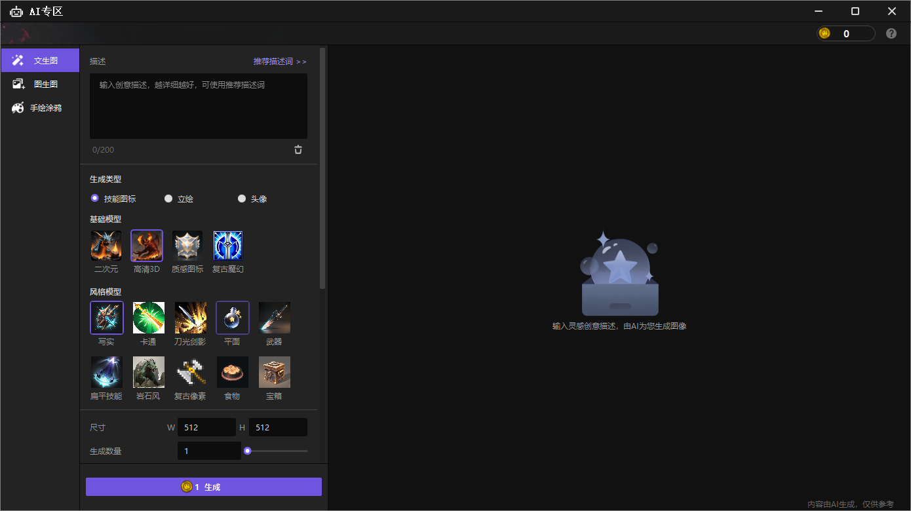

import { Callout } from 'codesandbox-theme-docs'

import { FCollapse } from 'components/FCollapse'

# 资源商店

在**资源商店**中，您可以选择角色、动物、建筑、装饰、植物、岩石、特效、图标、音频和ECA，在导入后可以在您的项目中使用。资产商店中的一些资源可以免费使用，而其他资源在使用前需要付费。

除了像在[开始界面-资源商店](../Navigation/Start_Page#资源商店)中那样在这里下载资源，您还可以在**我的资产**中管理资产。

在**我的资产**中，您可以**批量导入**资产，并单击**打开资源管理器**以搜索导入的资产。如果您的资产不能满足您的需求，请单击**转到资产商店**以查看更多资产。

