import { Callout } from 'codesandbox-theme-docs'

import { FCollapse } from 'components/FCollapse'

# 特效编辑器
特效在游戏中扮演着重要的角色，它能够增强游戏的视觉效果、提供游戏信息和反馈、增加游戏的战斗体验以及营造游戏的氛围和情绪，使游戏更加有吸引力和趣味性。

Y3编辑器中内置了强大的特效编辑器，本教程将对特效编辑器的各种用法进行介绍，学习本教程后，你将了解如何用特效编辑器生产特效资产。

# 一、打开特效编辑器
## 步骤1
点击资源管理器，跳转到资源管理器界面

## 步骤2
资源管理器界面中选择特效

1、新建粒子：直接点击即可

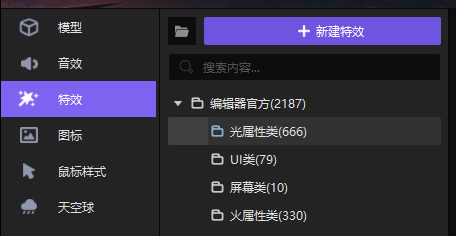

2、如果是编辑官方特效：双击官方特效资产，编辑完成后，直接点击保存，然后命名就会默认存放至自定义下
## 步骤3
新建特效会弹出下方图中的对话框，我们根据需要新建特效

基础是空特效，需要我们从0开始制作

官方也预设了一些简单的特效模板，我们也可以直接选择创建模板，然后直接使用或者是根据自已的设计修改后保存使用

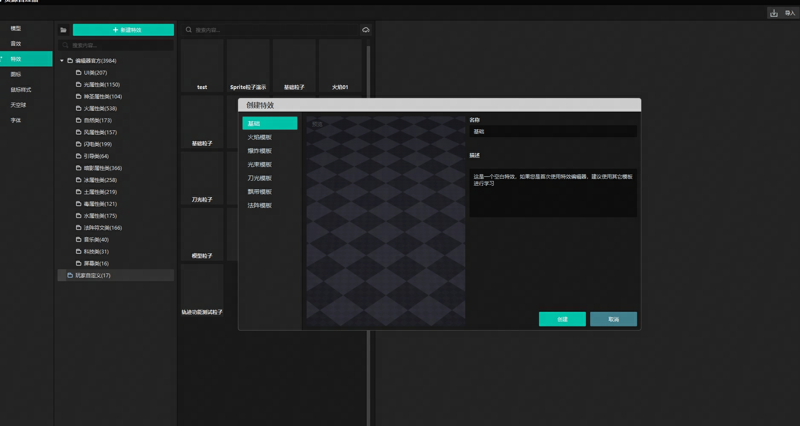

# 二、认识编辑器界面
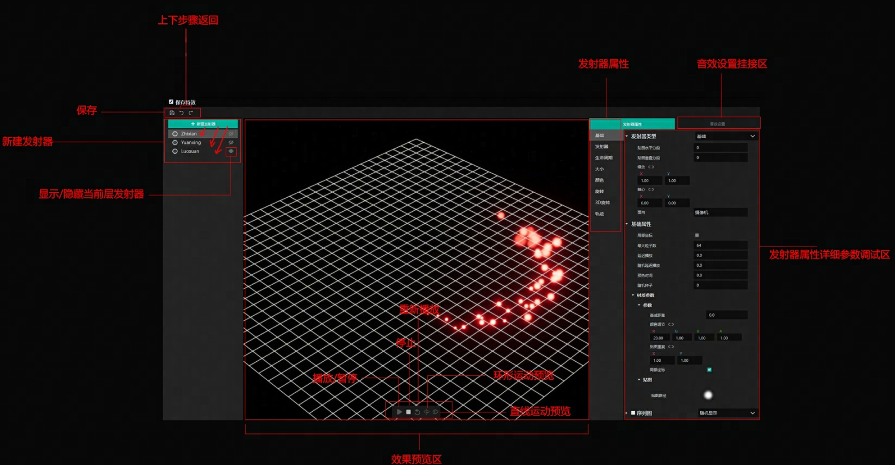

tips：可以通过鼠标右键取消折线图中的折点

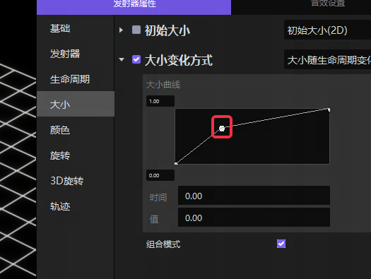
# 三、编辑器的操作功能介绍
特效编辑器6种粒子类型介绍
## 基础粒子
### 功能描述
最基础的粒子类型，也是最常用的粒子，相对于其他类型没有任何特殊变化，广泛应用于各种特效，火焰，燃烧，光晕，烟雾等等。
### 效果展示
<video width="100%" controls>
  <source src="http://up5.nosdn.127.net/0/doc/EE1.mp4" type="video/mp4" />
  Your browser does not support the video tag.
</video>

### 测试方法
我们以一个火焰序列特效举例

1、新建发射器

2、点击基础，在基础属性里点击贴图路径，然后选择一张火焰序列贴图；这里使用的序列贴图分段数量是9x9（水平分段和垂直分段都是9）

1）在此处添加贴图，点击可跳转到资源管理器种去选取满意的贴图

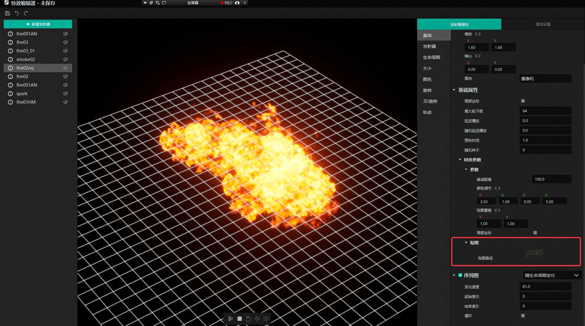

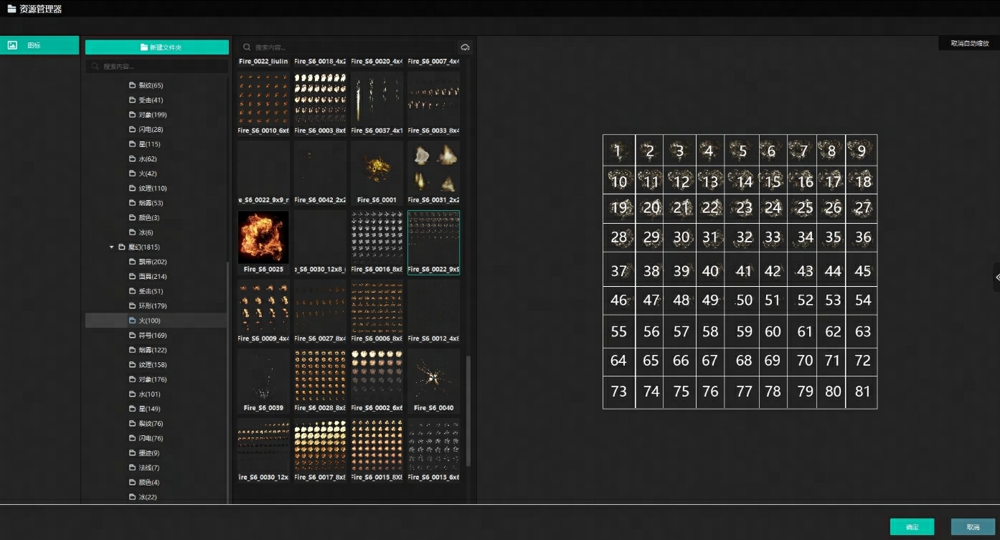

2）在此处设置序列的基础水平和垂直分段值，根据自己选中的序列贴图进行分段（如果是非序列贴图，则全部为0即可）

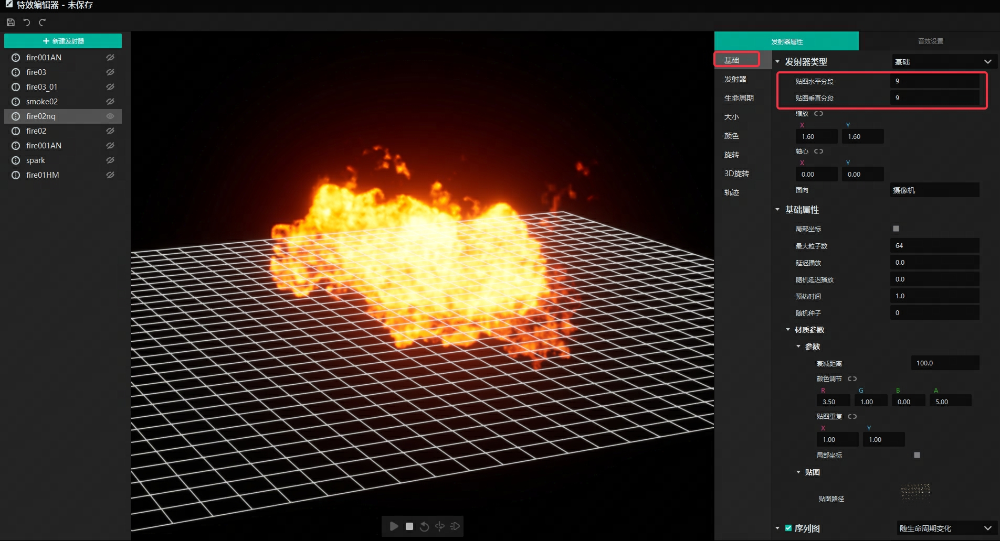

3、序列图的变化设置

勾选序列图：如果我们是选用的序列贴图则需要勾选此处才能对序列贴图的变化进行控制，共有两种控制方式

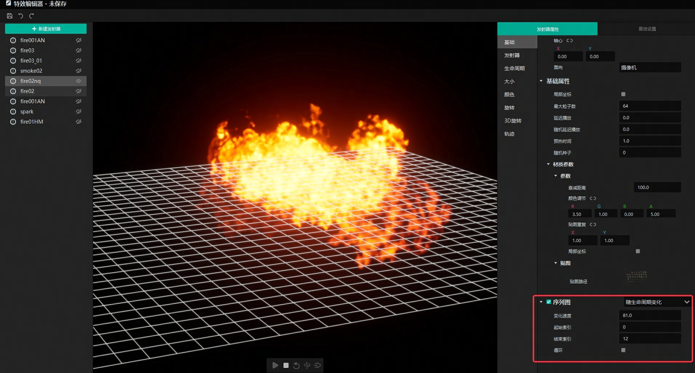

1）随机显示

随机的挑选播放自定义设定的区间里的某一张图（随机播放2到33之间里的单张图）

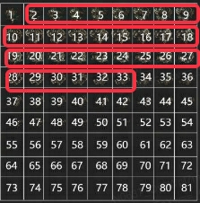

2）随生命周期变化

变化速度：每秒播放多少张图片

起始索引：代表从第几张图开始播放

结束索引：代表播放到第几张图结束

循环：勾选以后，会直接默认从第一张播放到最后一张，然后继续循环下去

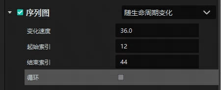

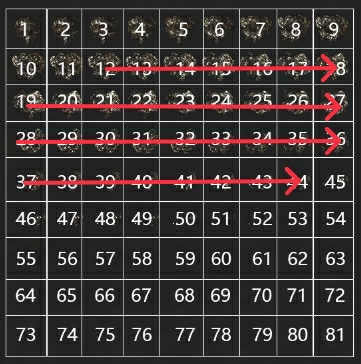

### 视频实操演示（对以上功能进行综合操作演示）
<video width="100%" controls>
  <source src="http://up5.nosdn.127.net/0/doc/EE2.mp4" type="video/mp4" />
  Your browser does not support the video tag.
</video>

### 参数介绍

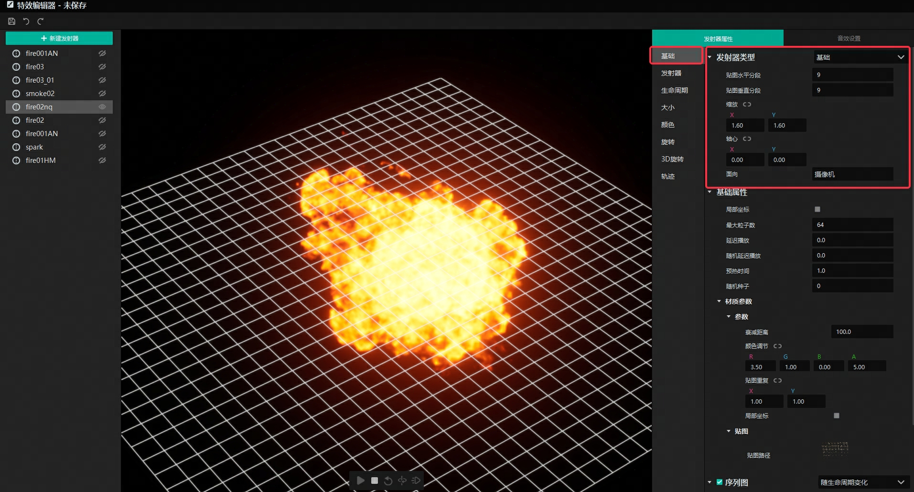

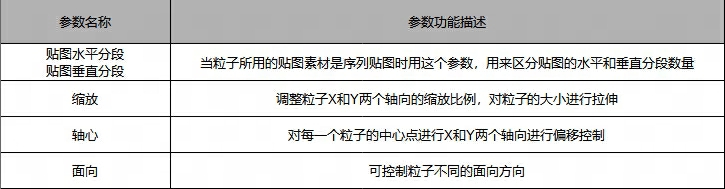

备注：以上是基础粒子的基础参数，配合其他公共类参数（生命周期、大小、颜色、旋转、轨迹）可调出自己想要的效果
## 飘带粒子
### 功能描述
飘带粒子可以用来制作车轮印迹、火焰尾烟等拖尾效果的特效
### 效果展示
<video width="100%" controls>
  <source src="http://up5.nosdn.127.net/0/doc/EE3.mp4" type="video/mp4" />
  Your browser does not support the video tag.
</video>
### 测试方法
我们以一个飘带拖尾特效举例

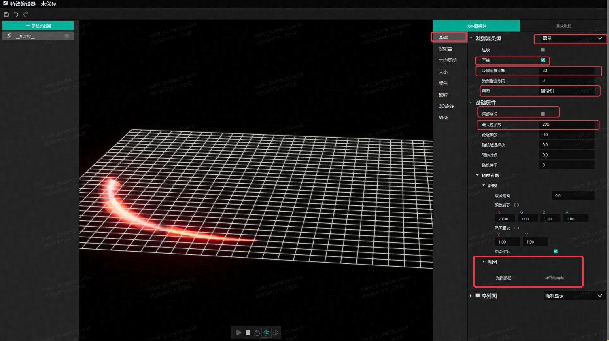

1、基础参数

选择发射器类型为飘带粒子模式

平铺进行勾选

纹理重复周期填写30（表示贴图纹理每秒重复几次，重复次数越多，飘带越圆滑）

面向选择摄像机模式

局部坐标去掉勾选（如果勾选的话，拖尾无法位移显示）

最大粒子数量填写200（拖尾需要大量的粒子才能保证平滑，所以显示数量越大越平滑，根据情况而定，我们现在这个效果200就够了）

我们选则合适的贴图

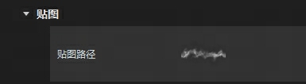

2、发射器

发射模式选择常规

每秒发射数量填写30（表示发射频率，值越大拖出来的痕迹就越平滑，通常可以设置在20~30之间）

选中环绕测试，便于观察效果

### 视频实操演示（对以上功能进行综合操作演示）
<video width="100%" controls>
  <source src="http://up5.nosdn.127.net/0/doc/EE4.mp4" type="video/mp4" />
  Your browser does not support the video tag.
</video>
### 参数介绍

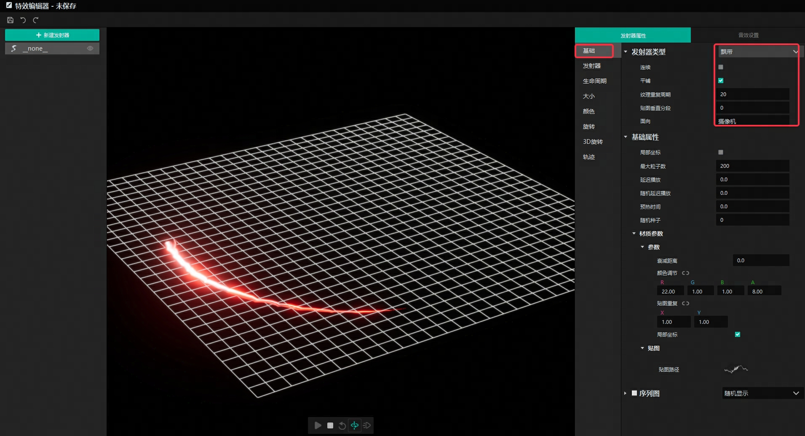

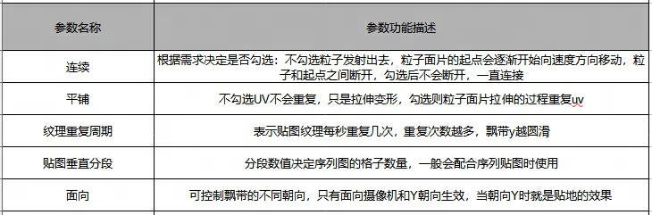
## 刀光粒子
### 功能描述
刀光粒子常用于制作武器特效，刀剑挥砍的拖影等。
### 效果展示
<video width="100%" controls>
  <source src="http://up5.nosdn.127.net/0/doc/EE5.mp4" type="video/mp4" />
  Your browser does not support the video tag.
</video>
### 测试方法
我们以一个刀光拖尾举例子

1、基础参数

选择发射器类型为刀光粒子模式

勾选连续

厚度填写数值0.02（厚度根据情况而定，不给厚度也可以）

局部坐标的勾选去掉（否则不能拖拽显示效果）

选择合适的贴图

2、发射器

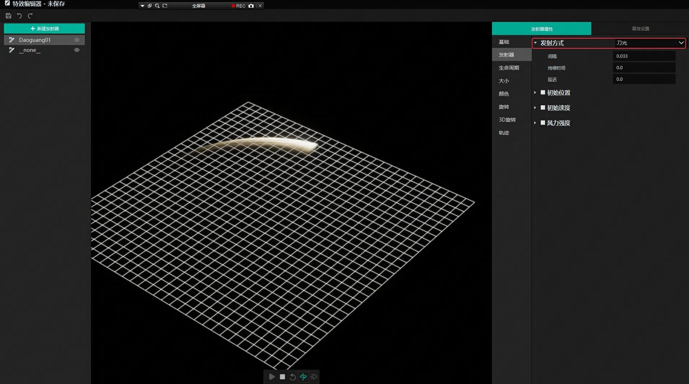

发射模式要选择刀光模式

点击此处进行环形动态测试观察效果

### 视频实操演示（对以上功能进行综合操作演示）
<video width="100%" controls>
  <source src="http://up5.nosdn.127.net/0/doc/EE6.mp4" type="video/mp4" />
  Your browser does not support the video tag.
</video>
### 参数介绍
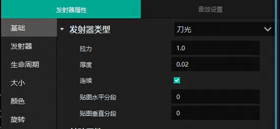

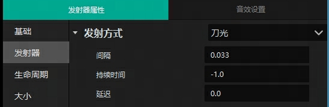

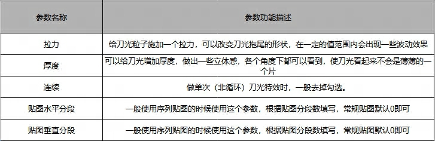
## 光束粒子
### 功能描述
光束粒子通常可以用来制作连线特效（引导特效）
### 效果展示
<video width="100%" controls>
  <source src="http://up5.nosdn.127.net/0/doc/EE7.mp4" type="video/mp4" />
  Your browser does not support the video tag.
</video>
### 测试方法
我们以一个类似闪电链的引导特效举例子

1、选择发射器类型为光束

2、选择中意的贴图

3、轨迹种勾选直线轨迹，Y填写数值为750

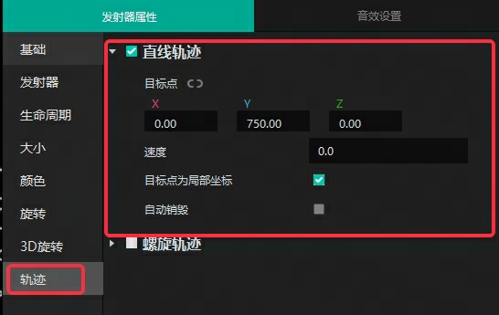

4、生命周期勾选初始生命周期，这里我们就直接使用了默认生命值为1

5、大小中勾选初始大小，然后选择初始大小，这里我们把最大值和最小是修改为0.6

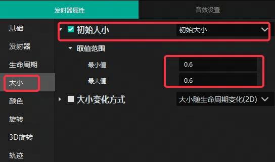

6、颜色勾选初始颜色，这里数值我们使用默认值，然后去基础里去使用材质参数下的颜色调节进行调色

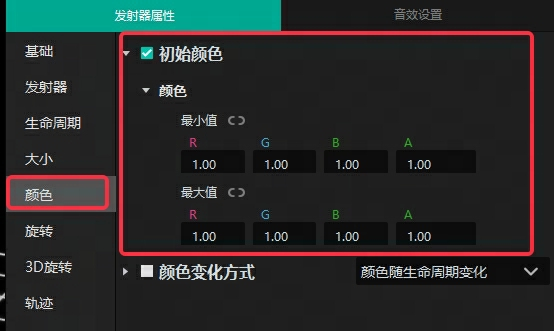

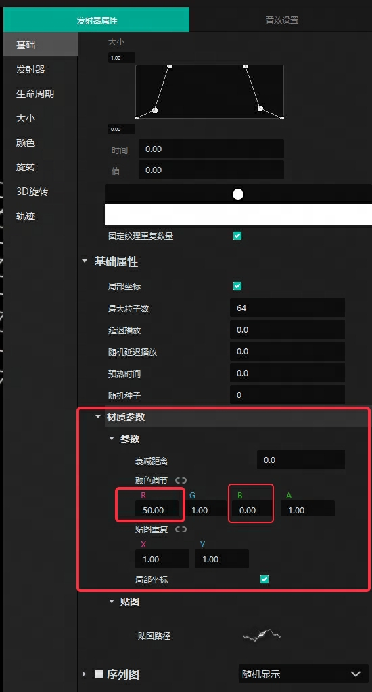

7、纹理重复数量调整数值为2；曲线细分段数调整数值为6；曲线细分周期调整数值为0.2；垂直幅值调整数值为1；速度幅值调整数值为500；渐入距离和渐出距离调整数值为500；流动速度调整数值为-5

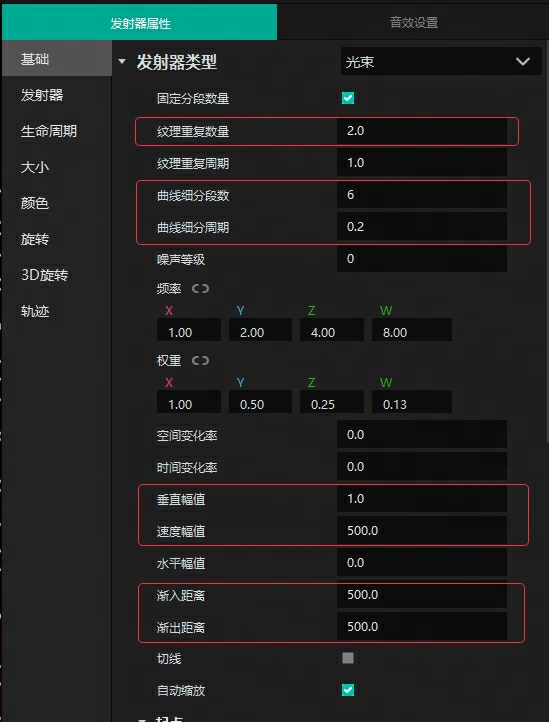

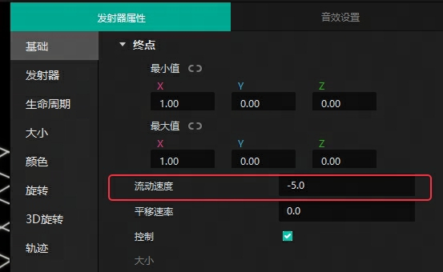

8、勾选控制，调节连接特效两端的大小

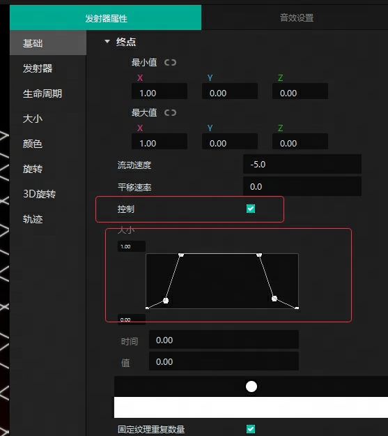
### 视频实操演示（对以上功能进行综合操作演示）
<video width="100%" controls>
  <source src="http://up5.nosdn.127.net/0/doc/EE8.mp4" type="video/mp4" />
  Your browser does not support the video tag.
</video>
### 参数介绍

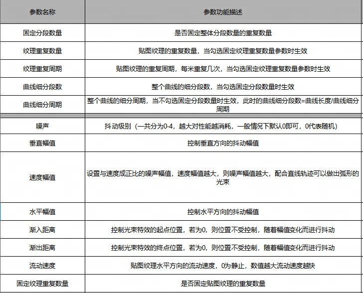
## 模型粒子
### 功能描述
模型粒子通常可以用来制作各种不同形状的模型的材质特效，广泛应用的常见特效材质有基础、消散、扭曲、菲涅尔
### 效果展示
<video width="100%" controls>
  <source src="http://up5.nosdn.127.net/0/doc/EE9.mp4" type="video/mp4" />
  Your browser does not support the video tag.
</video>
### 测试方法
我们以赋予模型扭曲材质举例

1、选择发射器类型为模型模式

2、选择特效需要用到的模型资源，本次案例制作使用的是个球形（如果需要其他模型也可以从资源库中选取）

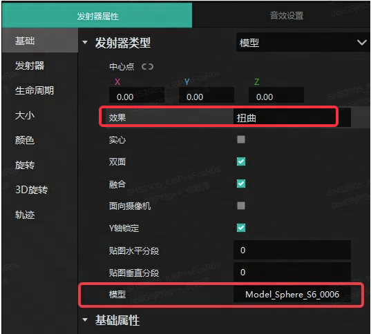

3、选取合适的贴图，可以多尝试不同的贴图，会表现出各种不同的效果

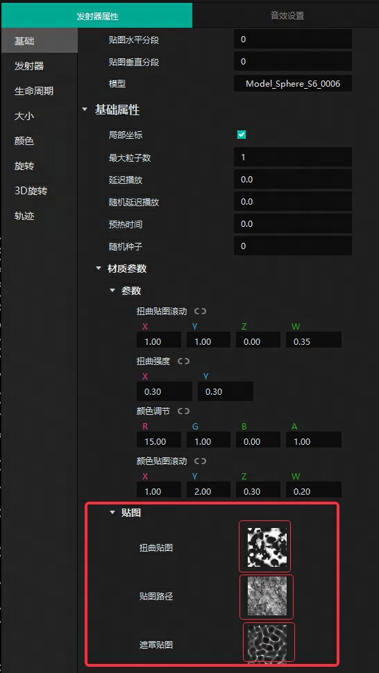

4、调整相应的参数，使材质动起来

我们这里调整了

扭曲贴图滚动的W：0.35  

扭曲强度的X和Y为0.3

颜色贴图滚动的Y为2 Z为0.3 W为0.2

颜色调节的R调整为15  B为0

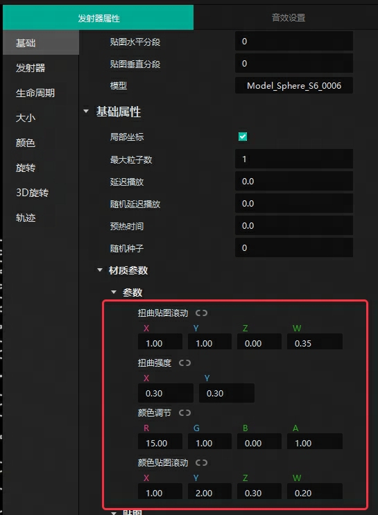

5、勾选了融合（透明混合的参数）

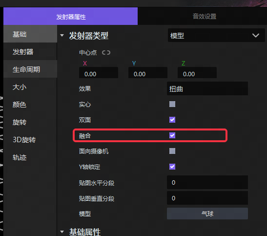

6、发射器中的持续发射去掉勾选，变成一次性发射一个

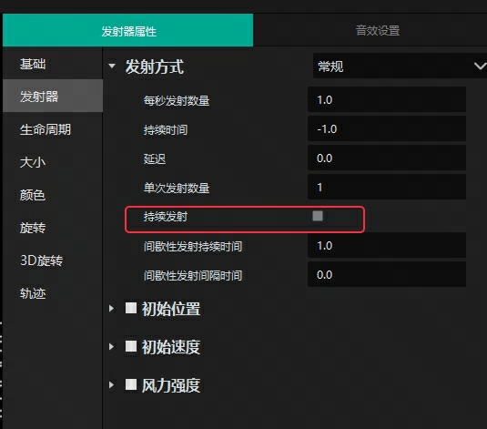

7、生命周期中我们选中分段生命周期和初始生命周期，保持默认参数即可

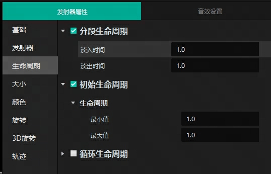

8、完成保存
### 视频实操演示（对以上功能进行综合操作演示）
<video width="100%" controls>
  <source src="http://up5.nosdn.127.net/0/doc/EE10.mp4" type="video/mp4" />
  Your browser does not support the video tag.
</video>
### 参数介绍

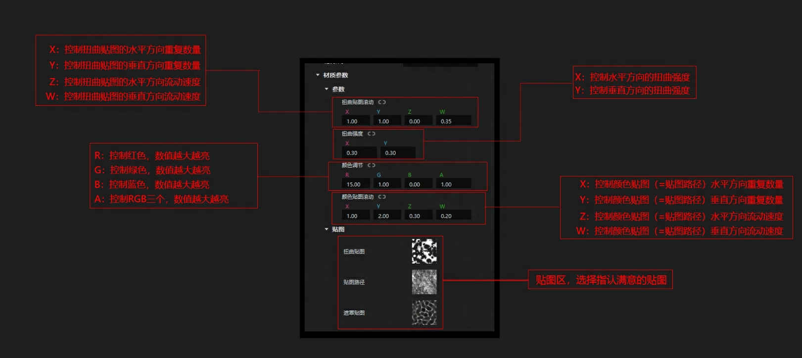
## 组合粒子
### 功能描述
用来整体控制子粒子的父级特效
### 效果展示
<video width="100%" controls>
  <source src="http://up5.nosdn.127.net/0/doc/EE11.mp4" type="video/mp4" />
  Your browser does not support the video tag.
</video>
### 测试方法
先制作四个子粒子层，然后新建一层粒子选择发射器类型为组合模式，把子粒子的名称一一对应填写到组合粒子的子粒子参数名称下

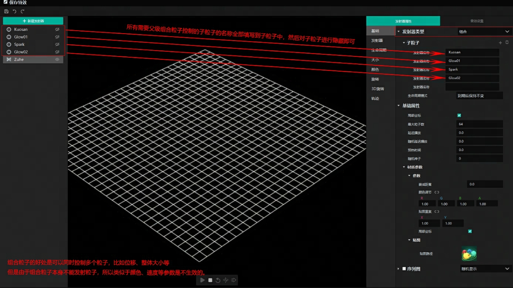

由于组合粒子的特殊性，有些参数对于组合粒子是不生效的，以下列举一下哪些是生效的参数

大小：初始大小/大小随生命周期变化

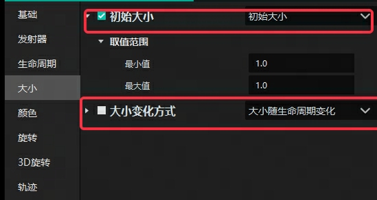

轨迹：螺旋轨迹

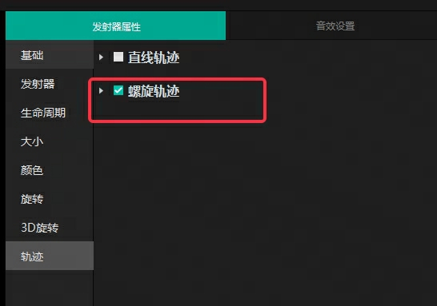
### 视频实操演示（对以上功能进行综合操作演示）
<video width="100%" controls>
  <source src="http://up5.nosdn.127.net/0/doc/EE12.mp4" type="video/mp4" />
  Your browser does not support the video tag.
</video>
### 参数介绍
# 四、特殊功能介绍
## 轨迹
主要有三种轨迹运动：直线运动、圆形运动、螺旋运动

可以用来测试弹道的效果，也可以用来制作带有运动轨迹的效果
### 1、直线运动
方法演示
<video width="100%" controls>
  <source src="http://up5.nosdn.127.net/0/doc/EE13.mp4" type="video/mp4" />
  Your browser does not support the video tag.
</video>
### 2、圆形运动
方法演示
<video width="100%" controls>
  <source src="http://up5.nosdn.127.net/0/doc/EE14.mp4" type="video/mp4" />
  Your browser does not support the video tag.
</video>
### 3、螺旋运动
方法演示
<video width="100%" controls>
  <source src="http://up5.nosdn.127.net/0/doc/EE15.mp4" type="video/mp4" />
  Your browser does not support the video tag.
</video>
# 五、综合案例制作视频
## 案例1
持续燃烧的火焰特效
<video width="100%" controls>
  <source src="http://up5.nosdn.127.net/0/doc/EE16.mp4" type="video/mp4" />
  Your browser does not support the video tag.
</video>
## 案例2
传送法阵效果
<video width="100%" controls>
  <source src="http://up5.nosdn.127.net/0/doc/EE17.mp4" type="video/mp4" />
  Your browser does not support the video tag.
</video>

# 结尾
特效编辑器的使用更多的在于灵活与变通，本文的教学内容只是简单的入门，了解编辑器的基础功能，制作和调整一些相对简单的特效，对六种不同的发射器类型做了介绍，同时穿插演示了调整特效的颜色、大小、生命等功能，随着后续教学文档的补充完善以及字段提示的添加，你将可以更快的学会如何制作效果更好、表现更佳的特效！