import { Callout } from 'codesandbox-theme-docs'

import { FCollapse } from 'components/FCollapse'

# 主界面

进入项目后，就能开始实际操作编辑器。下图为编辑器的主界面。图中的信息对你而言可能会突然有些过量，因为有如此多的面板、页签、选项……或许你也无法确定Y3的操作方法与快捷键等与你惯用的软件是否一样。不必迷茫，这个小节将引导你逐步了解主界面和基础操作。

## 菜单栏

主界面左上方的菜单栏提供针对编辑器和项目的基本设置功能，分为**文件**、**编辑**、**窗口**、**细节**、**调试**、**发布**、**插件**、**帮助**。

菜单栏下方，你可以使用**运行按钮**对项目进行调试，并设置了**撤销**，**恢复**以及**保存**的快捷按钮。
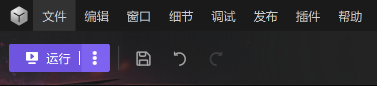

点击你可以在三种运行模式下进行项目调试

### 编辑器内运行
 复用当前编辑器窗口进行测试，编辑窗口会变成游戏运行窗口，所以无法再执行游戏编辑操作。

### 独立进程运行
 唤出一个额外窗口运行游戏，不会阻塞编辑器本身的编辑项目操作。

### 本地多开运行游戏
如果当前游戏是多人游戏，你可以通过本地多开功能为每一个玩家运行一个窗口，借此测试多人游戏功能。

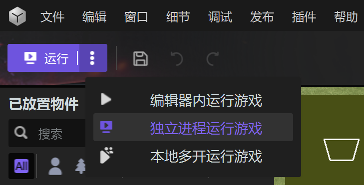

### 文件 
进行**新建**、**打开**、**项目管理**、**保存**、**另存为**、**在文件资源管理器中显示**、**地图详情**、**版本管理**、**退出**。其中版本管理你需要使用[触发器](../Trigger#trigger) 进行配置。

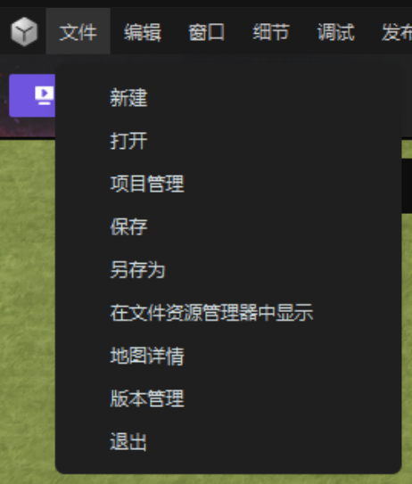

#### 版本管理
 允许多人进行开发 

首先你需要配置一下环境，具体操作如下

(1) 下载并安装git: https://git-scm.com/ 

(2) 注册GitHub账号: https://github.com/

(3) 配置本地Git信息

(4) 获取本地 SSH 并添加到Github管理中，创建一个新的线上库

(5) 打开该项目，并在**版本管理**中绑定相应的服务器地址

配置完成后，你可以上传本地项目内容，下载在线项目内容，实现协同开发。

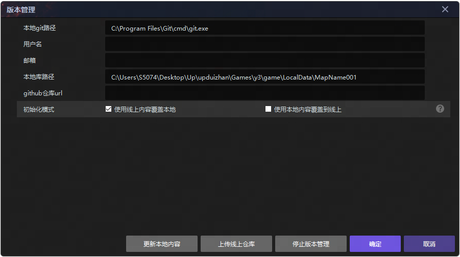

### 编辑
 你可以执行诸如**撤销**、**恢复**、**剪切**、**复制**、**粘贴**、**删除**和**清除选中**等操作。除此以外, 可以在 [通用设置](../../getting-started/general-setting#general-settings)和 [键位设置](../../getting-started/hotkeys#hotkeys-setting).

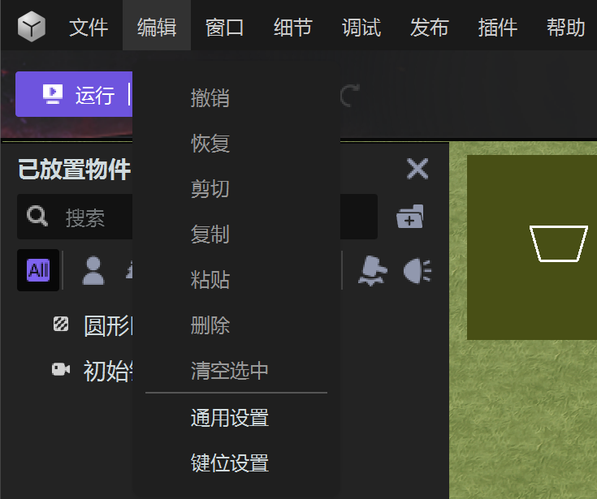

### 窗口
 你可以通过是否勾选来决定显示或者隐藏**物件预览**、**已放置物件**、**工具面板**、**日志**、**调试窗口**、**小地图**、**状态栏**

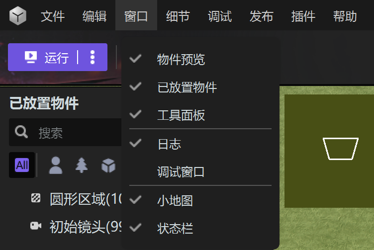

### 细节
你可以通过细节菜单调整项目的**语言设置**、**游戏规则**、**属性定义**、**玩家设置**、**美术效果**、**地图设置**、**存档设置**。

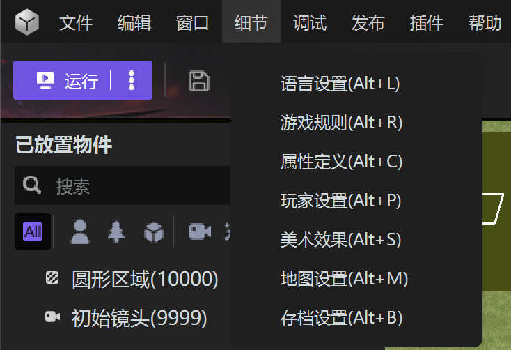

### 调试

调试板块中提供了一些调试运行游戏时的工具，你可以通过勾选来选择需要的辅助调试工具。

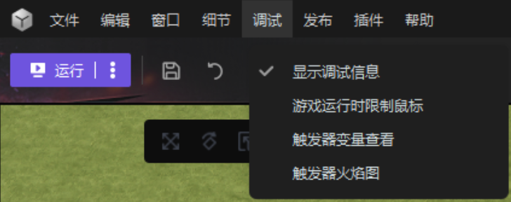

### 发布
你可以通过发布菜单上传项目、开启开发者平台“开发者之家”以及平台道具配置。

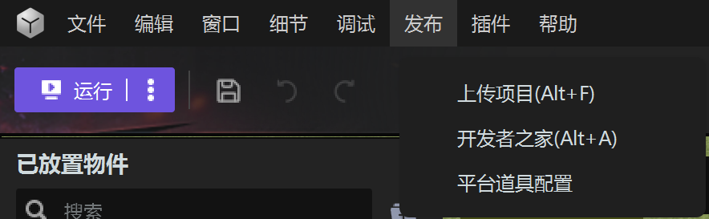

### 插件
利用插件功能，你可以快速获取其他人提供的成套逻辑或资源，从而在此基础上快速实现自己的游戏玩法。

一些插件还能扩展编辑器的功能，提供一些编辑器原本没有的功能来提高开发效率。

在安装2.0版本的编辑器后，你可以在主界面上方找到【插件】选项，点击其中的【插件管理】即可打开插件管理面板。

插件管理允许你对本地插件进行详情查看、卸载以及启用禁用的操作。

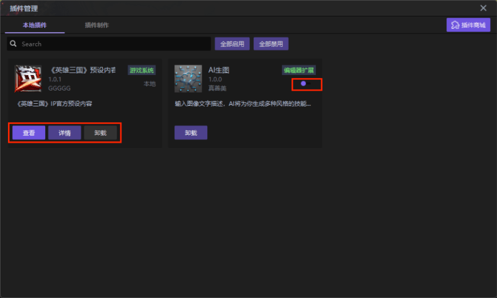

你也可以将自己制作好的游戏逻辑玩法或美术资源打包为插件，或根据提供的API开发自己的扩展插件来扩展编辑器的功能。在管理面板的【插件制作】标签页内点击右下角的【新建自定义插件】按钮，即可创建自己的插件。

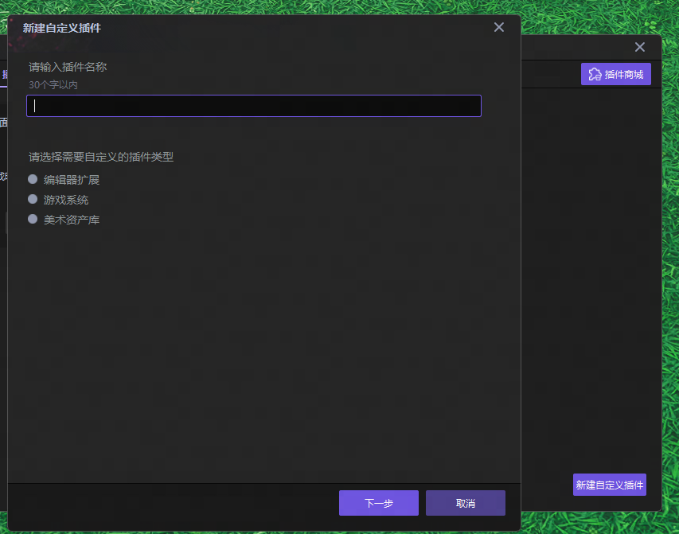

此外，你可以在【插件】选项内点击【插件商城】来对商城内的资源快速筛选。

购买相应的插件后，在资源商城的【我的资产】页面内，点击即可导入相应的插件。

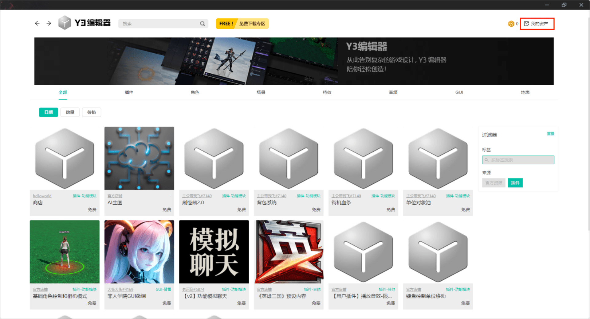

### 帮助
在帮助板块，你可以进入Y3编辑器论坛，进入开发者学院官网。遇到问题，你也可以**反馈**给官方。查看使用指南可以让你更加熟练地使用编辑器，你还可以随时进入Lua库网站以及关于我们的相关信息。

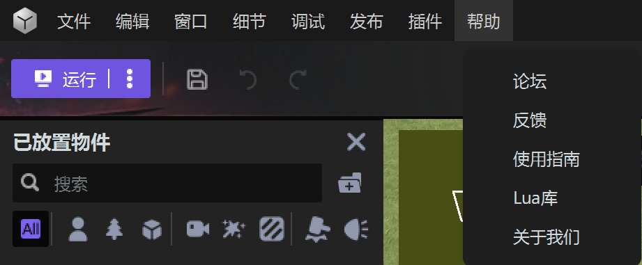