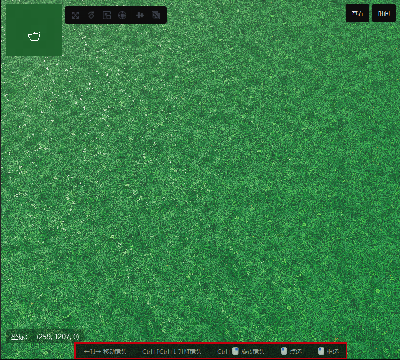
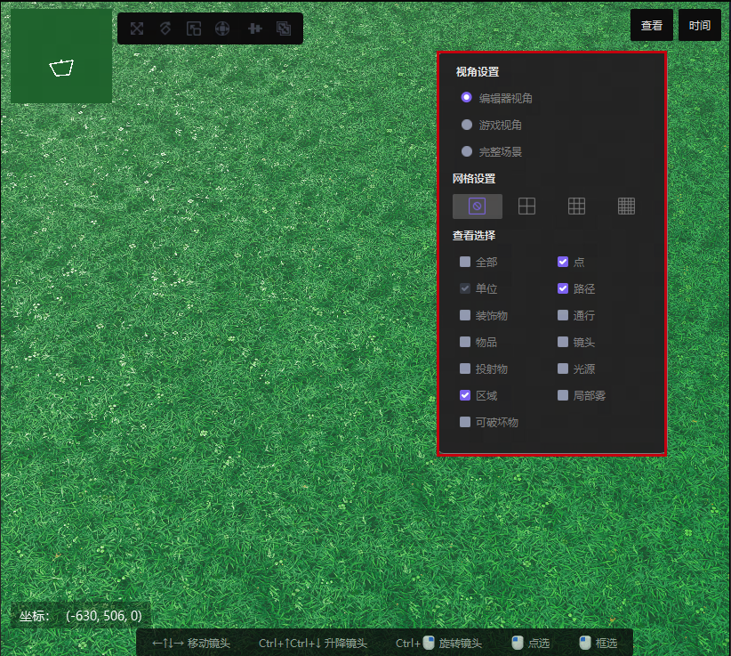
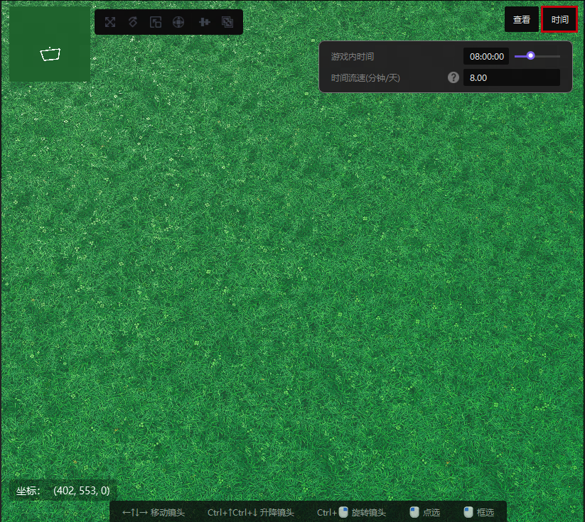

import { Callout } from 'codesandbox-theme-docs'

import { FCollapse } from 'components/FCollapse'

# 操作区

**操作区**是主界面中心的区域。

## 小地图
**小地图**在**操作区**左上角， 展示着目前操作区域在整个项目地图里的方位。

## 状态栏
**状态栏**在**操作区**底部， 未选中物件时会向您展示编辑器的基本操作。选中物件时则会提示可以对该物件使用哪些特殊操作。

## 查看
**查看**在**操作区**右上角， 点击后可 **视角设置** and **网格设置**. 您也可以在**查看选择**过滤掉指定的物件类型，使之处于不可视状态。

<Callout type="warning"> 
注意： 你选中某物件时，该物件的可视状态不可更改。
</Callout>

## 时间

**时间**在**操作区**右上角，点击后会显示一个滑块用于拖拽改变游戏场景里的时间。您也可以修改**时间流速（分钟/天）**，调整多少分钟为游戏内一日的流逝速度。 

