import { Callout } from 'codesandbox-theme-docs'

import { FCollapse } from 'components/FCollapse'

# 工具面板

**工具面板**在主界面的右侧，包含**地形编辑**和**放置物件**。

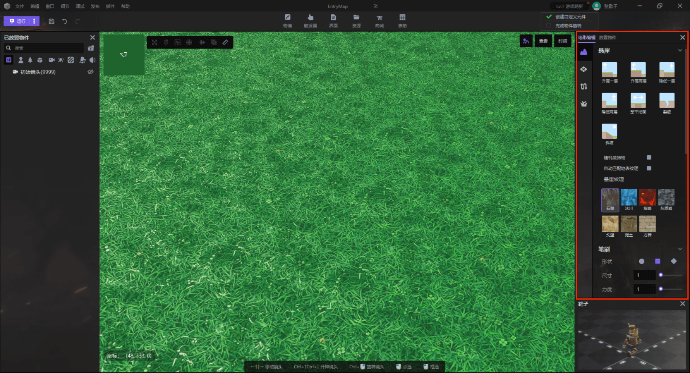

## 地形编辑

在一个项目被创建后，场景默认为平地。为了丰富项目的内容，你需要依靠**地形编辑**。

你可以根据故事背景设置游戏场景，带来相应的视觉享受、情绪波动和沉浸感。例如，竞技场周围的火山岩可以制造出极其紧张的气氛。场景还可以起到引导玩家的作用。当场景中有一条路时，玩家可以理解其中的提示，并尝试沿着这条路前进。场景可以配合实际的游戏方法，例如，当游戏角色进入雪地时，它可能会减速或失去生命。

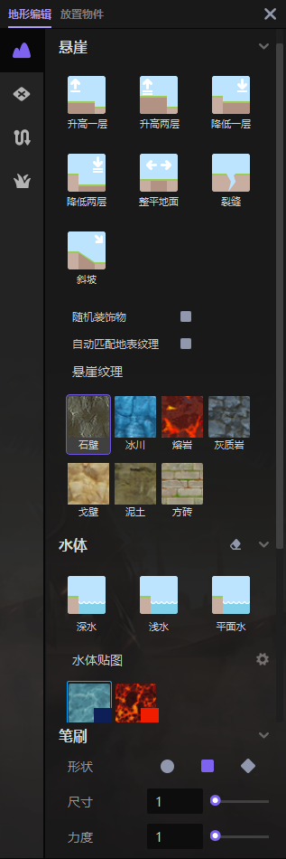

### 地势

**悬崖**：您可以在项目中设置悬崖，并调整其高度或形状。您还可以设置地图表面的高度，以呈现各种地貌。

**悬崖纹理**：可以为地形选择不同的纹理，如石壁、冰川、熔岩等。你也可以勾选随机装饰物与自动匹配地表纹理，系统会在你绘制悬崖时，自动在悬崖周围生成装饰物与悬崖下的地表纹理。

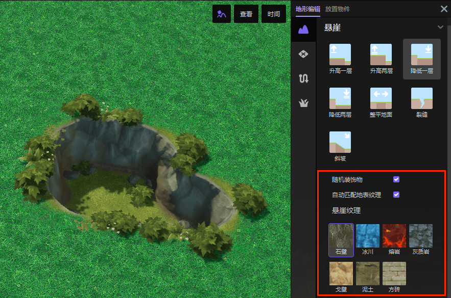

**水体**：同样，您也可以通过“水体”板块，在你的场景中设置水体环境，并调整其贴图样式。

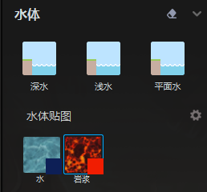

**高度**：地图表面的高度和形状可以调整。

<Callout type="warning"> 
 注意：**悬崖**将提高整个选定区域，而**高度**将从边缘到中心逐渐提高选定区域。 
</Callout>

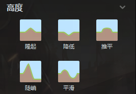

**画笔**： 在绘画过程中，你可以调整画笔的**形状**、**大小**和**强度**，以便更好地绘制表面。**形状**决定了要画的区域的形状，**大小**决定了要画的区域的范围，而**力度**决定了改变地图表面的幅度。

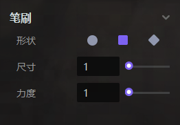

### 地形

你可以绘制不同的地形纹理，决定该地面的样式是草地还是雪地，而在纹理上，还可增添一层涂鸦，绘制信息或记号。同样可以更改笔刷的**尺寸**和**形状**以满足项目地形的绘制需求。

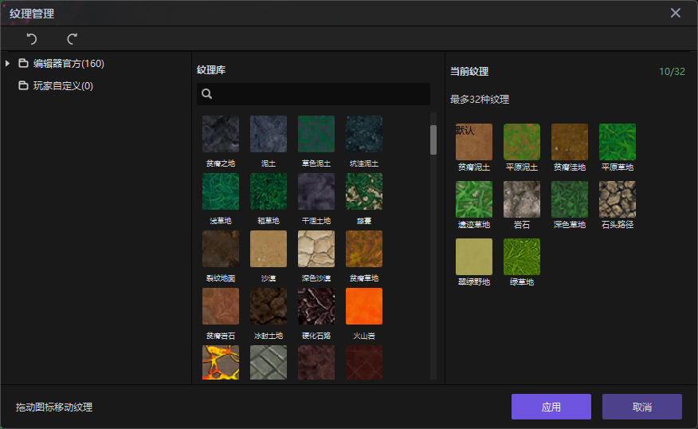

点击 然后用鼠标点击地图上的任何一个点，这个点的纹理就会被复制，并允许你用这个纹理来作画。

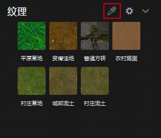

点击 你可以看到纹理管理界面，你可以将纹理库中的纹理通过拖动新增至当前纹理中。

<Callout type="warning"> 
 注意事项：最多可以添加32种纹理到当前纹理中，若超过上限则需删除后再进行添加。
</Callout>

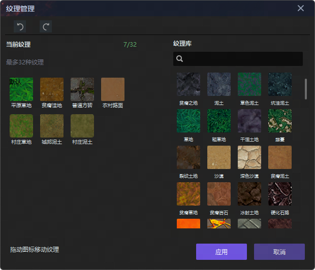

### 通行

你可以在地面上绘制区域从而影响游戏内的地面效果，包括设置目标位置的碰撞，通行和视野规则。你可以更改笔刷的**尺寸**和**形状**以满足**通行**的绘制需求。

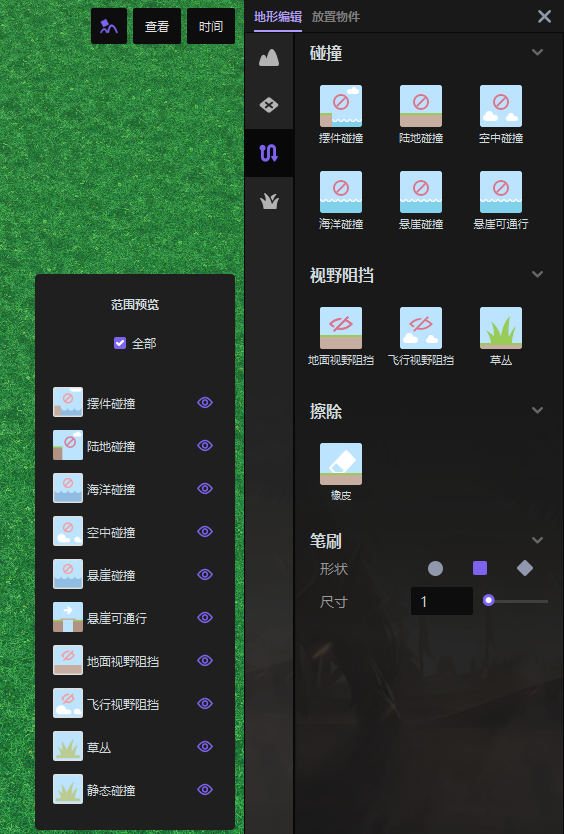

你可以在项目中画出各种类型的**碰撞**。

**物体碰撞**：在为一个物体（包括装饰物和可破坏物）画出碰撞后，当它与其他东西碰撞时，它们之间会有一个看不见的距离，这被称为**物品碰撞范围**，可以在[游戏规则](../../getting-started/game-rule#通用)中设置。在你为任何物体设置了物体碰撞后，任何物体都不能被放在该物体的物体碰撞范围内。

**地面碰撞**：当你设置一个区域为地面碰撞时，运动类型为地面碰撞的单位不能通过这个区域。

**空中碰撞**：当你设置一个区域为空中碰撞时，运动类型为空中碰撞的单位不能通过此区域。

**水上碰撞**：当你设置一个区域为水上碰撞时，运动类型为水上碰撞的单位不能通过此区域。

**悬崖碰撞**：在为悬崖绘制碰撞图后，悬崖将被划分为相应的层。例如，悬崖将被分为第1层和第2层，它们不再是一体的，它们之间可以有相对运动。

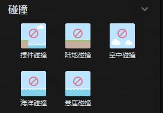

你可以在项目中画出各种类型的**遮挡**，这限制了游戏角色的视野。遮挡的效果与遮挡的类型和角色的视野类型都有关。

**地面遮蔽**：视觉类型为地面的单位不能消除地面遮蔽区域的雾气。

**空中遮蔽**：视野类型为空中的单位不能消除空中遮蔽区域的雾气。

**草丛遮蔽**：没有共享视野的玩家无法看到草丛中另一派系的游戏角色，除非对面的角色主动造成伤害。**共享视图**可以在[细节-玩家设置](../../getting-started/player-setting)中设置。与你相同派别的游戏角色将在草丛中呈半透明状态。

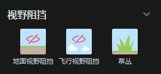

你可以点击**橡皮擦**来擦除现有的碰撞和闭合。

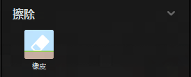

你可以**预览**项目中存在的碰撞和遮挡。

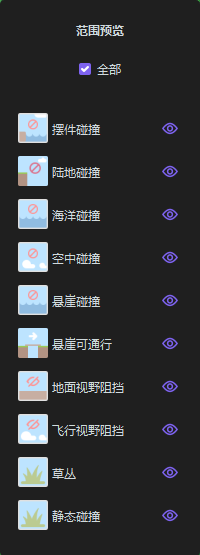

**悬崖可通行**：当你设置一个区域为悬崖可通行时，可以使所在格的悬崖碰撞失效，能够正常通行。

### 植被

植被可以被画在地面上作为装饰物。植被不会发生碰撞或影响物体的位置。你可以调整要画的植被的**密度**。你还可以修改画笔的**形状**和**大小**来绘制植被。

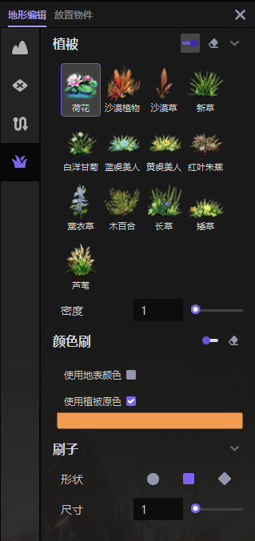

默认情况下，植被使用预设的原色。开启颜色刷功能后，你可以勾选使用地表颜色、使用植被原色或是直接使用自定义颜色；你也可以使用[erease](./icon/erease.png)橡皮将已有的植被颜色改为植被原色。

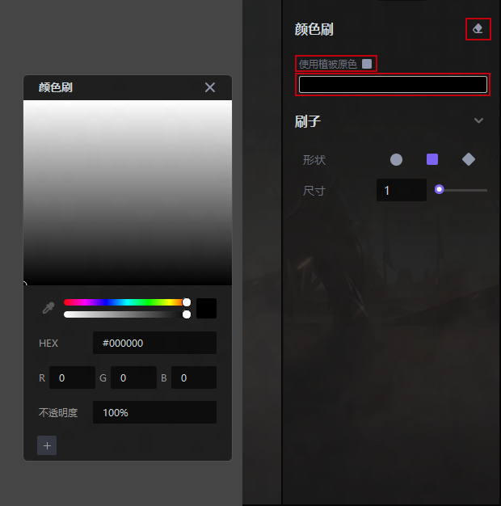

## 放置物件

在**工具面板**中，你还可以对各种物件进行摆放，并对其进行简单的编辑和设置，主要包括：[单位](#单位)，[装饰物](#装饰物)，[物品](#物品)，[镜头](#镜头)，[投射物](#投射物)，[区域](#区域)，[可破物](#可破坏物)，[氛围](#氛围)。
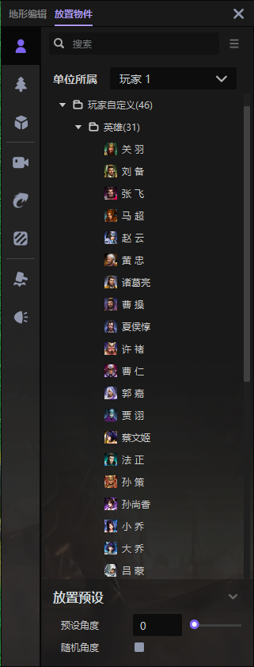

### 单位

**单位**是指被玩家或者AI控制的，可以在游戏场景中实现移动，释放技能，使用物品等操作的游戏角色。
你可以选择预设的角色放置在[操作区](./Operation_Area)，并修改**单位所属**

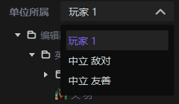

你可以调整**放置预设**，调整它的**朝向角度**或选择**随机角度**。

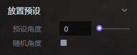

### 装饰物

**装饰物**在场景中作为装饰摆放，比如树木花草等。装饰物没有**生命值**、**物品栏**和**技能栏**等属性，仅仅作为环境装饰存在。

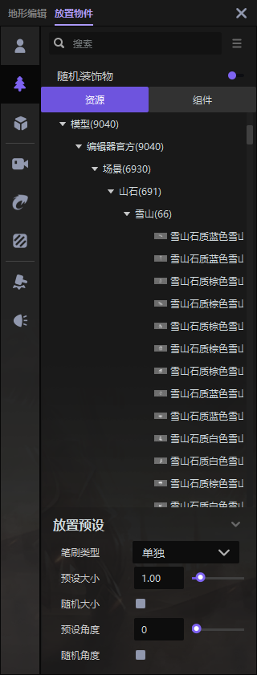

我们可以使用[资源管理器](../Resource_Manager#model)或者[组件](../Object_Editor/Functions#decorations)内的装饰物，也可以点击开启随机装饰物，在你设定的装饰物列表中进行随机选择。

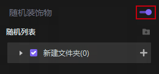

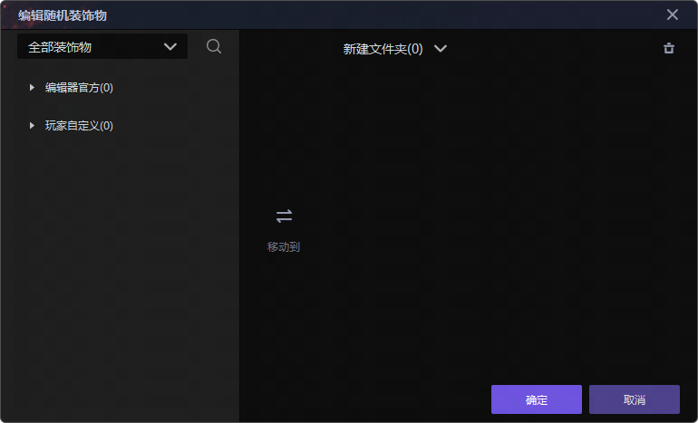

**放置预设**：笔刷类型设定单独，可以调整装饰物的**预设大小**，**角度**，同样可以通过勾选设置为随机

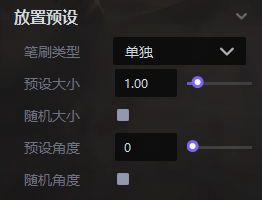

**笔刷类型**设定为**区域**，可以调整摆放区域的**形状**，**笔刷大小**，**密度**，以及其中单个装饰物的**大小**和**角度**。

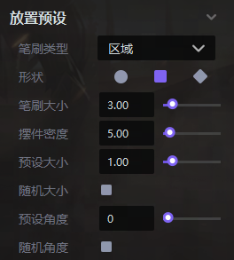

### 物品

**物品**可以在游戏内使用，可以被单位拾取和使用。**工具面板**中可以选择预设的物品进行放置并**调整角度**。

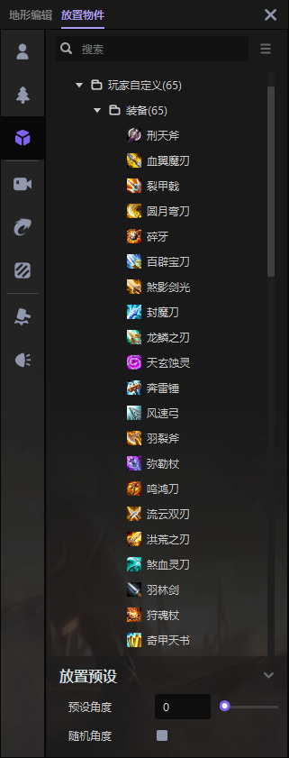

### 镜头

项目内视角的载体，你可以新建镜头或者镜头时间轴动画，通过[触发器](../Trigger)达成转场，跟随，电影拍摄等效果。 

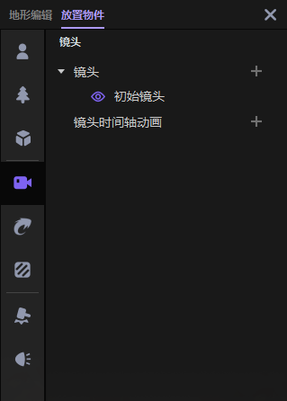

### 投射物

拥有动态效果的装饰物，比如风雪，岩浆等。你可以使用投射物丰富游戏场景，也可以用投射物来制作酷炫的英雄技能。

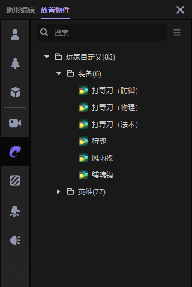

### 区域

逻辑区域包含圆形/矩形区域，点，路径以及多边形区域，区域在实际项目运行中是不显示的，你可以通过[触发器](../Trigger)赋予区域更多的功能。

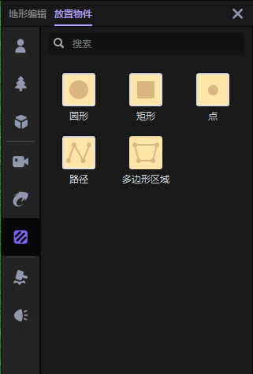

### 可破坏物

有碰撞的可以被特定技能攻击和拆除的装饰物。工具面板中它与装饰物物件的设置方法相同，但是可破坏物可以被[触发器](../Trigger)赋予逻辑。

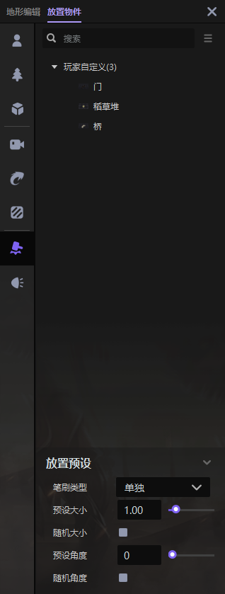

### 氛围

包含**聚光灯**，**点光源**，**局部雾**以及**场景音效**。你可以利用它添加氛围效果，例如，阳光透过窗户照射进来的效果，昏暗灯光的效果等。

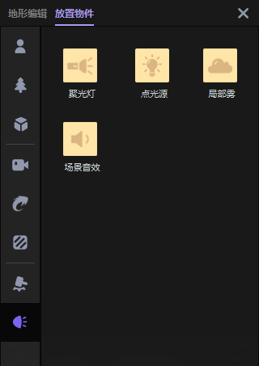

## 属性编辑

物件摆放在[操作区](./Operation_Area)后，选中这些物件，你可以对这些物件进行操作或通过**工具面板**对它们进行**属性编辑**。

  **移动：**移动场景中的物件

  **旋转：**旋转场景中的物件

  **缩放：**缩放场景中的物件

  **变换：**场景中移动和缩放对象

 **对齐：**将多个物件进行对齐

 **组合：**将选中的装饰物组合成新的装饰物

 **拆分：** 将成组的装饰物拆分成单独的装饰物

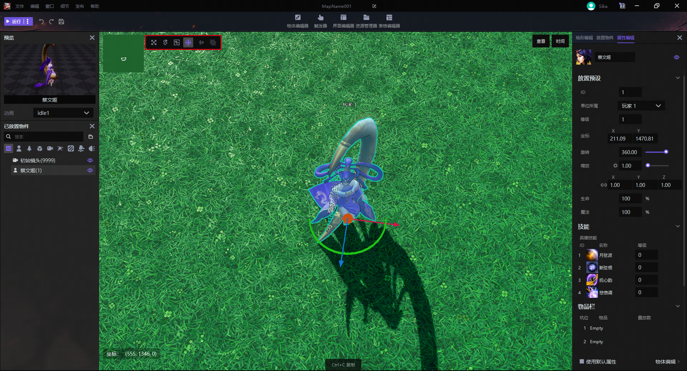

### 属性编辑-单位

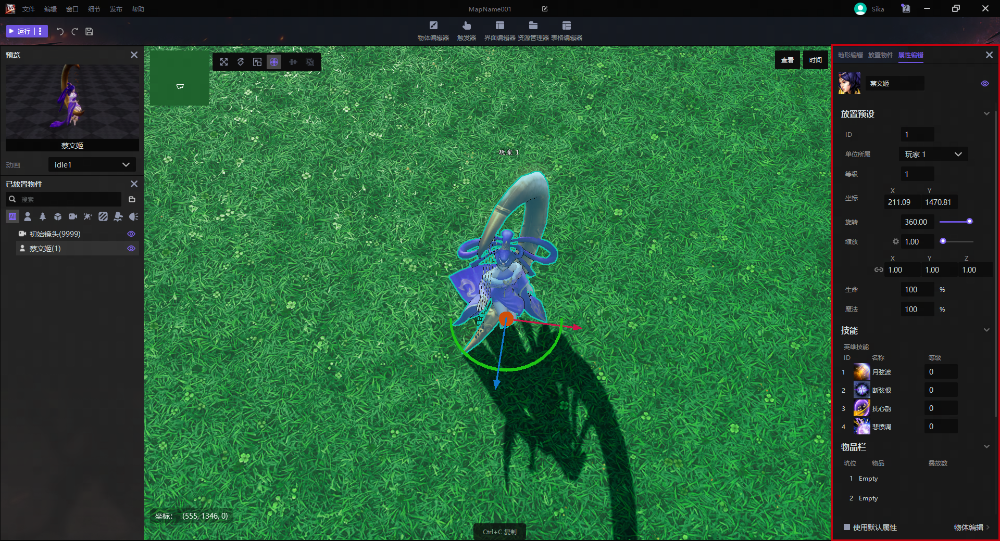

你可以修改**单位**的**名称**，点击可以显示或者隐藏这个单位。

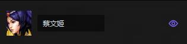

**放置预设**中你可以查看**ID**，**坐标**，查看并修改单位**所属**，**等级**，**坐标**，**旋转**，**缩放**（还可按照X,Y,Z轴独立调整），**生命**与**魔法**。

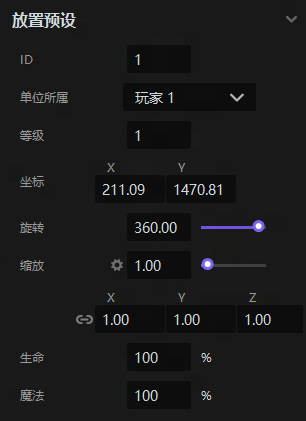

**技能**里可以添加或者修改当前物件的**通用技能**和**英雄技能**，包括对应的技能等级。

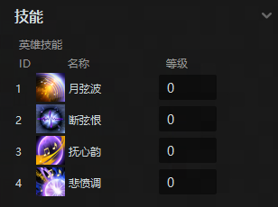

**物品栏**里可以设置选中单位物品栏内的**初始物品**和**堆叠数**。此处只能设置默认界面的6个物品栏内的物品。如果想要使用额外的界面，请使用[界面编辑器](../UI_Editor/Navigation_Bar)。

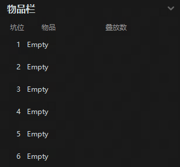

设置选中单位死亡后掉落的物品及概率

### 属性编辑-氛围

场景音效：可以摆放在场景某一坐标上的音效，玩家在一定范围内可以听见该声音。

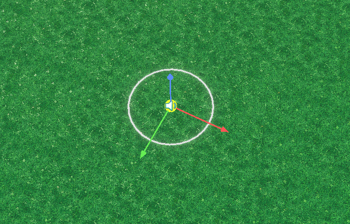

除了基础的坐标外，你还可以设置其开始衰减距离、静音距离，以及是否初始播放与循环播放声音。

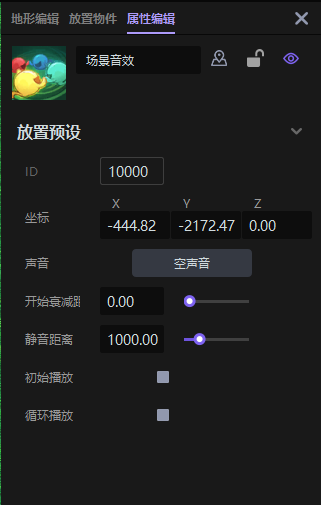

### 属性编辑-装饰物

你可以修改**装饰物**的名称，点击可以显示或者隐藏这个装饰物。你还可以对装饰物的坐标，旋转角度，缩放等进行**放置预设**.

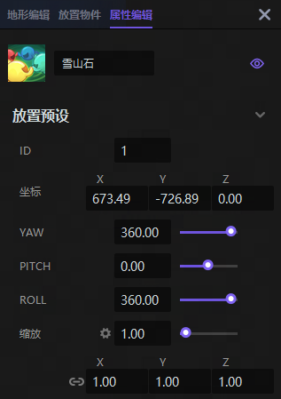

### 属性编辑-物品

你可以修改**物品**的名称，点击可以显示或者隐藏这个物品。你还可以设置物品的**单位所属**，**等级**，**坐标**，**旋转缩放**，并为该物品添加主动释放技能。

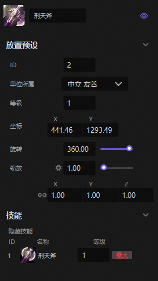

### 属性编辑-镜头

你可以修改**镜头**的**名称**，初始镜头是无法修改名称的，点击可以显示或者隐藏这个物件。
还有一些其他的镜头属性可以修改

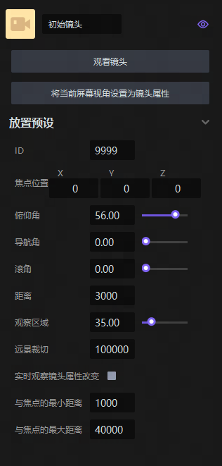

 **焦点位置**：镜头对焦的成像焦点，如下图所示。

 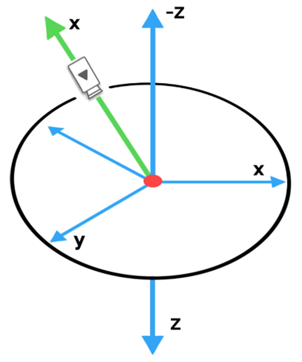

 **俯仰角**：镜头方向与地图水平面的夹角，如下图所示。

 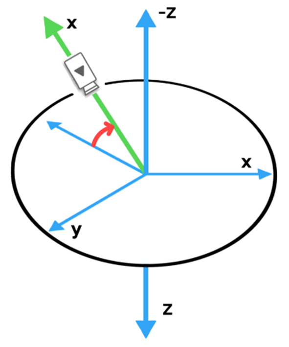

 **导航角**：镜头方向在地图平面的投影与地图X轴的夹角，如下图所示。

 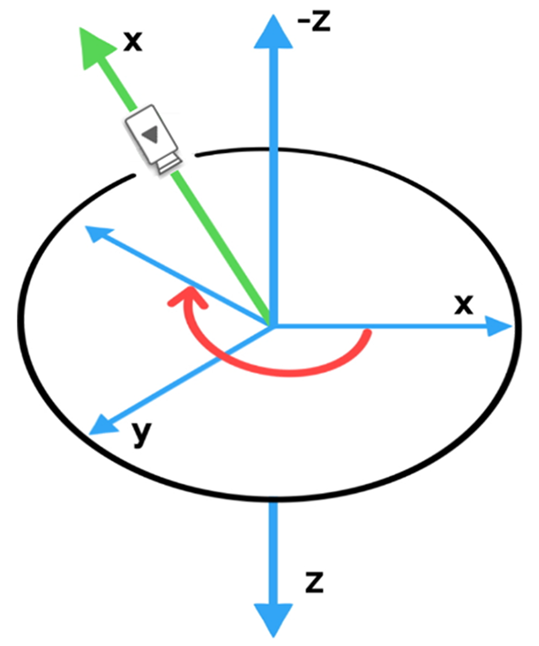

 **滚角**：镜头位置不变，自身旋转的角度，如下图所示。

 

 **距离**：镜头中心到镜头焦点距离，如下图所示。

 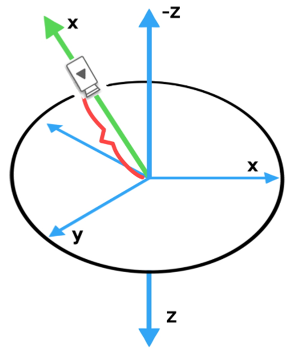

  **观察区域**：镜头可以观察到的区域，如下图红色线条围成的圆锥区域。

 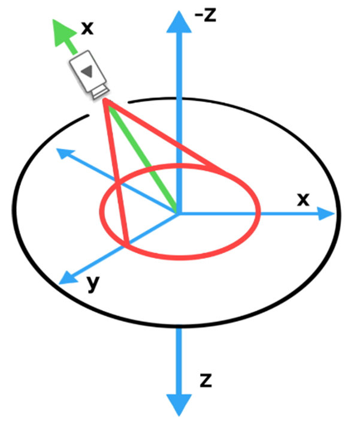

 **远景裁切**：镜头加载的物体范围。 

 **实时观察镜头属性改变**：可选择是否实时查看镜头的属性的变化，是否开启全局视野：开启状态下，启动游戏后无视视野遮挡。

 **与焦点的最小距离**：设定初始镜头与焦点的最小距离

 **与焦点的最大距离**：设定初始镜头与焦点的最大距离

### 属性编辑-投射物

你可以修改**投射物**的名称，点击可以显示或者隐藏这个投射物。你还还可以对选中投射物的坐标，旋转角度，缩放等进行**放置预设**。

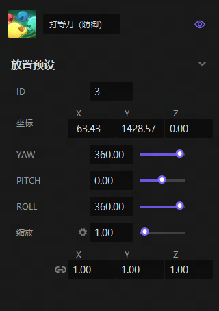

### 属性编辑-逻辑区域

你可以修改**区域**的名称，点击可以显示或者隐藏这个区域除了基础的坐标以及半径的设置，你还可以通过**下拉菜单**选择**区域内天气**，点击编辑区设置**区域声音**以及区域的绘制**颜色**。

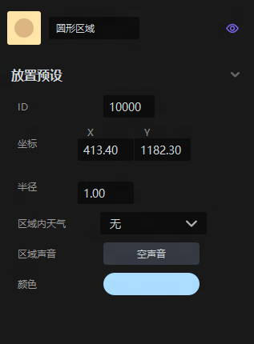

### 属性编辑-可破坏物

你可以进行名称的修改，点击可以显示或者隐藏这个可破坏物。你还可以对选中可破坏物的坐标，旋转角度，缩放等进行放置预设。

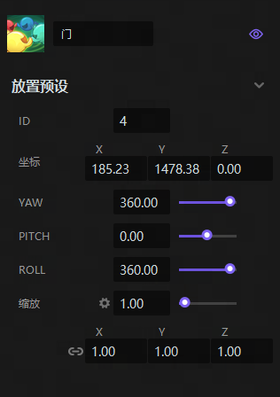

### 属性编辑-氛围

**点光源：**照亮以自身为圆心的圆形区域，你可以进行名称的修改，点击可以显示或者隐藏这个氛围。

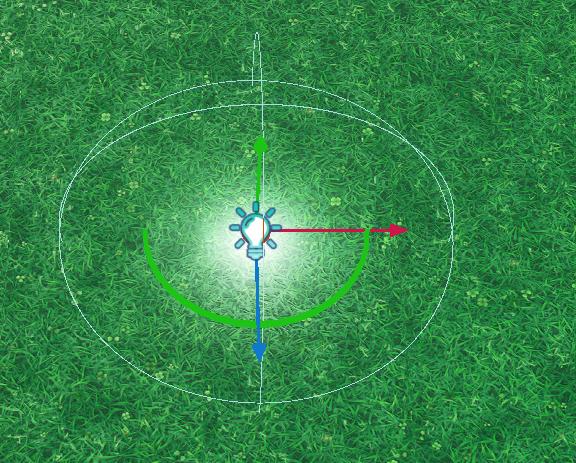

还可以设置**坐标**，**方向**，**颜色**，**光源范围**与**光源强度**，并可以勾选**是否产生阴影**。

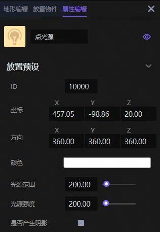

**聚光灯：**可以像手电筒一样照亮目标方向，形成光路。

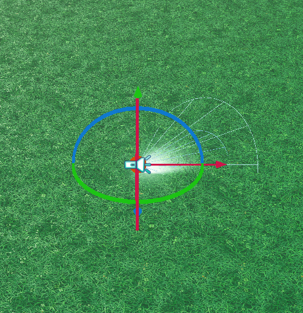

除了和点光源同样的设置选项外，聚光灯可以设置**散射角度**。

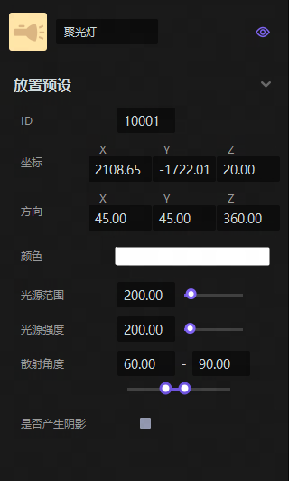

**局部雾：**场景中可以摆放的迷雾效果。你可以进行名称的修改，点击可以显示或者隐藏这个物件

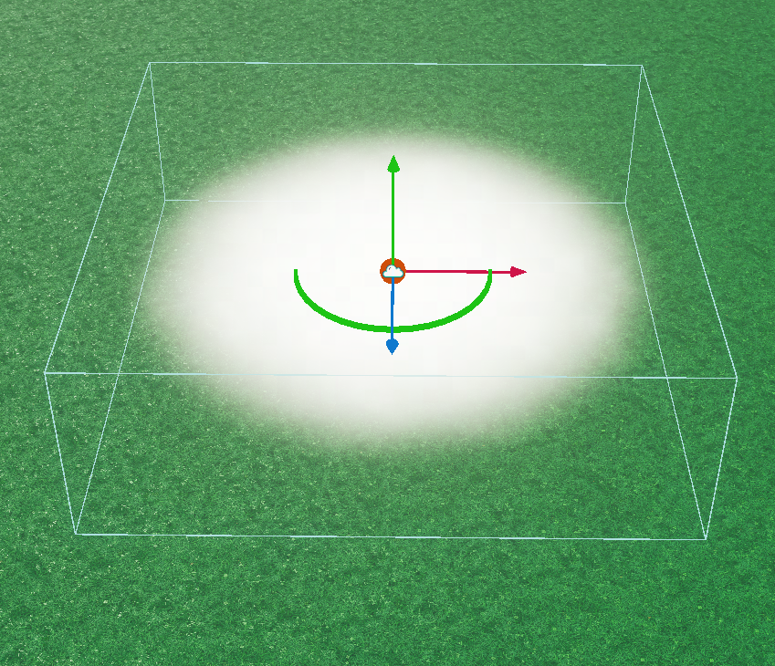

除了基础的**坐标**，**旋转**，**缩放设置**外，你可以对局部雾进行**颜色**和**浓度**的设定，并且可以设定**流动速度**。

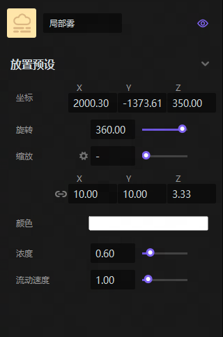
