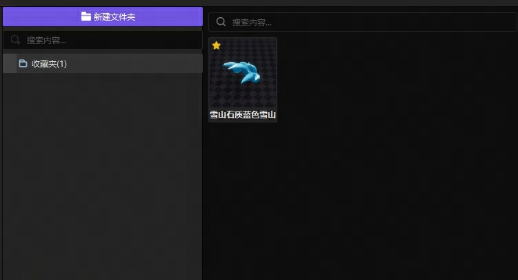
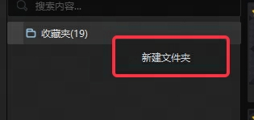
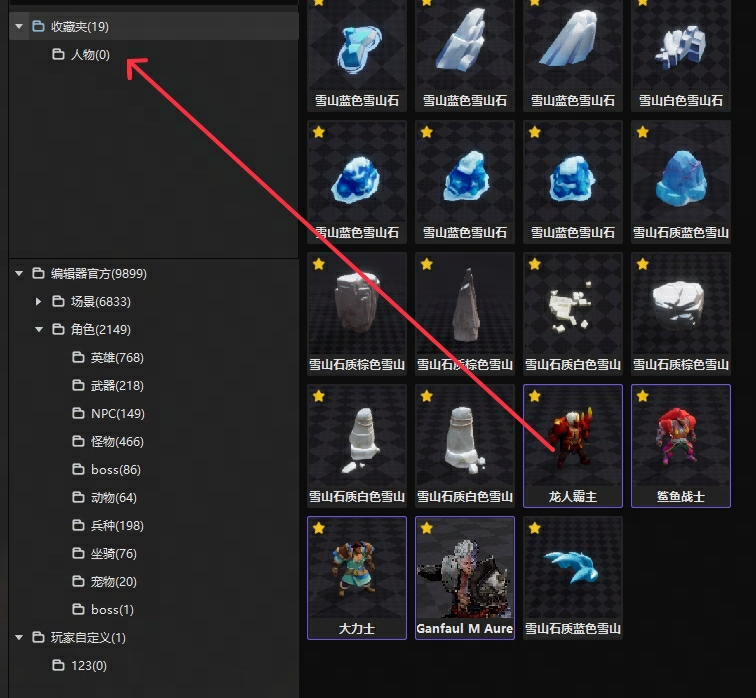
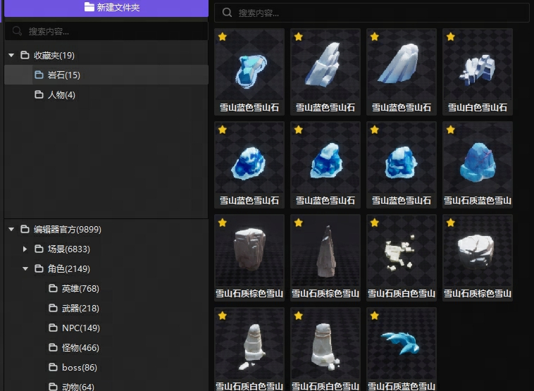

import { Callout } from 'codesandbox-theme-docs'

import { FCollapse } from 'components/FCollapse'

# 引言
资源管理器新增收藏夹目录，用户可以通过收藏资源，在收藏夹中按照项目需求创建文件夹，以管理所有收藏的资源。收藏功能可以收藏官方和自定义导入的资源。
# 收藏
点击预览左上角收藏图标、showroom收藏图标或者右键菜单收藏（您也可以使用Shift和Ctrl快捷键，多选资源并收藏）

收藏后，可以在收藏夹中查看收藏的所有资源

自定义导入的资源也可以收藏，在收藏夹中进行管理

# 收藏夹
右键点击收藏夹，点击创建文件夹

创建文件夹后，选择您想要整理出来的资源，点击拖拽至新建的文件夹

收藏夹可以帮助您按照您对于当前项目的规划，合理地管理想要使用的资源，提升资源管理效率

