import { Callout } from 'codesandbox-theme-docs'

import { FCollapse } from 'components/FCollapse'

# 物体编辑器中的摆件设置

你可以利用**物体编辑器**进行各类摆件的深度编辑。 

## 单位

### 数据设置

#### 基础设置

**头像**: 点击头像或头像图片下方的，可以进入资源管理器选择新的头像图片。

**名称**: 可以自定义当前单位的名字。

**编辑器后缀**: 此处添加的内容只在开发项目时有效，用于区分相同名字的单位，并不会影响到游戏内的显示内容。

**标签**: 用于对单位进行分类，便于对同一类别的单位进行批量操作。例如，使用[触发器](../Trigger)编写逻辑时可以通过标签关联相应的分组。

**描述**: 用于在商店中进行展示，以方便玩家了解该**单位**的情况。

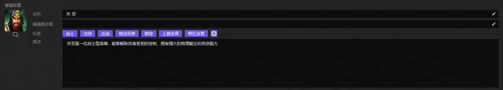

#### 固定属性

可以在**固定属性**中设置当前单位的**通用**，**属性**，**技能相关**，**商店相关**，**科技**，**声音**等内容。点击**加号**可以展开列表，查看可调整的具体属性内容。

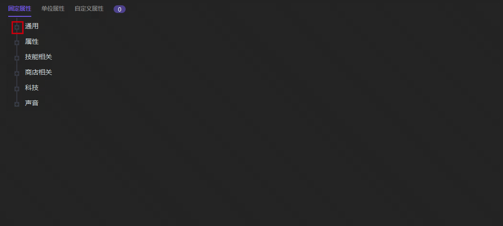

将鼠标悬停在**名称**或**问号**位置，可以查看当前属性的具体说明，方便你了解如何使用该属性。

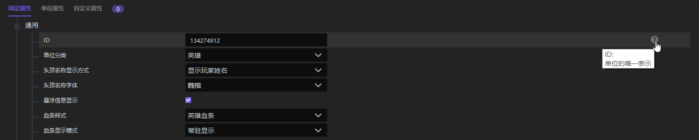

#### 单位属性

可以点击输入框设置各项单位属性的**基础属性值**以及**属性成长值**。

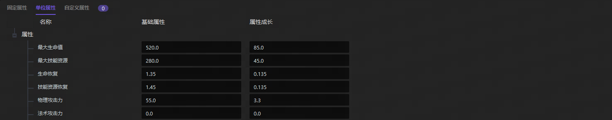

将鼠标悬停在各个单位属性的**名称**处，可以查看当前属性的具体说明，方便你了解如何使用该属性。

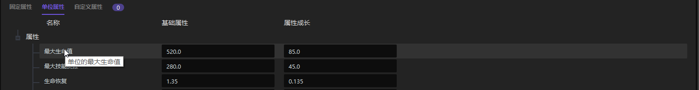

#### 自定义属性

点击右上角加号，可以添加新的自定义属性并设置其**名称**，**类型**，**值**，后续通过[触发器](../Trigger)调用，根据你的需求设置**单位**的自定义属性。 

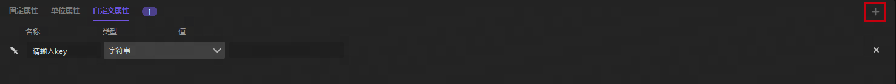

### 表现设置

你可以在**表现界面**设置**单位模型**在项目中的表现形式。

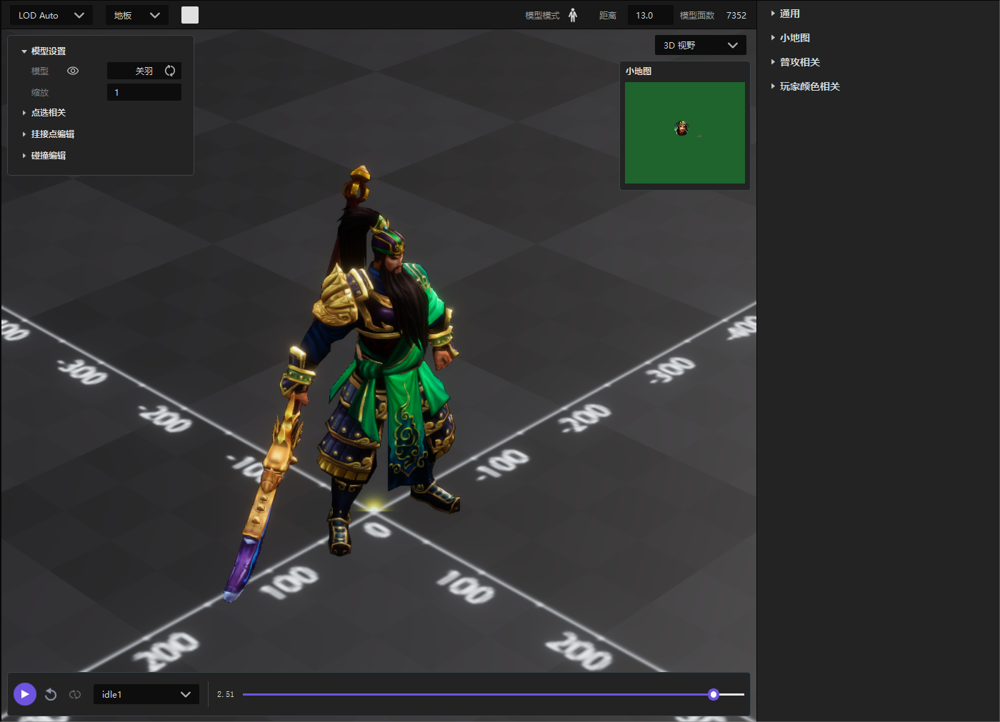

**LOD Auto**: 此模式下，编辑器会根据镜头的距离自动渲染**单位**的细节。

**距离**：编辑器会根据输入的数值调整镜头的距离。

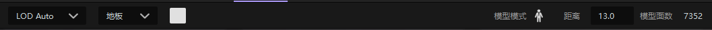

**模型模式**：点击可以单独显示去除蒙皮的骨骼模式。

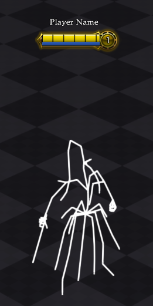

**模型设置**：点击可以在[资源管理器-模型](../Resource_Manager#模型)中选择模型进行替换，通过缩放选项可以调整模型的整体大小。

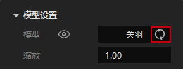

**点选相关**：勾选**效果预览**，可以在表现页面预览单位的**选择圈**与**点击盒**。你可以调整**选择圈缩放**，**点击盒高度**以及**点击盒半径**。

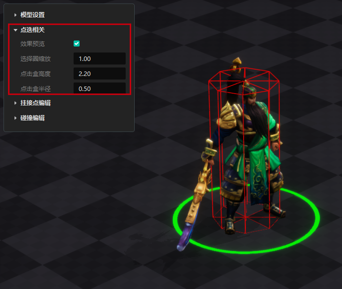

**挂接点编辑**：如果现有的**挂接点**不能满足开发者的要求，你可以点击**挂接点管理**，新增挂接点或删除已有的挂接点。

<Callout type="info"> 
挂接点（socket）：用于在3D模型中连接或绑定其他对象或物体，从而控制模型的动作、位置、旋转或其他属性。例如，一个人物模型可能有多个挂接点，包括手臂、腿、头、眼睛等部位，这些挂接点可以用于绑定武器、道具或其他物体，使其跟随模型的动作和姿态变化而自动调整位置和角度。挂接点可以提高项目的开发效率和模型的可控性。
</Callout>

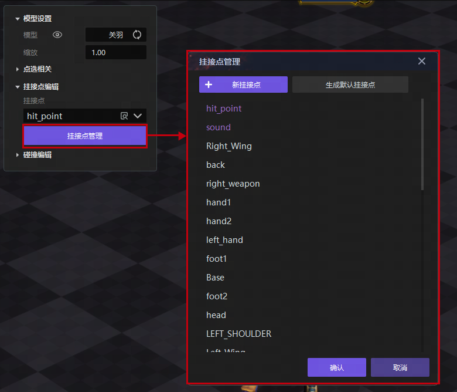

**碰撞编辑**：勾选显示**碰撞半径**，你可以在表现页面预览当前单位的**碰撞范围**，还可以修改**碰撞半径**；点击**自动生成碰撞**，系统会自动生成合适当前单位的碰撞范围。

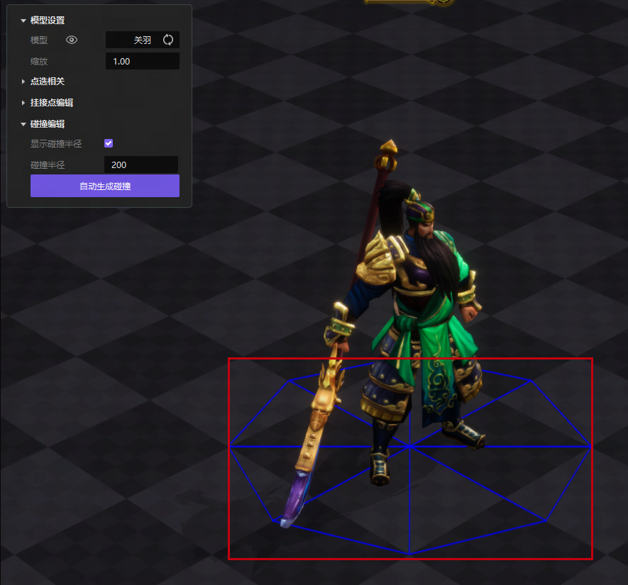

点击界面右上角的下拉框，可以调整当前的预览角度。

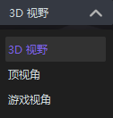

点击开始播放当前选择的动作，在下拉菜单中可以选择当前单位所拥有的动作类型，拉动进度条可以调整动作的播放速度。

你可以在页面右侧**通用面板**中的**小地图**、**普攻相关**、**玩家颜色相关**版块修改当前**单位**在项目中的各类效果，并直接在预览界面查看修改效果。
      

## 装饰物

### 表现设置

你可以在**表现界面**设置**装饰物**在项目中的表现形式。

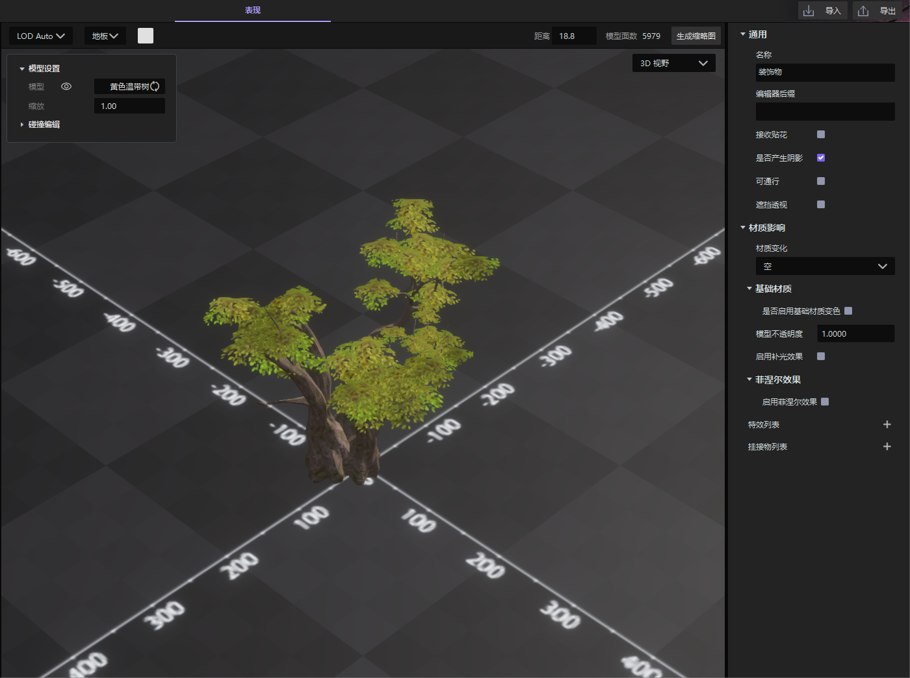

**LOD Auto**: 此模式下，编辑器会根据镜头的距离自动渲染装饰物的细节。

**距离**：编辑器会根据输入的数值调整镜头的距离。

**遮挡透视**：用于选择在此装饰物遮挡视线的情况下是否能够透视。

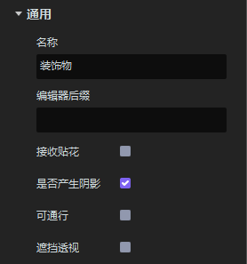

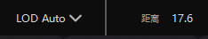

**模型设置**：点击可以在**资源管理器-模型**中选择**模型**进行替换，通过**缩放**选项可以调整模型的整体大小。

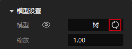

**碰撞编辑**：你可以为装饰物设置不同的**碰撞**，并在预览区直接查看当前**装饰物**的具体**碰撞范围**。你还可以通过界面下方按钮分别**清除碰撞范围格点**、**重置碰撞范围**、利用橡皮擦**擦除单个碰撞范围格点**、**退出碰撞编辑**。点击**生成碰撞**可以确认当前装饰物碰撞范围。

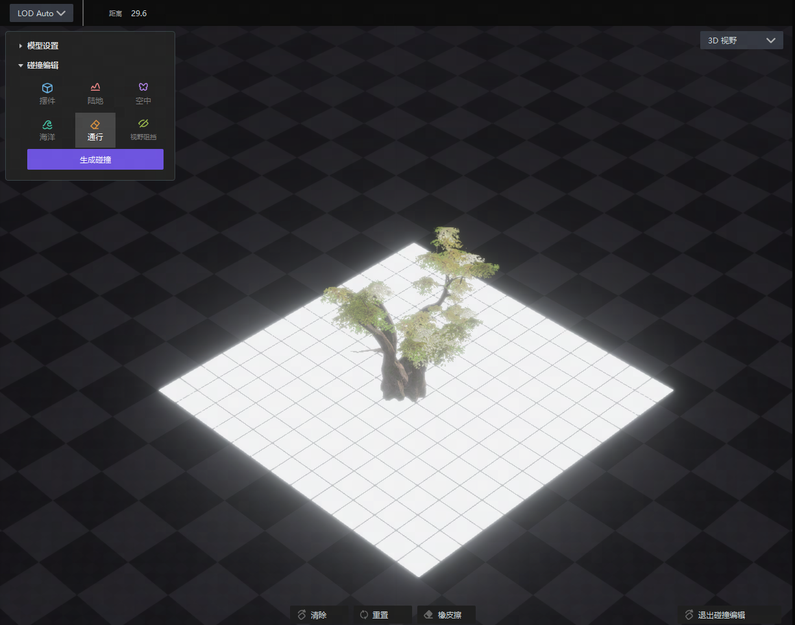

点击界面右上角的下拉框，可以调整当前的预览角度。

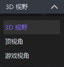

你可以在界面右侧修改当前装饰物的表现形式。

**名称**：修改当前装饰物的名称。

**编辑器后缀**：此处添加的内容只在开发项目时有效，用于区分相同名字的单位，并不会影响到游戏内的显示内容。

**接收贴花：**设置装饰物是否能够接受贴花类的特效在其模型上方。

**是否产生阴影**：用于选择显示或隐藏当前装饰物的阴影效果。

**可通行**：用于选择是否允许单位站在装饰物上或者从装饰物上方通过。

**更换材质**：设定当前装饰物的材质变化。

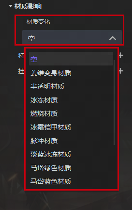

在**特效列表**中点击 “+” 可以为当前**装饰物**添加**特效**，点击可以在[资源管理器-特效](../Resource_Manager#特效)中选择对应的**特效**，还可以调整特效的细节，包括**偏移**，**缩放**，**旋转**，**播放速度**。一个装饰物可以添加多个特效。

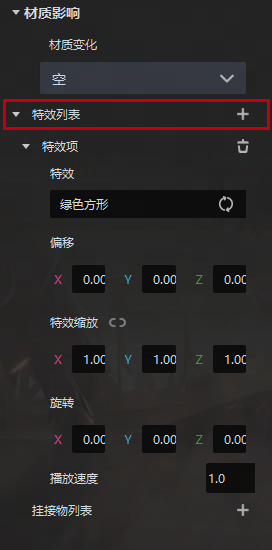

点击“+”可以为当前**装饰物**添加**模型挂接物**，点击可以在[资源管理器-模型](../Resource_Manager#模型)中查找挂接物模型，你还可以调整挂接物的**偏移**，**缩放**，**旋转**，**接受贴花**，**是否产生阴影**，**可通行**，并设置**材质变化**。

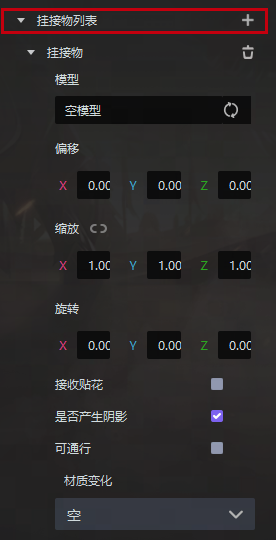

## 物品

### 数据设置

#### 基础设置

**头像**: 点击头像或者头像下方进入[资源管理器](../Resource_Manager)选择新的头像。

**名称**: 可以自定义当前**物品**的名字。

**编辑器后缀**: 此处添加的内容只在开发项目时有效，用于区分相同名字的**物品**，并不会影响到游戏内的显示内容。

**标签**: 用于对物品进行分类，便于对同一类别的物品进行批量操作。例如，使用[触发器](../Trigger)编写逻辑时可以通过标签关联相应的分组。

**描述**: 用于在商店中进行展示，以方便玩家了解该**物品**的情况。

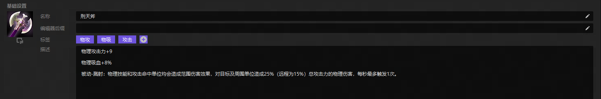

#### 固定属性

你可以在**固定属性**中设置当前物品的**通用**，**属性**，**商店相关**，**声音**等内容。点击“+”可以展开列表，查看可调整的具体属性内容。

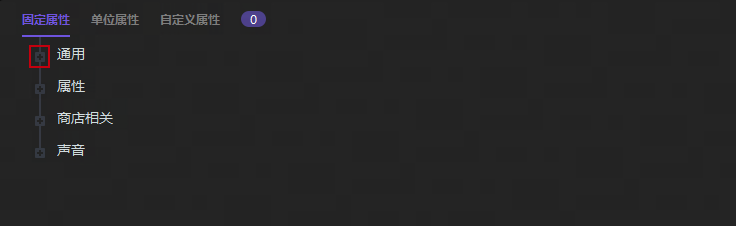

将鼠标悬停在**名称**或**问号**位置，可以查看当前属性的具体说明，方便你了解如何使用该属性。

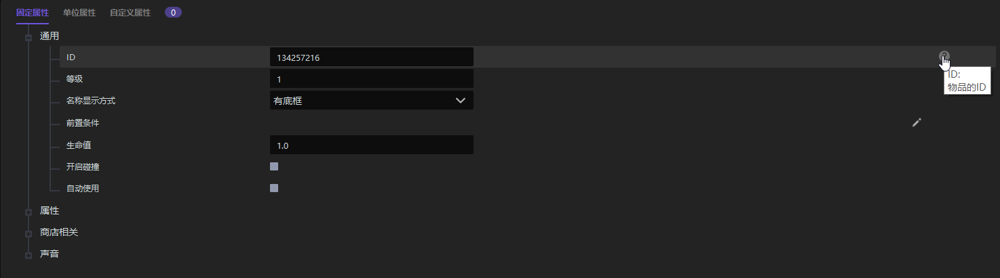

#### 单位属性

你可以点击输入框设置各项属性的值，点击可以添加或删除某个属性类别

<Callout type="warning"> 
 注意：物品的单位属性仅针对于使用该物品的单位有效。
</Callout>

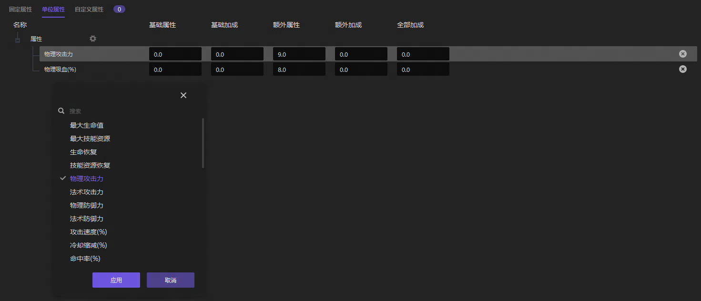

将鼠标悬停在各个单位属性的**名称**处，可以查看当前属性的具体说明，方便你了解如何使用该属性。

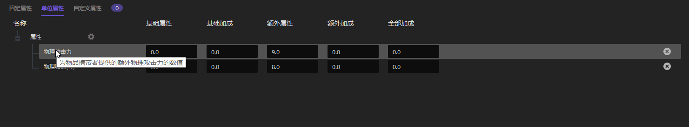

#### 自定义属性

点击右上角“+”，可以添加新的**自定义属性**并设置其**名称**，**类型**，**值**，后续通过[触发器](../Trigger)调用，从而根据你的需求设定物品的自定义属性

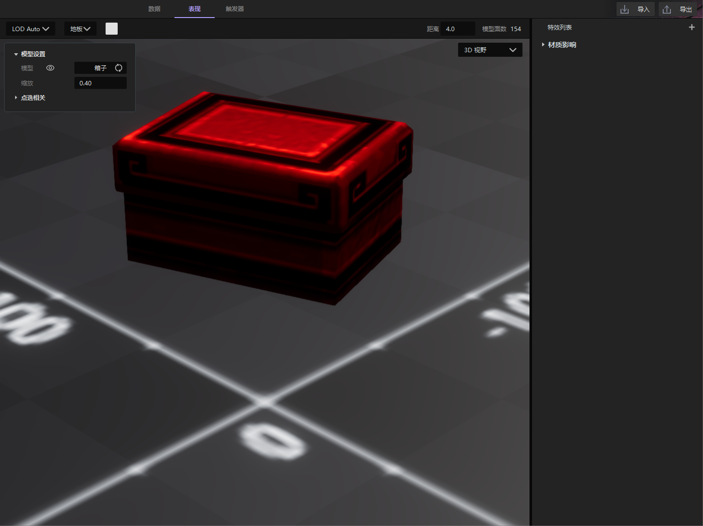

### 表现设置

你可以在**表现界面**设置**物品**模型在项目中的表现形式。

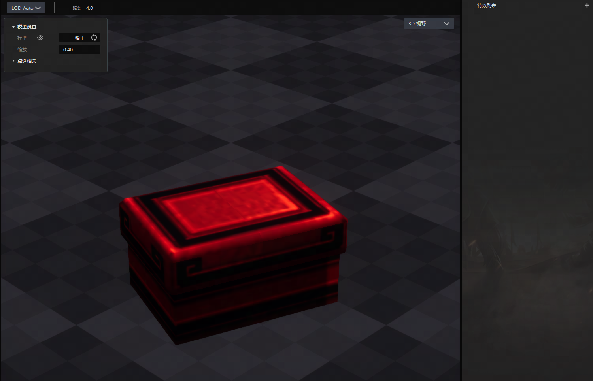

**LOD Auto**: 此模式下，编辑器会根据镜头的距离自动渲染物品的细节。

**距离**：编辑器会根据输入的数值调整镜头的距离。

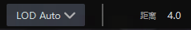

**模型设置**：点击 中选择模型进行替换，通过缩放选项可以调整模型的整体大小。
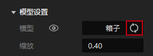

**选择设置**： 选择**预览**来预览显示窗口上项目的**选择区域**和**碰撞**。你可以调整**规模**，**碰撞高度**，和**碰撞半径**。

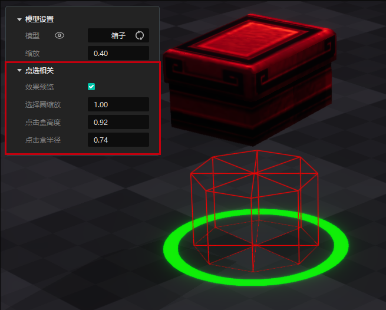

点击右上角的下拉框，调整预览角度。
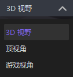

在**特效列表**中，点击 "+"，可以在[资源管理器-模型](../Resource_Manager#模型) 中选择对应的特效，还可以调整特效的细节，包括**偏移**，**特效缩放**，**旋转**，**播放速度**，一个物品可以添加多个**特效**。

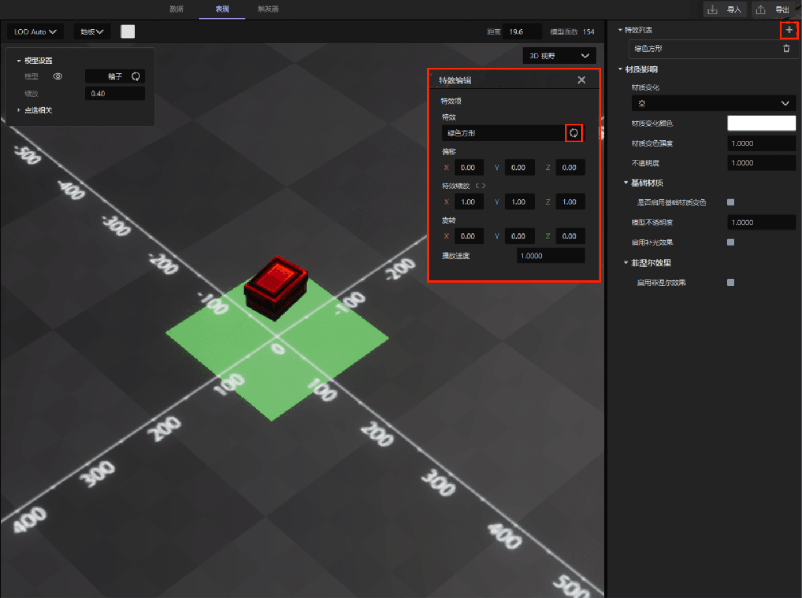

## 技能

### 数据设置

#### 基础设置

**头像**: 点击头像或头像图片下方的，可以进入资源管理器选择新的头像图片。

**名称**: 可以自定义当前技能的名字。

**编辑器后缀**: 此处添加的内容只在开发项目时有效，用于区分相同名字的技能，并不会影响到游戏内的显示内容。

**标签**: 用于对**技能**进行分类，便于对同一类别的**技能**进行批量操作。例如，使用[触发器](../Trigger)编写逻辑时可以通过标签关联相应的分组。

**描述**: 对于当前**技能**的具体说明，以方便玩家了解该**技能**的情况。

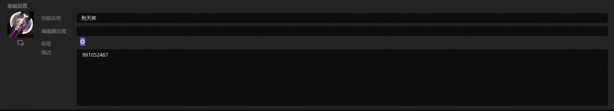

#### 固定属性

可以在固定属性中设置当前技能的**基础**，**数值**，**技能阶段相关**，**索敌相关**，**声音**等内容，点击""+""可以展开列表，查看可调整的具体属性内容。

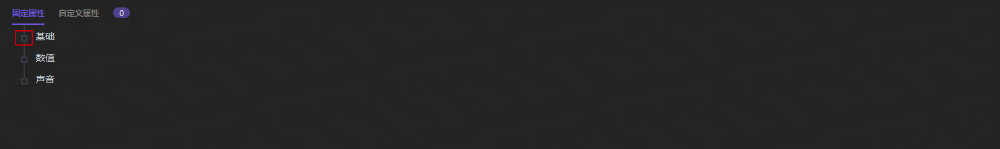

将鼠标悬停在**名称**或**问号**位置，可以查看当前属性的具体说明，方便你了解如何使用该属性。

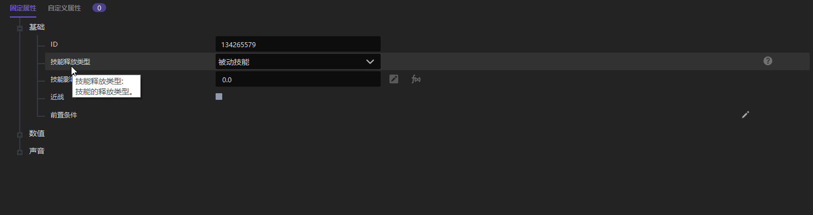

#### 自定义属性

点击右上角“+”，可以添加新的自定义属性并设置其**名称**，**类型**，**值**，后续通过[触发器](../Trigger)调用，根据你的需求设定**技能**的自定义属性。

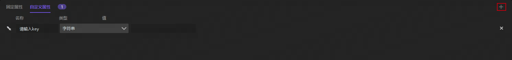

## 魔法效果

一些技能可以为**单位**和**物品**提供特殊的效果（buff），比如加快恢复生命值，增加攻击力等。魔法效果分为三类：**普通**，**光环**，**护盾**。

### 数据设置

#### 基础设置

**头像**: 点击头像或者头像下方的，可以进入[资源管理器](../Resource_Manager)选择新的头像图片。 

**名称**: 可以自定义当前**魔法效果**的名字。

**编辑器后缀**：此处添加的内容只在开发项目时有效，用于区分相同名字的**魔法效果**，并不会影响到游戏内的显示内容。

**标签**: 用于对**魔法效果**进行分类，便于对同一类别的**魔法效果**进行批量操作。例如，使用[触发器](../Trigger)编写逻辑时可以通过标签关联相应的分组。

**描述**: 对于当前**魔法技能**的具体说明，以方便玩家了解该**魔法技能**的情况。

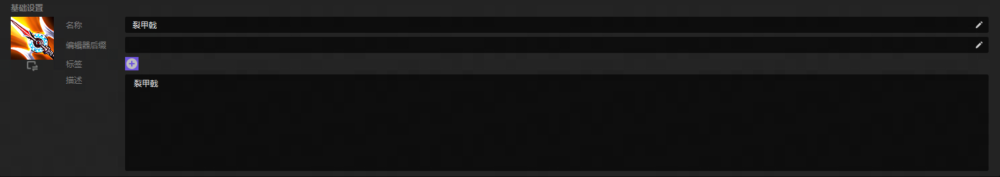

#### 固定属性

可以在固定属性中设置当前魔法效果的**ID**，**数值**，**显示图标**，**效果影响**，**覆盖类型**，**覆盖相关**，**声音**等内容，点击""+""可以展开列表，查看可调整的具体属性内容。

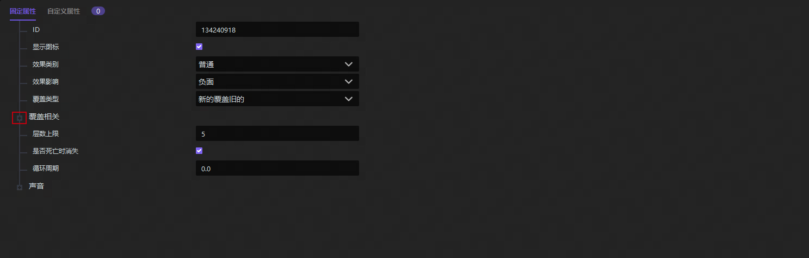

将鼠标悬停在**名称**或**问号**位置，可以查看当前属性的具体说明，方便你了解如何使用该属性。

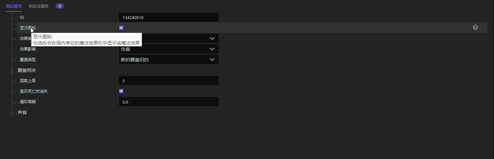

#### 自定义属性

点击右上角“+”，可以添加新的自定义属性并设置其**名称**，**类型**，**值**，后续通过[触发器](../Trigger)调用，根据你的需求设定**魔法效果**的自定义属性。

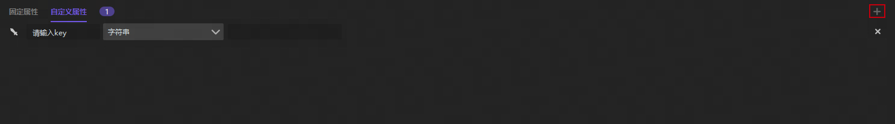

### 表现设置

你可以在**表现界面**设置游戏内角色获得和失去魔法效果时**单位**周围播放的特效。

<Callout type="warning"> 
 注意: 界面中的单位模型仅仅用于展示魔法效果，而非你正在为其设置魔法效果的单位模型。
</Callout>

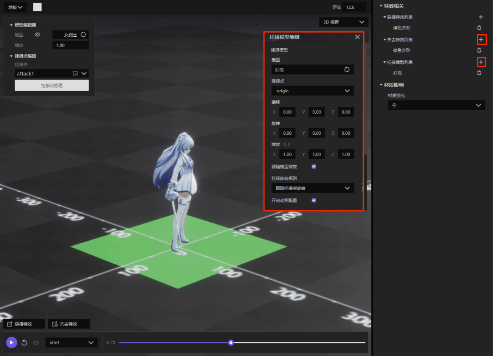

**距离**：编辑器会根据输入的数值调整镜头的距离。

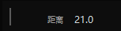

在**特效列表**中，点击 "+"，可以在[资源管理器-模型](../Resource_Manager#模型) 中选择对应的特效，还可以调整特效的细节，包括**偏移**，**特效缩放**，**旋转**，**播放速度**，一个物品可以添加多个**特效**。

**模型设置**：点击 中选择模型进行替换，通过缩放选项可以调整模型的整体大小。

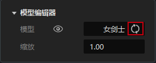

点击界面右上角的下拉框，可以调整当前的预览角度。

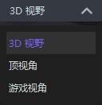

**获得/失去特效列表**：你可以为**获得魔法效果**时和**失去魔法效果**时分别添加特效。通过可以在[资源管理器-特效](../Resource_Manager#特效)中选择特效，还可以调整特效的细节，包括**偏移**，**旋转**，**特效缩放**，**播放速度**，以及放置该特效的**挂接点**，设置特效**是否跟随模型缩放**、**是否跟随挂机点/模型旋转**。获得/失去特效列表中都可以添加多个特效。

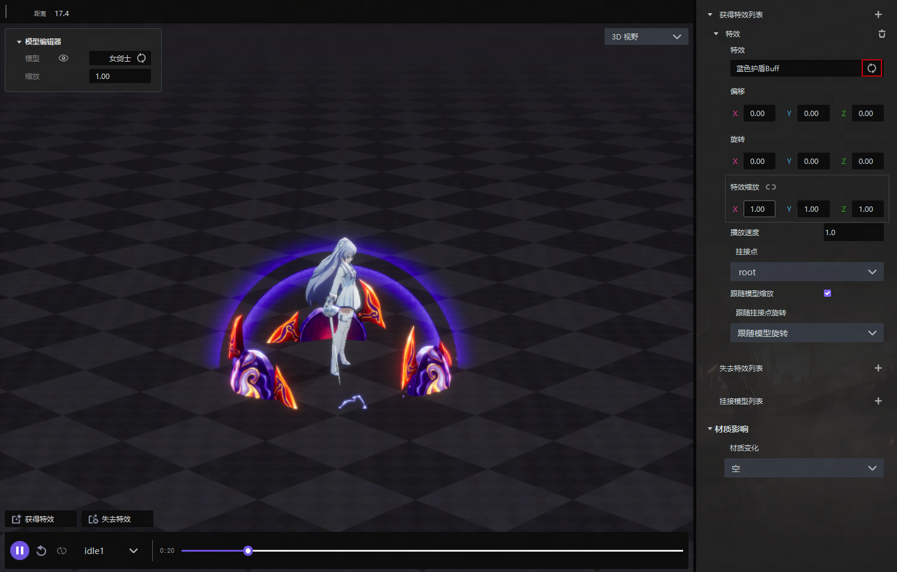

**挂接物列表**：与**装饰物**的表现设置相同，你也可以点击加号为魔法效果添加挂街物并进行各类编辑。

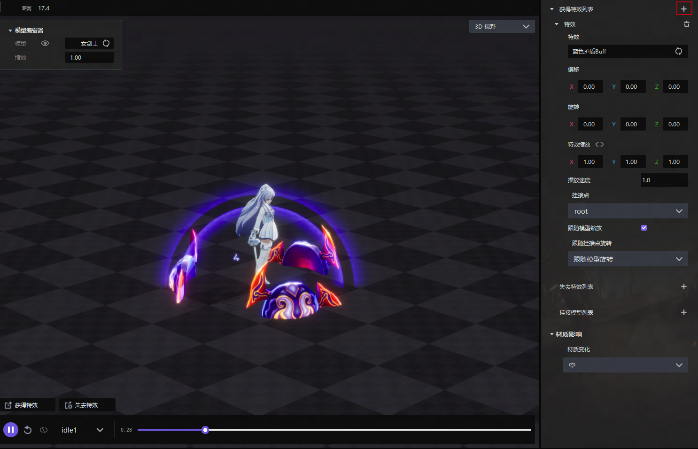

**材质影响**：模特单位在获得当前魔法效果的时候，其视觉效果可以被改变，例如设定地块变成蓝色、设定该单位是幻象、设定摆件透明等，从而使玩家获得更多的反馈信息。

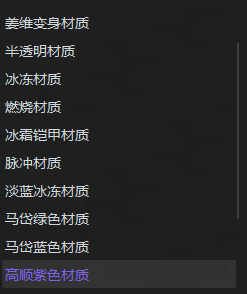

你可以预览**获取特效**和**失去特效**时的魔法效果，并查看对应状态下**单位**的动作展示。

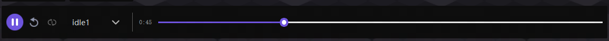

## 投射物

**投射物**可以与其他摆件（如[技能](#技能)）配合使用，也可以直接摆放在场景中。

### 数据设置

#### 基础设置

**头像**: 点击头像或者头像下方的，可以进入[资源管理器](../Resource_Manager)选择新的头像图片。 

**名称**: 可以自定义当前**投射物**的名字。

**编辑器后缀**：此处添加的内容只在开发项目时有效，用于区分相同名字的**投射物**，并不会影响到游戏内的显示内容。

**标签**: 用于对**投射物**进行分类，便于对同一类别的**投射物**进行批量操作。例如，使用[触发器](../Trigger)编写逻辑时可以通过标签关联相应的分组。

**描述**: 对于当前**投射物**的具体说明，以方便玩家了解该**投射物**的情况。

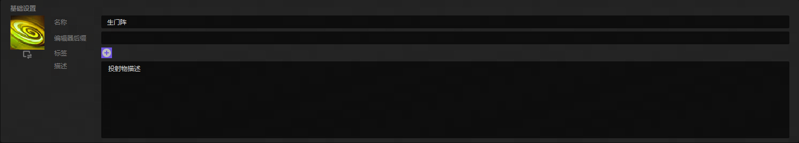

#### 固定属性

可以在**固定属性**中设置当前投射物的**ID**，**是否循环播放**，**最大持续时间**，**区分敌我特效显示**，**声音**，**可移动通道**等内容。点击加号可以展开列表，查看可调整的具体属性内容

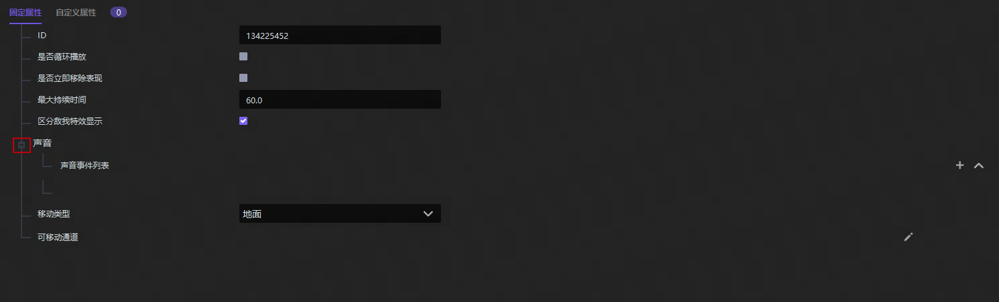

将鼠标悬停在**名称**或**问号**位置，可以查看当前属性的具体说明，方便你了解如何使用该属性。

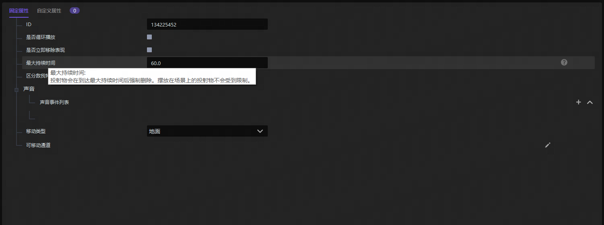

#### 自定义属性

点击右上角“+”，可以添加新的自定义属性并设置其**名称**，**类型**，**值**，后续通过[触发器](../Trigger)调用，根据你的需求设定**投射物**的自定义属性。

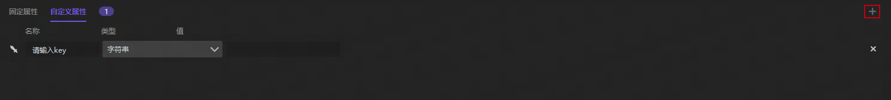

### 表现设置

你可以在**表现界面**设置**投射物**模型在项目中的表现形式。

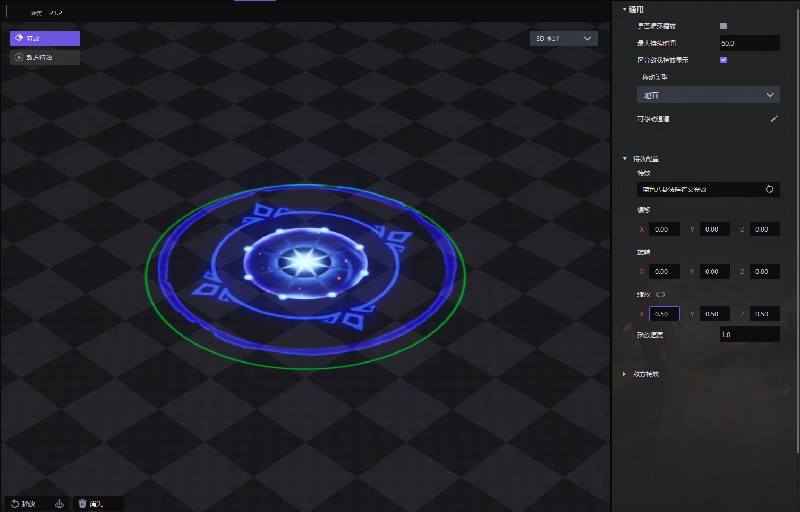

**距离**：编辑器会根据输入的数值调整镜头的距离。

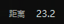

点击**特效按钮**可以播放投射物的动画效果。

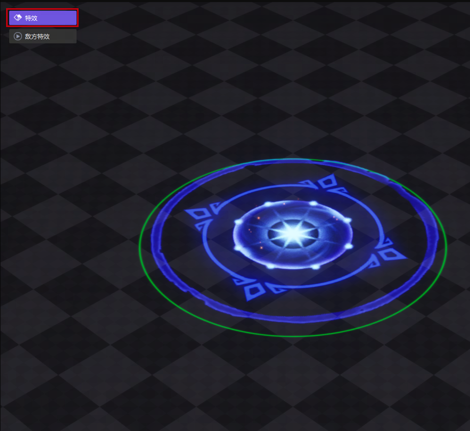

点击界面右上角的下拉框，可以调整当前的预览角度。

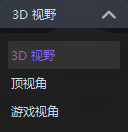

勾选**是否循环播放**后，可以让投射物在项目中循环播放，并且可以设置循环播放的**最大持续时间**，投射物的**移动类型**以及**可移动通道**。

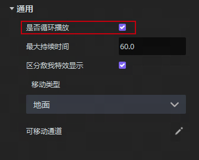

勾选**区分敌我特效显示**后可以进行敌我双方特效配置。通过可以在[资源管理器-特效](../Resource_Manager#特效)中选择特效，还可以调整特效的细节，包括**偏移**，**旋转**，**缩放**，**播放速度**。

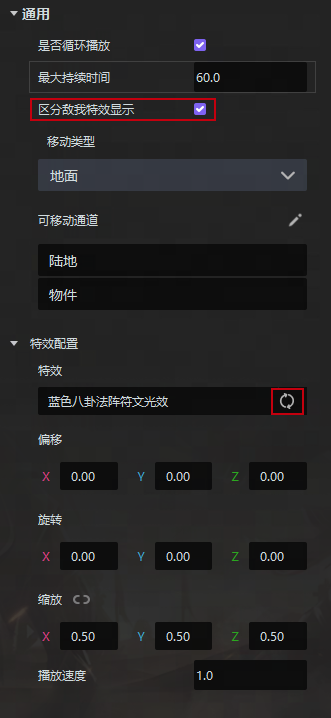

在界面左下角点击点击**Replay**可以预览投射物的动画，点击**Fade**可以预览投射物消失时的动画。

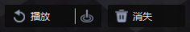

点击**播放**右侧的图标可以修改投射物的运动方式，包含**静止不动**, **直线运用**, **环绕运动**.

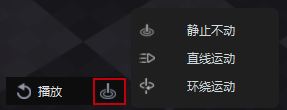

## 科技

科技系统用于限制玩家操作或增加玩家属性（比如，为当前玩家所有单位的攻击力增加100），有利于增强你对游戏节奏的把控。科技系统是归属于玩家之下的系统，每个玩家的科技是独立的，仅对自己生效。

### 数据设置

#### 基础设置

**头像**: 点击头像或者头像下方的，可以进入[资源管理器](../Resource_Manager)选择新的头像图片。 

**名称**: 可以自定义当前**科技**的名字。

**编辑器后缀**：此处添加的内容只在开发项目时有效，用于区分相同名字的**科技**，并不会影响到游戏内的显示内容。

**标签**: 用于对**科技**进行分类，便于对同一类别的**科技**进行批量操作。例如，使用[触发器](../Trigger)编写逻辑时可以通过标签关联相应的分组。

**描述**: 对于当前**科技**的具体说明，以方便玩家了解该**科技**的情况。描述的内容支持使用函数代码来编辑。

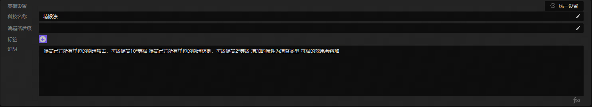

#### 固定属性

你可以在**固定属性**中设置当前技能的**ID**，**最大等级**，**影响全部单位**，**影响单位标签**等内容。

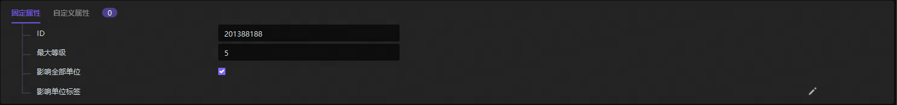

将鼠标悬停在**名称**或**问号**位置，可以查看当前属性的具体说明，方便你了解如何使用该属性。

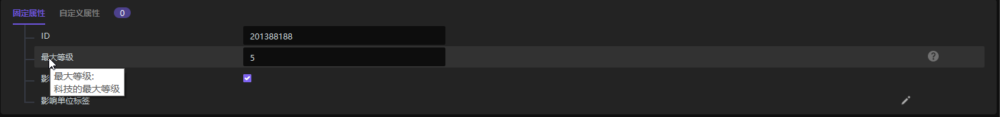

你可以对**科技**的等级进行设置，还可以更换**图标**，设置**资源需求**，添加**科技效果**，添加**前置条件**。

#### 自定义属性

Click the “+” in the upper right corner to add a new Custom Attribute and set its **Name**, **Type**, and **Value**. Then you can set the custom attribute of a **Tech** according to your requirements through Trigger.
点击右上角“+”，可以添加新的自定义属性并设置其**名称**，**类型**，**值**，后续通过触发器调用，根据你的需求设置科技的自定义属性。

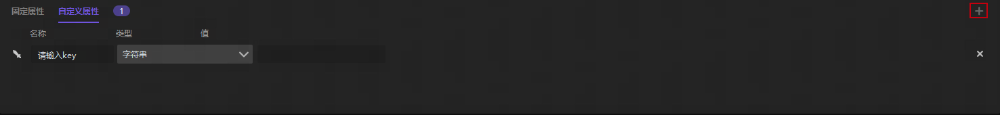

## 可破坏物

可破坏物主要用于为游戏玩家提供可以被采集的资源。

### 数据设置

#### 基础设置

**名称**: 可以自定义当前**可破坏物**的名字。

**编辑器后缀**：此处添加的内容只在开发项目时有效，用于区分相同名字的**可破坏物**，并不会影响到游戏内的显示内容。

**标签**: 用于对**可破坏物**进行分类，便于对同一类别的**可破坏物**进行批量操作。例如，使用[触发器](../Trigger)编写逻辑时可以通过标签关联相应的分组。

**描述**: 对于当前**可破坏物**的具体说明，以方便玩家了解该**可破坏物**的情况。描述的内容支持使用函数代码来编辑。

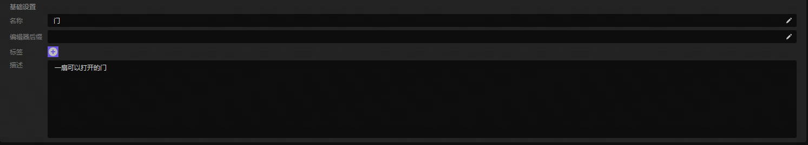

#### 固定属性

可以在**固定属性**中设置当前**可破坏物**的**ID**，以及调节**可被选中**，**可被攻击**，**可被作为技能目标**，**生命值**，**死亡时销毁**，**死亡时销毁延迟**，**接受贴画**，**是否可通行**，**可被采集**等选项。

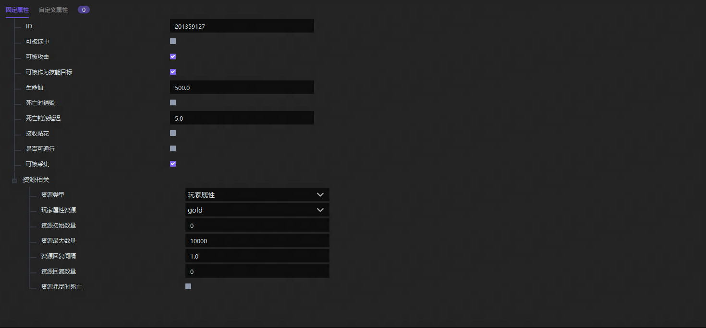

将鼠标悬停在**名称**或**问号**位置，可以查看当前属性的具体说明，方便你了解如何使用该属性。

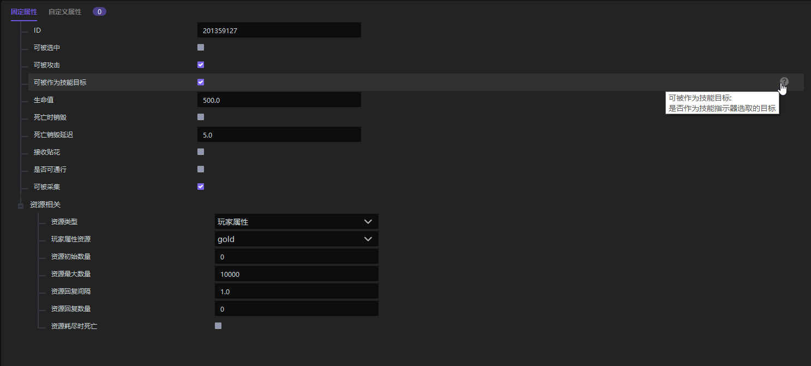

#### 自定义属性

点击右上角“+”，可以添加新的自定义属性并设置其**名称**，**类型**，**值**，后续通过[触发器](../Trigger)调用，根据你的需求设置**可破坏物**的自定义属性。

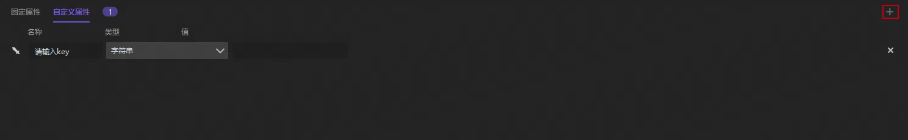

### 表现设置

你可以在**表现界面**设置**可破坏物**在项目中的表现形式。

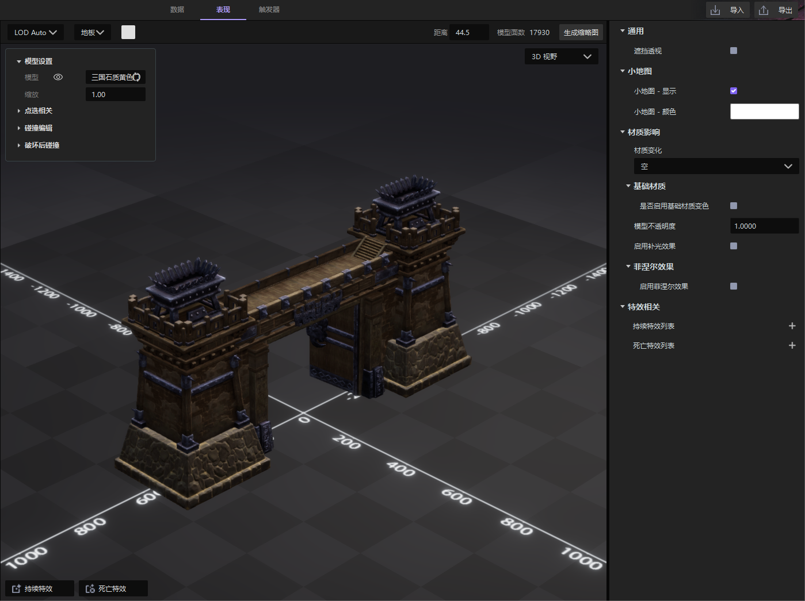

**LOD Auto**: 此模式下，编辑器会根据镜头的距离自动渲染**可破坏物**的细节。
**距离**：编辑器会根据输入的数值调整镜头的距离。

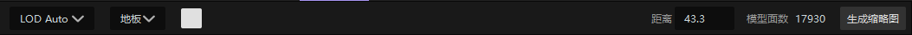

**模型设置**：点击可以在[资源管理器-模型](../Resource_Manager#模型)中选择模型进行替换，通过缩放选项可以调整模型的整体大小。

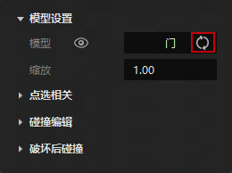

**点选相关**：勾选**效果预览**，可以在表现页面预览可破坏物的**选择圈**与**点击盒**。你可以调整**选择圈缩放**，**点击盒高度**以及**点击盒半径**。

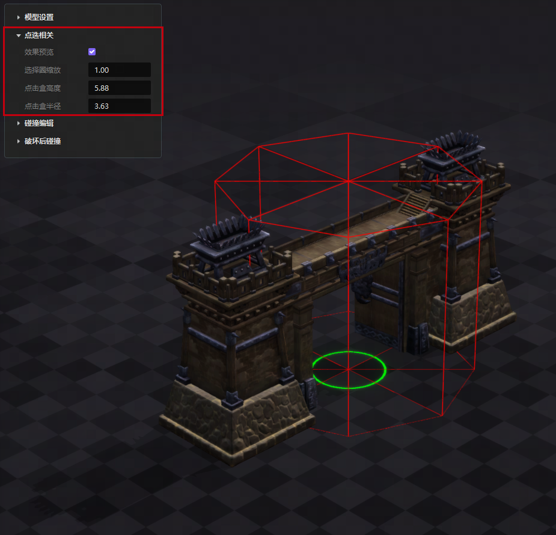

**碰撞编辑**：你可以为可破坏物设置不同的**碰撞**，并在预览区直接查看到当前**可破坏物**的具体碰撞范围。你还可以通过界面下方按钮分别**清除碰撞范围格点**、**重置碰撞范围**、利用**橡皮擦**擦除单个碰撞范围格点、**退出碰撞编辑**。点击**生成碰撞**可以确认当前**可破坏物**的碰撞范围。

**破坏后碰撞**：你可以设置**可破坏物**被**破坏**后的碰撞类型，例如房屋被击毁后，废墟依然具有带阻挡效果的碰撞类型。

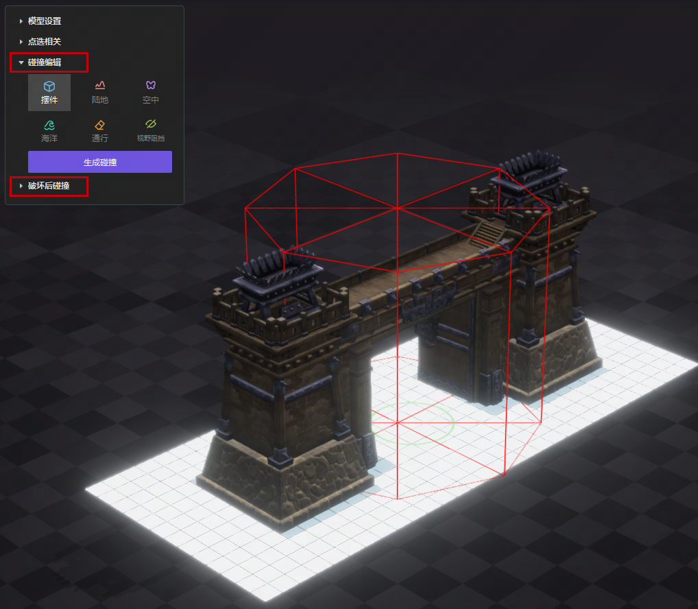

点击界面右上角的下拉框，可以调整当前的预览角度。

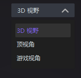

勾选**小地图-显示**后，你可以设置可破坏物在小地图中的颜色。

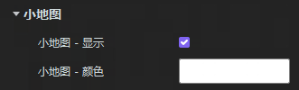

**材质影响**：设定当前可破坏物的材质变化。 

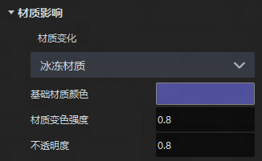

点击“+”可以为**可破坏物**添加**持续特效**与**死亡特效**，通过 可以在[资源管理器-特效](../Resource_Manager#特效)中选择你想要的特效，还可以调整特效的细节，包括**偏移**，**旋转**，**缩放**，**播放速度**。

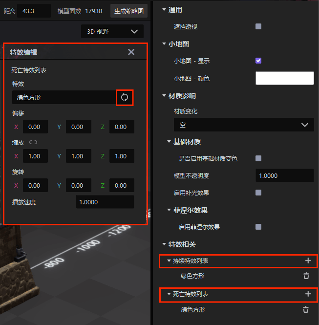

## 声音

在**物体编辑器**中可以简单地对声音进行编辑并加以利用，成为背景音乐或技能音效。

### 数据设置

#### 基础设置

**名称**: 可以自定义当前**声音**的名字。
**播放**：点击按钮可以试听当前声音，拖拉进度条可以选择播放的节点。

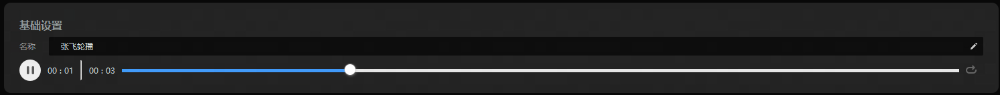

#### 固定属性

**ID**: 该声音在编辑器中的唯一编号。

**声音类型**: 可以选择2D声音/3D声音。

**音量**: 调整当前声音的音量大小。

**淡入**: 用于设置声音开始时由无声过渡到有声所经历的时间。

**淡出**: 用于设置声音结束时由有声过渡到无声所经历的时间。

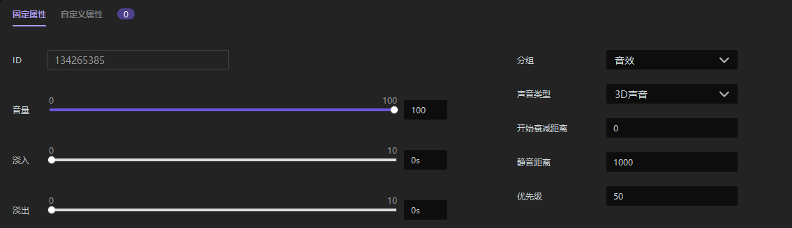

点击“+”可以为一个音乐场景添加多个声音，不仅可以调节各个声音的**音量**，还可以调整各个声音的**播放概率**，并且点击播放键进行试听。当然，也可以点击 来删掉不想要的声音。

<Callout type="info"> 
播放概率：你可以调整播放概率让每种声音根据概率随机播放，从而使游戏中的音乐变得多样化。例如，如果将声音A的播放概率的数值设为70，将声音B的播放概率的数值设为30，则当某玩家在游戏中体验这段剧情的时候，有70%的概率会听到声音A，有30%的概率会听到声音B。
</Callout>

<Callout type="warning"> 
 注意：无论添加多少种声音，所有声音的播放概率之和不能超过100，也就是在同一时刻不会出现多种声音叠加的情况。
</Callout>

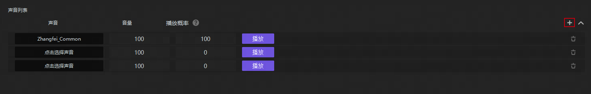

#### 自定义属性

点击右上角“+”，可以添加新的自定义属性并设置其**名称**，**类型**，**值**，后续通过[触发器](../Trigger)调用，根据你的需求设置声音的自定义属性。

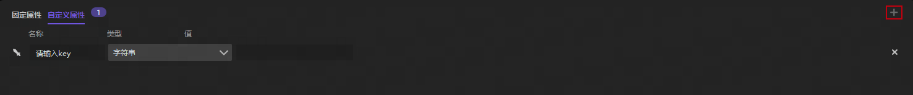

## 定义

除了**物体编辑器**提供的固定属性外，还可以点击**物体编辑器**左下角的定义选项打开属性编辑窗口进行自**定义**编辑，你可以自定义**单位属性**、**玩家属性**、**攻防属性**、**复合属性**、**英雄经验以及伤害公式**。

详情可见[属性定义](../../getting-started/attribute-definition#属性定义)
