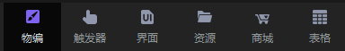
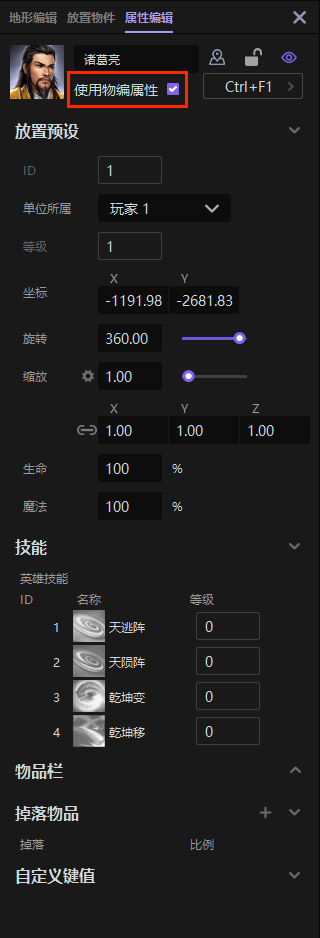
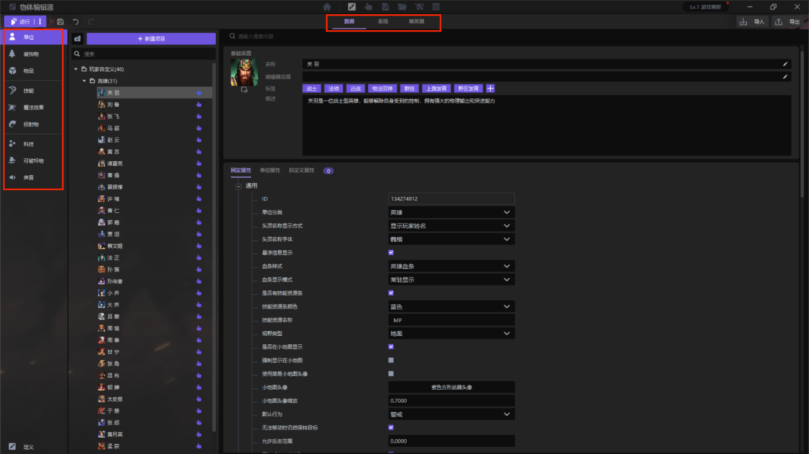
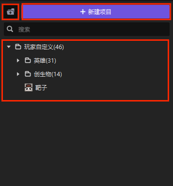
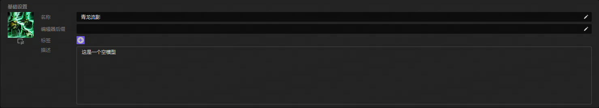
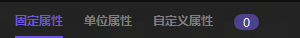
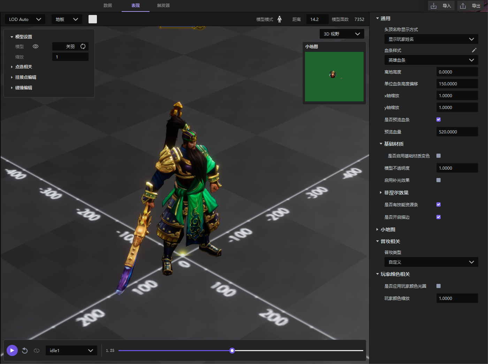
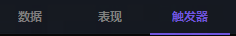

import { Callout } from 'codesandbox-theme-docs'

import { FCollapse } from 'components/FCollapse'

# 物体编辑器

物体编辑器可以让你轻松地编辑和管理游戏中的[单位](./Functions#单位)，[装饰物](./Functions#装饰物)，[物品](./Functions#物品)，[技能](./Functions#技能)，[魔法效果](./Functions#魔法效果)，[投射物](./Functions#投射物)，[可破坏物](./Functions#可破坏物)，[可破坏物](./Functions#可破坏物)，[声音](./Functions#声音)，同时你还可以创造或修改各种游戏内容，比如**单位名称**，**攻击力**等。

在**操作区**选中对象时，可通过是否勾选**使用物编属性**，来设置该物件是应用物编属性或是默认属性。

## 物体编辑器的界面

**物体编辑器**中共有9种可编辑的物体，点击界面最左侧的分类列表，可以对相应的摆件进行设置。你可以在分类列表右侧的文件夹列表中对该分类下的摆件进行管理。**物体编辑器**右侧界面分为**数据**，**表现**，**触发器**三个板块。

### 摆件管理

**物体编辑器**中包含**玩家自定义**文件夹，其中包括该项目插件中预设的资源内容。

**玩家自定义**：你可以使用**新建**按钮创建新的摆件，这些新建的摆件会存放在玩家自定义文件夹下。对于玩家自定义摆件的设置会更加自由灵活。你也可以通过点击下图左上角**文件夹图标**在**玩家自定义**下新建文件夹，方便分类管理。

### 数据界面

在**数据界面**你可以对大部分物体进行基础设置，包括**名称**，**编辑器后缀**，**标签**和**描述**。

你还可以为**物体**设置一些专有属性，包括**固定属性**、**单位属性**和**自定义属性**。

### 表现界面

**表现界面**展示了当前摆件在项目内的效果，你可以在这个页面可视化地编辑摆件的表现效果。

### 触发器界面

这里的**触发器**又称为**实体触发器**，是为当前摆件赋予逻辑的地方。**实体触发器**支持**搜索**，**导入**与**导出**功能。

