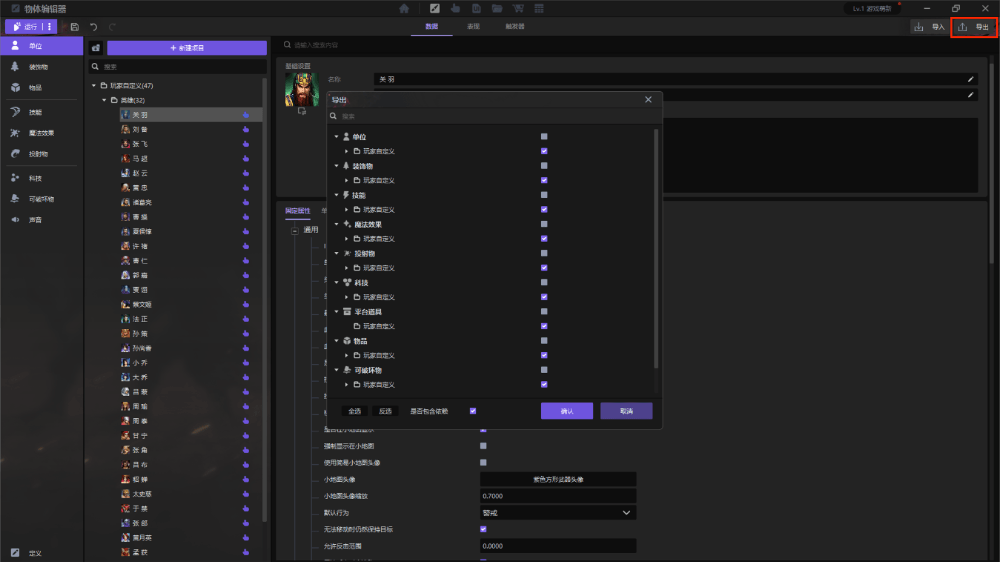
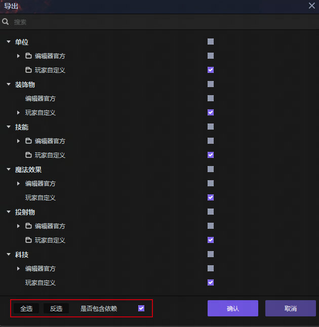
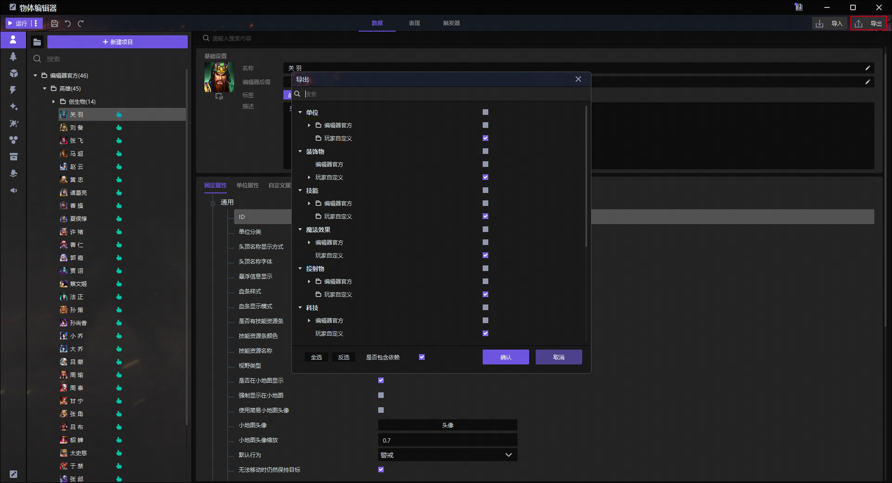
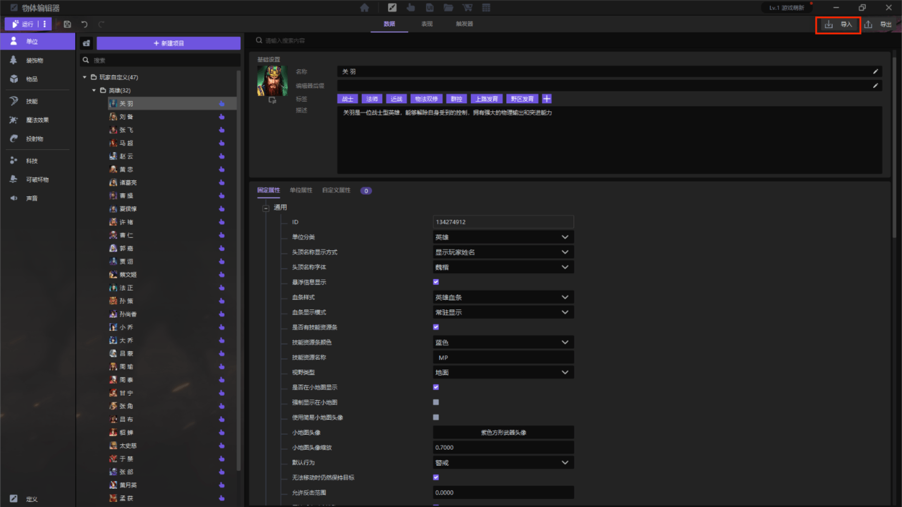
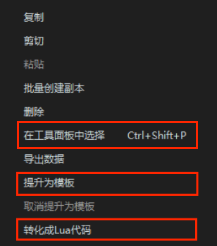

import { Callout } from 'codesandbox-theme-docs'

import { FCollapse } from 'components/FCollapse'

# 物体编辑器的复用

**物体编辑器**中的数据可以**导出**到本地，你也可以将**物体编辑器**的数据从本地**导入**，这样就可以在不同的项目里面重复利用已经设置过的物体编辑器数据，也可以方便多人项目合作。

## 导出

选中想要导出的内容，右键点击**导出数据**。

勾选想要导出的数据，界面下方可以选择**全选**，**反选**，以及是否**包含依赖**。

<Callout type="info"> 
 包含依赖：该选项表示是否包括所选对象的附属内容。例如，当导出一个单位的属性时，如果你选择包含依赖，则单位的能力会一起导出。
</Callout>

你也可以点击**物体编辑器**右上角的导出，勾选想要**导出**的数据，同样可以在界面下方选择**全选**，**反选**，以及是否**包含依赖**。

## 导入

点击**物体编辑器**上方的**导入**按钮，选择想要**导入**的文件夹，即会将数据与**实体触发器的**内容合并。ID是物体的唯一标识，如果导入的数据和编辑器内已有的数据拥有相同的ID，则编辑器内已有的数据会被覆盖。

右键点击**摆件**你还可以进行如下操作。

**在工具面板中选择**：跳转到[操作区](../Main_interface/Operation_Area)放置选择的摆件。

**还原属性值**：将当前摆件的属性还原到默认状态。

**还原触发器**：将当前摆件的实体触发器还原到默认状态。

