import { Callout } from 'codesandbox-theme-docs'

import { FCollapse } from 'components/FCollapse'

# 资源管理器

**资源管理器**是用来管理所有项目资源的资源库，包括 [模型](#模型), [声音](#声音), [特效](#特效), [图标](#图标), [鼠标样式](#鼠标样式), [天空球](#天空球)和[字体](#字体), [地形纹理](#图标), [序列帧与AI专区](#图标)。 在编辑器提供的素材之外，你也可以导入本地资源文件，规则请查看[资产导入](../Art-Assets/Import)。

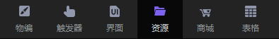

## 资源管理器界面

进入资源管理器后，您可以在窗口的左边查看资源分类。点击**新建文件夹**，通过文件夹对资源进行分类。你也可以在**搜索栏**中输入资源ID，以快速定位资源。点击窗口右上角的**导入**，将本地资源上传到**资源管理器**中。点击**云图标**，查看或隐藏[资源商店](./Asset_Store.md)中的资源。

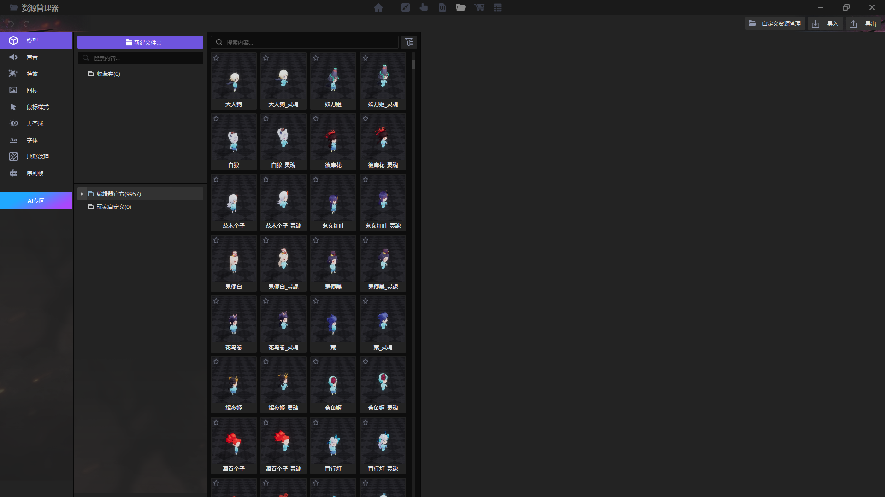

右键单击一个资源，对其进行以下操作： **收藏**，**复制ID**，**剪切**，**删除**，**重命名**，**重置标签**，**创建到物编**和**创建到场景**。**模型**、**音频**和**特效**这三个资源可以快速创建到物编中单位，声音，魔法效果/投射物的玩家自定义栏中。 

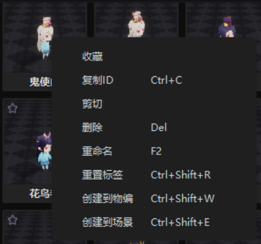

点击右下角的 "+"，为资源设置一个自定义的标签，以便更好地对其进行分类。如果你不再需要这个标签，右击资源的缩略图，选择**重置标签**，那么这些标签将被恢复到默认状态。

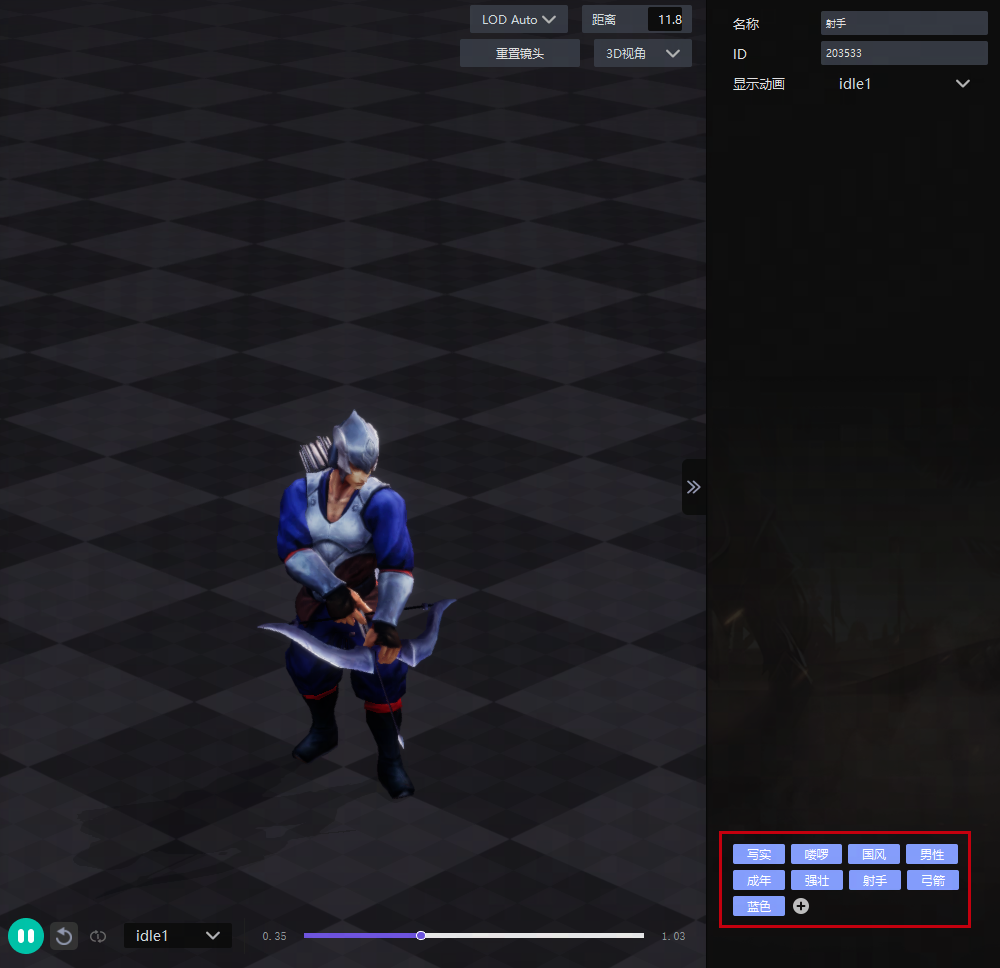

## 模型

你可以在模型选项中查看角色，建筑，树木，岩石，家具等场景装饰物。 

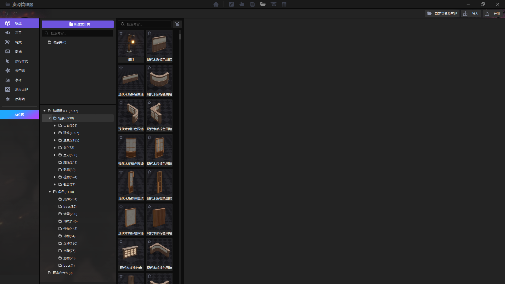

## 音效

编辑器提供了角色语音，主题音乐、环境音效等音效素材供你使用。

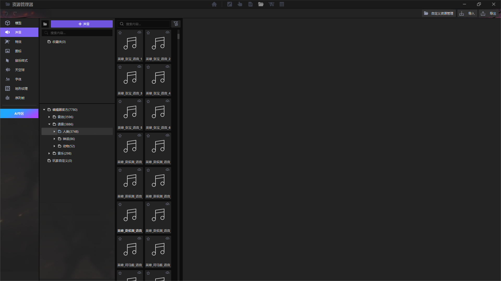

## 特效

编辑器提供的各类特效可以让你的项目更加丰富。

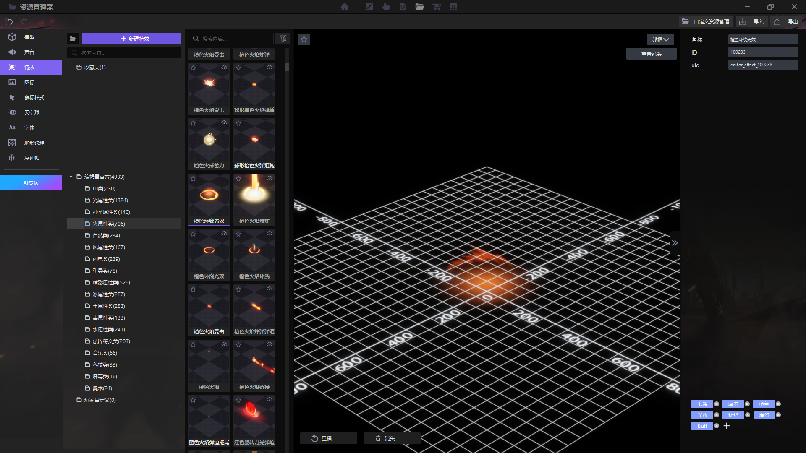

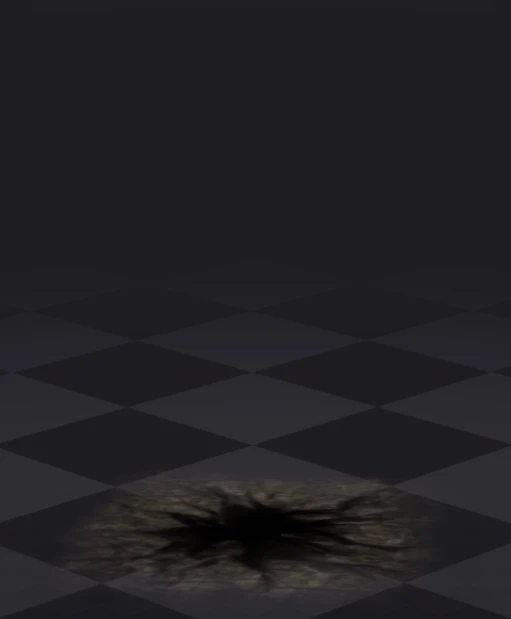

## 图标

这里的图标样式可以用于替换**技能图标**或者**头像图标**。

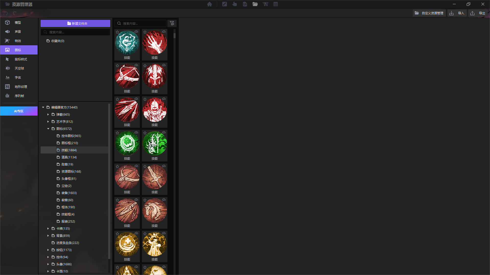

## 鼠标样式

你可以为[细节-美术效果-指示器](../getting-started/artistic-effects)外观中的鼠标样式选择不同的风格。

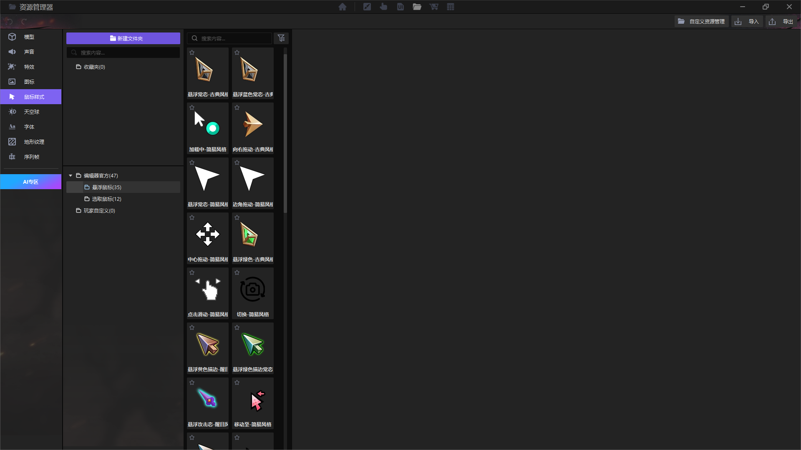

## 天空球

你可以在[细节-美术效果-天空球](../getting-started/artistic-effects)中选择最适合的用于地面之外的空间背景。

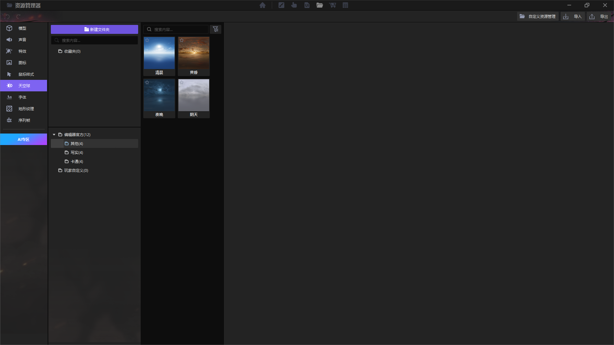

## 字体

这里展示了编辑器所支持的字体。

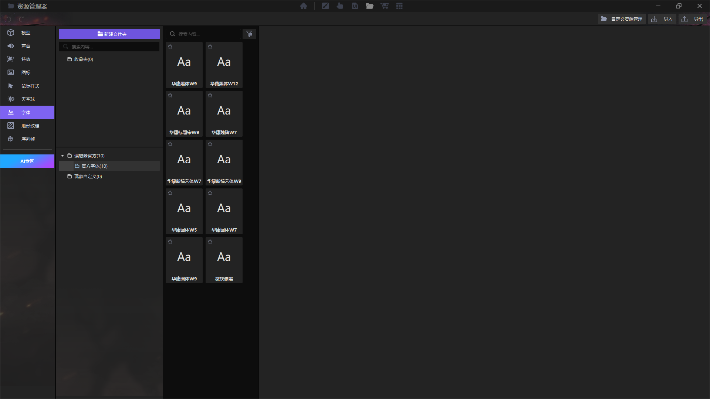

## 地形纹理

这里展示了编辑器官方内置的地形纹理，你可以在地形编辑中进行管理与使用。

## 序列帧

详见[序列帧](../Art-Assets/Sequence-Frame-Animation#序列帧动画)

## AI专区

AI专区支持您根据需求与描述，利用AI技术生成技能图标、立绘与头像。包括**文生图**、**图生图**、**手绘涂鸦**三种途径。

AI生成图片需要消耗灵感币，您可以通过完成成就系统任务来获得灵感币。

