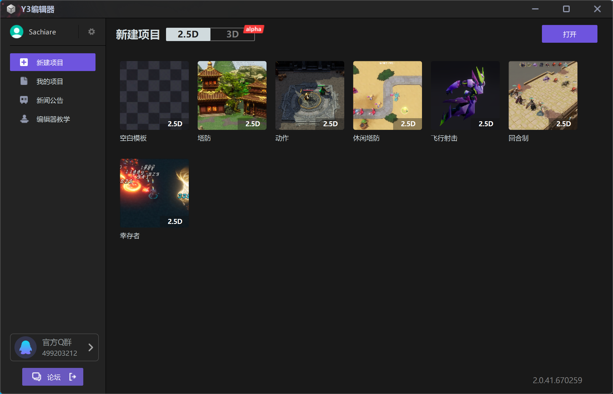
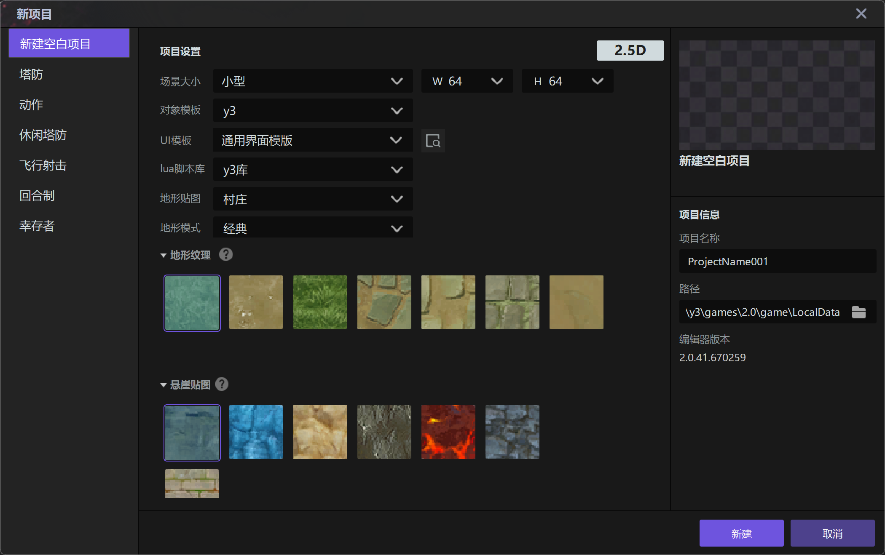
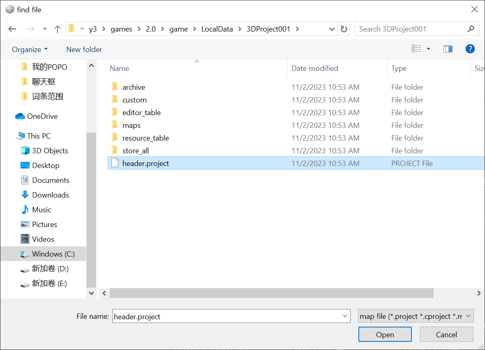
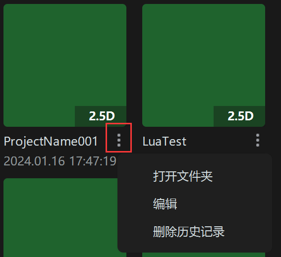

import { Callout } from 'codesandbox-theme-docs'

import { FCollapse } from 'components/FCollapse'

# 启动页

从**启动页**这里开始，你将踏上使用编辑器创作的旅途。使用**地形编辑**让你的项目更加丰富，使用**物体编辑器**设置和管理项目中的物件，使用**触发器**让项目动起来，通过**界面编辑器**使你的项目更加生动，在**资源管理器**中选用丰富的模型、图标、特效。你还可以通过资源商店挑选符合需求的模型，图片甚至触发逻辑进行使用，最后，表格编辑器能够帮助你更好的进行数据管理。让我们开始吧！

## 创建一个新项目

开启编辑器即可进入启动页。你可以点击启动页的“空白模板”选项从零开始新建一个项目，也可以点击选择官方提供的模板，直接进行游玩或为你的项目提供思路与程序基础。

无论是新建空白模板还是使用官方模板，你都可以随意设置你的**项目名称**和项目的**保存路径**。

当你选择创建一个空白项目时，你可以进行以下设置：

**场景大小**：你可以通过下拉菜单设置场景的**宽度（W）**和**长度（H）**，数值越大则场景越大，但是消耗的资源也就越多。当然，进入项目后，你也可以通过[设置-地图大小](../getting-started/size) 进行更改。

**UI模板**：你可以通过**下拉菜单**设置项目中的UI。比如角色信息面板，背包栏等的样式风格。之后也可以在**界面编辑器**中进行自定义修改。点击.可以预览UI风格。

**地形纹理**：你可以通过下拉菜单设置不同的主题，主题预制了默认的地表纹理。选中这一组的某一个纹理后，被选中的纹理会应用到整个地图。后续在项目设计时，你也可以通过[地形编辑](./Main_interface/Tool_Palette)进行修改。

**悬崖贴图**：你选择对应悬崖贴图后，它会成为项目中默认的悬崖贴图。后续在设计项目时，你也可以通过[地形编辑](./Main_interface/Tool_Palette)进行修改。

**地形模式**：你可以通过下拉“地形模式”的菜单设置不同的地形模式，经典模式可以刷出棱角分明的变远，叠加模式则可以叠加多层贴图，画出模糊的边界。

## 打开已存储项目

如果你曾经打开过任意项目，下次进入编辑器就会在起始页看到这些项目，双击即可进入。

你也可以通过右上角的**打开**选项，选中项目文件夹里的header.project文件，启动任一项目。

## 更多设置

点击项目右下角的 ，你可以对当前项目进行更多的设置。

**打开文件夹**: 打开当前项目存储的文件夹。

**编辑**: 打开该项目。

**删除历史记录**: 将该项目从最近打开版块中删除。（注意，此操作并不会删除此项目文件）