import { Callout } from 'codesandbox-theme-docs'

import { FCollapse } from 'components/FCollapse'

# 表格编辑器

表格编辑器是Y3编辑器提供的除了物体编辑器以外的数据管理工具。你可以借由表格，保存一些数据并且快速的调试，这些数据可能是两次技能的公共CD时间、怪物掉落各等级物品的概率、或是在每次刷怪时刷的怪物种类和数量以及允许玩家消灭他们的时间等。

## 表格编辑器的操作

在你第一次进入表格编辑器界面时，可在左上角找到两种表格的创建选项：一维表和多维表。此处还有新建文件夹，搜索，保存，撤销，返回的功能按钮。

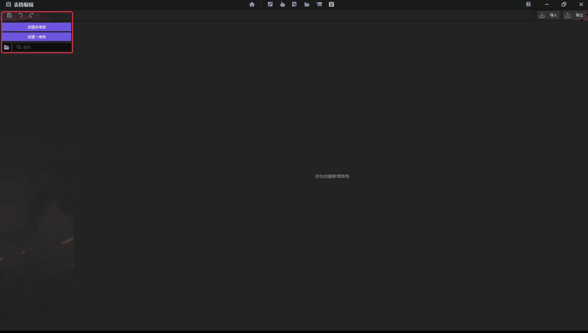

### 新建多维表

使用按钮或Ctrl+M新建多维表。多维表适合定义一种数据对象。假设你正在制作一个《塔防》项目，在第1波次，一共有30只恶魔进攻玩家，玩家需要在60秒内把他们消灭。这里波次有“顺序”、“怪物数量”、“怪物类型”、”消灭时间”四个关键属性，可以使用多维表格管理数据：

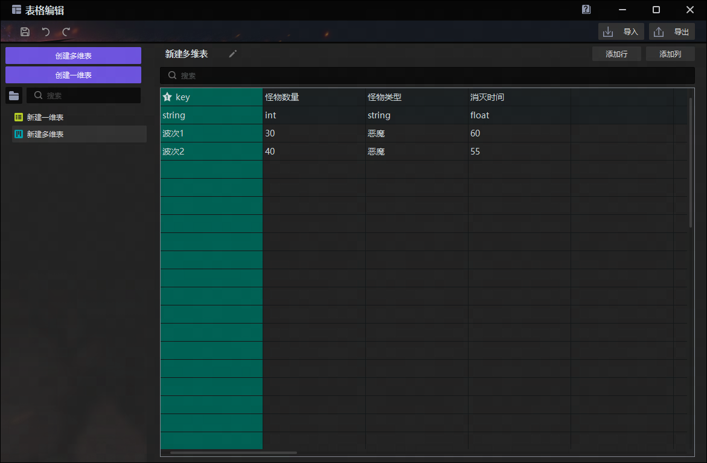

表格中的第一行是这个数据对象的属性名称，分别对应上文中的“顺序”、“怪物数量”、“怪物类型”、“消灭时间”。表格中的第二行是这个属性的数据类型，如果数据类型选错了，那么你可能没有办法在触发器中正确的拿到你想要的数据。你可以在表格中的第三行及之后的行中定义你的数据对象的各个属性。然后使用触发器来调用你在表格编辑器中定义的数据。

### 新建一维表

使用按钮或Ctrl+N创建一维表。一维表适合定义零散的各种数据，比如游戏初始化时的一些规则和参数。假设你的《练功房》项目中一共会有六个房间，你想分配其中有两个房间产出经验，有两个房间产出金币，并且希望在游戏中时间12时开始刷新怪物，14时之后就停止刷新怪物。

由于这些数值关系到项目中设定的经济产出，如果你希望快速地调整这些数值，可以将这些数值保存在一维表格中，如下所示。

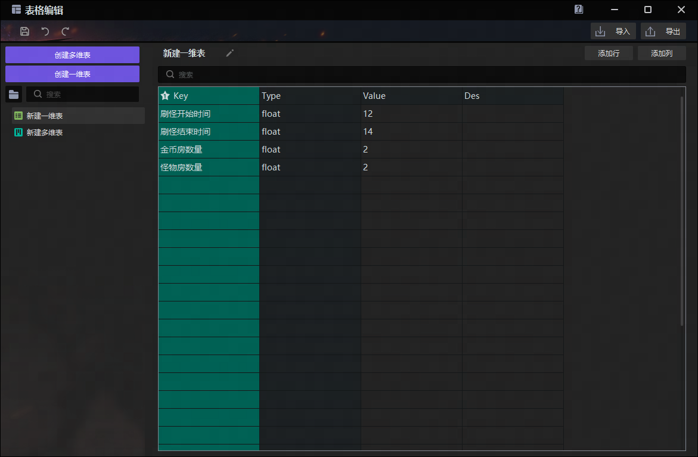

表格中的第一行是每一列内容的标题。第一列是数据的键名，在触发器中通过这个键名可以取到第三列的值。第二列是数据的类型，如果类型不对，可能没有办法按照预期取到正确的值。第三列是数据的值，配置的值应该填在这一列。第四列是备注，可以用于填写该行的数据用途，这在团队开发时是很有用的。

### 选中表格后添加行/列

表格创建后，会自动生成一些可以操作的单元格。当你在同一个表格中需要更多的空行、空列时，可点击右上角两个按钮添加。
注意：一维表不支持列的拓展。该按钮置不可交互。

### 数据验证

标红的单元格意味着该数据无法在局内读取到。若是在你配置过程中出现，可能只是因为你的表格还没有编辑完成而系统提前在验证。

但当你认为完成了数据配置后，仍有单元格标红，可把鼠标悬浮在红框上查看具体原因，如关键数据的缺失或不匹配或重复，再予以修复。

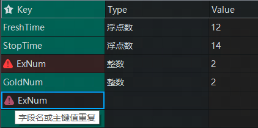

### 重命名、文件夹以及表格搜索
右键点击一张表或选中后按F2可进行重命名。

点击文件夹图标按钮或Ctrl+G则可新建文件夹，用于归类表格。且文件夹里可以再新建文件夹。长按住某文件夹或表格便能拖动，用于调整层级和顺序。
希望在表格中定位与查找时，可在搜索框里输入文字，就会筛选并展示包含指定文字的表。

### 保存与撤销恢复
保存按钮是保存整个工程，而撤销或恢复按钮只针对你在表格编辑器内的操作。

### 删除与复制黏贴
右键点击表格中的任意单元格或者左侧栏或者某一张表，可调出常用功能，如删除表格、删除行、删除列。也支持直接使用快捷键，如Ctrl+C和Ctrl+V对表或单元格进行复制黏贴。

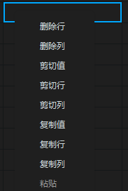

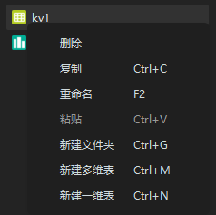

## Excel导入导出
表格编辑器并不支持如office中公式、填充柄、甚至VBA等一些高级功能的应用。对数据配置效率要求较高的开发者，推荐结合Excel和表格编辑器，加上导入导出功能完成批量化的表格修改。比如，搭建数值模型时使用Excel，快速验证调试游戏体验时使用表格编辑器。

你可以在表格编辑器的右上方找到导入导出的功能入口。
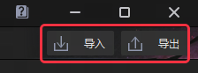

点击导入，你可以选择一个表格文件将其导入至编辑器中，当前支持的表格格式有”.xlsx”,”.xlsm”,”.xls”,”.csv”共四种。识别sheet名时，“config_”开头的sheet以多维表规则读取，“kv_”开头的sheet以一维表的规则读取。

### 多维表导入
1.在导入时识别sheet名，尝试导入文件中所有"config_"作为前缀的sheet表格。 

2.导入时涉及到的公式等特殊格式以结果的值进行读取。 

3.表格的第一行为注释行，不读取。 

4.表格的第二行为数据名，读取后视为列名。 

5.表格的第三行为数据格式，暂支持int,string,float,bool四个枚举类型，枚举支持大小写模糊。 

6.表格的第四行为主键标识，以key1,key2,key3进行枚举，枚举支持大小写模糊。最多支持三键表。需有key1，才能有key2，需有key2，才能有key3，否则报错，不允许导入，如果没有key，则生成一个”key1“列作为主键，int，以行号填写值。

7.第五行之后为表格的数据。 

### 一维表导入
1.第一行为标题行，标题行限定“Key,Type,Value,Des",大小写允许模糊。

2.第二行往后为数据行。

### 导出规则
你可以选择一个路径将编辑器中的表格以允许导入的格式进行导出。

### 导入导出常见问题

Q：导入后原来有值的单元格变空。

A：单元格的数据格式可能和在表格中指定的格式不符。

Q：导入提示错误的键类型。

A：主键的数据格式需要是整型或者字符串型。

Q：导入同名的表格如何处理。

A：同名的表格会在导入时询问是否需要覆盖，如果你不需要覆盖，需要在导入前重命名。

Q：导出的表格在编辑之后所有的列都缩到了同一个单元格中。

A：导出的表格是CSV格式，这种格式方便在github中检查其他协作者修改了什么内容，但是在部分表格编辑器中可能会导致保存的时候损坏的问题，当遇到这种问题，推荐你尝试升级你系统中的表格编辑软件，或者在第一次打开表格后将里面的内容粘贴到单独保存的.xlsx文件里进行操作。

Q：我制作了一个下图所示的结构，为什么我无法获取到正确的值？

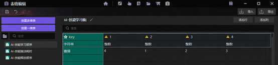

A：字段名的数据类型始终是字符串（string），即使填入数字也依然是字符串。而技能学习顺序是整数值（int），互相切换调用时，注意它们之间的变量类型关系。

## 以触发器指令调用表格数据

你在表格编辑器内定义的表格，在游戏初始化时将会保存在内存中，供你在任意的触发器中调用以运用于游戏。你可以在ECA动作列表的表分类中找到表格的基础方法。

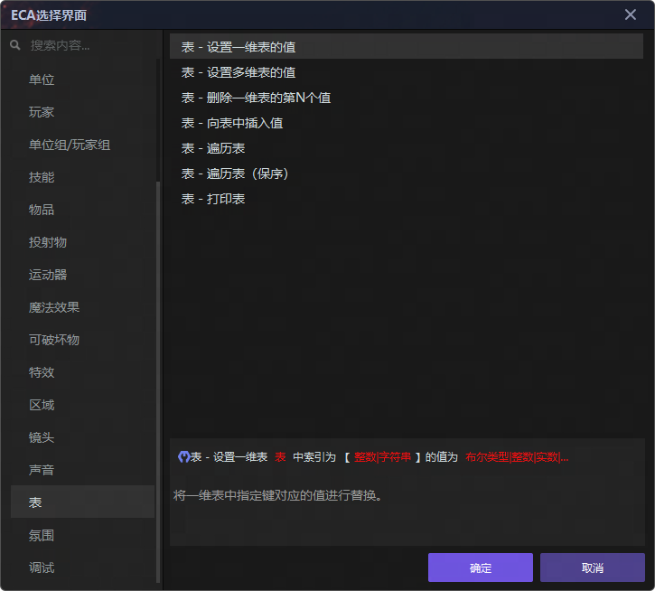

### 一维表用例

当前已经配置了如下的一维表，命名为globalConfig:

可以直接通过Type类型对应的参数类型，在获取到Key对应的Value值，如：
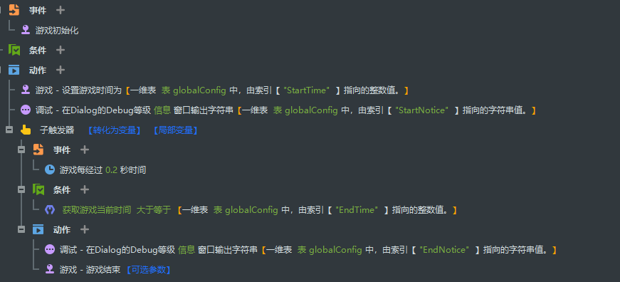

### 多维表用例

当前已经配置了如下的多维表，命名为Example：
 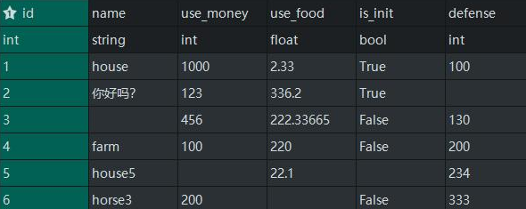

最基础的使用方式为直接获取表格中的值，如我当前需要获得id为1的数据中的use_money字段的整型数据，将其存入变量a中。可以采用这样的方式：
 

更常用的方式为遍历表格，然后用每一行的值去做一些事情，这里需要注意，多维表的每一行都是一个一维表，在遍历的动作中需要用一维表的方式去获取特定的值。
 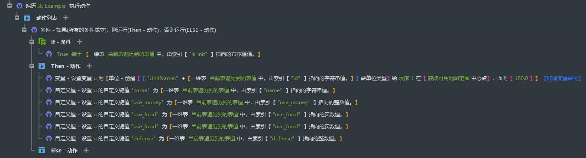