import { Callout } from 'codesandbox-theme-docs'

import { FCollapse } from 'components/FCollapse'

# 触发器

在这一部分，你将学习项目的运行核心之一：**触发器**，并且可以利用其特性和原理，让你设计的项目精彩起来。

触发器是所有逻辑的诞生处，你可以在**触发器**通过**事件-条件-动作**来实现各种效果。即当游戏内发生某些**事件**，且满足一定**条件**后就会触发一些**动作**。

例如：对于**事件**“玩家在聊天框中输入‘加钱’” ，当满足**条件**“玩家阵营是势力1 ”的时候，会产生**动作**“该玩家的金币增加100”。

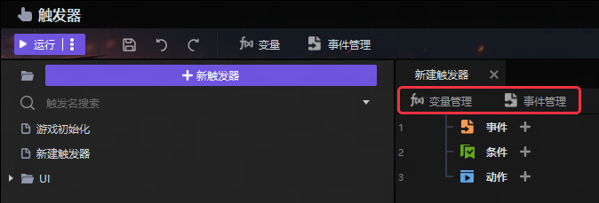

## 触发器的界面

你可以通过点击**编辑器**主界面中的**触发器**或通过[快捷键](../getting-started/hotkeys)**F4**进入触发器。

进入**触发器**窗口后，你可以添加或删除文件夹和触发器，并使用搜索功能快速找到你想找的触发器。

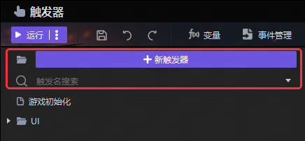

你可以对选定的触发器进行以下操作： **复制**, **剪切**, **粘贴**, **删除**, **重命名**, **禁用**, 和**转化成Lua代码**。

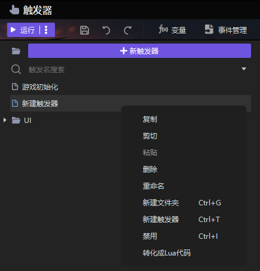

创建触发后，可以在触发编辑区编写和触发逻辑对应的内容。

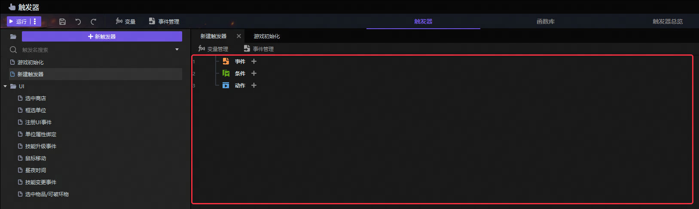

你可以在**变量管理**与**事件管理**中提前写入常用的变量和事件，以便在游戏中随时调用，从而减少开发项目的记忆成本和后期维护成本。

下图为**变量管理**的界面。变量是触发器中最常用到的数据类型，你可以设置各种变量类型以满足项目需求。你可以在**变量设置**中详细了解变量的运用方法。

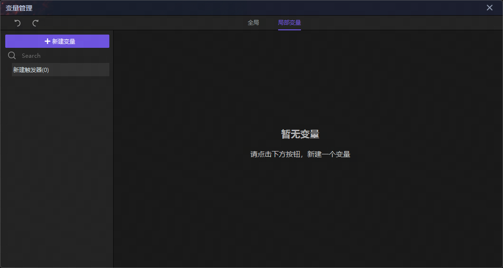

下图为**事件管理**的界面。你可以提前设置事件并添加事件中需要的参数，然后在**触发器-自定义事件**中进行调用。

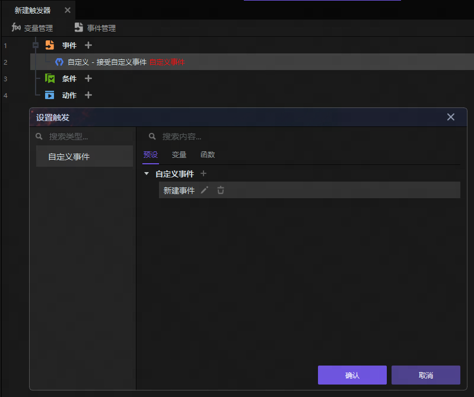

## 触发器的基本结构

一条完整的**触发器**有三个主要部分: **事件**，**条件**，**动作**。

**事件**：事件内容达成时激活这条触发，并开始执行后续设定的条件和动作。如设定开始游戏5秒后，就是当游戏开始5秒之后，该条触发被激活，每一个触发器只能有一个事件语句。

**条件**：触发事件激活后，后续动作所必须满足的特定条件。一个触发器可以设定多个条件，只有满足条件设定要求，才会向下执行游戏逻辑。

**动作**：激活事件，满足条件后发生的游戏逻辑。

例如一条触发器中的三个主要部分如下。

**事件**：某比赛的裁判发射信号枪。

**条件**：小明是赛跑者。

**动作**：小明开始跑。

我们通过以上的**事件-条件-动作**逻辑拆分了整个故事，也就利用触发将整个事情在编辑器中运行起来。

事件/条件/动作的编写顺序没有硬性要求，三者的编辑方式基本一致，但建议从上到下依次书写，这样更符合逻辑顺序，并且上游内容的变更可能会影响到下游内容的实现。

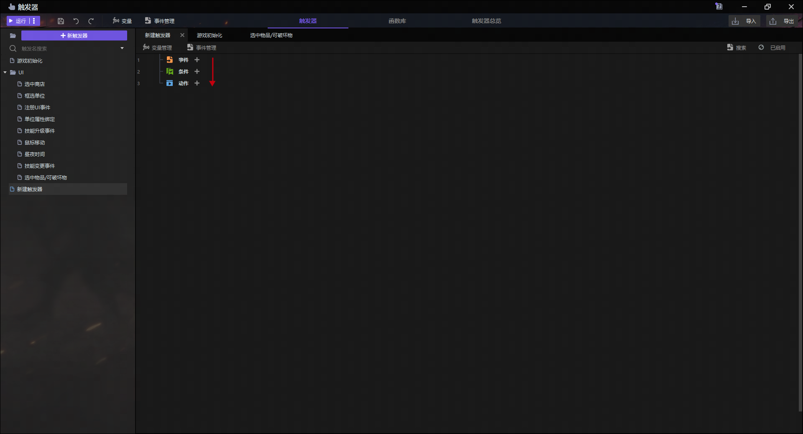

## 新建与更改语句

点击**事件/条件/动作**后面的"+"为当前部分新建语句，也可以在空白处点击鼠标右键，新建**事件**，**条件**，**动作**，**子触发器**与**注释**。

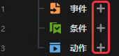

如果想要更改已有的事件，条件或者动作，双击对应语句即可弹出选项窗口，选择新的内容后即可进行覆盖。

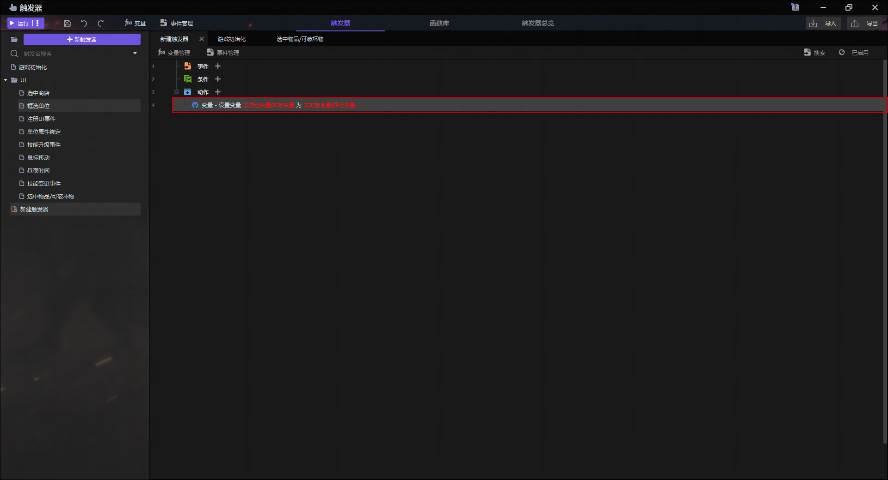

你可能会发现，语句中有些参数是存在空缺的，可以查看**参数设置**了解这些参数的填写规则。

## 添加注释

可以在每一条触发语句上方添加注释来解释或记录相关信息，注释并不会影响运行逻辑，只是作为记录和解释说明。注释可以方便不同的开发者对大型作品工程文件的维护和迭代。

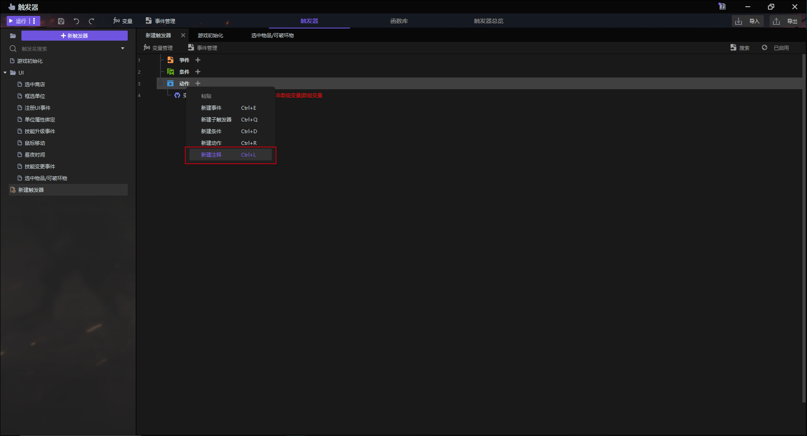

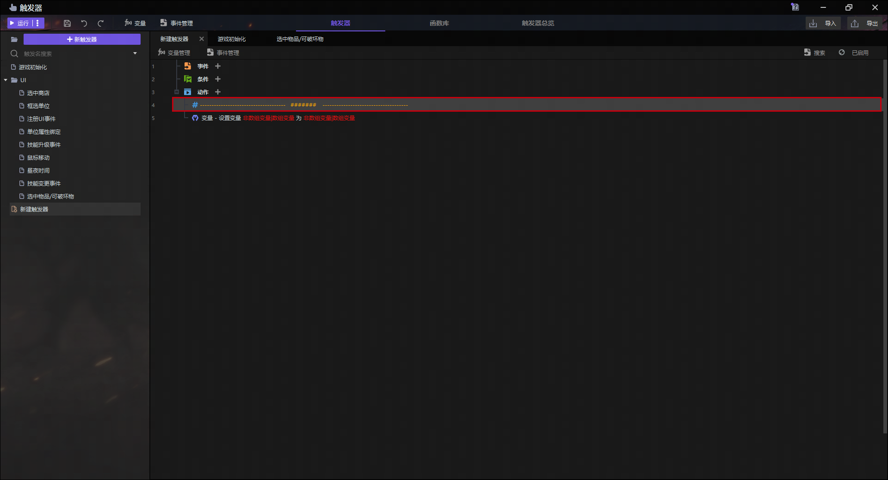

## 实体触发器

实体触发器的优势在于它可以更简单地将逻辑和目标物体绑定，而与其他摆件无关，并且可以更少地消耗性能。

你可以在**物体编辑器**的**触发器**中进行逻辑编写。实体触发器的编辑模式与之前所讲的触发器操作一致。实体编辑器中一个摆件可以设置多条触发。

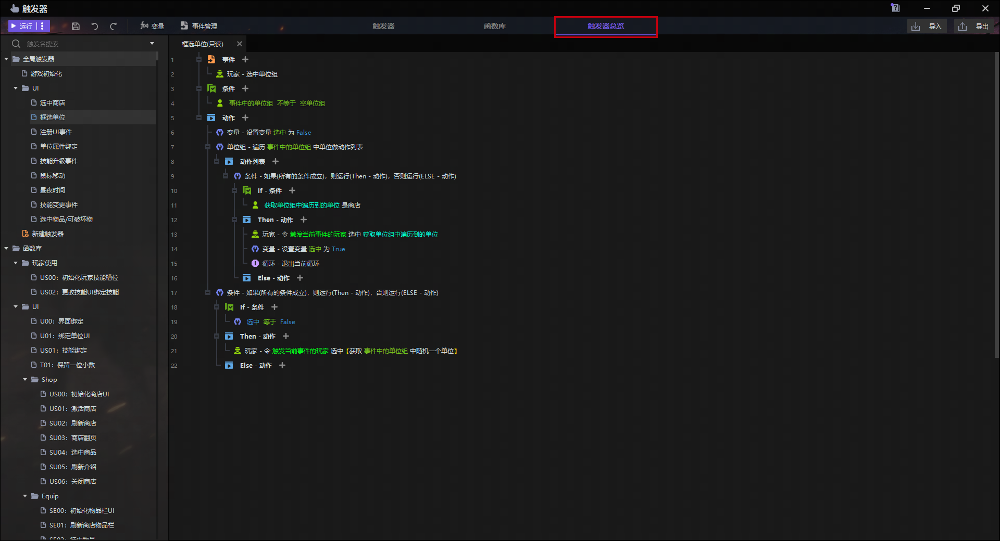

## 函数库

你可以将自己常用的触发器语句转换成逻辑库函数以供重复使用。在**函数库**添加语句后，你就可以在触发器中找到该函数语句并直接使用。与触发器的操作逻辑相同，在左侧创建函数后，在右侧编辑功能库函数。

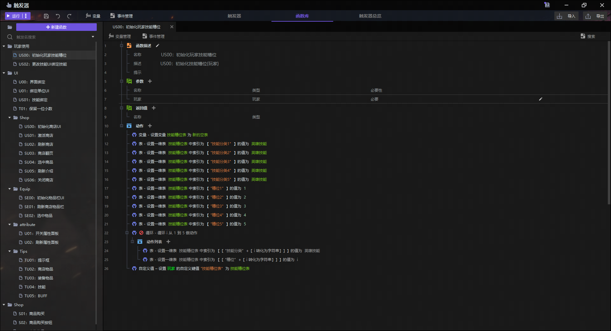

## 触发器复用

也可以将触发器导出到本地文件，方便你复用或在多人情况下进行文件合并。在触发器中选择想要复制的触发进行复制，这条触发器的源代码内容会写入到粘贴板中，此时可以在记事本等文本文件中进行粘贴保存。
你可以打开其他项目，将触发器的源代码内容复制到粘贴板，在触发器界面选择右键粘贴或按下快捷键Ctrl+V即可。

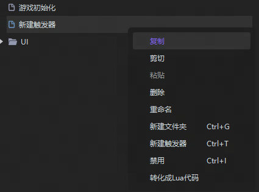

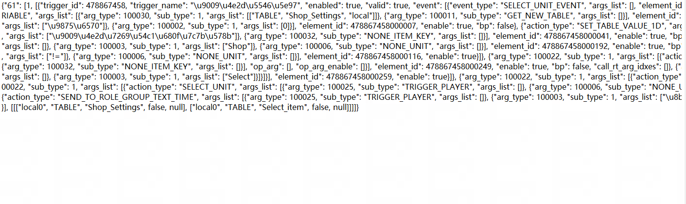

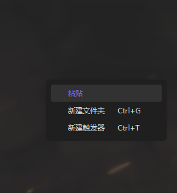