import { Callout } from 'codesandbox-theme-docs'

import { FCollapse } from 'components/FCollapse'

# 属性

用于调整当前所选**控件**的各项属性，包括**基础属性**、**坐标**和**尺寸**、**图片样式**等。

## 基础属性

**控件类型**： 所选控件的类型。

**控件名称**： 所选控件的名称。

## 常规属性

**是否拦截**： 对于有面积的控件，你可以设置该小部件是否阻止玩家对游戏用户界面的操作。

<Callout type="warning"> 
注意：对于没有面积的控件，如节点，自身不会接受到触碰，因此对其设置是否拦截没有实际作用。
</Callout>

**是否可见**：默认为可见，取消勾选以后控件变为不可见（可通过[触发器](../Trigger.md)编写代码切换指定控件的可见状态）。

**可拖动**：是否可以直接拖动。

**hover反馈事件**：设置控件悬停事件。

**控件适配**：设置该控件相对于父级图层的位置。

<Callout type="warning"> 
注意：只有当控件适配选项被开启后，相对父级位置的设置才起效 
</Callout>

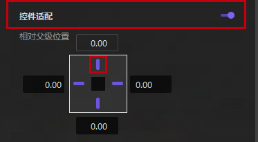

## 坐标和尺寸

**坐标**：控件在当前画布中的横纵坐标。

**尺寸**：控件当前大小。

**锚点**：设置控件锚点坐标。

**旋转**：控件旋转角度。

**缩放**：控件放大或缩小的比例。

**不透明度**：提供透明度设置。

## 特殊属性

接下来的属性会根据控件的类型有所区别。

### 空结点

**是否截图**：当空节点有附属图层时，可以选择空节点是否作为遮罩蒙版。

**裁剪模式**：分为框体裁剪和像素裁剪，根据遮罩贴图的框体或者像素点进行裁剪。

**颜色**：节点所覆盖区域的背景色。

**遮罩贴图**：选择遮罩蒙版的形状。

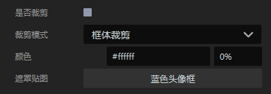

### 按钮样式

**快捷键/组合快捷键**：可以选择是否可以通过**快捷键/组合快捷键**选择该按钮，还可以选择该按钮是使用图片作为按钮样式还是使用颜色进行填充。 

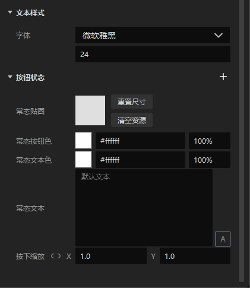

**常态贴图**：设置按钮的背景贴图。

**常态按钮色**：设置按钮在常态时的颜色。

**常态文本色**：设置按钮在常态时文本的颜色。

**常态文本**：设置按钮在常态时的文本内容。

**按下缩放**：左键点击按钮时的按钮缩放比例。

**文本样式**：按钮上的文本字体。

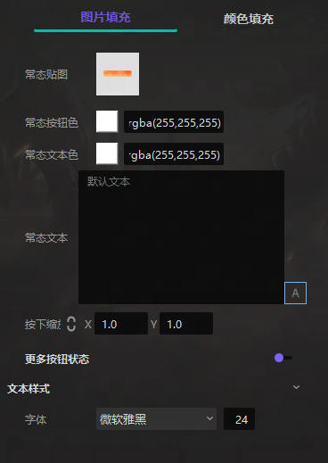

**更多按钮状态**：点击按钮状态左侧的加号，可设置在悬浮、按下、禁用状态下的按钮图、文本颜色与文本内容。

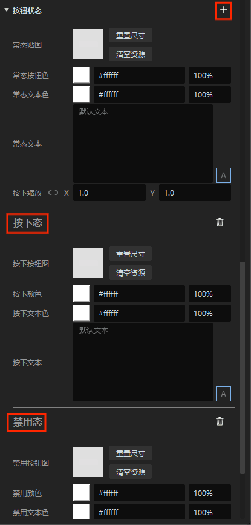

### 图片样式

**背景图片**：选择你想要的图片。

**图片颜色**：可对图片进行颜色遮罩。

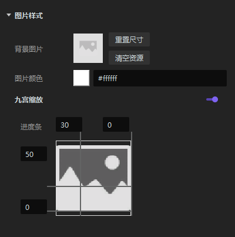

**九宫缩放**：开启该功能后，可以将一张完整的图片按照格数（不限于9格）切分，并可以对每格中的图片进行单独缩放，而不影响整体图片的尺寸。

### 模型样式 

**模型**：从[资源管理器](../Resource_Manager.md)中导入模型。 

**常态动画**：设置模型动作。

**背景颜色**：设置模型背景颜色。

**镜头模式**：可选择自定义模式、智能全身模式与智能头像模式，使用自定义数据或预设数据。

**相机坐标**：设置视角相机相对于模型的坐标。

**摄像机视口**：设置摄像机与模型之间的距离。

**旋转角度**：以x、y、z三个角度共同设置模型旋转角度。

**焦点坐标**：以x、y、z三个角度共同设置模型焦点坐标。

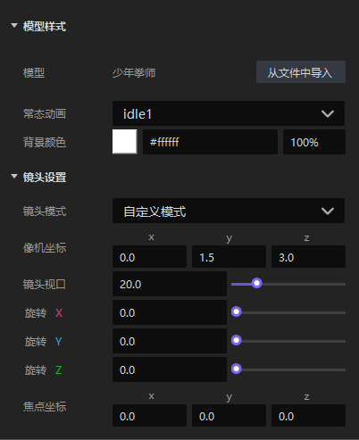

### 文字样式

**文本**：设置文本内容。

**字体**：设置文本字体与字号。

**字体颜色**：设置文本颜色。

**对齐方式**：设置文本在文本框内的对齐方式。

**间距**：设置文本的行间距与字间距。

**文字效果**：设置文字的加粗、斜体、下划线、阴影。

**超框处理**：当文字量超过文本框时的处理方式，可以选择截断文本或者自适应字体。

**文本动画**：可以选择文本出现时文本是否有动画，比如逐字显示及其时间间隔。

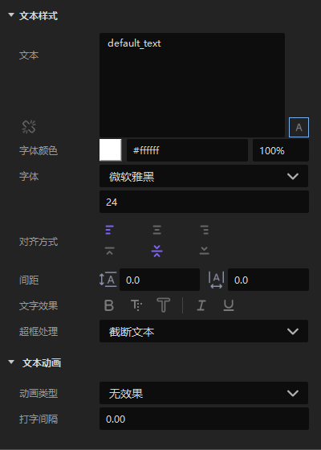

以下为输入框特有属性

**提示文本**：设置提示文本的内容。

**提示颜色**：设置提示文本的颜色。

### 进度条样式

你可以通过**进度条类型**设置进度条的显示类型，如条形或者环形。进度条可以用**图片填充**或是**颜色填充**。

**图片填充**

**背景图片**：设置进度条背景颜色。

**进度条图片**：设置进度条背景图片。

**最大值/当前值**：设置进度条的进度。

**是否反转**：改变进度条的方向。

**九宫缩放**：开启和关闭九宫缩放功能。

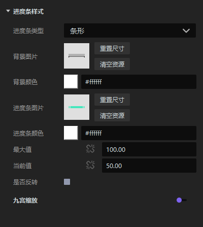

**颜色填充**

**背景颜色**：设置进度条背景颜色。

**进度条颜色**：设置进度条颜色。

**进度**：设置进度条进度。

**是否反转**：改变进度条的方向。

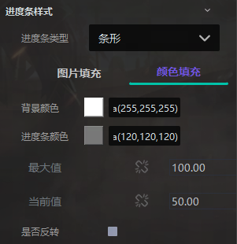

### 滑动条样式

**进度**：设置滑动条的进度。

**背景颜色**：设置滑动条背景颜色。

**进度条颜色**：设置进度条颜色。

**滑块默认颜色**：设置滑块默认颜色。

**背景图片**：设置滑动条背景图片。

**进度条图片**：设置进度条图片。

**滑块默认图片**：设置滑动条上滑块的默认图片。

**滑块缩放**：设置滑动条上滑块的缩放比例。

**更多滑块状态**：设置滑块在悬浮、按下、禁用时的状态。

**九宫缩放**：开启或关闭九宫缩放功能。

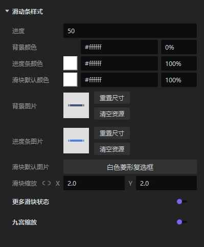

### 列表

**布局方式**：设置列表布局方式。

**反向排布**：设置列表排布方式是否反向。

**跳过隐藏控件**：列表是通过子控件填充的，当列表中的某个控件被隐藏时，如果你勾选跳过隐藏控件，则列表中不会显示该控件的任何痕迹；如果你不勾选跳过隐藏控件，你将在列表中看到该控件的存在，但看不到该控件的具体内容。

**切分**：支持对列表进行切分。

**背景图**：设置列表背景图。

**背景颜色**：设置列表背景颜色。

**禁止滚动**：开启或关闭列表滚动功能。

**控件间距**：设置列表内各节点的间距。

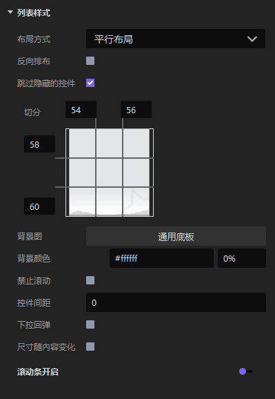