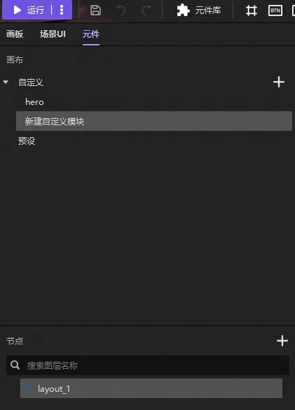
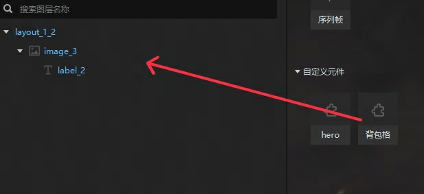
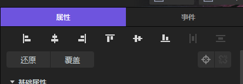
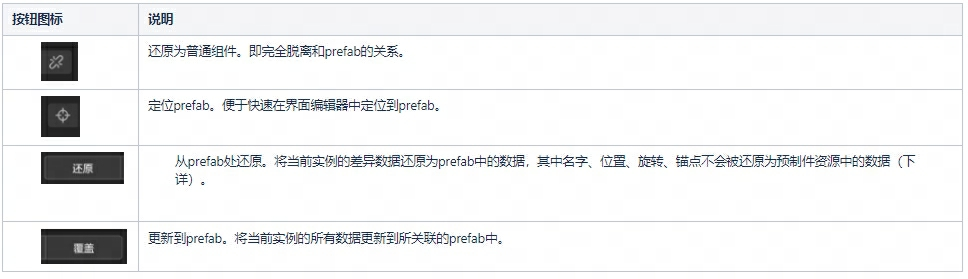
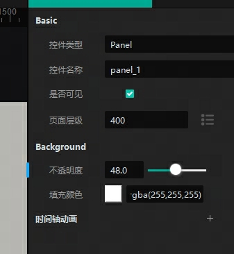
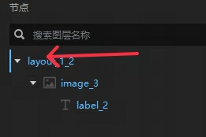
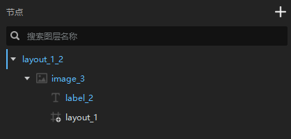
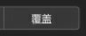

import { Callout } from 'codesandbox-theme-docs'

import { FCollapse } from 'components/FCollapse'

# 元件
在物体编辑器中，我们创建了一个物件之后可以反复的使用它，同样的，在界面编辑器中，可以使用元件（prefab）来复用相同或者相近的界面控件。
例如当制作背包功能时，每个背包格都是同样的功能可以进行复用，可创建一个背包格作为元件。

将其复制多份放入背包中。以后修改只需要在元件中进行修改，修改会自动同步到所有元件实例中。

元件（prefab）的创建与修改
## 创建
在元件中创建空的自定义模块即可
注意，1个元件下只有一个根节点，多个根节点无效，保存时只存第一个根节点。

## 修改
在元件中可进行各类UI编辑，保存后将根据差异替换至所有该元件的实例中

*与实例的非差异部分会同步替换

差异部分则不替换

差异内容的判定见下文

# 元件的实例的创建与显示
把自定义元件拖到画布中即可创建元件的实例，实例创建后在左侧列表显示为下图

元件也支持复制粘贴

元件实例在画板中显示为蓝色

此外，prefab实例的根节点处置顶显示4个按钮

还原、覆盖、定位和解绑

可根据需要修改实例以及同步到元件中

# 元件的实例与Prefab的差异与显示
## 差异说明
修改实例时，将会引起内容与Prefab中内容有变化，当进行还原或者覆盖操作时，可以将差异部分还原或者覆盖，非差异部分不会还原/覆盖。
以下的内容会引起差异：

1、prefab的属性值变化，例如（可见性、字色等等） 其中，有些特殊内容不会引起差异例如：

a. 修改Prefab名称（仅指Prefab根节点，如果修改子控件的名称会引起差异）

b. 修改prefab的rect transform中的位置、旋转、锚点、相对父级适配

*开发者注：不会引起差异的内容是因为设计上实例就是需要提供此类与元件不同之处以方便复用

2、添加子控件
## 差异的显示
1.属性值的差异变化显示在右侧属性列表中

以蓝色标注差异

例如实例的不透明度为48，prefab为100，则左侧显示蓝色标记，表明此内容进行了修改

同时左侧列表中，在实例的根节点处，出现蓝色标记，表示存在差异

2.添加子控件的差异变化，显示在左侧列表中

子控件处会显示“+”号角标

# 元件实例的覆盖（override)
实例覆盖允许玩家修改实例后，应用到prefab上
覆盖需要玩家手动操作，未操作的内容仅作为实例存在
点击进行覆盖

覆盖操作的执行顺序如下：

step1:检测该实例和prefab间的差异，将差异部分覆盖至prefab

step2:检测覆盖后的prefab和其他实例之间的差异，将非差异部分覆盖至其他实例

例如，prefab中某子控件的文字色为黄色，a实例中为蓝色，b实例中为黄色，c实例中为红色

在a实例中override到prefab后 ， prefab变为蓝色，a实例蓝色，b实例蓝色，c实例为红色。

# 其他
## 元件实例的还原（revent)
修改实例后可以点击revent从prefab出还原

还原时还原差异部分内容，非差异部分不做还原
## 元件实例的禁止操作
不允许在实例中删除从prefab中创建的子控件

不允许在实例中更改从prefab中创建的节点的层级关系