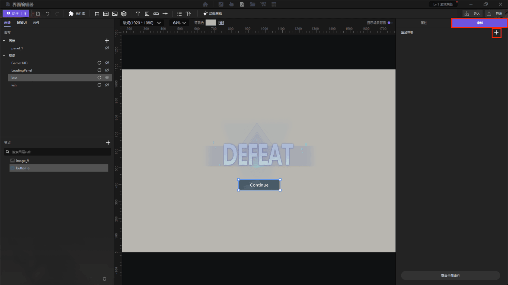
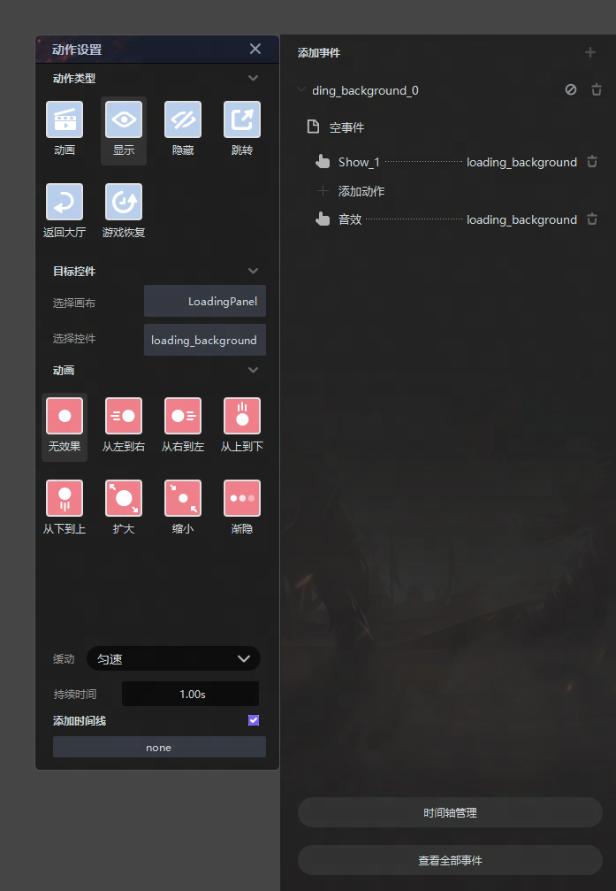
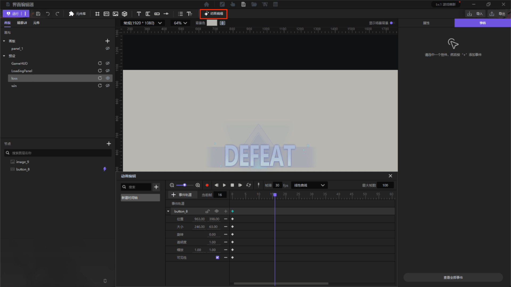
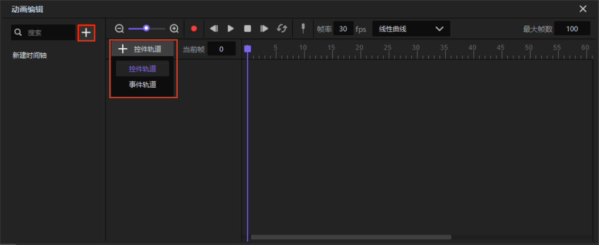
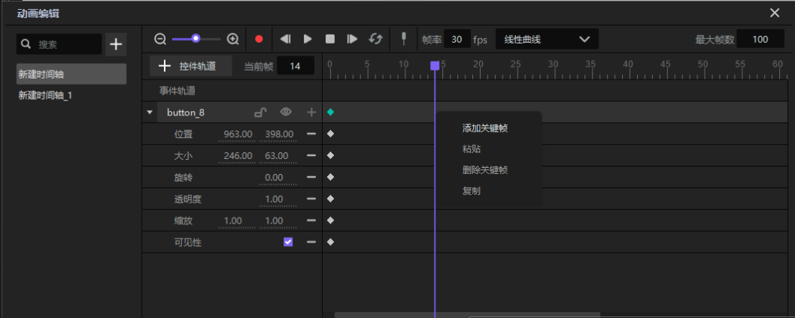
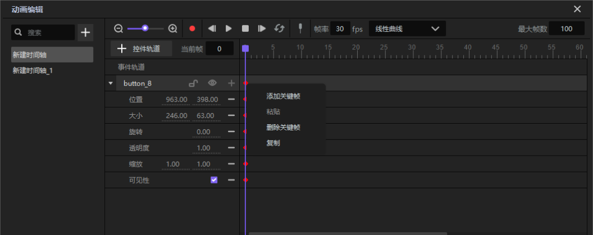
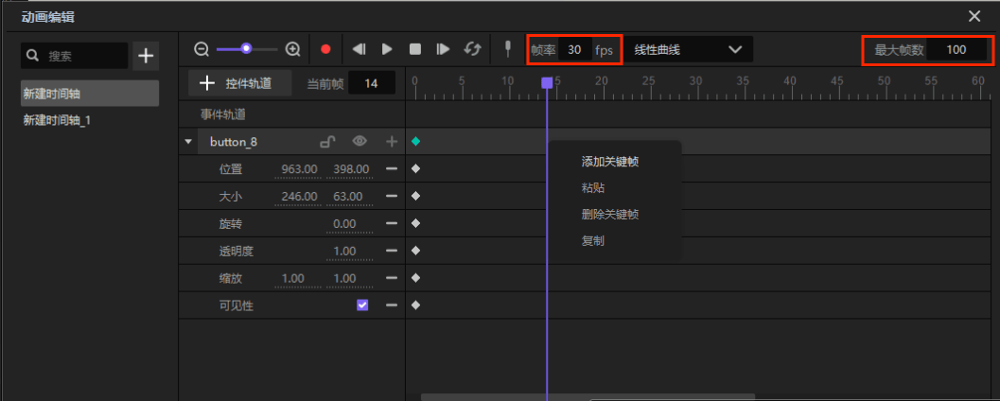

import { Callout } from 'codesandbox-theme-docs'

import { FCollapse } from 'components/FCollapse'

# 事件

在**事件**调色板中，你可以调整所选**事件**的动作和声音。

从左边的小部件调色板中选择一个小部件，然后点击事件调色板右上角的 "+"，为所选小部件添加一个交互式**事件**。

点击**事件**下的**添加**，将弹出**动作设置**调色板，你可以设置**动作类型**、**目标部件**和**动画**。要创建复杂的粒子，点击底部的**时间轴管理**来添加时间线。

<Callout type="warning"> 
 注意：时间轴和动作设置板块中的动画效果互相排斥，如果在动作设置板块中选择了一个动画效果，则时间轴不生效。
</Callout>

## 动画编辑

通过**动画编辑**，你可以对事件与控件进行时间轴动画编辑，让画布上的**控件**以一种安排好的方式播放。

点击**动画编辑**，在弹出的窗口中点击加号添加动画组，并添加对应的**控件轨道**或**事件轨道**，即可开始制作帧动画。

在时间轴中你想添加关键帧的地方右键单击鼠标，在弹出的菜单中添加关键帧。

选中时间轴中已存在的关键帧，右键单击鼠标，可以在弹出的菜单中对其进行删除关键帧、复制、粘贴操作。

:  加入关键帧，或可通过快捷键K加入关键帧。

: 播放当前动画。

: 暂停播放。

:点击此按键表示开启循环播放，再次点击  可循环播放。循环播放过程中可点击, click  取消循环。

**帧数/帧率**：通过输入数值来调整动画的帧数和帧率。

