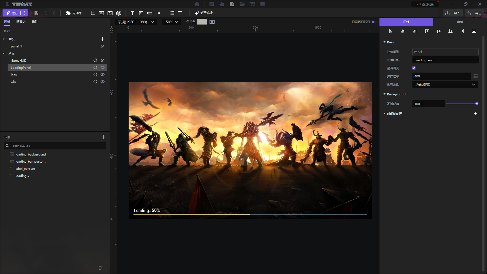
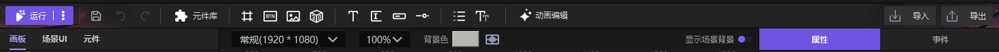

import { Callout } from 'codesandbox-theme-docs'

import { FCollapse } from 'components/FCollapse'

# 界面编辑器

**界面编辑器**中包含针对项目GUI （Graphical User Interface,图形用户界面）的各种编辑方法，可以丰富游戏玩家的视觉体验。**界面编辑器**由[导航栏](#导航栏)、[画板](./Panel#画板)、[界面模块](./Widget#控件)、[场景UI](./Scene_UI#场景界面)、[控件](./Widget#控件)、[元件](./Components#元件)、[画布](./Convas#画布)、[属性](./Attributes#属性)、[事件](./Events#事件)组成，每个部分层级关系明确，只要设置得当，就可以做出任何界面效果，甚至可以实现纯2D游戏。

## 导航栏

**运行**: 点击运行，你可以直接在界面编辑器内运行项目。

: 保存项目。

: 撤销上一步的操作。

: 在已有撤销操作的情况下，恢复上一步撤销的操作。

**导入**: 导入素材。

**导出**: 导出当前**界面编辑器**。

**背景色**: 画布背景色。

**画布比例**: 当前画布尺寸。

**缩放**: 画布在主界面内的尺寸缩放比例。

**显示场景背景开关**：开启状态下，画布背景色将显示为透明，并将场景显示为画布背景。

**动画编辑**：可设置控件与事件的时间轴动画。
