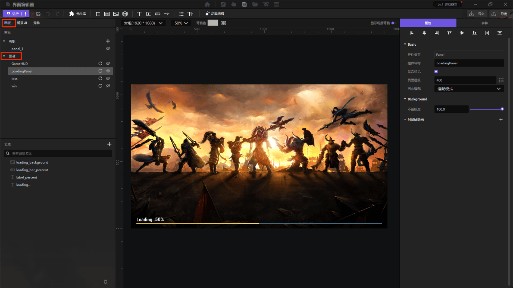
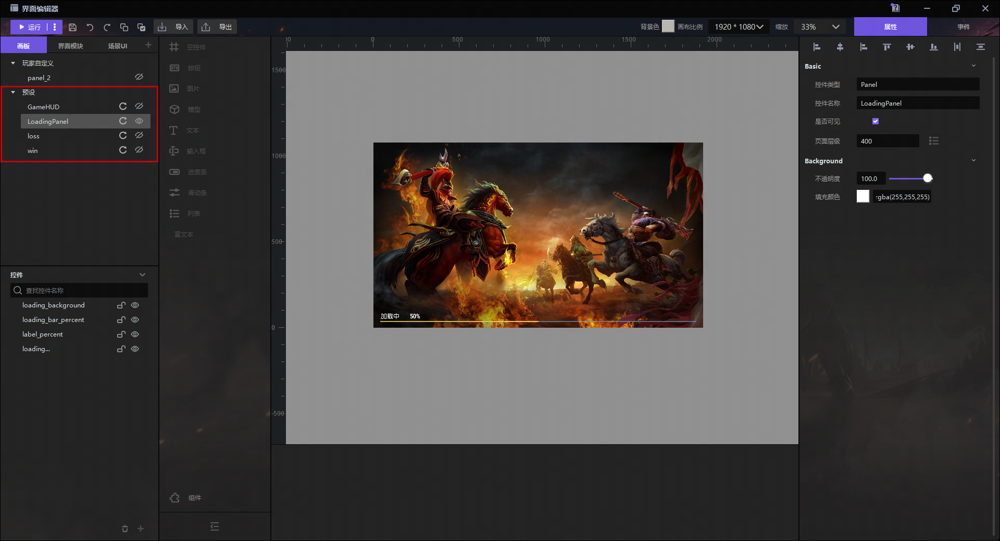
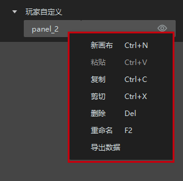

import { Callout } from 'codesandbox-theme-docs'

import { FCollapse } from 'components/FCollapse'

# 画板

**画板**是绘制平面UI的地方。**预设**是预设的界面，包含预设的内置程序，可以直接和**单位**进行挂钩，比如**血条（Health Bar）**、**名称**等，不需要另外再编写ECA。

**预设面板**： 预设了四个画板，包括**GameHud**、**LoadingPanel**、**Loss**和**Win**。

**功能菜单**: 鼠标右键点击画板名称，展开功能菜单。对于预设的画板，在功能菜单中只能导出数据。

**新建画板**: 点击 "+" 或者鼠标右键点击**界面**，在弹出的功能菜单中点击**新画布**选项。

<Callout type="warning"> 
注意：在开始设计一个界面之前必须先创建一个画板。
</Callout>

