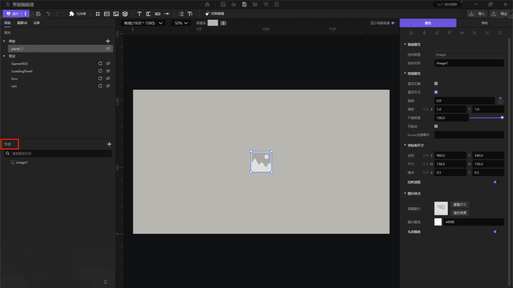

import { Callout } from 'codesandbox-theme-docs'

import { FCollapse } from 'components/FCollapse'

# 控件

**节点**板块中展示了每个画板里的**控件**。你可以在这里对控件进行重命名，对控件的层级进行**调整**，**添加**，**删除**操作。

**列表展示**: 点击 收起、展开控件区域。

**控件名称**: 双击文本部分可以为控件重命名。

**可视**: 设置该控件是否在画布中可见表示可见，表示不可见。

<Callout type="warning"> 
注意：如果层级较的高图层被设为不可见，层级较低的图层被设为可见，那么整个图层以较高层级图层的设置为准。
</Callout>

**锁定**:  表示层级未被锁定，表示层级被锁定，此时你无法改变或者编辑该层级。

**添加**: 点击可以在本画板内新增控件。

**删除**:点击可以删除当前选中控件。

**功能菜单**：右键点击控件名称可以展开控件的功能菜单，你可以复制、粘贴、删除控件，也可以对控件进行重命名、复制路径，或者将控件转化为**元件**。

