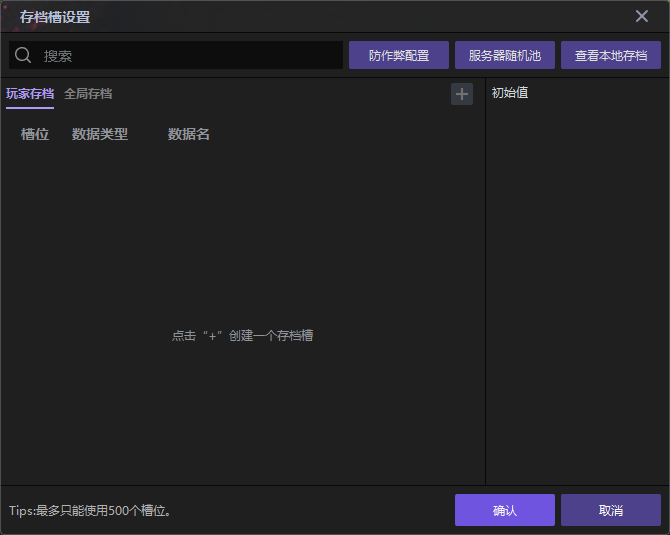
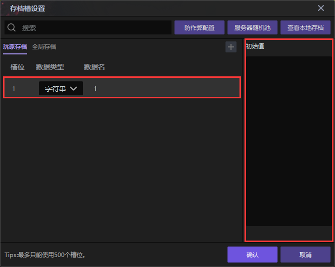
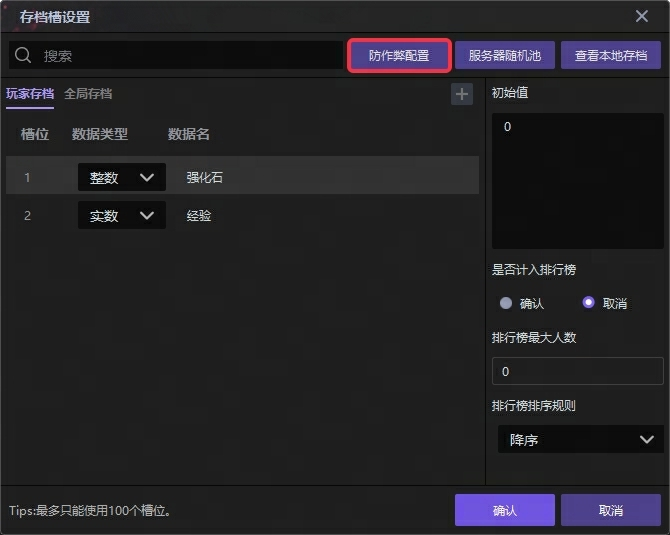
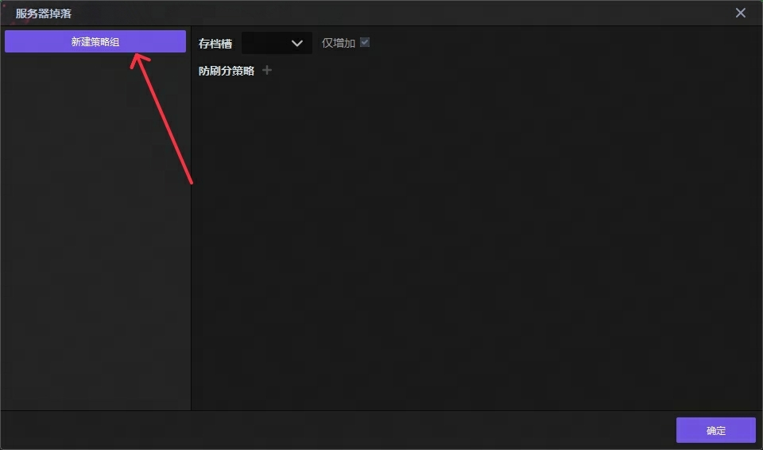
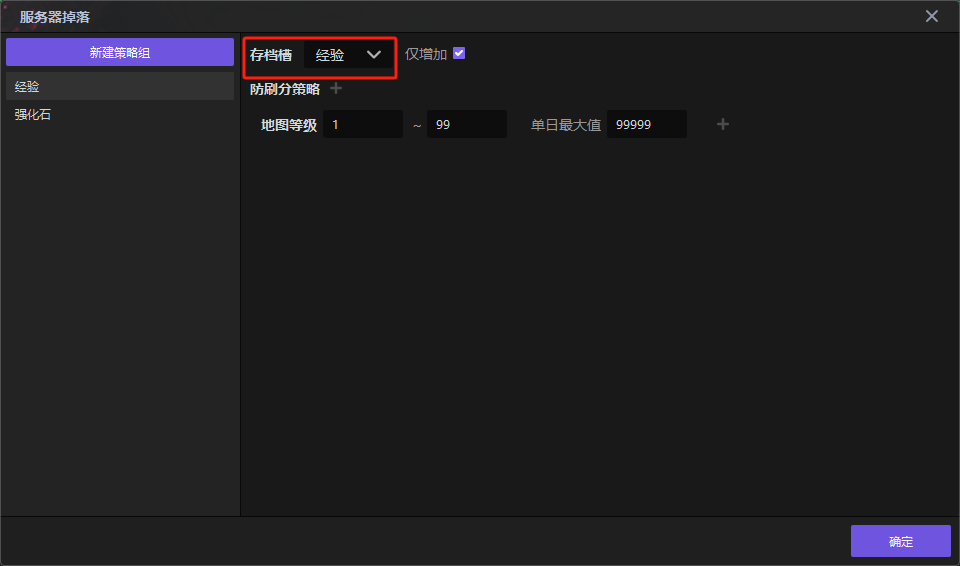
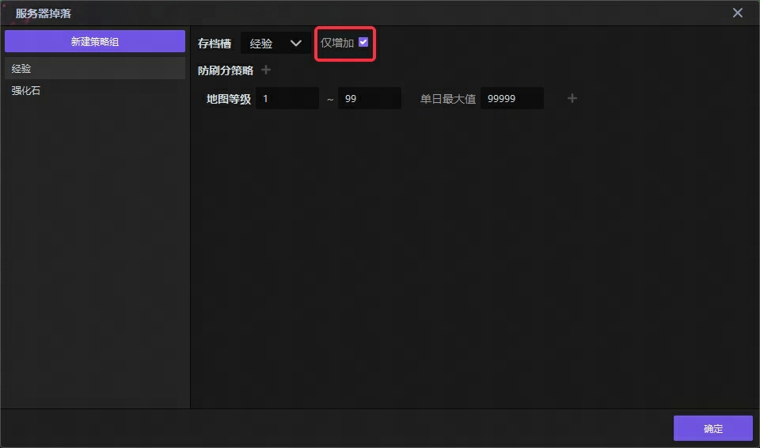
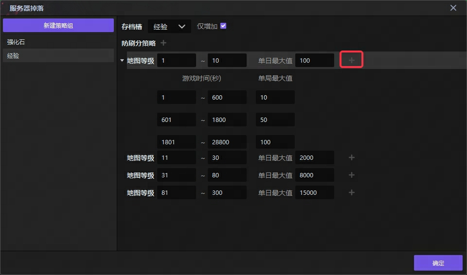
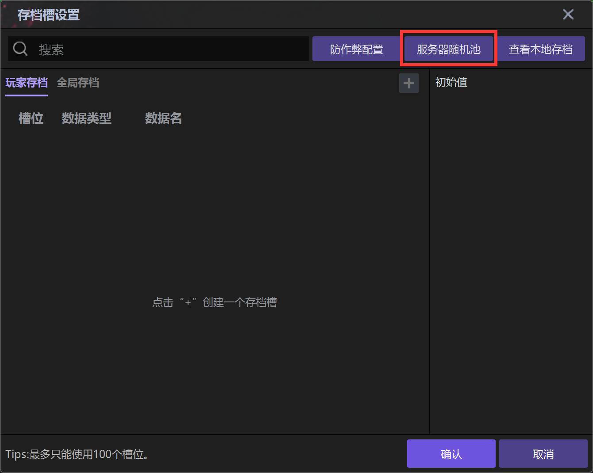
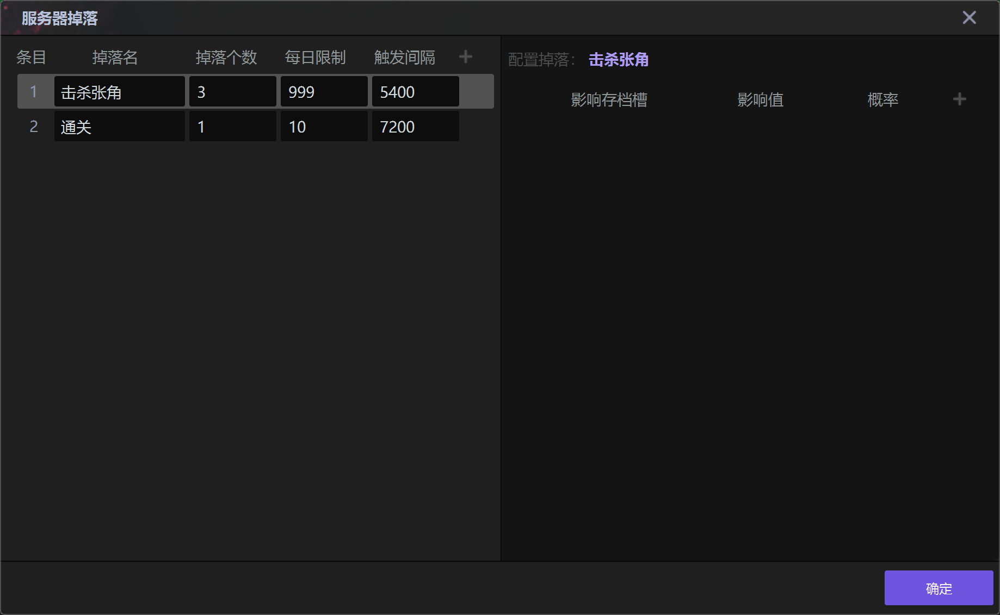

import { Callout } from 'codesandbox-theme-docs'
import { FCollapse } from 'components/FCollapse'

# 存档设置

## 存档槽

RPG需要保存玩家的装备、等级等数据，RTS游戏需要保存关卡等数据。在编辑器中，你可以在**存储槽**选项卡中点击**加号**来设定各种参数，从而搭建项目的存档结构。你还可以通过编写触发器将存档的数据上传到平台的云服务器中，并通过[开发者平台](https://create.reckfeng.com/)来配置存档。

每一行数据，包含**槽位**，**数据类型**，**数据名称**和**初始值**。数据名称和数据类型可以通过双击进行修改，初始值则通过单击添加。

## 防作弊配置
防作弊配置主要用于解决玩家通过本地作弊程序修改与存档有关的内存值，将修改后的结果上报存档服务器落盘导致的存档异常增加情况。

你可以在主界面-细节-存档设置界面中找到这个功能的配置入口。

界面打开后，你可以点击新建策略组来创建一个防作弊策略。

目前防作弊配置只能应用于数值型的存档槽位，且每个存档槽位只能同时被一个防作弊策略约束，**当你没有办法创建防作弊策略时，请检查你的存档槽位是否有尚未配置防作弊策略的数值型存档**。

创建完成防作弊策略后，你可以选中策略条目查看和编辑防刷分的规则，正在编辑的策略对应的存档槽位将会出现在这个下拉列表中。

勾选存档槽右边的仅增加，服务器将会把这个存档槽中所有导致下降的操作否决。

存档槽下面的界面对应着防刷分策略的表单，你可以在表单区域编辑在处于某个地图等级的区间的玩家每天、每局这个存档槽最大的增加量。

点击加号时，将会创建一条约束每日新增的配置。配置规则如下图，语意为在地图等级1-10时，玩家每天经验最多能增加100点。11-30时，每天经验最多能增加2000点，以此类推。

在每天新增上限的基础上，你还可以通过点击每日最大值右侧的加号，创建单局新增的限制，如下图的语意为：玩家在地图等级1-10时，在600秒前结束的游戏，最多只能增长10点经验，在600到1800期间结束的游戏，最多只能增长50点经验，超过1800秒后结束的游戏可以获得最多100点经验。

当玩家的地图等级超过策略配置的最大等级时，他将不再受到防刷分规则的约束。
## 服务器随机池
基于作者手段在客户端发起掉落请求，在服务器执行掉落结果运算并直接落盘在存档中。从而解决缓解掉落内容基于中间变量落盘所产生的安全性问题。
### 入口位置
细节-存档设置-服务器随机池

### 对应ECA
1.存档 - 使【玩家】以【服务器掉落】策略执行服务器掉落，在掉落完成时做动作。

带有动作列表（匿名函数）参数，在服务器对应动作完成后，回调函数到达时执行动作列表的语句。

若发送掉落请求的客户端 不是参数中的玩家，则该请求不生效，但仍会执行动作列表。

2.特殊 - 获取服务器执行结果

仅在1的动作列表中可以看到。 返回整数。0代表成功，1代表不满足触发间隔，2代表不满足每日限制 999代表其他服务器链接问题。

3.特殊 - 遍历服务器掉落结果做动作

仅在1的动作列表中可以看到。带有动作列表（匿名函数）参数，获取方式见4和5。

被遍历的对象为 默认将服务器回调返回的参数（列表），遍历次数对应掉落个数，若掉落个数为1，则仅列表仅有1项内容。列表键值对获取方式见4，5。

当执行失败时，列表为空列表，对应动作不执行。

4.特殊 - 获取遍历到的掉落影响存档所在槽位。

仅在3的动作列表中可以看到。返回整数，代表对应的玩家存档id。

5.特殊 - 获取遍历到的服务器掉落的存档影响值。

仅在3的动作列表中可以看到。返回整数，代表对应玩家存档id的实际增量。