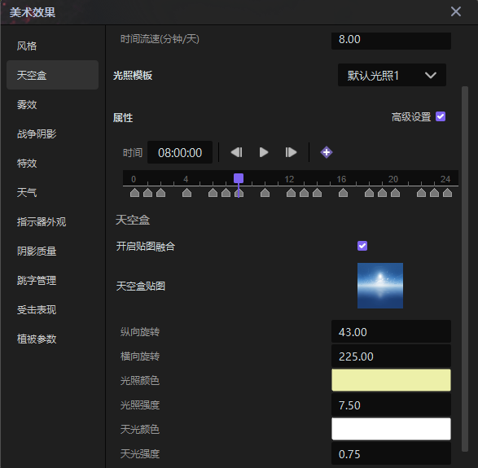
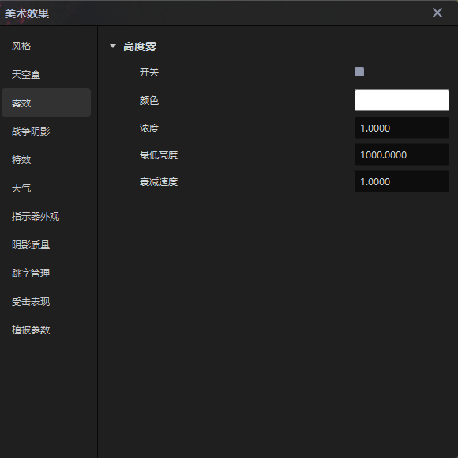
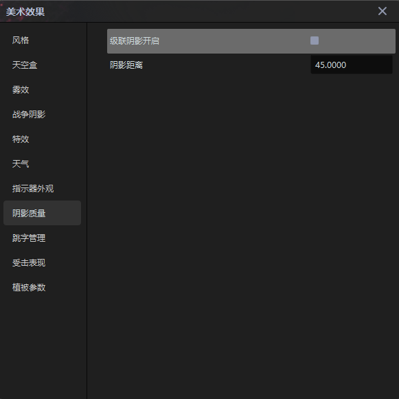

import { Callout } from 'codesandbox-theme-docs'
import { FCollapse } from 'components/FCollapse'

# 美术效果

点击编辑器菜单栏的**细节-美术效果**选项，你可以设置项目内的整体风格，例如添加天空盒、滤镜、天气、特效等。

## 风格

- **画风**  
  你可以改变游戏的整体风格，包括游戏里的角色的风格，例如可以将其风格改成**像素风**、**铅笔画**或者**美景**。

- **滤镜**  
  你可以更改整个场景的色调，比如选择了**黑白记忆**滤镜后，场景画面会完全变成黑白色调。
  

- **镜头辉光**  
  镜头辉光能够模拟用肉眼观察非常明亮的物体时看到的泛光效果，从而凸显三维物体的真实感。其中**辉光强度**选项能够调节泛光的强度，**衰减范围**选项则能够调节光线随着与光源的距离增大而导致的光线强度减弱的幅度，在设计过程中你可以可尝试填入不同的数值以获取最好的视觉效果。

- **暗角**  
  你可以设置暗角的参数，使画面四周变暗，营造紧张惊险、悬疑神秘等氛围。
  

## 天空盒

**天空盒**又叫天空球是包裹整个游戏场景的立方体，其定义了地面之外的空间背景。

点击**天空盒**的缩略图即可选用，或者点击进入到**资源管理器-天空球**分类中，选择或者导入新的天空盒。

## 雾效

在设计过程中，你可以加入**雾效**增加场景的真实度，当相机高度大于为雾效设定的**最低高度**时，会产生迷雾效果，高度越高浓度越大。

- **颜色**: 调节雾的颜色。

- **雾浓度**:调节雾的浓度，浓度越高对视觉的障碍效果越大。

- **最低高度**: 高度低于这个数值的地方没有迷雾。

- **衰减速度**: 当游戏角色走进迷雾中时，迷雾的退散速度。

## 战争阴影

**战争阴影**分为**置灰迷雾**和**未探索迷雾**两部分。

**置灰**表示获取过视野然后又失去的状态。你可以设置灰色阴影的**颜色**、**浓度**、**扰动开关**与**扰动强度**。

<Callout type="info"> 
**扰动**是指灰色阴影具有一种类似火焰燃烧的效果，能够给玩家带来视觉扭曲的体验。
</Callout>

|  |  |
| ---------------------- | ---------------------- |

**未探索迷雾**  当一个区域中没有己方队友时，游戏玩家看不到该区域的具体内容，只能看到一片**未探索迷雾**。你可以设置未探索迷雾的**颜色**，**浓度**与**衰退幅度**。

## 特效图标

你可以设置玩家**升级**时、**杀死怪物获得货币**时与**复活**时的特效，也可以选择是否开启相关特效，以及在杀死怪物时所获得的货币是所有人可见还是仅该玩家可见。
点击文件夹图标可以打开**资源管理器-特效**，更换相应的特效。

## 天气

你可以设置当前场景的天气情况，该天气会覆盖整个项目场景，与区域天气互不影响。

## 指示器外观

你可以设置**鼠标状态**、**技能指示器**与**移动特效**。

在**鼠标状态**选项卡中，你可以设置常态下的**悬浮**、**选取**和**禁用态**的鼠标样式，同时还可以设计鼠标在**敌方建筑单位**、**敌方非建筑单位**、**己方建筑单位**、**己方非建筑单位**、**友方建筑单位**与**友方非建筑单位**处悬浮和选取时的样式。

你可以双击鼠标样式，进入[资源管理器-鼠标样式](./icon-common/mainwindow2_artistic_effect_setting_replace_dwn.png)，选取或导入鼠标样式，还可以点击刷新按钮重置鼠标样式。

在游戏能力释放之前，场景中会有一个**技能指示器**，向你显示能力的方向或区域。你可以设置能力指示器的特殊效果。

点击  进入 **资源管理器-特效**, 点击  重置特效。  

下图为箭头指示器的一种特效样式-箭头指示器。

你可以设置一个**单位**在移动或攻击时的**移动效果**。点击！[asset store_home_edit_liang_hover](./icon-common/assetstore_home_edit_liang_hover.png)进入**资源-特效**后，修改或导入一个新的特殊效果。你也可以点击！[mainwindow2_artistic_effect_setting_replace_dwn](./icon-common/mainwindow2_artistic_effect_setting_replace_dwn.png)来重置特殊效果。

## 阴影质量

你可以自定义**级联阴影**是否开启，并设置**级联阴影级数**、**级联阴影距离**，以及各层级之间的**阴影距离**。在某些场景中，方向光产生的实时阴影在靠近摄像机时会出现像素化，阴影级联有助于解决因此而产生的透视锯齿问题。

<Callout type="warning"> 
注意：阴影级联仅对方向光有效；使用的级联越多，透视锯齿对阴影的影响就越小，但是增加级联数量会增加计算机的渲染开销。
</Callout>

## 跳字管理
### 跳字的作用

在游戏中，跳字是一种很常用的表现形式，它有着提供实时反馈，增强打击效果，强调游戏事件，提供游戏信息，增加游戏的沉浸感等效果。

### 跳字轨迹相关使用说明

#### 概况：

1、在最新的更新中我们对跳字进行了系统化的重构，将跳字分成了字体、轨迹两个部分（本次更新对现有已使用的跳字不会产生影响）

2、字体包含了艺术字和通用字体两种

3、新增了一个轨迹编辑界面，可以在里面自由编辑跳字的位置、缩放、透明度（入口：美术效果-跳字管理-编辑跳字）

#### 注意事项：

1、轨迹编辑中的字体仅是预览查看效果，实际跳什么字体需要在eca中选择

2、将轨迹设为默认后所有跳字的默认轨迹都将修改，同时只能有一种默认轨迹

#### 具体说明：

1、进入轨迹编辑器后选择新建轨迹或者右键复制现有轨迹即可添加新的轨迹

2、为了适配普通跳字和暴击跳字所有轨迹均会有两套配置（除非作为暴击伤害使用不然暴击轨迹没有实际作用，可以无视）

3、选中其中一条轨迹即可对轨迹属性进行修改

4、选中具体需要调整的属性

5、调整对应时间轴信息（选中对应点后在右侧修改或者直接拖拽（支持多选））

6、调整完成后保存即可在其他地方调用

## 加载图片

你可以对打开编辑器时的加载页进行个性化设置。

## 受击效果

使用受击表现可以大大的增强游戏的打击感，以及命中反馈。
受击表现的设置如下。

**具体功能：**
单位在受到大于0点伤害（结算前）后会自动触发一次闪白效果

**属性说明：**
受击时长：闪白的持续时间
闪光间隔：两次闪白之间的最小时间
受击颜色：闪白效果的颜色
受击闪光单位类型：受伤后会触发闪白效果的单位类型