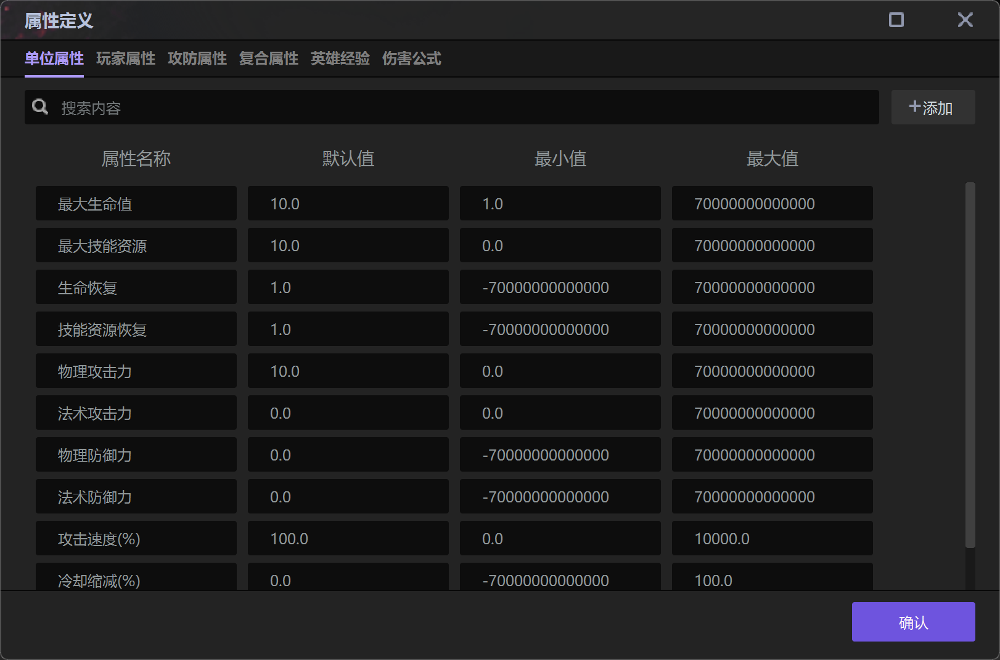
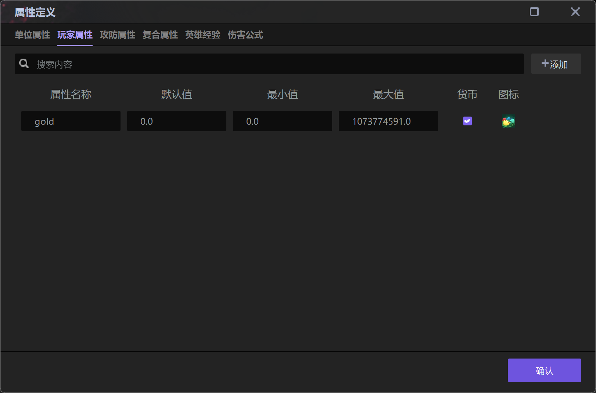
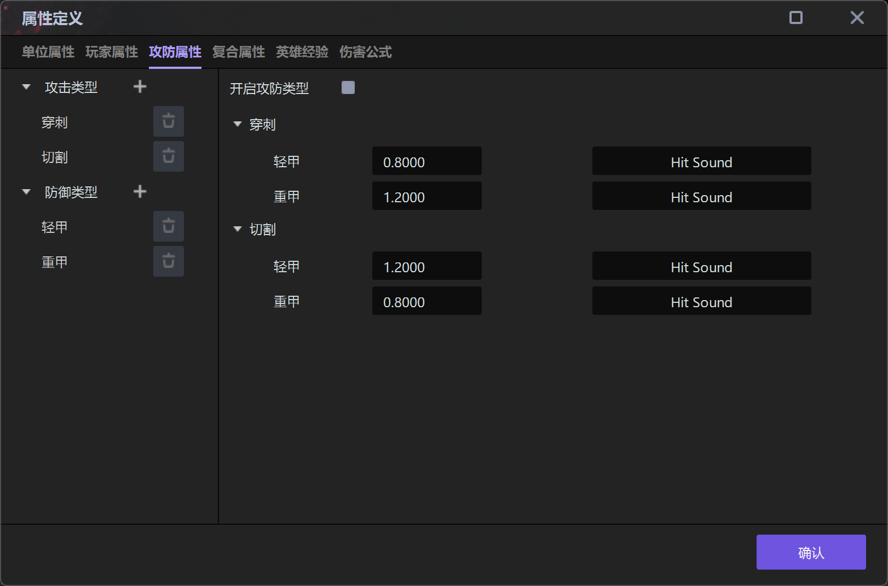
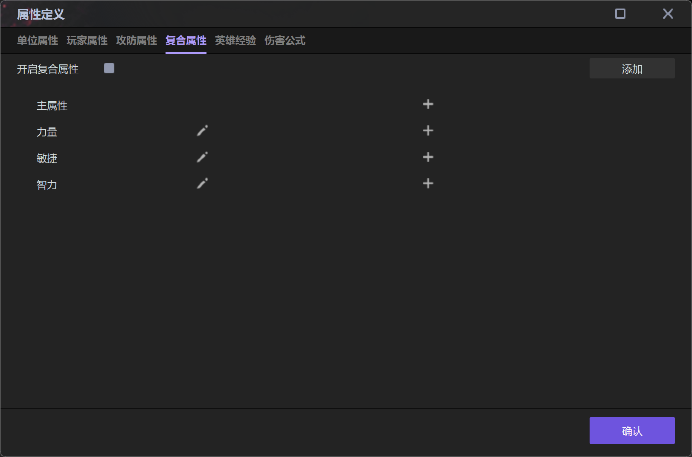
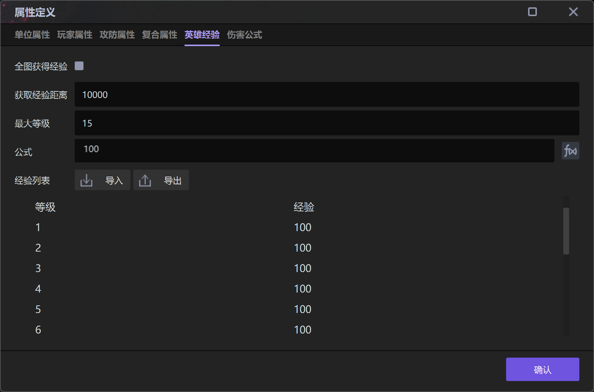
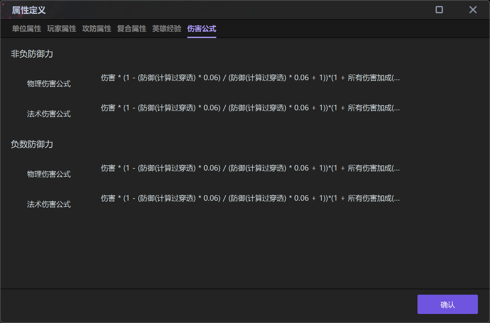

import { Callout } from 'codesandbox-theme-docs'
import { FCollapse } from 'components/FCollapse'

# 属性定义

在开发简单项目时，你大可略过此处，但如果你的创作计划里涉及**伤害与护甲**的关系，**复合属性如何影响角色具体属性**（例如角色的力量值同时影响其近战伤害和生命上限）等，不妨点击编辑器菜单栏的**细节-属性定义**选项进行设置，这样做会更加高效。

## 单位属性

可以在**属性定义-单位属性**中设置单位的属性，属性值可以直接绑定到UI文本或者进度条上，单位属性每个属于每个地图所有，使用多地图功能时，需要将地图attr.json复制到其他地图中来使用。

## 玩家属性

可以在**属性定义-玩家属性**中设置单位的属性，玩家属性是全项目通用的，修改会跨地图生效。

## 攻防属性

编辑器为战斗类游戏提供预置的攻击防御系统。你可以定义项目中的**攻防属性**，以及决定是否启用**攻防类型**。在默认的示例数据中，**穿刺**、**切割**、**轻甲**、**重甲**相互作用，穿刺的伤害打在轻甲防御者身上只有0.8倍效果，针对重甲则有1.2倍特效，你可以对这些数值进行自由修改。

## 复合属性

点击  开启**复合属性**后，你可以设置并增加各复合属性的具体内容，还可以设置并增加**主属性**的额外收益。

<Callout type="info"> 
主属性：不同角色的初始属性中最高的一项即为该角色的主属性，例如默认情况下战士的主属性为力量，猎人的主属性为敏捷，法师的主属性为智力。
</Callout>

<Callout type="warning"> 
注意事项：开启复合属性后，你可以在物体编辑器-单位-单位属性-复合属性中设置单位的初始复合属性，从而确定当前单位的主属性。
</Callout>

## 英雄经验

你可以对与**经验**相关的内容进行设置，具体如下。

- **全图获得经验**：勾选该选项，游戏角色可以在项目的全地图范围内获得经验。

- **获取经验距离**：游戏角色可以获得经验值的半径范围。

- **最大等级**：游戏角色的最高等级。

- **公式**：每次等级提升所需的经验值，点击f(x)按键可以通过复杂公式进行设定。

- **所需经验**：从上一个等级升级到当前等级所需要的经验值。

## 伤害公式

编辑器在攻击防御系统中提供预置的伤害公式。你可以点击**笔型按钮**修改**伤害公式**的具体数值，或者点击**重置按钮**恢复默认设计。

