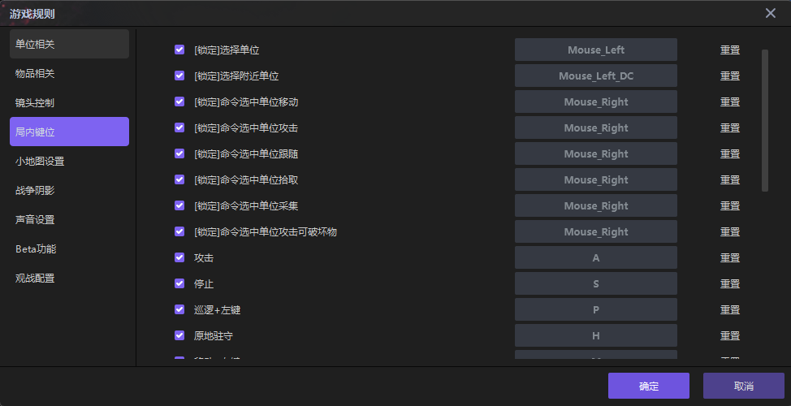
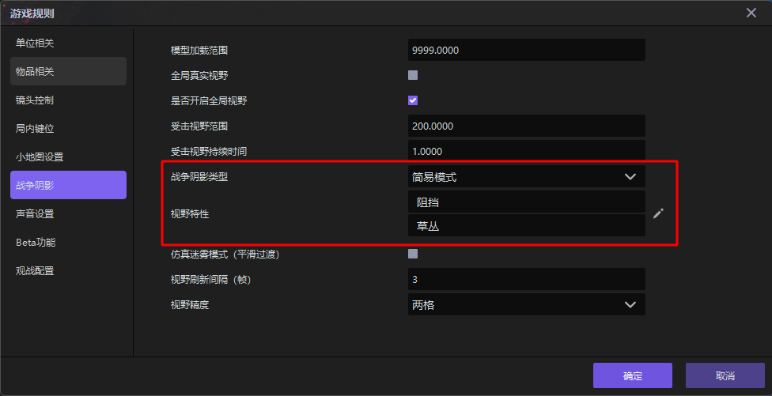

import { Callout } from 'codesandbox-theme-docs'
import { FCollapse } from 'components/FCollapse'

# 游戏规则

在开发复杂项目时，有很多功能看似简单，却可能需要大量代码才能实现，而编辑器已经把许多常用的经典设计内置在项目规则里，方便用户直接使用、调试。

## 单位相关

你可以在**单位相关**中对项目中的单位进行基础设置。

## 物品相关

你可以通过**物品碰撞范围**针对物品设置通用碰撞范围

<Callout type="info"> 
物品碰撞范围：物品与物品之间隐形的间隔距离。 
</Callout>

你可以设定物品被拾取后是进入**物品栏**还是**背包栏**。

## 镜头控制

你可以调整项目运行中镜头随着**鼠标或者键盘移动的速度**。

## 局内键位

你不但可以在**键位设置**中个性化定制项目开发时的热键，也可以在**局内键位**中设置游戏运行时的操作热键。

## 小地图设置

你可以使用不同颜色标注出小地图上各个生物与英雄所属的阵营。

表示阵营的颜色支持自定义，还可以进行色值的储存，方便下次制作时快速选取。

## 战争阴影

编辑器预设了两种战争阴影模式，即**经典模式**和**简易模式**。你也可以选择自定义模式，自行设置视野阻挡的细节。你还可以通过**模型加载范围**来设置运行状态下的镜头距离。

- **经典模式**  

- **简易模式**  

- **自定义模式**-点击**笔形**按钮设置细节

