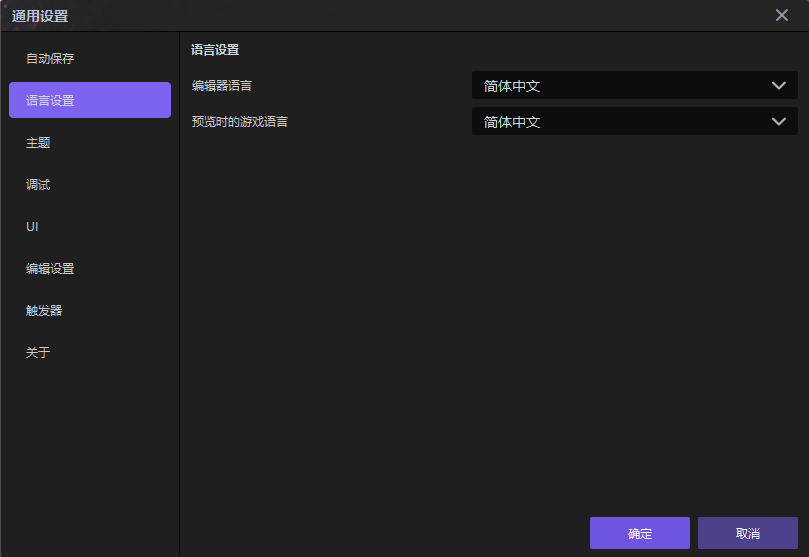
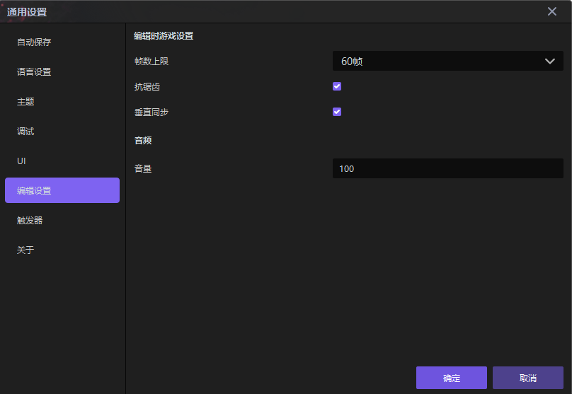
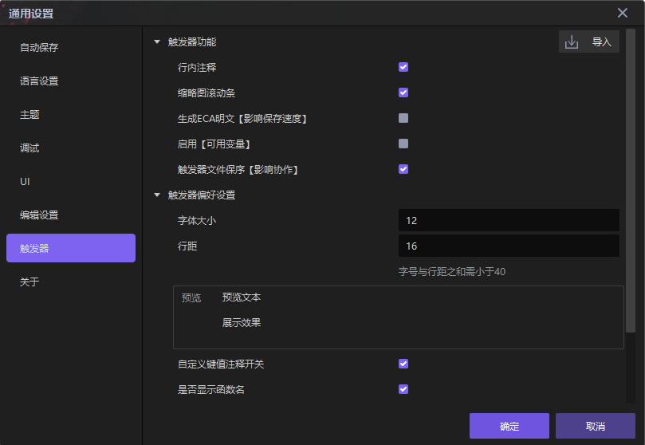
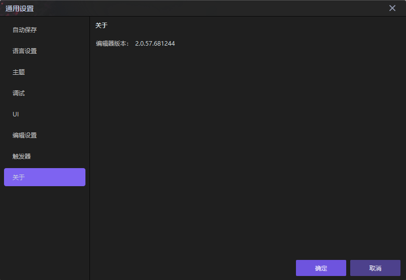

import { Callout } from 'codesandbox-theme-docs'
import { FCollapse } from 'components/FCollapse'

# 通用设置

在编辑器菜单栏中点击**编辑-通用设置**，您可以设置编辑器的**自动保存**、**语言设置**、**主题**、**调试**以及**场景表现**，并获取编辑器的**版本号**。

## 自动保存

您可以设置和修改自动保存的**间隔**和**路径**。此外，您可以查看每个历史记录的**路径**，以便快速找到历史文件。

## 语言设置

您可以通过**语言设置**设置在编辑器中编辑项目时使用的语言。

## 主题

您可以设置Y3编辑器的**主题**。

## 调试

当您开发一个项目时，在编辑器中可以看到该项目的调试信息，如下图所示。

您可以设置调试信息的显示方式。

1. 如果选择**显示**，则会显示调试信息。如果您不想看到调试信息，请不要选择此选项。
2. 您可以设置调试信息的**位置**和**画面质量**。
3. 如果选择**运行时鼠标是否限制在游戏内**，则在调试状态下，鼠标的移动仅限于编辑器的范围内。如果您不选择此选项，则鼠标的移动不受范围的限制。
4. 您可以设置**编辑器内远景裁切距离**距离，即在编辑器中开发游戏时从摄像机可以看到的最远距离。

<Callout type="warning"> 
注意：您可以通过[战争阴影](../../guides/getting-started/game-rule#战争阴影)中的**模型渲染距离**来设置游戏运行时的最大镜头距离。
</Callout>

## UI

您可以设置界面编辑器的各种属性

## 编辑设置

您可以设置游戏帧数，渲染设置以及声音设置。

## 触发器

您可以设置触发器编辑界面的各种属性。

## 版本号

在这里您可以看到当前编辑器版本号

