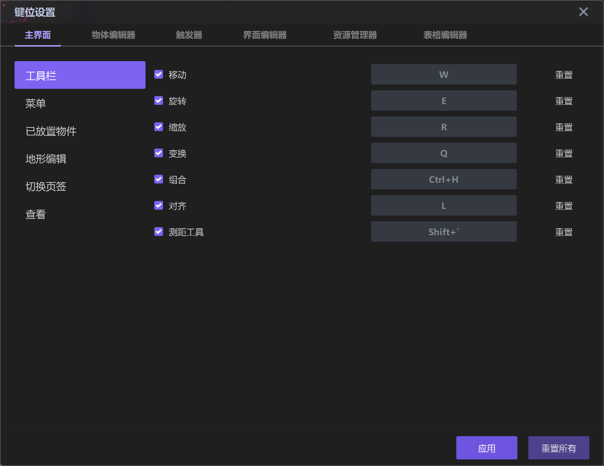
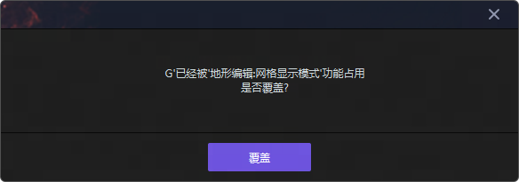

import { Callout } from 'codesandbox-theme-docs'
import { FCollapse } from 'components/FCollapse'

# 键位设置

点击Y3编辑器菜单栏的**编辑-键位设置**选项，你可以对**主界面**、**物体编辑器**以及**触发器**的快捷按键进行个性化定制以方便项目开发。你同样可以在[游戏规则-局内键位](./game-rule#局内键位)中，对玩家进入游戏后可使用的快捷按键进行个性化定制。

选择  表示开启当前快捷键，点击右侧输入区后，就可以开启编辑。

设置热键时需要遵循一些规则。
- **辅助键**包含ctrl 、alt 、shift，不区分左右。
- **功能键**包含字母、主键盘数字、小键盘数字、标点符号、F1-F12、方向键，不区分大小写 。
- 有效键位有以下几种形式：
   - 1个功能键 
   - 1个辅助键
   - 1个辅助键+1个功能键
   - 2个辅助键+1个功能键
   - 3个辅助键

如果设置出现冲突，界面会出现提示信息，如下图所示。

可设置热键的内容如下所示。

<FCollapse title="Show table">

- 主窗口
   - 地形调色板
     - 网格显示模式
     - 上一个画笔
     - 下一个画笔
     - 增加画笔大小
     - 减小画笔大小
   - 菜单
     - 保存
     - 运行
   - 放置的对象
     - 顺时针旋转
     - 逆时针旋转
     - 向左下方移动
     - 向下移动
     - 向右下方移动
     - 向左移动
     - 向右移动
     - 向左上方移动
     - 向上移动
     - 向右上方移动
     - 放大
     - 缩小
   - 视图
     - 水
     - 通行
     - 单位
     - 装饰
     - 物品
     - 抛射物
     - 破坏物
     - 摄像机
     - 区域
     - 点
     - 路径
     - 灯光
     - 局部雾
     - 所有
   - 对象调色板
     - 单位
     - 装饰
     - 物品
     - 摄像机
     - 抛射物
     - 区域
     - 破坏物
     - 大气层
 - 对象编辑器
   - 对象列表
     - 新建对象
     - 在工具调色板中选择
     - 恢复属性值
     - 恢复触发器
     - 导出数据
     - 导出所有
     - 导入数据
     - 重置为默认值
 - 触发器
   - 编辑触发器
     - 新建触发器
     - 禁用触发器
     - 新建事件
     - 新建条件
     - 新建动作
     - 新建子触发器
     - 新建注释
     - 禁用触发器行
     - 在触发器编辑器中搜索
   - 编辑变量
     - 新建变量
     - 编辑变量
</FCollapse>