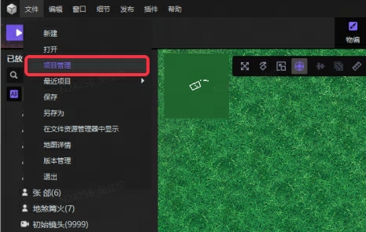
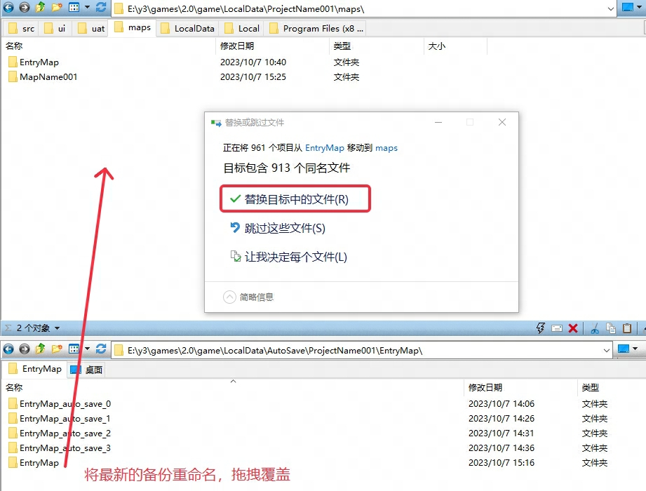
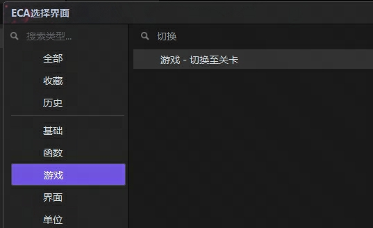

import { Callout } from 'codesandbox-theme-docs'
import { FCollapse } from 'components/FCollapse'

# 多场景

多场景功能为制作剧情驱动的线性关卡提供便利、以及为orpg等大地图类型的游戏提供降低内存压力的手段。

你可以在主界面 - 文件 - 项目管理选项中找到多关卡功能的入口。

项目管理的面板中，你可以新建关卡、为现有的关卡重命名、移除关卡、设置主关卡以及切换关卡。

主关卡将会影响使用编辑器开启这个项目时，以及玩家进入这个游戏，默认加载的关卡（后续有计划将进入游戏的默认关卡与匹配模式或房间参数绑定）。

注意：在切换关卡时，若不进行保存，在当前关卡做过的既有修改将会丢失。

为了降低自动保存造成的效率损耗，2.0版本编辑器不会将整个工程进行自动保存，只会保存正在编辑的关卡。在需要复原你的进度时，需要将自动保存目录下的关卡备份粘贴到原工程对应的关卡文件夹中进行覆盖。

你可以在触发器 - 动作 - 游戏分类中找到切换关卡的语句。

在使用过程中。需注意：

执行切换关卡时，所有的玩家会同时切换到新的关卡。建议将切换的语句写在游戏结束的条件中，或制作类似地下城与勇士的房间切换时的投票规则。

进入新的关卡时或回到老的关卡时，游戏进度都将会从游戏初始化开始重新运行。

如果在不同关卡中存在需要传递和共享的数据，需要在游戏过程中将这些数据放入存档中，在切换关卡后根据存档的数据重新加载。存档相关可见存档须知及表格存档、表格加密的使用说明。

在关卡切换过程中，若处在上传存档的CD过程中，也会在切换前强制保底上传一次。

