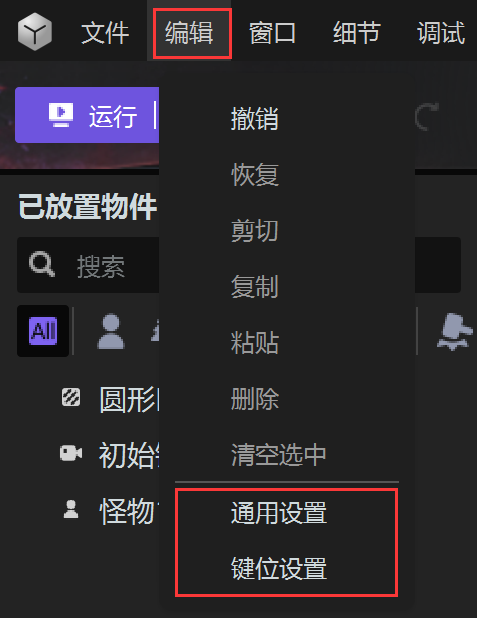
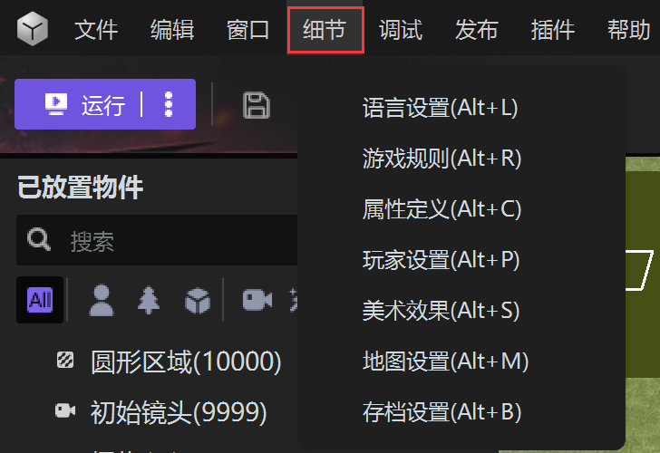

import { Callout } from 'codesandbox-theme-docs'
import { FCollapse } from 'components/FCollapse'

# 工程设置

创建项目后，您可以通过Y3编辑器菜单栏中的**文件**，**编辑**和**细节**选项来设置现有项目，包括[多场景](./multilevel)、[通用设置](./general-setting)、[键位设置](./hotkeys)、[语言设置](./text-setting)、[游戏规则](./game-rule)、[属性定义](./attribute-definition)、[玩家设置](./player-setting)、[美术效果](./artistic-effects)、[地图设置](./size)、[存档设置](./archive-setting)。

