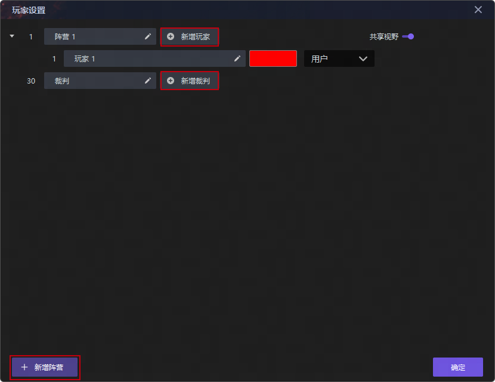
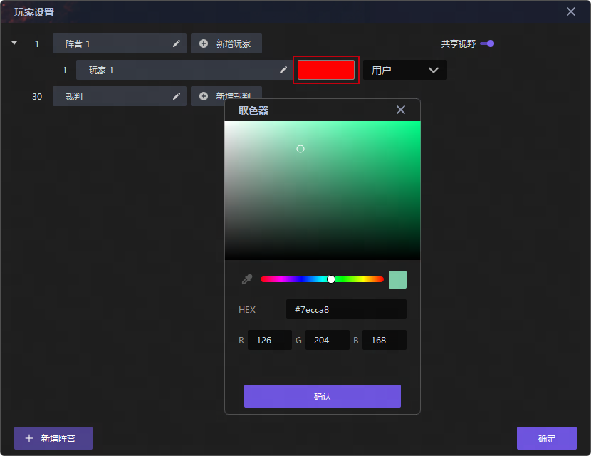

import { Callout } from 'codesandbox-theme-docs'
import { FCollapse } from 'components/FCollapse'

# 玩家设置

点击编辑器菜单栏的**细节-玩家设置**选项，你可以设置游戏内的玩家人数，以及玩家之间的关系，游戏默认只有一支队伍和一个玩家（玩家1），如果想要实现多人游戏，可以点击界面上的**新增玩家**或**新增阵营**按钮，你也可以拖动玩家到不同的阵营，或添加裁判位让好友进行观战。

你也可以通过调色板自定义玩家代表色:

