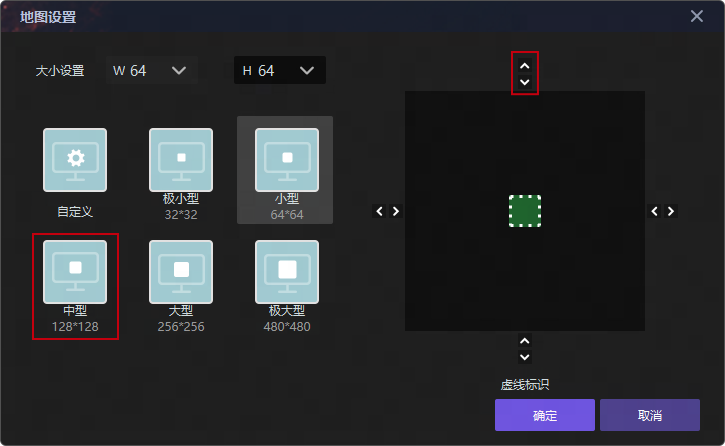
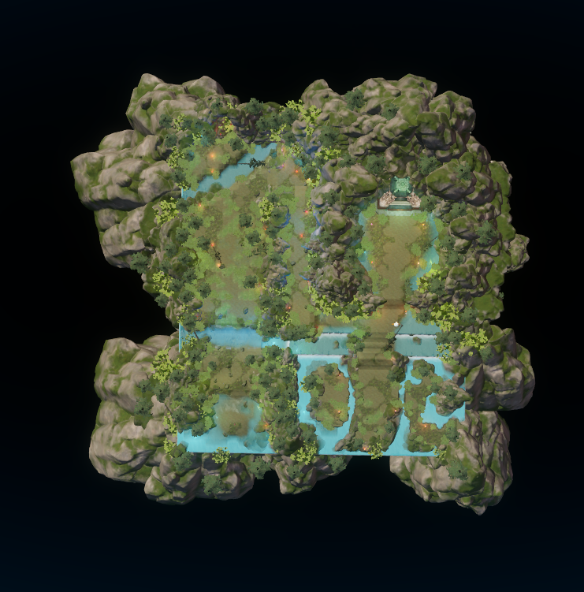
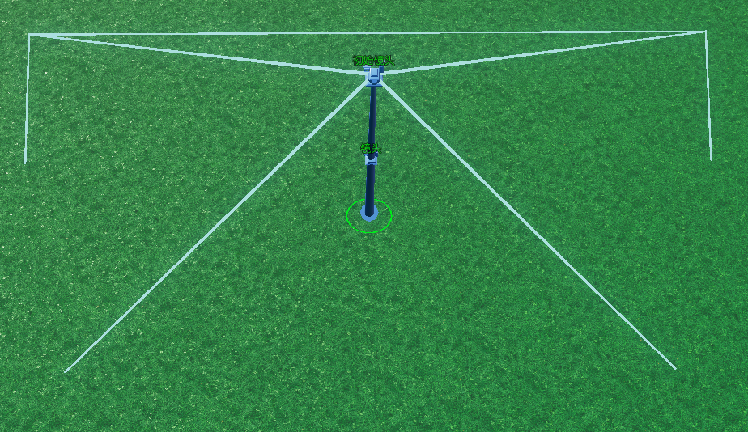
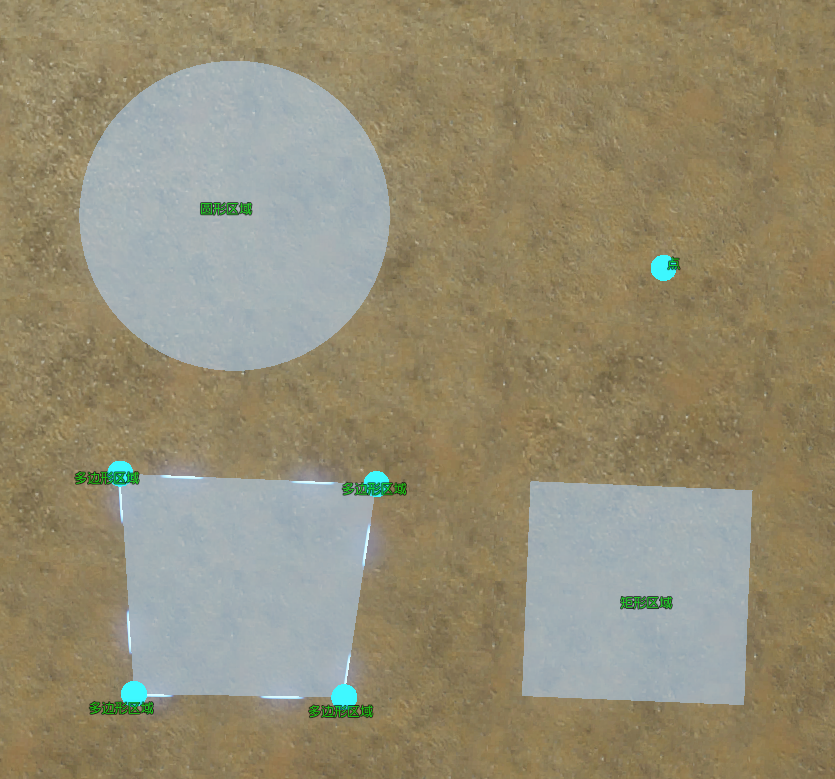
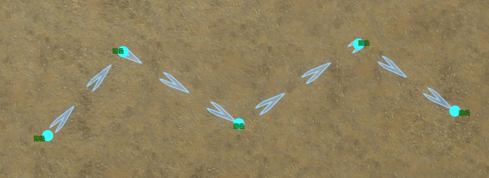
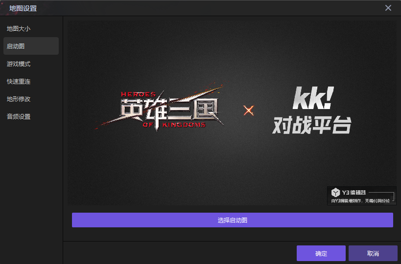
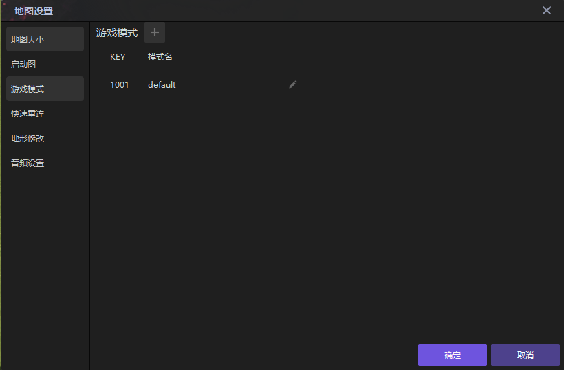
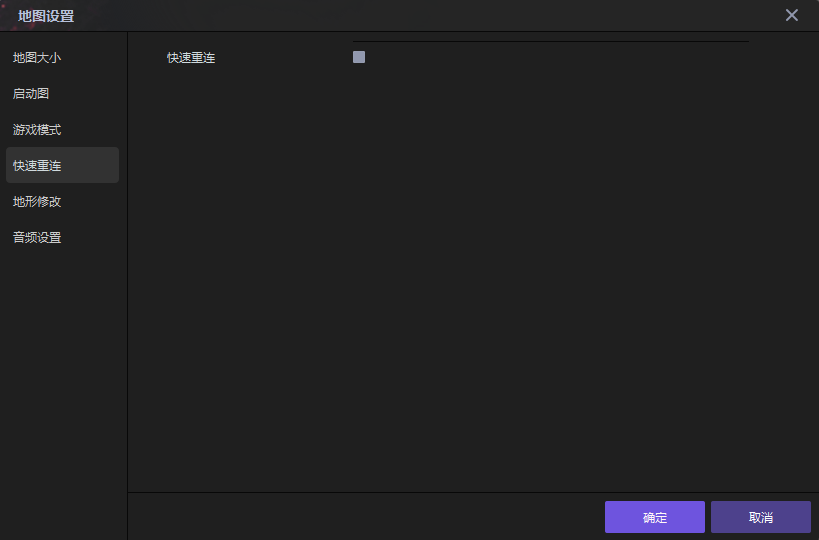
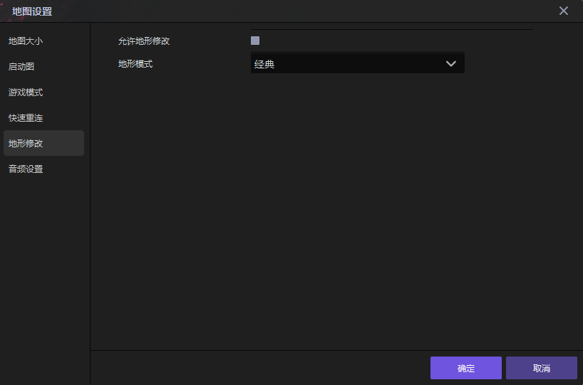
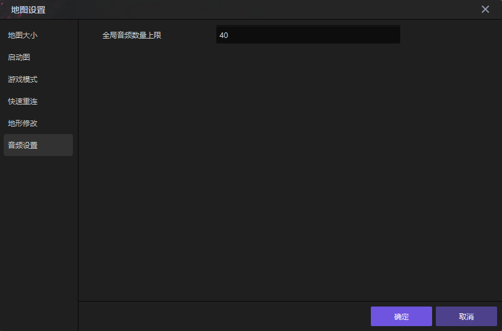

import { Callout } from 'codesandbox-theme-docs'
import { FCollapse } from 'components/FCollapse'

# 地图大小

编辑器支持改变当前项目的地图尺寸。点击编辑器菜单栏的**细节-地图设置-地图大小**选项，你可以在窗口左侧选择一个正方形的地图尺寸，然后在**大小设置**栏调节地图的**宽度（W）**与**高度（H）**，或者借助右侧预览图四周的正反箭头，使地图大小朝该方向扩大或缩小。

例如，设计一张128*160的地图，操作步骤如下

1. 在窗口左侧选择128*128的中型地图，显示为右侧示意图区域中的褐色部分；
   
2. 在窗口右侧示意图区域，点击两次最顶部的箭头，虚线表示扩展后的新地图大小。

<Callout type="warning"> 
缩小地图可能会删除掉地图边缘的一些摆件，包括地形，地势（含纹理，悬崖，高度，涂鸦，裂缝），通行，单位，装饰物，物品，可破坏物，特效，镜头，区域，路径。当地图尺寸重新变大后，被删除的摆件不会重新出现在地图上。这些摆件的删除规则如下。
</Callout>

## 地形地势&通行

以格点为单位删除，若一部分地形处于改变后的地图外，一部分处于改变后的地图之内，则只删除地图外部分，地图内部分保留，如下图所示，左侧为地图缩小前，后侧为地图缩小后。

|  |  |
| --------------------- | --------------------- |

## 单位&装饰物&物品&可破坏物&特效

不考虑模型的体积，以摆件的坐标原点为准，若原点在修改后的地图内，则不会被移除；若坐标原点在地图外，则会被移除。如下图所示。

## 镜头

以镜头的焦点位置为准。对于初始镜头，若初始镜头的焦点在地图改变后仍在地图内，则初始镜头不做改变；若初始镜头的焦点不在改变后的地图内，则将初始镜头移动至新地图的中心。对于除初始镜头外的其他镜头，若镜头焦点位置在修改后的地图内，则该镜头不做改变；若焦点位置在修改后的地图外，则该镜头被移除。

## 区域

对于点，若点在修改后的地图内，则该点不做改变；若点在修改后的地图外，则该点被移除。对于圆形、矩形、多边形区域，若修改后的地图能完整包含该区域的所有面积，则该区域不做改变；若该区域的某些面积在修改后的地图之外，则该区域会被移除。

## 路径

只要存在路径上的点在修改后的地图之外的情况，该路径就会被全部移除；若不存在路径上的点在修改后的地图外情况，则该路径不做改变。

# 启动图

您可以在该页面修改启动图

# 游戏模式

您可以在该页面修改启动模式

# 快速重连

您可以在该页面选择是否开启快速重连功能

# 地形修改

您可以在该页面选择是否开启快速地形修改和选择地形模式

# 音频设置

您可以在该页面设置全局音频数量上限

