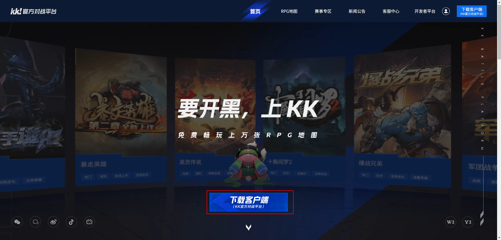
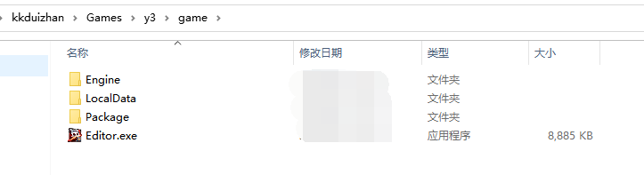
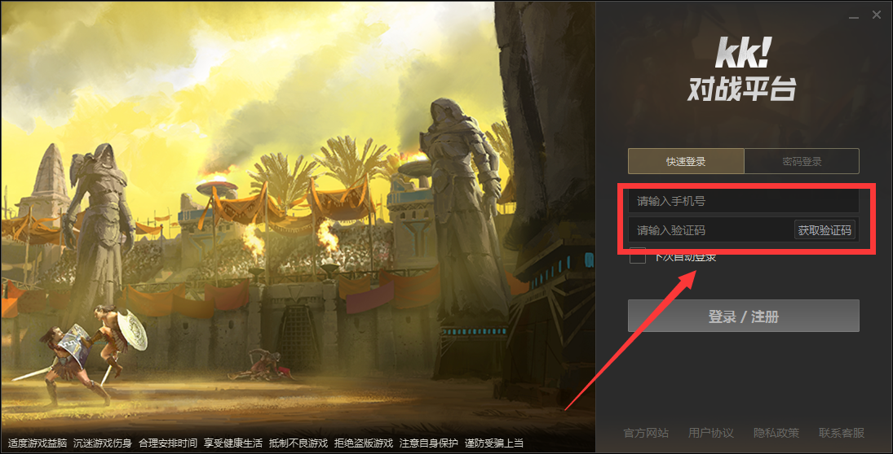
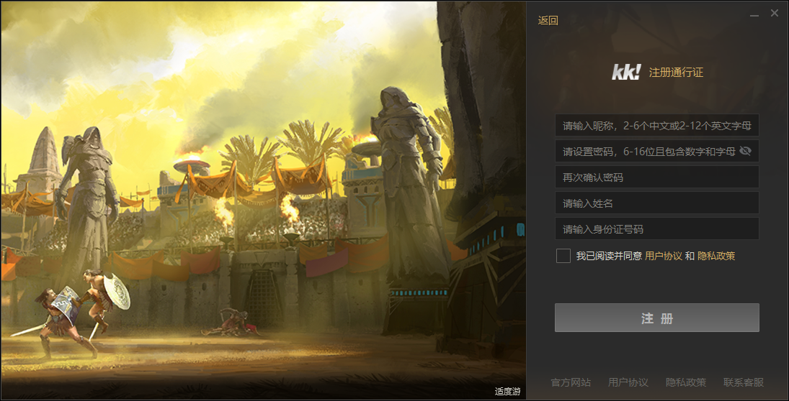
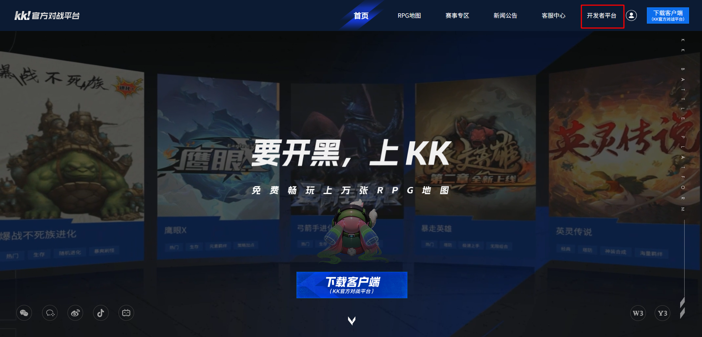
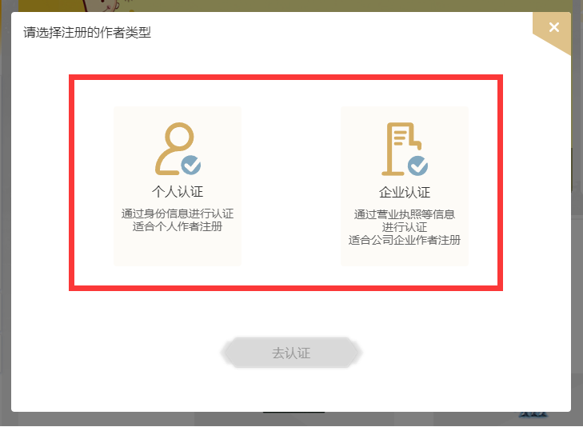

# 开发者注册

正式成为KK平台的Y3编辑器开发者前，您需要先注册与激活账号，准备工作如下：

### 安装平台与编辑器
平台下载地址：**reckfeng.com**
 

编辑器在KK对战平台下载完成后，将自动装载在路径：kkduizhan/Games/y3/game文件夹内，点击“Editor.exe”即可打开编辑器

### 注册KK对战平台账号

输入您的手机账号，获取短信验证码。
 

输入对应的信息，设置昵称、设置密码、进行实名信息认证完成注册。
 

注册完成KK对战平台账号后，浏览器输入reckfeng.com，点击**开发者平台**。
 

### 开发者认证

点击**加入开发者平台**
 

根据您需要进行认证的类型进行认证即可，待认证审核通过后，恭喜您成为开发者！
 

