# 作品上传

1.打开KK对战平台所在的文件夹，“kkduizhan”路径下 kkduizhan/Games/y3/game文件夹。
 

2.选择“Editor.exe”文件，双击打开。
 
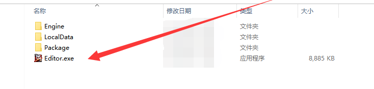

3.登录**开发者平台**账号，输入手机号码，获取验证短信或选择密码登录。
 
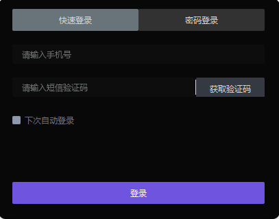

4.上传地图前首先核对编辑器版本号，要保证地图使用最新版本的编辑器（即保证地图制作使用的编辑器版本与上传地图的编辑器版本一致）。
 
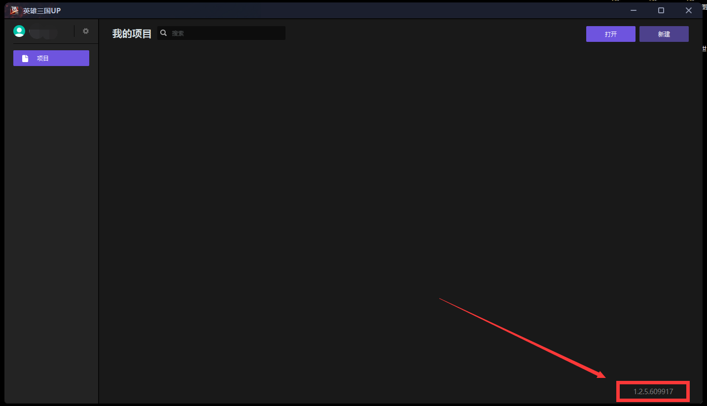

5.点击打开，选择要上传的地图包体文件夹内的“header.map”文件，点击“Open”。
 
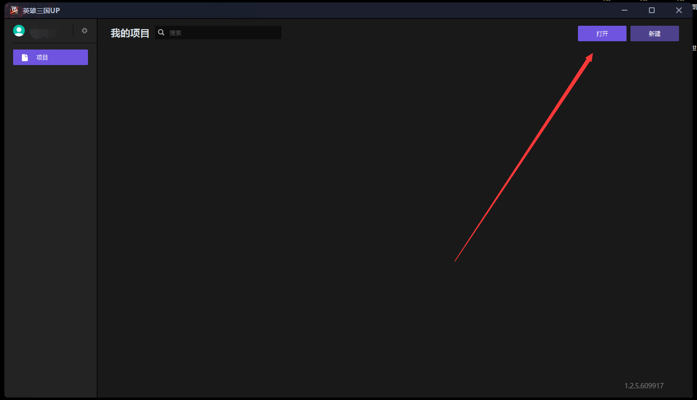
 
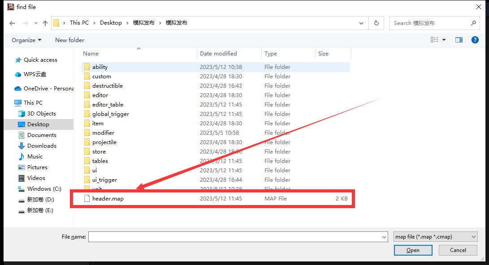

6.等待地图加载完成，弹出编辑器页面。
 

 
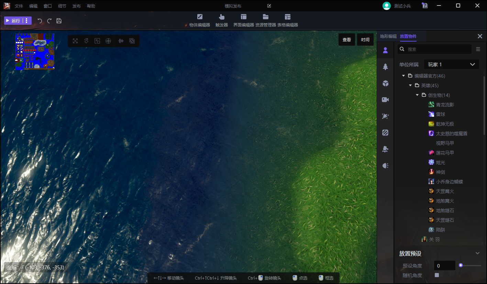

7.选择左上角的**发布**，然后点击**上传项目**。
 
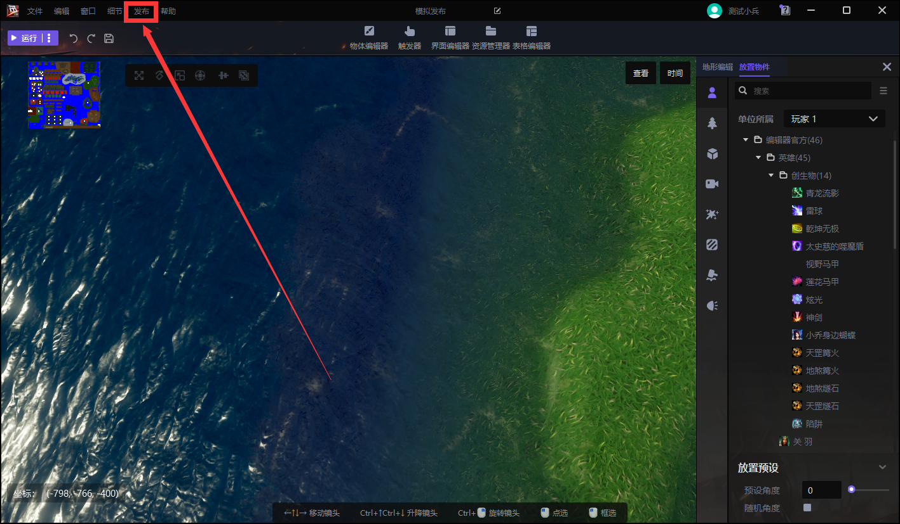

8.进入发布流程，根据作品实际发布情况选择对应按钮。
 
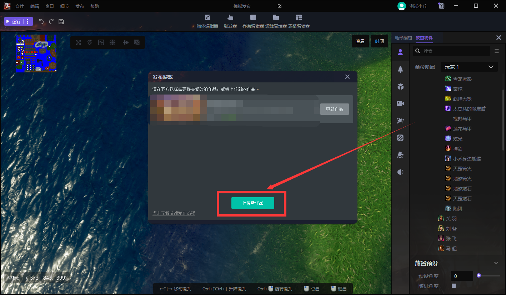

首次上传地图则选择**上传新作品**。
 
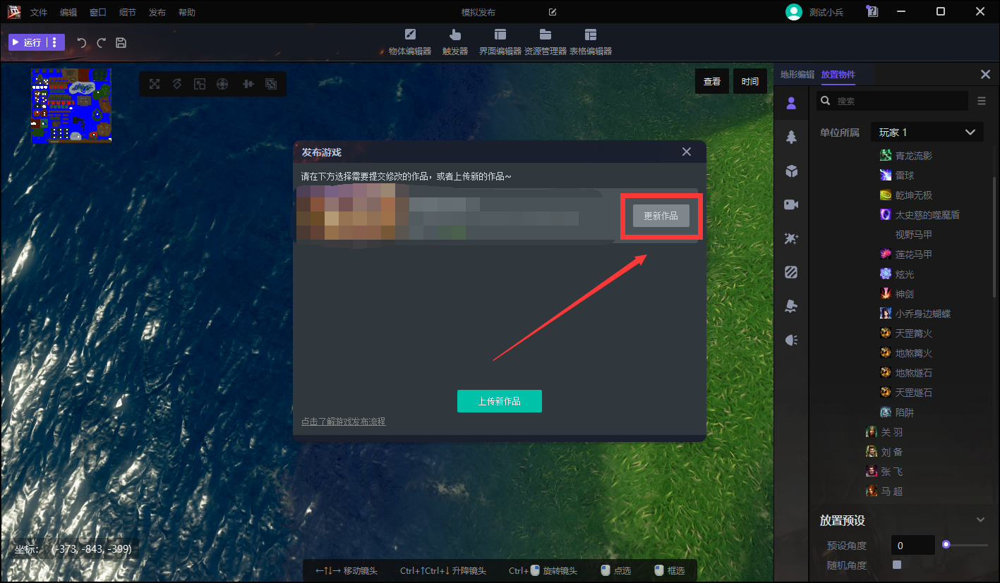

若更新已有作品则选择**更新作品**。

9.输入作品名称，点击**上传新作品**
 
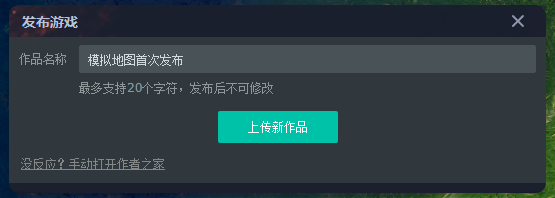

10.等待作品上传至100%，会弹出**开发者平台**页面。
 
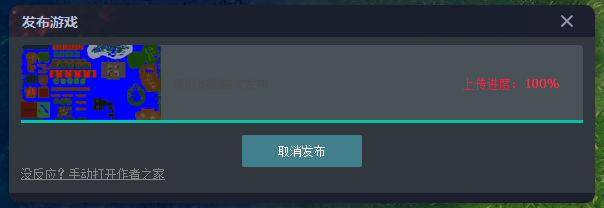

11.输入**作品名称**。
 
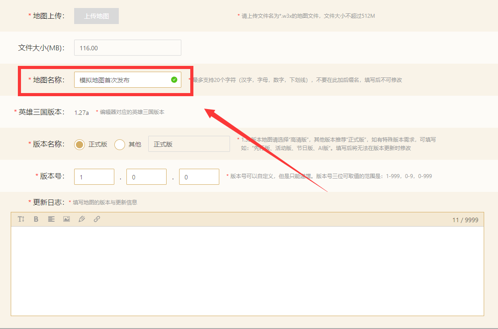

12.输入对应**版本号**。
 
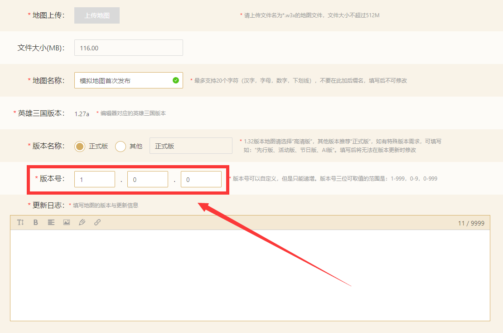

13.输入对应**更新日志**内容。
 
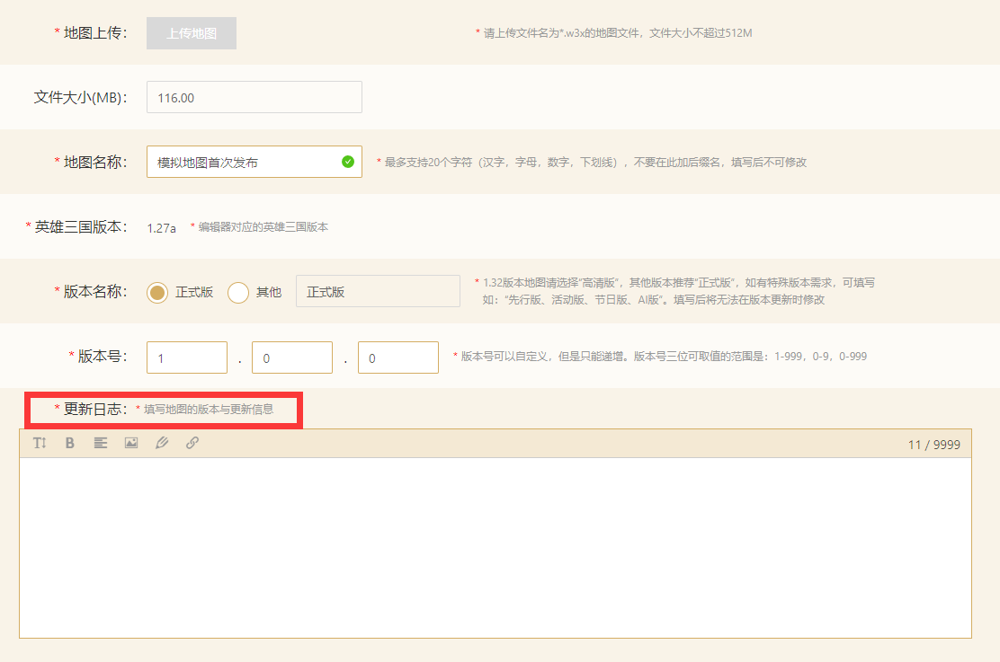

14.选择作品对应类型，目前共计6类：**TD塔防**、**其他地图**、**角色地图**、**防守地图**、**生存地图**、**对战地图**，仅供选择1个类型。
 
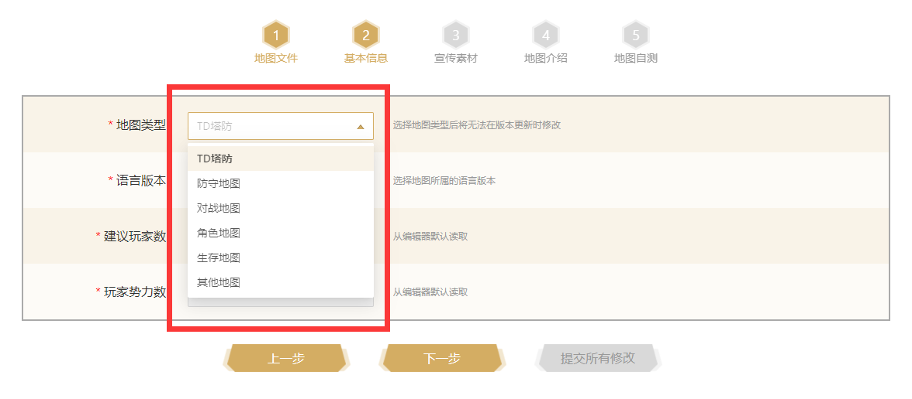

15.填写展示信息，根据提示添加对应宣传物料，请注意对应物料需要的规格尺寸、大小。
- 地图宣传小图：尺寸要求为390x256，支持jpg/png格式，上限为512KB
- 地图宣传图片/视频：最多支持上传4个图片/视频，支持顺序拖拽，尺寸要求为996x482，支持jpg/png格式，视频大小上限为50MB，支持MP4格式，且支持上传封面
- 宣传图标：尺寸要求为220x220，支持jpg/jpeg/png格式，上限为512KB
- Banner图片：尺寸要求为1000x500，支持jpg/png格式，上限为2MB
- 宣传物料尺寸规格直接涉及作品对外显示的效果，建议按照推荐尺寸上传
 
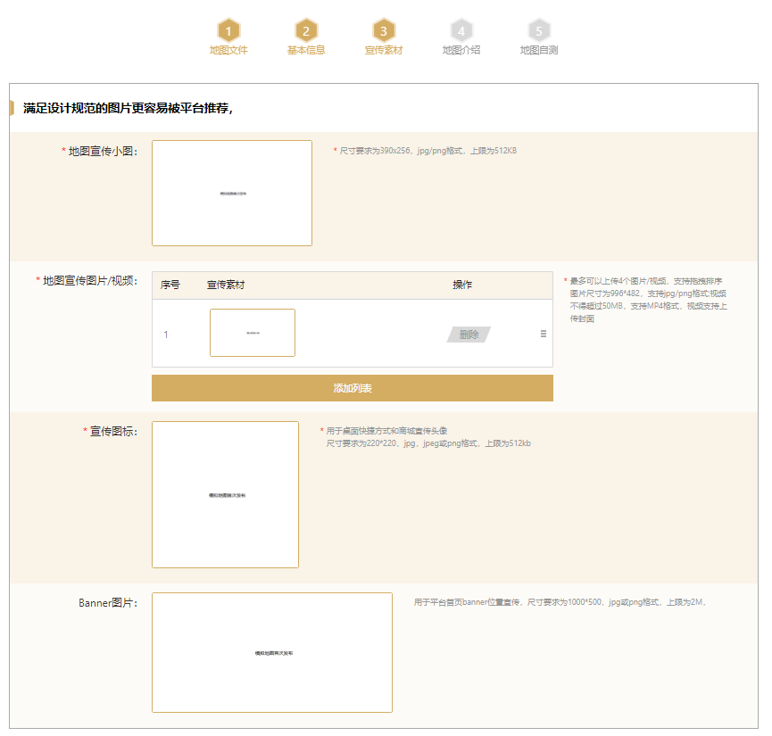

16.填写**地图基本说明**、**获胜条件**、**进阶说明**。
- 切勿输入敏感及违禁词汇、语句
- 支持上传图片
- 支持超链接设置
 
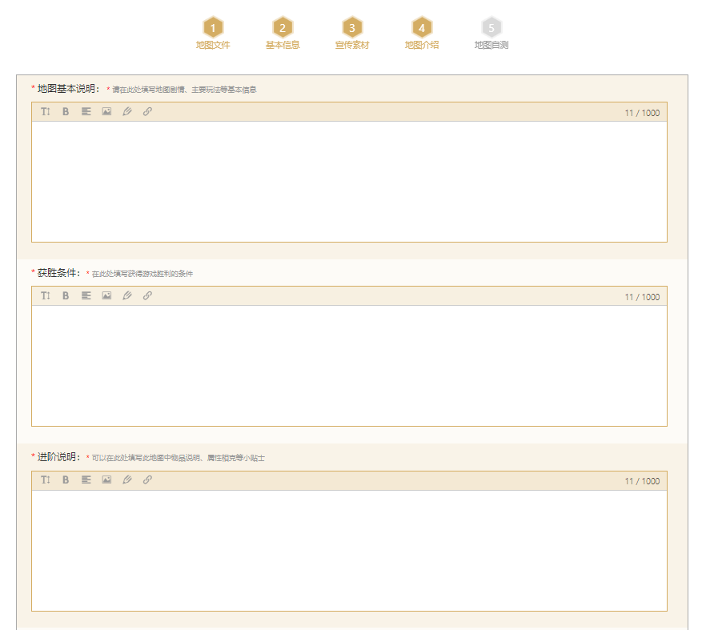

17.点击**开始自测**。
 
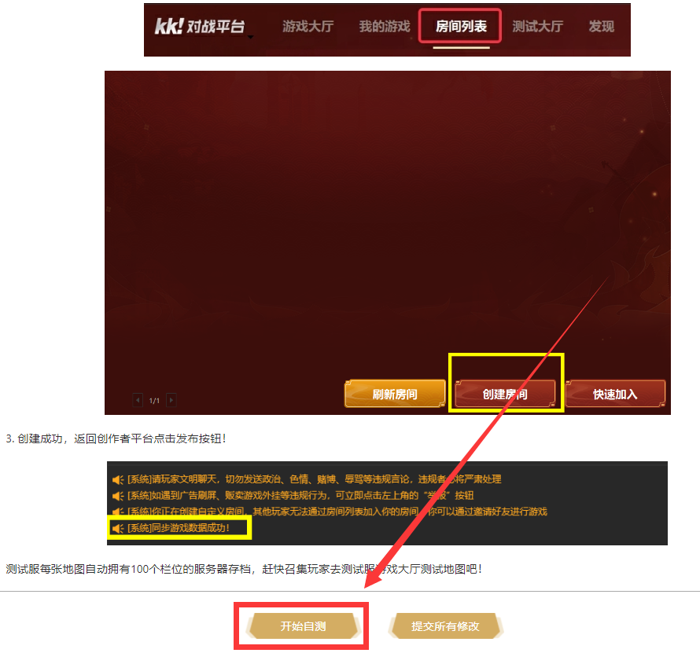

18.点击**申请审核**，待审核完成后，点击**发布**作品即可上架。
- 审核状态变更需要开发者关注，系统暂时不会进行主动提示。
 
