# 道具配置

1.	进入**开发者平台**页面后，选择要配置道具的地图，选择**道具管理**。
 
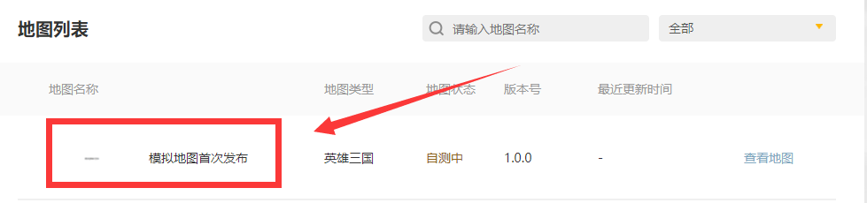

2.作品内制作好“商品/道具”变量（key值）后，可在地图上传后被开发者平台后台自动读取对应的道具列表。
 
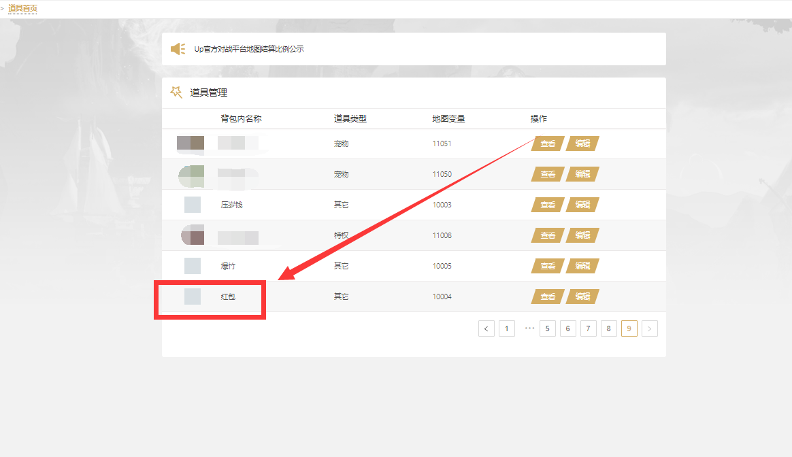

- 如图内的红包，在地图作品内对应的变量（Key值）为10004

3.点击需要编辑的道具左侧的**编辑**按钮，对道具进行编辑。
 
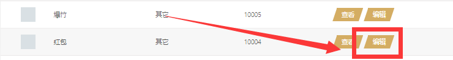

4.进入**道具**的编辑界面，我们要补全如下几点：**背包内名字**、**道具类型**、**消耗类型**、**会员特权**、**背包内图片**、**道具说明**。
 
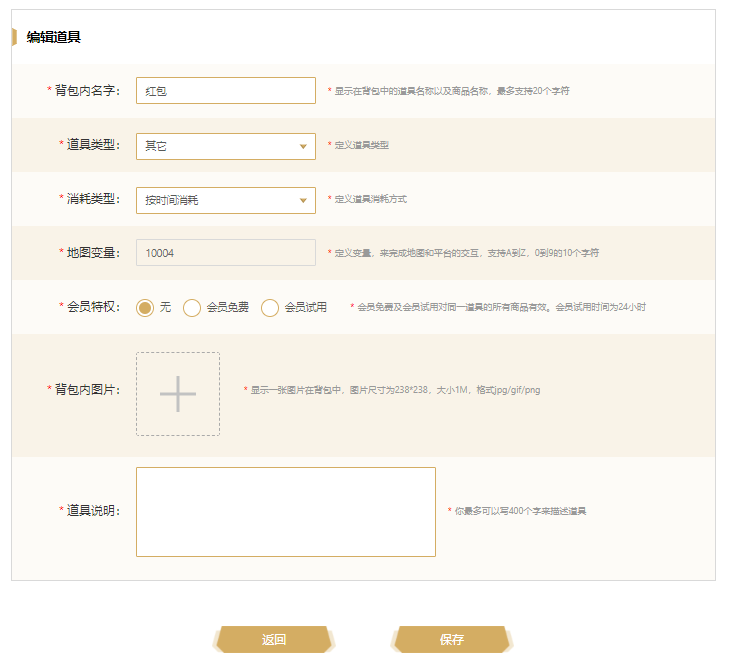

5.**背包内名字**编辑对应规则：最多支持20字符，支持中文、英文、以及各类常用标点符号。
- **背包内名字**编辑完成后，在以该道具为基础的商品创建后将不可更改，请谨慎操作！！！
 
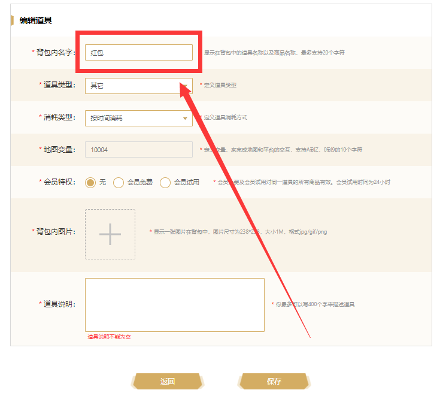

6.**道具类型**编辑对应规则：当前可选共计 7 类选项，分别为**英雄**、**坐骑**、**翅膀**、**皮肤**、**宠物**、**特权**、**其它**。
 
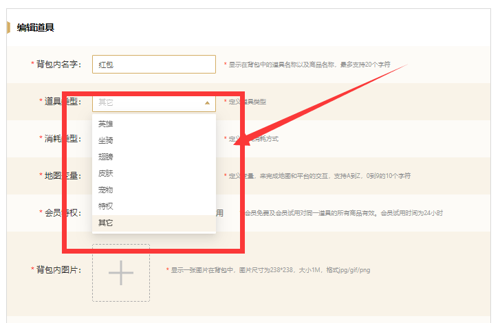

7.**消耗类型**编辑对应规则：当前可选共计 2 类选项，分别为**按时间消耗**、**按数量消耗**。
- **消耗类型**编辑完成后，在以该道具为基础的商品创建后将不可更改，请谨慎操作！！！
- **按时间消耗**类商品多用于如“英雄”、“特权”、“皮肤”、“翅膀”、“宠物”、“坐骑”等以时间为单位计量的商品，如永久有效、年卡、30天月卡、7天周卡类商品
- **按数量消耗**类商品多用于按个数消耗、按个数堆叠（可堆叠类）的商品，如：xx属性增幅丹药，每拥有1个可获得xx属性，此类商品即为**按数量消耗**类别
 
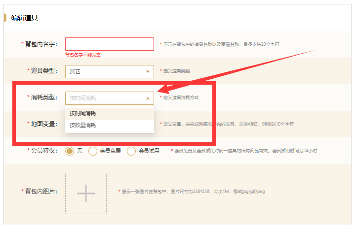

8.**会员特权**编辑对应规则：当前可选共计 3 类选项，分别为**无**、**会员免费**、**会员试用**。**按时间消耗**道具与**按数量消耗**道具略有不同，**按数量消耗**道具暂无“会员特权”相关选项
- 此处设置的**会员特权**选项，并非单个地图作品的会员，而是**KK对战平台**的“尊享会员”
 
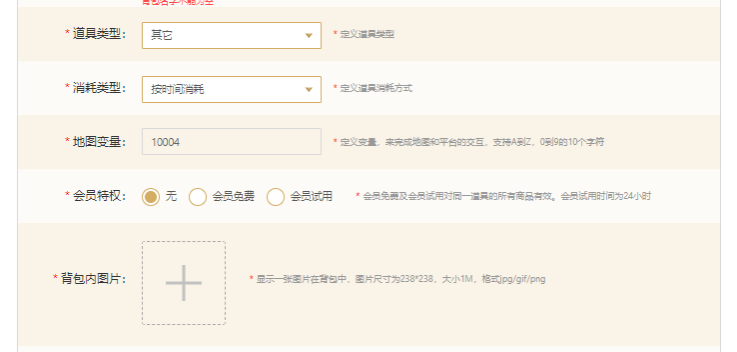

**按时间消耗**道具
 
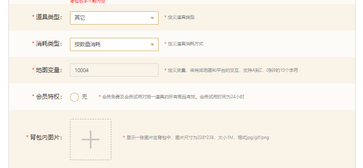

**按数量消耗**道具，暂无“会员特权”选项

9.**背包内图片**编辑对应规则：图片尺寸为238*238，图片大小不超过1M，支持jpg/gif/png格式图片。
- 此处的图片一定要谨慎上传，如若该道具创建商品后，被用户购买后，将在用户的平台道具商品背包内显示
- 若商品被玩家购买后，再对此处进行编辑更改，玩家背包内将不会同步更新
 
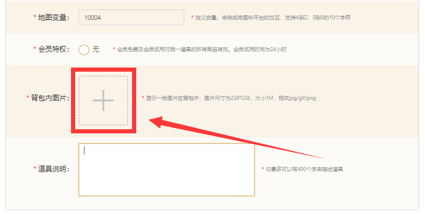

10.**道具说明**编辑对应规则：最多支持400个字进行道具的效果描述或道具说明。
- 请注意：切勿输入敏感及违禁词汇、语句

 
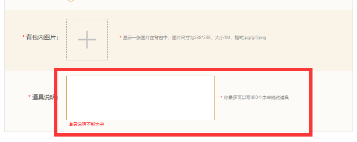

11.编辑好以上内容后，即完成一个道具的创建，但以下内容需要特别注意！！！

- 在道具创建完毕后，在以该道具为基础的商品创建后将不可更改的内容有：**背包内名字**、**道具类型**、**消耗类型**
- 在道具创建完毕后，在以该道具为基础的商品创建后可以更改的内容有：**会员特权**、**背包内图片**、**道具说明**
- 商品被购买后，玩家背包内显示的信息将不会随着道具页面内容编辑的更新而变化，将停留在玩家购买该商品时的描述内容
- **按数量消耗**道具若误设置为**按时间消耗**类别后，若此类商品被玩家购买后，玩家每次重新开局游戏都可以获得对应数量的**数量消耗型**商品
