#  商城配置

正式接入商业化前，请确保**开发者平台**账号已完成注册，且该账号已登录过平台正式服以及地图自测服并完成昵称设置、实名认证流程。
- 请注意，开发者账号类型若为“个人认证”，请于**收益管理**内的**收益账户管理**进行支付宝绑定。
 
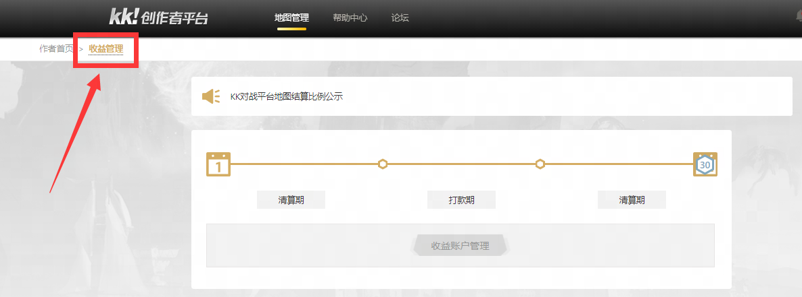

商城后台由4个部分组成，分别是：**商品管理**、**礼包设置**、**活动管理**、**推荐商品设置**。
 
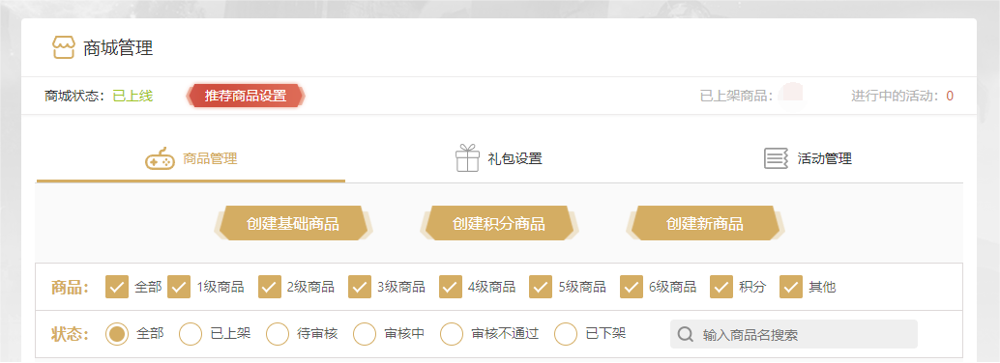

## 概览

商品一共分为三种类型、八个类别、有五种状态

商品的三种类型分别为：U币商品、积分商品、金币商品。

商品的八个类别分别为：1级商品、2级商品、3级商品、4级商品、5级商品、6级商品、积分商品、其它商品（金币商品、平台抽奖券等）。

商品的五种状态分别为：已上架、待审核、审核中、审核不通过、已下架。

## 商品功能

**商品**功能说明：
- 商品功能包含**上架/下架**、**创建同道具商品**、**编辑**、**查看**功能
- 通过审核的商品，您可根据需要自行操作，上架/下架
- 需要注意，商品在审核通过后，需要手动操作方可上架
 
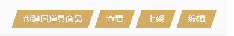

商品目前一共有3种上架方式，分别为：正常出售、限时出售、限量出售 （出售数量限制为 1-9999）。
 
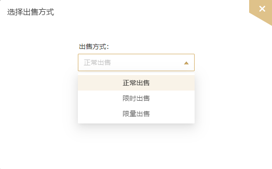

**创建同道具商品**规则说明：
- **按时间消耗**类型商品道具可配置不同时效的商品期限，并设置不同的价格（包含后台提供所有可设置的U币/金币/积分价格区间，如为积分道具可设置价格范围仍为“1-5000积分”）
- **按数量消耗**类型商品道具可配置不同的出售数量，出售数量最大值为“1000个”

## 商品管理

### **创建基础商品**配置指南

1.创建基础商品流程，点击**创建基础商品**
- 基础商品为商城上线正式服平台必要条件，至少需要2件基础商品方可开启商业化
- 基础商品的售卖货币单位统一为**金币**
 
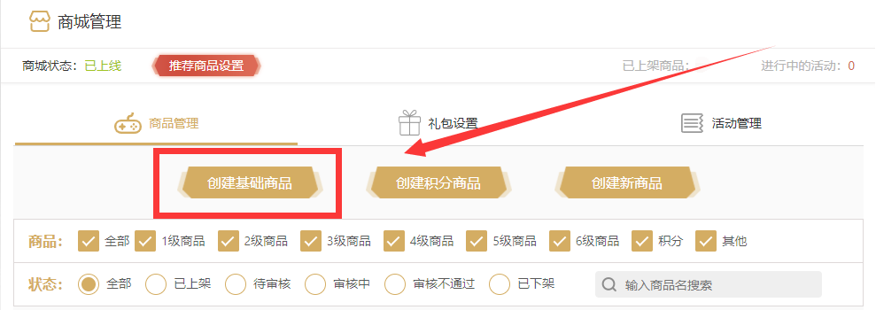

2.**基础商品**创建——选择道具
- 进入**基础商品**创建页面后，首先需要进行道具选择，选中对应道具后，再进行**基础商品**配置
- 基础商品的商品名称，对外显示为“道具名称”，商品上传后不支持改名，请谨慎设置
 
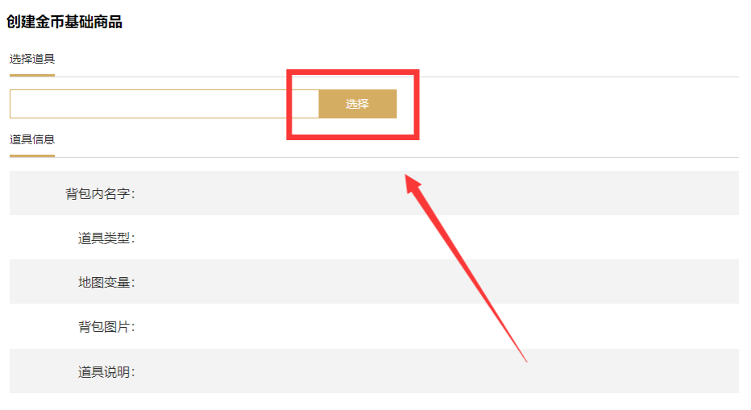
 
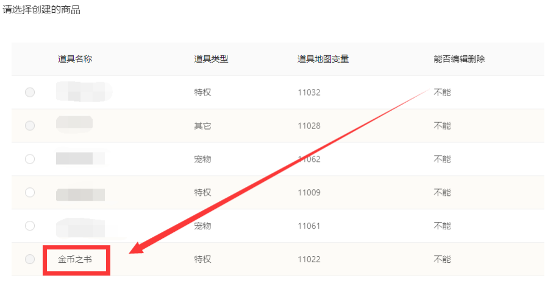

如图选择需要创建**基础商品**所使用的道具
 
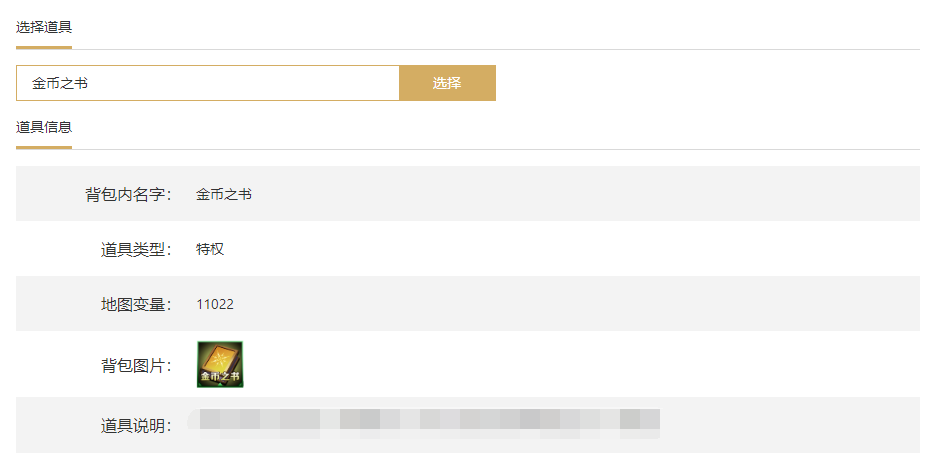

选择好对应的道具后，将自动填补对应的道具信息

3.**基础商品**创建——基本设置
- **基础商品**目前仅供可选3个售价档位，即：“1000金币”、“4000金币”、“10000金币”
- 基础商品的消耗方式，将自动读取**道具**配置后台的所选道具的消耗类型

 
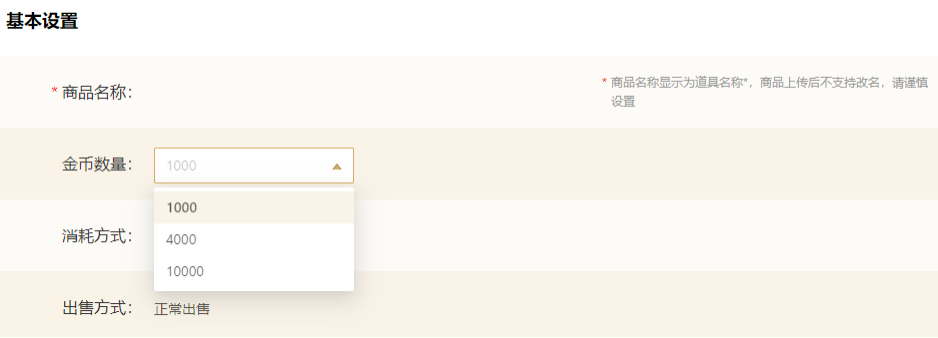

4.**基础商品**创建——图片设置
- 图片设置板块共分为2个部分，即**商品LOGO**配置、**商品宣传图**配置
- 商品LOGO配置要求为：210 x 210，支持jpg/png/gif格式图片，大小不超过500kb
- 商品宣传图配置要求为：300 x 300，支持jpg/png/gif格式图片，大小不超过5M，最大配置上限为4张图片
- 请注意，商品LOGO图、商品宣传图为**基础商品**配置必要条件，最少配置各1张，方可上架商城
 
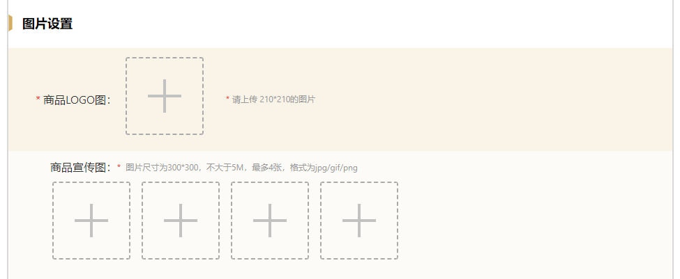

5.**基础商品**创建——商品说明、商品详情配置
- **商品说明**编辑对应规则：最多不超过200字
- **商品详情**编辑对应规则：字符数暂无上限，建议不超过400字
- 切勿输入敏感及违禁词汇、语句，否则商品将无法提交
 

### **创建积分商品**配置指南

1.创建积分商品流程，点击**创建积分商品**
- 积分商品创建后，同一商品将无法在创建未非积分商品
- 积分商品多用于平台宝箱功能
- 开发者无法就玩家支付的积分获得任何现金报酬
 
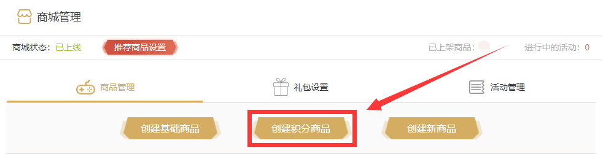

2.**积分商品**创建——选择道具
- 进入**积分商品**创建页面后，首先需要进行道具选择，选中对应道具后，再进行**积分商品**配置
- 积分商品的商品名称，对外显示为“道具名称”，商品上传后不支持改名，请谨慎设置
 
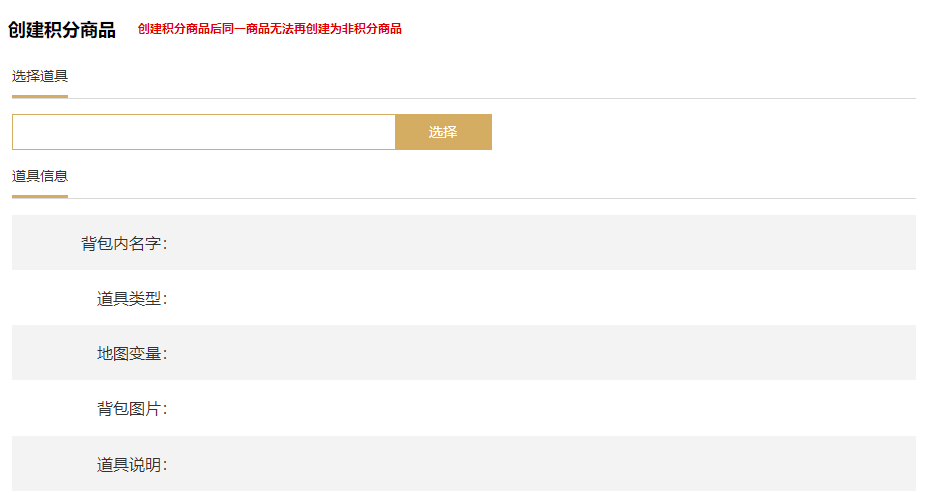
 
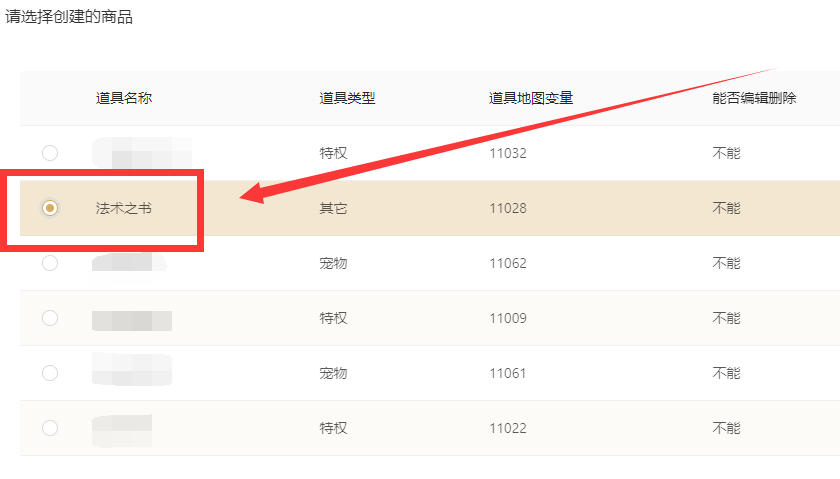

如图选择需要创建**积分商品**所使用的道具
 
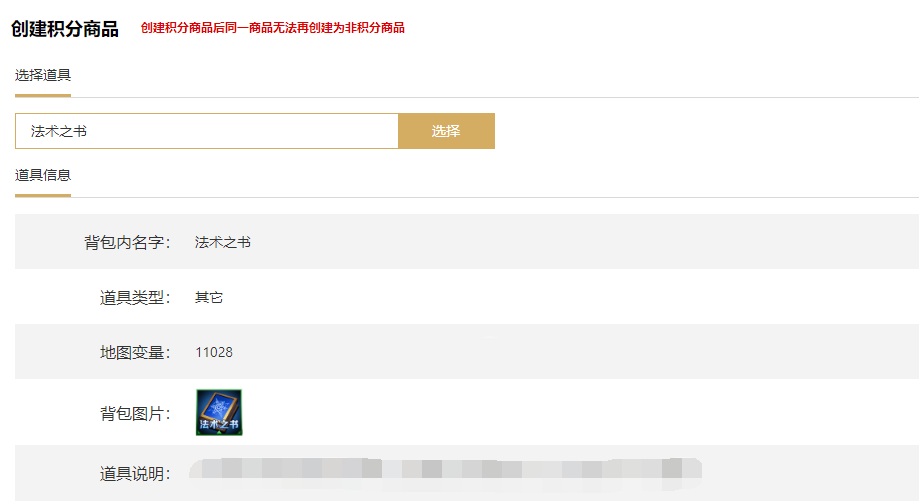

选择好对应的道具后，将自动填补对应的道具信息

3.**积分商品**创建——基本设置
基本设置内需要注意的是，**积分商品**将根据道具消耗类型（按时间消耗、按数量消耗）进行不同设置，详情如下：
- 积分价格设置区间为“1 - 5000积分”，即最高积分价格为“5000积分”，最低积分价格为“1积分”
- 积分商品的消耗方式，将自动读取**道具**配置后台的所选道具的消耗类型

**按数量消耗-积分商品**
- 售卖数量设置区间为“1-1000个”，即最大单次出售数量为“1000个”，最小单次出售数量为“1个”
 
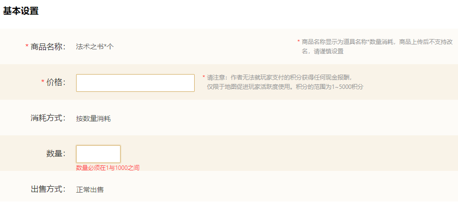

**按时间消耗-积分商品**
- 按时间消耗商品有效期可设置区间分别为：“永久”、“1/3/7/14/30/90/180/360天”
 
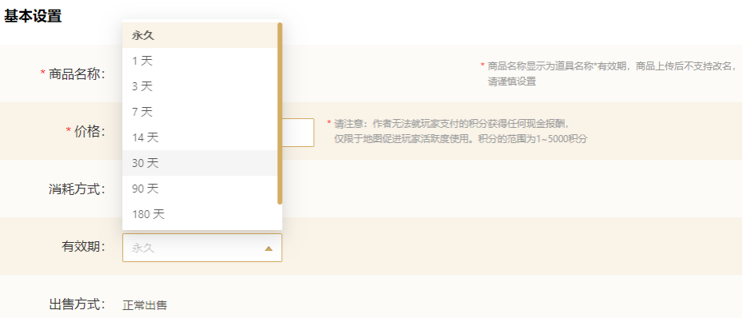

4.**积分商品**创建——图片设置
图片设置板块共分为2个部分，即**商品LOGO**配置、**商品宣传图**配置。
- 商品LOGO配置要求为：210 x 210，支持jpg/png/gif格式图片，大小不超过500kb
- 商品宣传图配置要求为：300 x 300，支持jpg/png/gif格式图片，大小不超过5M，最大配置上限为4张图片
- 请注意，商品LOGO图、商品宣传图为**积分商品**配置必要条件，最少配置各1张，方可上架商城
 
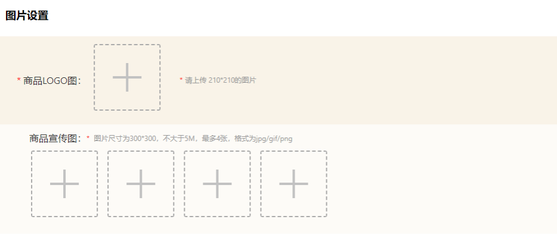

5.**积分商品**创建——商品说明、商品详情配置
- **商品说明**编辑对应规则：最多不超过200字
- **商品详情**编辑对应规则：字符数暂无上限，建议不超过400字
- 切勿输入敏感及违禁词汇、语句，否则商品将无法提交
 
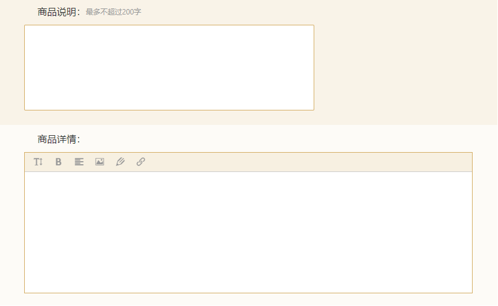

### **创建新商品**配置指南

1.创建新商品流程，点击**创建新商品**
 
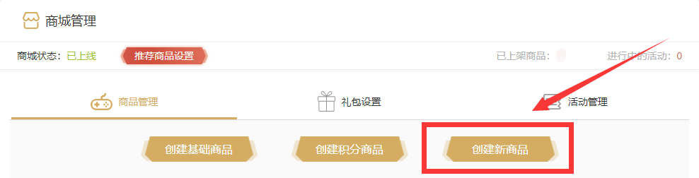

- 新商品创建，**开发者平台**后台总计提供了6个档位的商品定价策略，分别是：
一级商品定价-**6元**
二级商品定价-**13/38元**
三级商品定价-**68/88元**
四级商品定价-**128/168元**
五级商品定价-**238/298元**
六级商品定价-**648元**
 
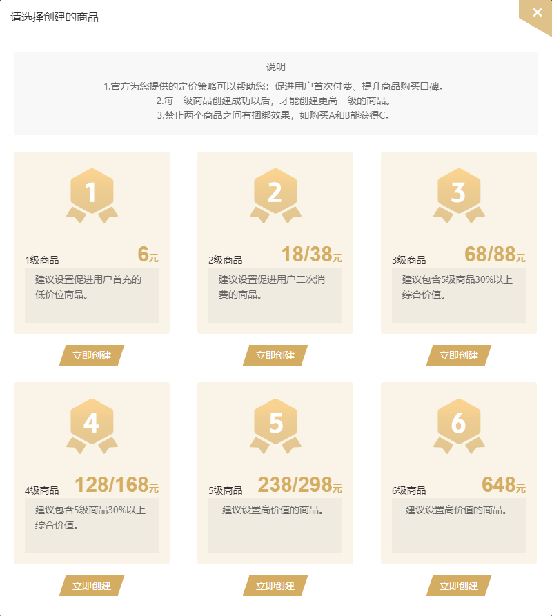

- 六级商品**648元**档位，需要在五级商品**238/298元**档位上架20天后方可创建
- 官方提供的定价策略可以帮助您，有效促进用户首次消费、提升商品购买口碑
- 每一级商品创建成功后，方可创建更高一级商品
- 禁止两个商品之间有捆绑效果，如购买A和B可以获得C

2.**U币商品**创建——选择道具
- 进入**新商品创建**页面后，首先需要进行道具选择，选中对应道具后，再进行**新商品**配置
- 商品名称，对外显示为“道具名称”，商品上传后不支持改名，请谨慎设置
 
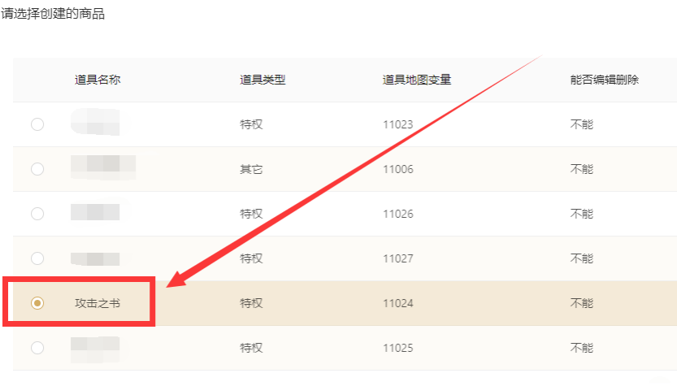

如图选择需要创建**新商品**所使用的道具

 
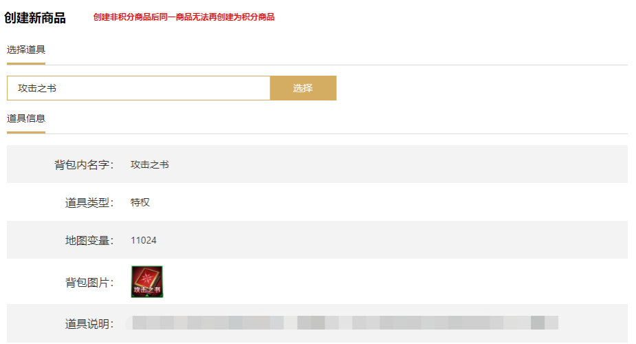

选择好对应的道具后，将自动填补对应的道具信息

3.**新商品**创建——基本设置
**新商品**将根据道具消耗类型（按时间消耗、按数量消耗）进行不同设置，如以**18/38元**档位为例，：
- 新商品的消耗方式，将自动读取**道具**配置后台的所选道具的消耗类型
- 可供选择的价格分别为“18元”、“38元”
 
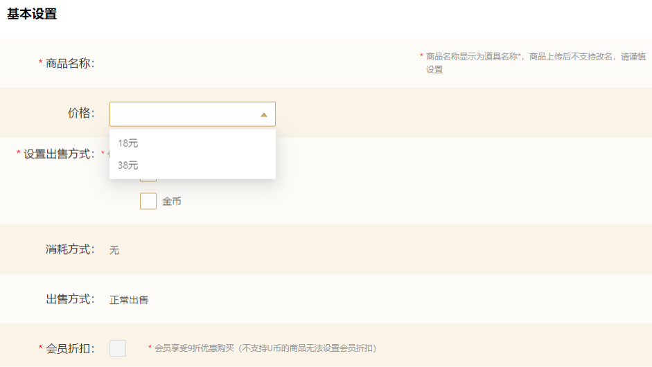

- 可供设置的出售方式有两种：“U币”、“金币”，但需要注意：开发者无法就玩家支付的对战平台金币获得任何现金报酬，仅限于对战平台开展特定活动时可以设置，请务必谨慎设置
- 需要注意，**会员折扣**处选项，此处会员折扣指对战平台会员，而非地图作品开发者自行设置的会员
 
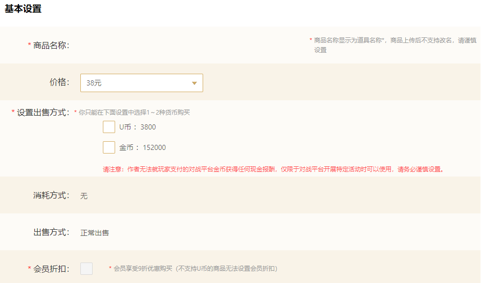

**按数量消耗-新商品**
- 售卖数量设置区间为“1-1000个”，即最大单次出售数量为“1000个”，最小单次出售数量为“1个”
 
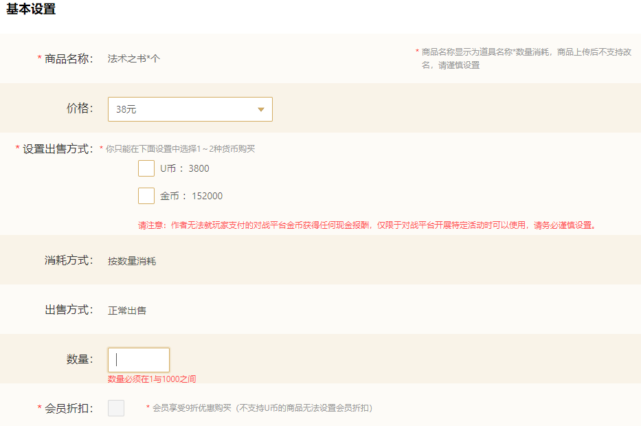

**按时间消耗-新商品**
- 按时间消耗商品有效期可设置区间分别为：“永久”、“1/3/7/14/30/90/180/360天”
 
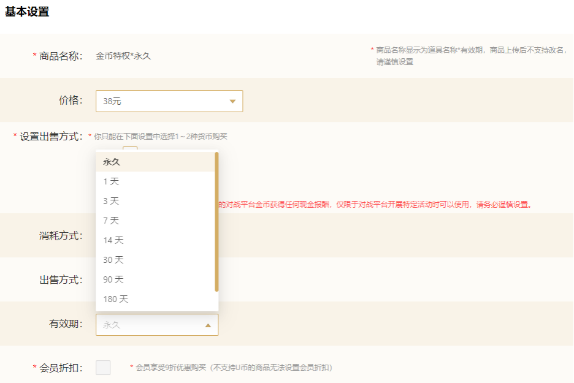

4.**新商品**创建——图片设置
图片设置板块共分为2个部分，即**商品LOGO**配置、**商品宣传图**配置:
- 商品LOGO配置要求为：210 x 210，支持jpg/png/gif格式图片，大小不超过500kb
- 商品宣传图配置要求为：300 x 300，支持jpg/png/gif格式图片，大小不超过5M，最大配置上限为4张图片
- 请注意，商品LOGO图、商品宣传图为**新商品**配置必要条件，最少配置各1张，方可上架商城
 
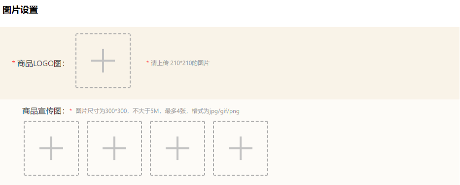

5.**新商品**创建——商品说明、商品详情配置
- **商品说明**编辑对应规则：最多不超过200字
- **商品详情**编辑对应规则：字符数暂无上限，建议不超过400字
- 切勿输入敏感及违禁词汇、语句，否则商品将无法提交
 

### 商城管理-**礼包设置**配置指南
 
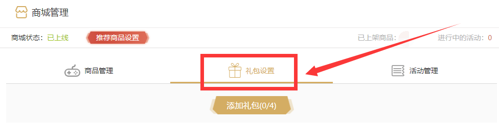

1.**商店管理**中选择礼包设置，礼包上限为 4个，分为三种购买方式：1.正常购买 2.限量购买 3.限时购买
- 正常购买，常用于推荐类商品场景，适合组合型道具，例：英雄+皮肤 组合
- 限量购买，常用于 次数消耗 及 时限消耗 道具，例：等级书*1本+经验加成*1天 组合
- 限时购买，常用于档期类场景，例：节假日 活动特卖
 
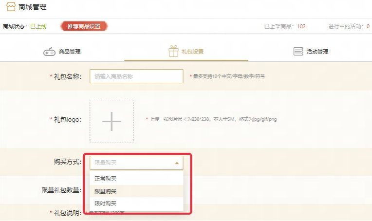

2.礼包设置时需留意，是否可重复购买，如组合时间消耗及次数消耗商品，可考虑允许重复购买
- 需要注意，在配置商城礼包时，平台商品**抽奖券**目前仅能配置9折出售，且最低出售设置数量为“20张”，且抽奖券折扣礼包配置仅能在平台特殊活动进行时配置

 
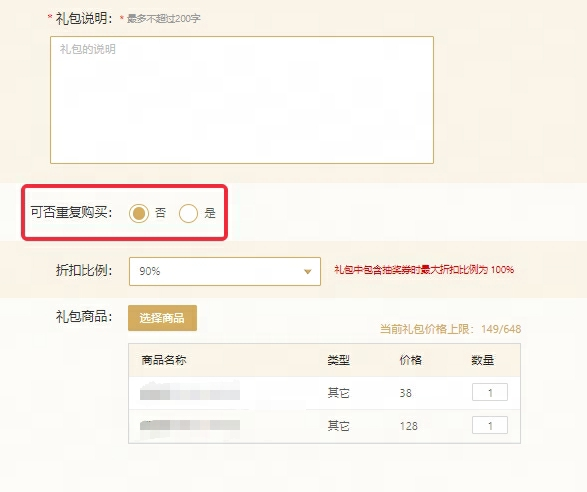

3.**折扣比例设置**
商业化初始阶段，礼包最高出售设置价格为，当前配置价格最高的商品价格（礼包内所有商品折扣后总和），即：如您配置最高价格的商品为“298元”，当前您设置的礼包折后出售价格不能超过“298元”
- 礼包价格上限为阶段性增长，实际价格以礼包价格上限，以配置最定价的后台提示为准
- 商业化刚开启时，理论上礼包折扣后价格最高为“298元”
 
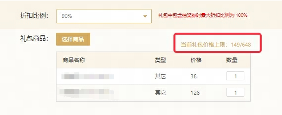

### 商城管理-**活动管理**配置指南
 
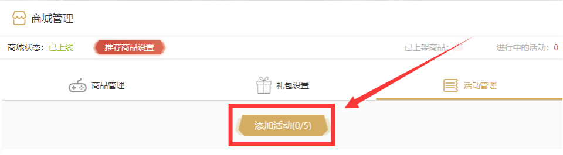

1.**活动管理**中选择添加活动，活动上限数量为 5个
- 多用于商品进行限时折扣促销活动
- 可根据不同需要，进行设置单个/多个商品的促销活动
 
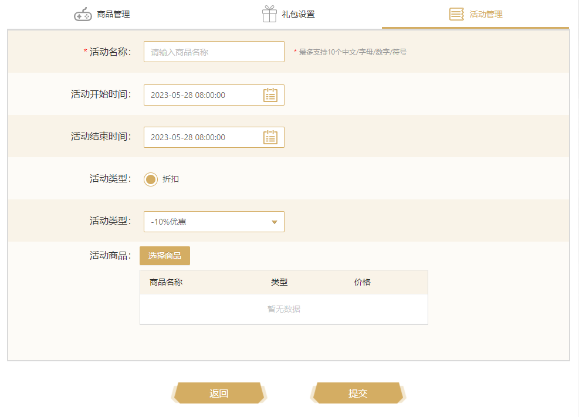

2.**活动名称**配置规则：最多支持10个中文/字母/数字/符号

3.**活动时间**开始/结束配置规则：
- 活动仅支持整点开始/结束设置
- 活动间隔时间不能小于1小时
- 活动生效前配置时间需要至少提前5分钟配置，如您想在x月x日12:00时开始活动，便需要在11:55分前配置好活动时间，若晚于55分设置后，活动开始时间需要顺延1小时方可配置成功

4.**活动类型**配置规则：
- 目前仅支持“折扣”类活动配置
- 仅支持设置折扣优惠档位“-10%/-20%/-30%/-40%/-50%优惠”
 
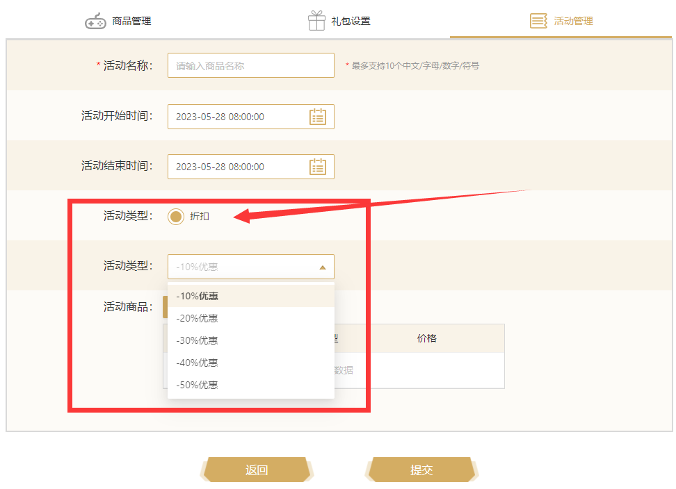

5.**活动商品**配置规则：
- 活动配置商品上限数量暂无上限

### 商城管理-**推荐商品设置**配置指南
 
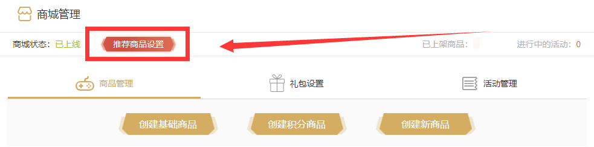

1.**推荐商品设置**功能支持三个模块，分别是：
- 商城公告功能
- 推荐商品功能
- 幻灯广告图

2.**商城公告**最多支持60个字符
 
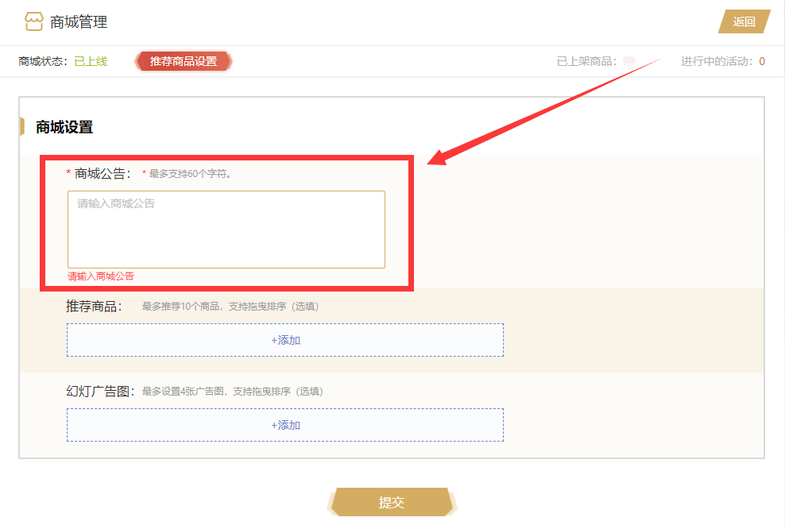

3.**推荐商品**最多支持设置10个推荐商品，且可根据展示顺序需要进行自由排序
 
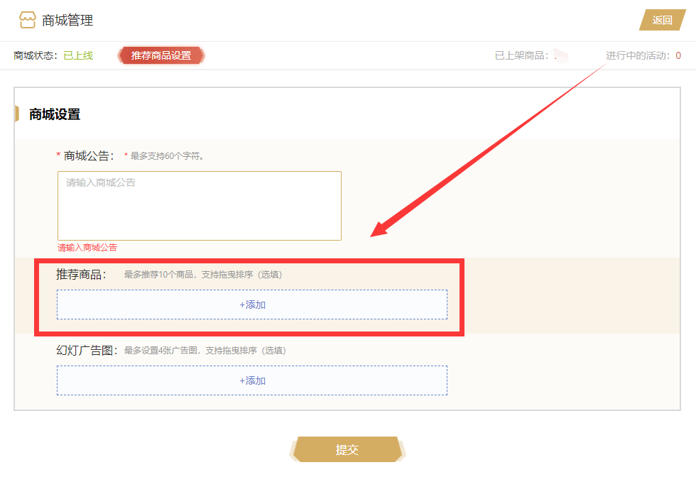

4.**幻灯广告图**功能最多支持设置4张图片，配置规则如下：
- 图片尺寸为566 x 280
- 图片大小上限为512kb
- 支持jpg/jpeg/png格式
- 上传幻灯广告图后可选择商品关联该广告，玩家可通过广告幻灯图跳转到关联商品
 
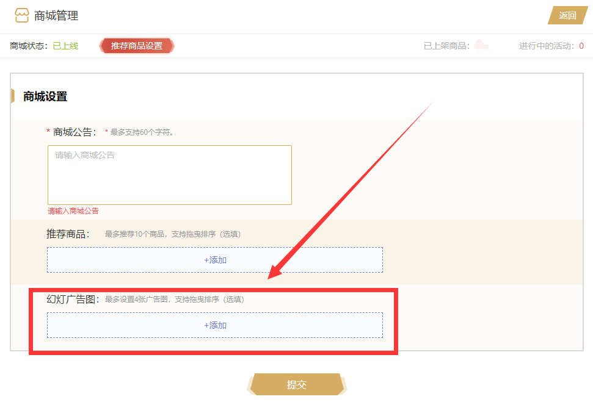