# 宝箱配置

进入**开发者平台**页面后，选择要配置宝箱的地图，选择**宝箱管理**
- 开通地图宝箱功能需要商城功能开通
- 点击开通宝箱后请仔细阅读开发者须知，点击同意后即可开启宝箱功能
- 宝箱需要在地图商城上线24小时后方可上架
- 宝箱上架后，地图商城内将自动添加商品：**抽奖券**
 
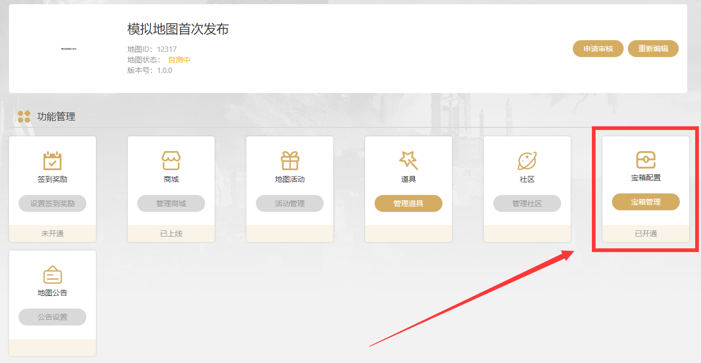

选择**编辑**，对首个宝箱进行编辑
- 每个作品都拥有一个**基础宝箱**
- 若想开通额外的宝箱，则需要向对战平台进行申请
- 单个作品可同时开启的宝箱最大数量上限为3个
 
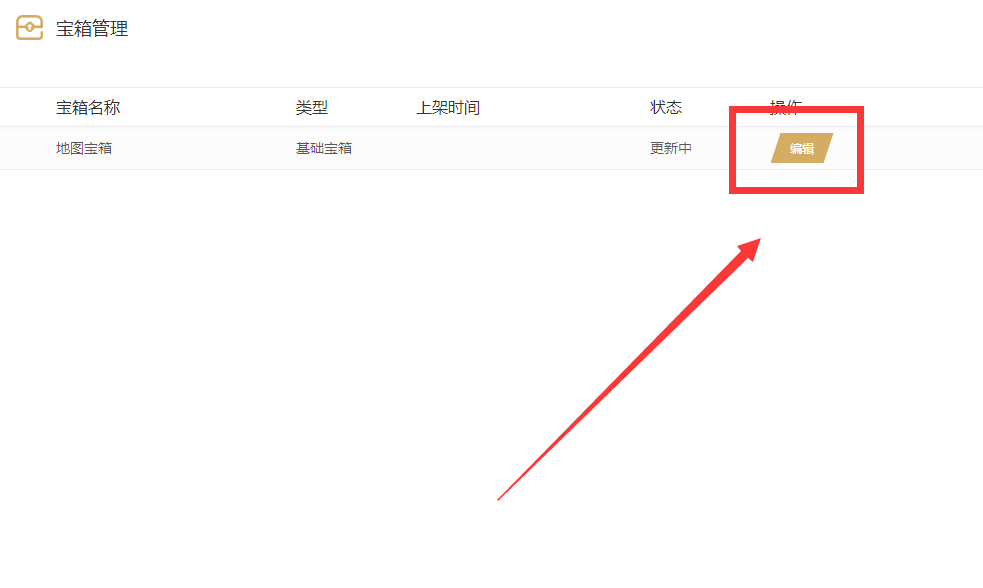

额外宝箱配置，选择**创建新宝箱**，进行宝箱创建
 
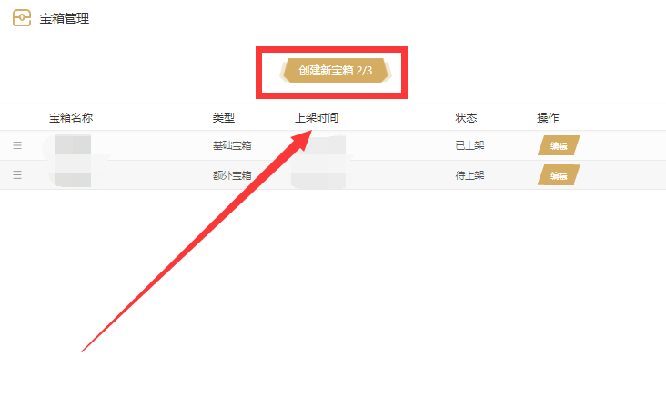

## 宝箱编辑

进入**宝箱**的编辑界面，需要补全如下几点：**宝箱名称**、**十连抽保底配置**、**首个十连抽高级设置**、**玩家等级奖励设置**、**新宝箱配置**
 
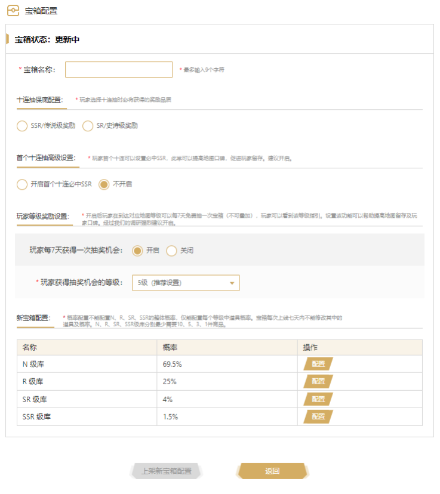

1.**宝箱名称**编辑对应规则：
- 最多输入9个字符，支持中文、英文
 
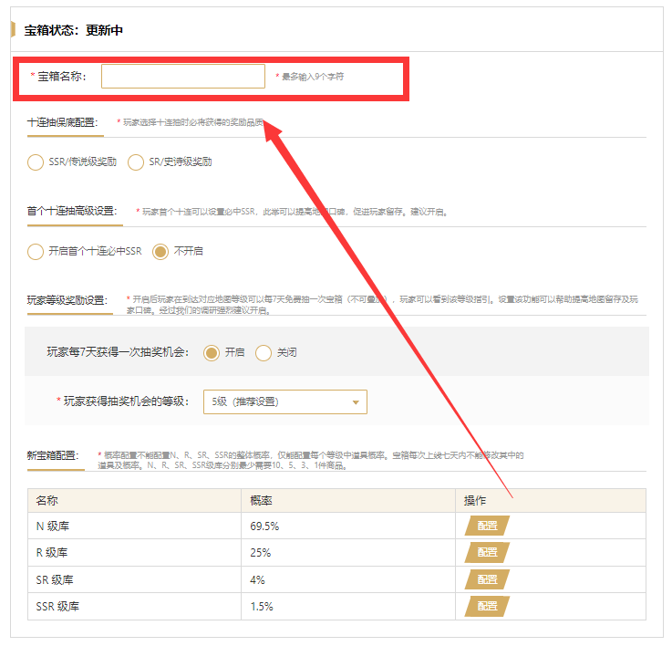

2.**十连抽保底配置**编辑对应规则：
- 选择玩家使用“抽奖券”进行10连抽时必定获得的宝箱内商品的品质
- 由于奖池分为4个品质lv，由高到底依次为：**SSR**、**SR**、**R**、**N**，所以对玩家吸引力最强的品质为**SSR**，其次为**SR**
- 为鼓励玩家进行十连抽，通过保底奖励撬动玩家情绪，达到提升玩家消费决策的目的，我们可以设置保底为**SSR**或**SR**道具1件
- 若**SSR**级库内商品数量不够充裕，切勿设置保底为**SSR**,**SSR**级商品被玩家快速消耗获取完毕后，将大幅降低宝箱对玩家抽取意愿的驱动
 
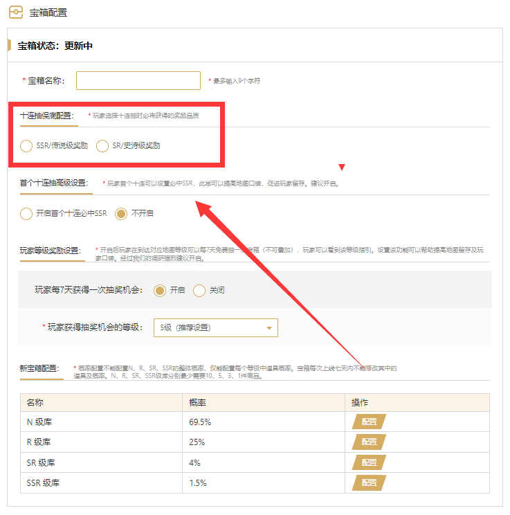

3.**首个十连抽高级设置**编辑对应规则：
- 顾名思义，玩家首次进行“抽奖券”10连抽时，将必定获得1件**SSR**品质商品，该设置可以选择**开启**/**关闭**，因能够有效提高玩家付费，建议开启
- 请注意！若开启首个十连必中SSR后，将无法关闭该选项！！！
 

4.**玩家等级奖励设置**编辑对应规则：
- 可设置玩家每7天免费获取1次抽奖机会；并可以设置玩家获得抽奖条件相关联的地图等级（1-9级）
- 建议开启，可有效提高黏性用户的忠诚度，建议免费获得抽取的门槛为3-5级，尽可能的让游戏时长在6小时以上的玩家都可以获得白嫖机会
 
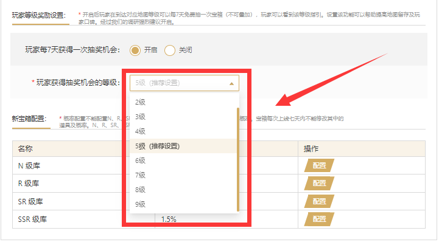

5.**新宝箱配置**编辑对应规则：
- 奖池分为4个品质lv，由高到底依次为：**SSR**、**SR**、**R**、**N**，四个品级分摊总抽取概率100%
- 配置宝箱需要至少19件商品，商品必须是上架状态（且不能是限时、限量销售）
   
| 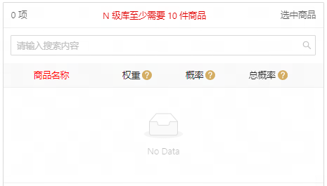 | 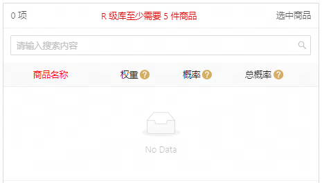 |
| ---------------------- | ---------------------- |

| 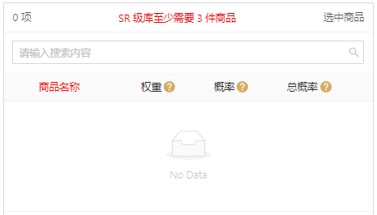 | 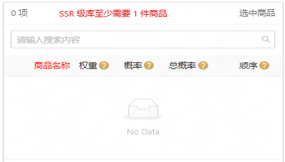 |
| ---------------------- | ---------------------- |
   

6.**新宝箱配置**编辑注意
- 点击上架按钮后会出现预览弹框，第一次上架时该弹框为最终确认弹框，宝箱一旦上架后一段时间内不可修改，请务必确认后再进行选择
- 商品宝箱内权重：权重最小为1，最大为9，数字越大则对应本品质等级内抽到的概率等比例放大
- 商品宝箱内概率：指商品在本品质等级内抽取到的几率，根据权重自动生存。当前显示值保留1位小数，误差不影响实际概率
- 商品宝箱内总概率：指品质等级概率*概率，是商品在实际抽奖中的期望概率值。当前显示值保留2位小数，误差不影响实际总概率
- 概率配置无法配置N/R/SR/SSR整体的概率，仅能配置每个品质等级中的道具概率
- 宝箱首次上线七天内不能修改其中的道具及概率
- 宝箱内的商品在被替换出宝箱内时，将无法从商城下架，且不能进行编辑
- 宝箱在首次上架后进入7天的锁定期，此期间可以配置宝箱但是只能在首次上架宝箱7天后生效
- 宝箱正式上架前一天会进行公示，玩家可以看到你对宝箱进行的修改。公示时间和上架时间的规则如下图：
 
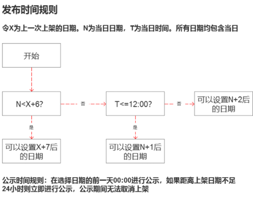

