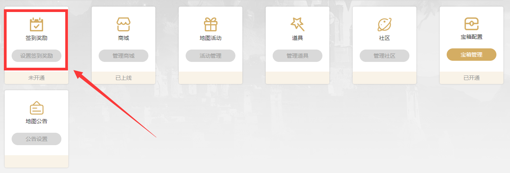
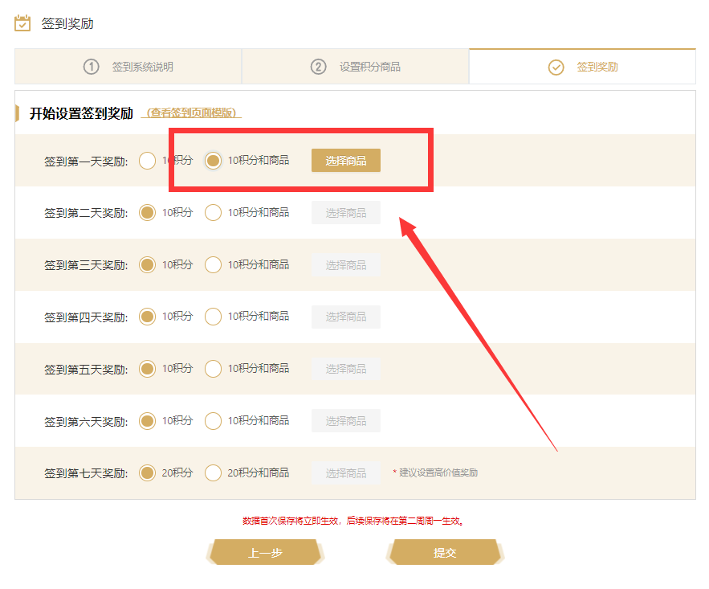

# 签到奖励

**签到奖励**配置规则
- 签到以1自然周为单位进行循环
- 设置签到奖励可以获得“额外的热度”、“地图特殊火热标识”、“提升玩家活跃度”（“额外的热度”：每个签到的玩家将对地图提升额外的热度。“地图特殊火热标识”：热度达到一定数量可触发动态火热标识。“提升玩家活跃度”：鼓励玩家长期进行游戏，为地图延长寿命）
- 设置签到奖励，设置完成后每周循环为签到的玩家发放奖励
- 积分为每张RPG地图专属的货币，玩家领取积分后只能用于兑换该地图下的商品，您需要在商城管理中创建积分商品促进活跃度
- 玩家在每天登陆的情况下，一周内可通过签到获得最多80积分
 

## 步骤

1.进入**开发者平台**页面，选择要配置签到奖励的地图，选择**签到奖励**
 

2.设置**签到奖励**
- 数据保存后将立即生效，后续保存设置将在第二周的周一生效
- **签到奖励**可让玩家通过签到获得两类奖励，分别为：**积分**、**商品**
- **签到奖励**有两种可设置的选项，分别为：**10/20积分**、**10/20积分和商品**

 

3.选择签到奖励商品，选择您希望玩家获得商品，进行添加即可
- 建议给予玩家时效性较短（1-3天的奖励）
- 建议给予玩家数量较少，可消耗的商品（1-3个即可）
 
