# 活动配置

## 概览

进入**开发者平台**页面后，选择要配置活动的地图，选择**活动管理**
 
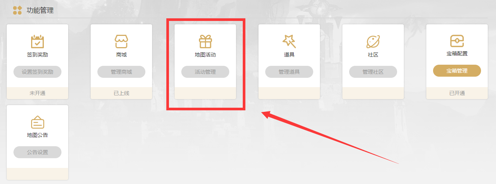

地图活动目前包含3个类型，分别为：**常规活动**，**抽奖券日常**和**抽奖券周常**。
 
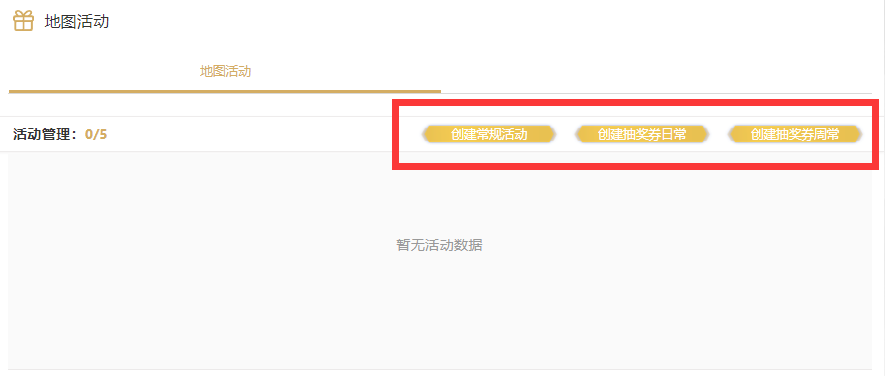

- 最大同时配置活动数量上限为5个，但**抽奖券日常**、**抽奖券周常**仅可分别配置仅1个活动
- 仅**抽奖券日常**、**抽奖券周常**活动可配置“抽奖券”作为活动奖励
- 单个地图活动，最多支持设置10个任务
- 单个地图活动，所有任务发放的商品总数量不能超过30个
- 活动一经上架开始，将无法取消，需待活动时间结束后方可重新配置
 
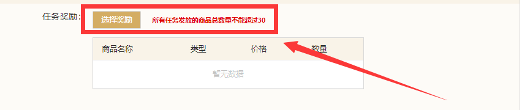

## **抽奖券日常**与**抽奖券周常**配置
- 可配置“抽奖券”为奖励的任务条件仅为**进行游戏总时长xx分钟**
- **抽奖券日常**活动内任务条件均为“每日24:00刷新”的活动
- **抽奖券日常**活动总计可配置的“抽奖券”奖励最大数量为6张，请合理配置奖励
 
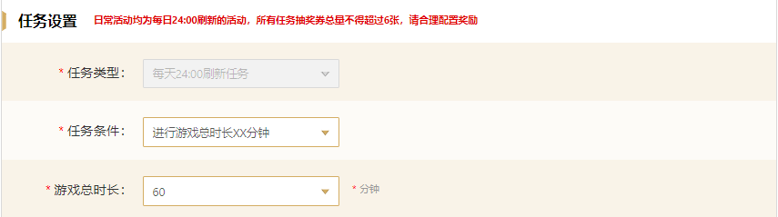

- **抽奖券周常**活动内任务条件均为“单次领取奖励”的活动
- **抽奖券周常**活动总计可配置的“抽奖券”奖励最大数量为25张，请合理配置奖励
 
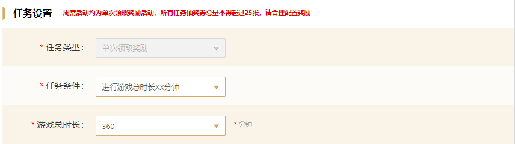

## **地图活动**配置

**活动信息**配置，需要补全如下信息：**活动名称**、**活动描述**、**活动时间**、**活动介绍**。

- **活动名称**最多支持输入6个字，支持中英文、标点符号。
- **活动描述**最多支持输入8个字，支持中英文、标点符号。
- **活动时间**最少持续3天，最多30天。活动开始时间不可小于当期时间。支持以整点为单位。

5.**活动介绍**最多支持输入140个字
- 切勿输入敏感及违禁词汇、语句
 
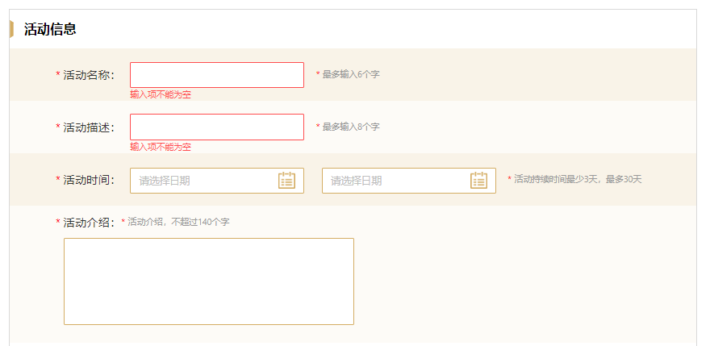

6.**任务设置**我们需要补全如下信息**任务类型**、**任务条件**、**任务条件对应信息**、**任务奖励**后，进行添加任务，最终进行活动的提交

6.1**任务类型**共分为两种：
- **单次领取奖励**（活动时间内仅可领取奖励一次）
- **每天24:00刷新任务**（活动时间内每自然日24:00过后，完成对应任务条件即可重复领取）
 
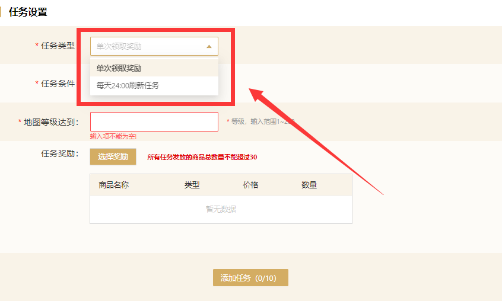

6.2**任务条件**共分为五种：
- **地图等级奖励**
- **进行游戏xx次**
- **进行游戏总时长XX分钟**
- **登录游戏xx天**
- **连续登录游戏xx天**
 
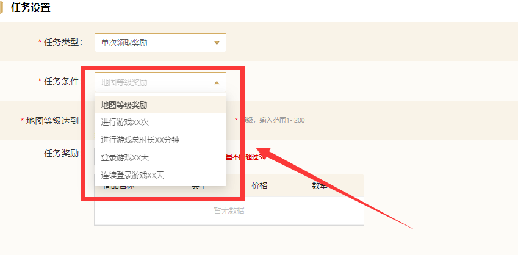

7**任务条件**设置规则说明

7.1**地图等级奖励**设置规则：
- 地图等级达到对应等级即可获得奖励
- 设置范围为：1-200级
 
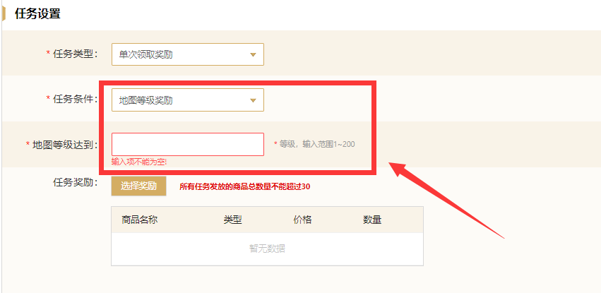

7.2**进行游戏xx次**设置规则：
- 进行游戏对应次数后即可获得奖励
- 设置范围为：1-100次
 
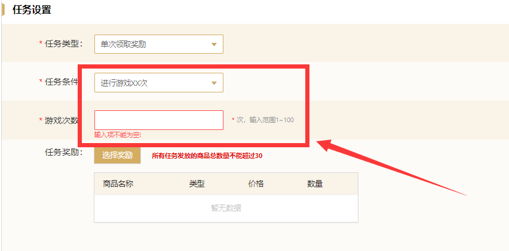

7.3**进行游戏总时长xx分钟**设置规则：
- 可供配置的时长有：“30/60/120/180/240/300/450/600/1000/2000/3000分钟”
- 需要注意的是，**抽奖券日常**、**抽奖券周常**活动配置内，可奖励商品“抽奖券”的任务条件必须为**进行游戏总时长xx分钟**，方可配置奖励“抽奖券”，且对应时长条件对应不同的“抽奖券”奖励数量
- **进行游戏总时长xx分钟**任务条件具有唯一性，如：A活动配置了时限为“游戏总时长30分钟”的任务条件，A活动或B活动则不能再设置“游戏总时长30分钟”的相关任务
 
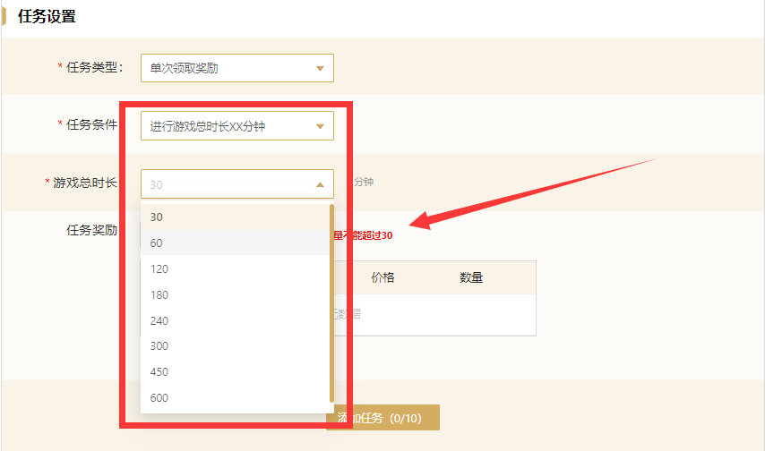

7.4**登录游戏xx天**设置规则：
- 登录游戏累计对应天数后即可获得奖励
- 设置范围为：1-30天
 
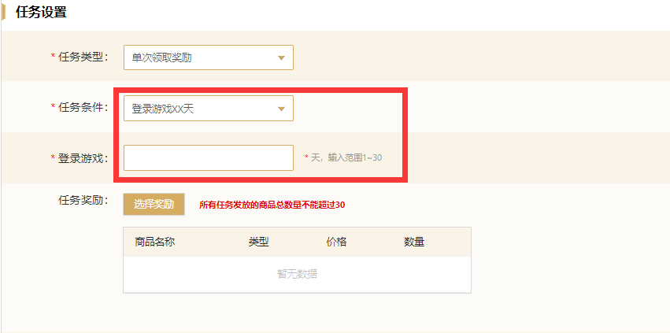

7.5**连续登录游戏xx天**设置规则：
- 连续登录游戏累计对应天数后即可获得奖励
- 设置范围为：1-30天
 
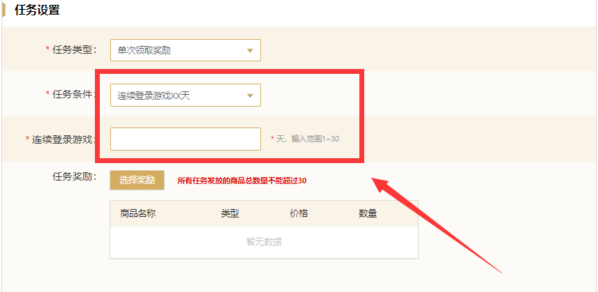

8**任务奖励**设置规则：
- 单个活动任务所发放的商品总数量不能超过30个
- 支持设置**U币商品**、**积分商品**、**金币商品**作为奖励设置